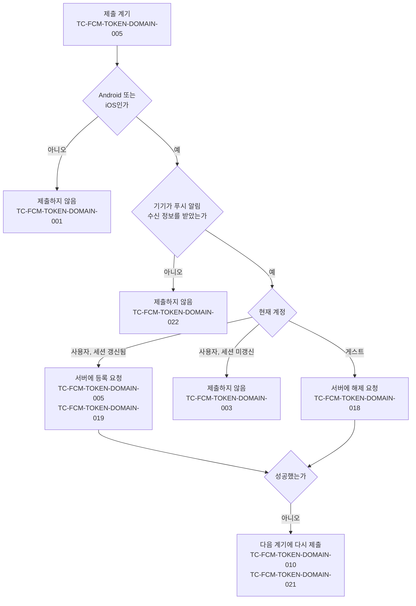

# 푸시 알림 수신 등록 테스트 케이스

기준 스펙: [푸시 알림 수신 등록 스펙(client)](../spec/client/fcm-token.md), [푸시 알림 수신 등록 스펙(common)](../spec/common/fcm-token.md), [푸시 알림 수신 등록 스펙(server)](../spec/server/fcm-token.md)

각 케이스의 `근거`는 절이 있는 스펙 폴더를 앞에 붙여 `client > domain > 절 이름`처럼 적는다.

## domain

### TC-FCM-TOKEN-DOMAIN-001: 데스크톱 앱과 웹에서는 수신 정보를 제출하지 않는다

- 근거: `client > domain > 등록하는 기기`
- Given: 데스크톱 앱 또는 웹에서 현재 계정이 사용자이고 세션이 갱신되어 있다.
- When: 앱이 시작되어 계정이 확인된다.
- Then: 서버로 등록 요청과 해제 요청이 발생하지 않고, 사용자에게 안내가 표시되지 않는다.

### TC-FCM-TOKEN-DOMAIN-018: 게스트 상태에서는 수신 정보 해제를 제출한다

- 근거: `client > domain > 제출`
- Given: Android 또는 iOS에서 현재 계정이 게스트다.
- When: 앱이 시작되어 계정이 확인된다.
- Then: 서버로 현재 수신 정보의 해제 요청이 한 번 발생하고 등록 요청은 발생하지 않는다.

### TC-FCM-TOKEN-DOMAIN-003: 세션이 갱신되지 않은 동안에는 제출하지 않고 갱신된 뒤 등록한다

- 근거: `client > domain > 제출`
- Given: Android 또는 iOS에서 저장된 사용자 정보는 있지만 로그인 세션이 아직 인증되지 않았다.
- When: 앱이 시작되어 계정이 확인되고, 그 뒤 로그인 세션이 인증된 상태로 바뀐다.
- Then: 세션이 인증되기 전에는 등록 요청과 해제 요청이 발생하지 않고, 인증된 뒤 등록 요청이 한 번 발생한다.

### TC-FCM-TOKEN-DOMAIN-004: 알림 권한이 거부되어 있어도 수신 정보를 등록한다

- 근거: `client > domain > 등록 정보`
- Given: Android 또는 iOS에서 현재 계정이 사용자이고 세션이 갱신되어 있으며, 시스템 알림 권한이 거부되어 있다.
- When: 앱이 시작되어 계정이 확인된다.
- Then: 서버로 등록 요청이 발생한다.
- 작성하지 않는 이유: 알림 권한 상태는 OS가 정하고 푸시 알림 수신 정보는 Firebase가 발급하므로, 권한이 거부된 기기에서 수신 정보가 발급되어 등록 요청까지 이어지는지는 실제 기기와 Firebase 없이 판정할 수 없다. 알림 권한을 거부한 채 Firebase 수신 정보 발급과 서버 등록 요청을 함께 관찰할 수 있는 기기 테스트 환경이 마련되면 작성한다.

### TC-FCM-TOKEN-DOMAIN-005: 각 제출 계기에서 현재 정보로 등록한다

- 근거: `client > domain > 제출 계기`
- Given: Android 또는 iOS에서 현재 계정이 사용자이고 세션이 갱신되어 있다.
- When: 테스트 데이터의 계기 중 하나가 발생한다.
- Then: 서버로 현재 수신 정보, 시간대, 언어를 담은 등록 요청이 한 번 발생한다.
- 테스트 데이터:

| 계기 |
| --- |
| 앱이 시작되어 계정이 확인됨 |
| 앱이 다시 활성 상태가 되어 계정이 확인됨 |
| 앱을 사용하는 동안 로그인이 완료되어 인증된 계정이 확인됨 |
| 확인된 계정이 다른 계정으로 바뀜 |

### TC-FCM-TOKEN-DOMAIN-025: 같은 계정이 같은 정보로 다시 확인되기만 하면 제출하지 않는다

- 근거: `client > domain > 제출 계기`
- Given: Android 또는 iOS에서 현재 계정이 사용자이고 세션이 갱신되어 있으며, 앱이 시작되어 계정이 확인된 뒤 등록 요청이 한 번 발생했다.
- When: 앱이 활성 상태를 유지한 채 같은 계정이 같은 정보로 다시 확인된다.
- Then: 서버로 등록 요청과 해제 요청이 더 발생하지 않는다.

### TC-FCM-TOKEN-DOMAIN-026: 같은 계정의 계정 정보가 바뀌면 다시 등록한다

- 근거: `client > domain > 제출 계기`
- Given: Android 또는 iOS에서 현재 계정이 사용자이고 세션이 갱신되어 있으며, 앱이 시작되어 계정이 확인된 뒤 등록 요청이 한 번 발생했다.
- When: 앱이 활성 상태를 유지한 채 같은 계정의 테스트 데이터 정보가 바뀐다.
- Then: 서버로 등록 요청이 한 번 더 발생한다.
- 테스트 데이터:

| 바뀐 정보 |
| --- |
| 이메일 |
| 프로필 이미지 |

### TC-FCM-TOKEN-DOMAIN-027: 화면이 재생성되면 같은 계정이어도 다시 등록한다

- 근거: `client > domain > 제출 계기`, `client > domain > 실행 경계`
- Given: Android 또는 iOS에서 현재 계정이 사용자이고 세션이 갱신되어 있으며, 앱이 시작되어 계정이 확인된 뒤 등록 요청이 한 번 발생했다.
- When: 계정이 그대로인 채 화면이 재생성된다.
- Then: 서버로 같은 계정의 등록 요청이 한 번 더 발생한다.

### TC-FCM-TOKEN-DOMAIN-028: 백그라운드에 있는 동안 바뀐 계정은 다시 활성 상태가 될 때 한 번 제출한다

- 근거: `client > domain > 실행 경계`
- Given: Android 또는 iOS에서 앱이 백그라운드에 있다.
- When: 백그라운드에 있는 동안 계정이 게스트에서 세션이 갱신된 사용자로, 다시 다른 사용자로 바뀐 뒤 앱이 다시 활성 상태가 된다.
- Then: 백그라운드에 있는 동안에는 제출이 발생하지 않고, 활성 상태가 된 뒤 그때의 계정으로 제출이 한 번 발생한다.

### TC-FCM-TOKEN-DOMAIN-022: 기기에 아직 수신 정보가 없으면 그 계기에는 제출하지 않는다

- 근거: `client > domain > 등록 정보`
- Given: Android 또는 iOS에서 현재 계정이 사용자이고 세션이 갱신되어 있으며, 기기가 아직 푸시 알림 수신 정보를 받지 못했다.
- When: 앱이 시작되어 계정이 확인된다.
- Then: 서버로 등록 요청과 해제 요청이 발생하지 않고, 오류 보고도 남지 않는다.

### TC-FCM-TOKEN-DOMAIN-024: 수신 정보를 받아 오지 못하면 제출 실패로 다룬다

- 근거: `client > domain > 등록 정보`, `client > domain > 실패 처리`
- Given: Android 또는 iOS에서 현재 계정이 사용자이고 세션이 갱신되어 있으며, Firebase가 수신 정보 요청에 오류로 응답한다.
- When: 앱이 시작되어 계정이 확인된다.
- Then: 서버로 등록 요청이 발생하지 않고, 그 오류를 실패 원인으로 담은 오류 보고가 한 번 남는다.

### TC-FCM-TOKEN-DOMAIN-023: 새로 발급된 수신 정보는 다음 계기의 등록에 담긴다

- 근거: `client > domain > 등록 정보`, `client > domain > 제출 계기`
- Given: Android 또는 iOS에서 현재 계정이 사용자이고 세션이 갱신되어 있으며, 직전 계기에 등록한 뒤 Firebase가 수신 정보를 새로 발급했다.
- When: 앱이 다시 활성 상태가 되어 계정이 확인된다.
- Then: 서버로 새 수신 정보를 담은 등록 요청이 한 번 발생한다.

### TC-FCM-TOKEN-DOMAIN-019: 같은 정보라도 계기마다 다시 등록한다

- 근거: `client > domain > 제출`
- Given: Android 또는 iOS에서 현재 계정이 사용자이고 세션이 갱신되어 있으며, 직전 계기에 같은 수신 정보, 시간대, 언어로 등록에 성공했다.
- When: 앱이 다시 활성 상태가 되어 같은 계정이 확인된다.
- Then: 서버로 같은 수신 정보, 시간대, 언어를 담은 등록 요청이 다시 한 번 발생한다.

### TC-FCM-TOKEN-DOMAIN-007: 시간대나 언어가 바뀐 뒤 처음 오는 계기의 등록에 새 값이 담긴다

- 근거: `client > domain > 등록 정보`
- Given: Android 또는 iOS에서 현재 계정이 사용자이고 세션이 갱신되어 있으며, 직전 계기 뒤에 기기의 시간대 또는 언어가 바뀌었다.
- When: 앱이 다시 활성 상태가 되어 계정이 확인된다.
- Then: 서버로 바뀐 값을 담은 등록 요청이 한 번 발생한다.
- 테스트 데이터:

| 달라진 값 |
| --- |
| 시간대 |
| 언어 |

### TC-FCM-TOKEN-DOMAIN-008: 시간대나 언어가 바뀐 것만으로는 제출하지 않는다

- 근거: `client > domain > 등록 정보`
- Given: Android 또는 iOS에서 현재 계정이 사용자이고 세션이 갱신되어 있다.
- When: 제출 계기 없이 기기의 시간대 또는 언어가 바뀐다.
- Then: 서버로 등록 요청이 발생하지 않는다.

### TC-FCM-TOKEN-DOMAIN-010: 등록에 실패하면 같은 계기 안에서 다시 시도하지 않고 다음 계기에 다시 등록한다

- 근거: `client > domain > 실패 처리`
- Given: Android 또는 iOS에서 현재 계정이 사용자이고 세션이 갱신되어 있으며, 서버가 등록 요청에 실패로 응답한다.
- When: 앱이 시작되어 계정이 확인되고, 그 뒤 서버가 성공으로 응답하는 상태에서 앱이 다시 활성 상태가 되어 같은 계정이 확인된다.
- Then: 첫 계기에서 등록 요청이 한 번만 발생하고 사용자에게 오류가 표시되지 않으며, 두 번째 계기에서 등록 요청이 다시 발생한다.

### TC-FCM-TOKEN-DOMAIN-020: 로그아웃은 해제를 기다리지 않고, 게스트로 바뀐 것이 계기가 되어 해제를 제출한다

- 근거: `client > domain > 로그아웃과 해제`
- Given: Android 또는 iOS에서 현재 계정이 사용자이고, 서버에 도달할 수 없어 해제 요청이 실패한다.
- When: 사용자가 로그아웃을 진행한다.
- Then: 해제 요청의 결과를 기다리지 않고 로그인 세션이 제거되어 계정 상태가 게스트로 바뀌고, 게스트로 바뀐 뒤 현재 수신 정보의 해제 요청이 한 번 발생한다.

### TC-FCM-TOKEN-DOMAIN-021: 해제에 실패하면 다음 계기에 다시 해제를 제출한다

- 근거: `client > domain > 로그아웃과 해제`, `client > domain > 실패 처리`
- Given: Android 또는 iOS에서 현재 계정이 게스트이고, 서버가 해제 요청에 실패로 응답한다.
- When: 앱이 시작되어 계정이 확인되고, 그 뒤 서버가 성공으로 응답하는 상태에서 앱이 다시 활성 상태가 되어 계정이 확인된다.
- Then: 첫 계기에서 해제 요청이 한 번만 발생하고 사용자에게 오류가 표시되지 않으며, 두 번째 계기에서 해제 요청이 다시 발생한다.

### TC-FCM-TOKEN-DOMAIN-015: 등록 실패와 해제 실패는 오류 보고로 남는다

- 근거: `client > domain > 실패 처리`
- Given: Android 또는 iOS에서 서버가 테스트 데이터의 요청에 실패로 응답한다.
- When: 테스트 데이터의 계정 상태에서 제출 계기가 발생한다.
- Then: 실패 원인을 담은 오류 보고가 한 번 남는다.
- 테스트 데이터:

| 계정 상태 | 요청 |
| --- | --- |
| 세션이 갱신된 사용자 | 등록 |
| 게스트 | 해제 |

### TC-FCM-TOKEN-DOMAIN-016: 통신 오류로 인한 실패도 오류 보고로 남는다

- 근거: `client > domain > 실패 처리`
- Given: Android 또는 iOS에서 현재 계정이 사용자이고 세션이 갱신되어 있으며, 서버에 도달할 수 없어 등록 요청이 통신 오류로 실패한다.
- When: 앱이 시작되어 계정이 확인된다.
- Then: 통신 오류를 실패 원인으로 담은 오류 보고가 한 번 남는다.

### TC-FCM-TOKEN-DOMAIN-017: 진행 중인 제출이 중단되면 보고하지 않는다

- 근거: `client > domain > 실패 처리`
- Given: Android 또는 iOS에서 제출 요청이 서버 응답을 기다리는 중이다.
- When: 앱 종료나 화면 이탈로 진행 중인 제출이 중단된다.
- Then: 오류 보고가 남지 않는다.

## data

### TC-FCM-TOKEN-DATA-001: 등록 요청에는 수신 정보, 시간대, 언어만 담고 계정은 담지 않는다

- 근거: `common > data > 제출 요청`
- Given: Android 또는 iOS에서 현재 계정이 사용자이고 세션이 갱신되어 있으며, 기기의 수신 정보가 `token-a`, 시간대가 `Asia/Seoul`, 언어가 `ko-KR`이다.
- When: 앱이 시작되어 계정이 확인된다.
- Then: 서버로 보낸 등록 요청은 인증된 세션을 사용하고, 요청에 수신 정보 `token-a`, 시간대 `Asia/Seoul`, 언어 `ko-KR`을 담으며 계정을 담지 않는다.

### TC-FCM-TOKEN-DATA-002: 해제 요청에는 수신 정보만 담는다

- 근거: `common > data > 제출 요청`
- Given: Android 또는 iOS에서 현재 계정이 게스트이고 기기의 수신 정보가 `token-a`다.
- When: 앱이 시작되어 계정이 확인된다.
- Then: 서버로 보낸 해제 요청은 요청에 수신 정보 `token-a`만 담는다.

### TC-FCM-TOKEN-DATA-007: 같은 수신 정보가 다시 등록되면 새 건을 만들지 않고 값을 바꾼다

- 근거: `server > data > 등록 처리`, `server > domain > 한 기기와 한 계정`
- Given: 서버에 수신 정보 `token-a`가 계정 A, 시간대 `Asia/Seoul`, 언어 `ko-KR`로 저장되어 있다.
- When: 테스트 데이터의 세션으로 수신 정보 `token-a`의 등록 요청이 도착한다.
- Then: 서버에는 수신 정보 `token-a` 건이 하나만 남고, 그 건의 계정, 시간대, 언어, 등록 시각이 요청 값으로 바뀐다.
- 테스트 데이터:

| 세션 계정 | 요청 시간대 | 요청 언어 | 결과 계정 |
| --- | --- | --- | --- |
| A | `America/New_York` | `en-US` | A |
| B | `Asia/Seoul` | `ko-KR` | B |

- 작성하지 않는 이유: 서버 저장소의 저장 규칙이어서 앱의 단위 테스트 환경에서 결정적으로 판정할 수 없다. 서버 정책 테스트 환경이 마련되면 작성한다.

### TC-FCM-TOKEN-DATA-008: 계정이 삭제되면 연결된 수신 정보 건도 삭제된다

- 근거: `server > data > 저장한 정보의 보호`
- Given: 서버에 계정 A에 연결된 수신 정보 건이 둘 있다.
- When: 계정 A가 삭제된다.
- Then: 계정 A에 연결된 수신 정보 건이 모두 삭제된다.
- 작성하지 않는 이유: 서버 저장소의 삭제 규칙이어서 앱의 단위 테스트 환경에서 결정적으로 판정할 수 없다. 서버 정책 테스트 환경이 마련되면 작성한다.

### TC-FCM-TOKEN-DATA-010: 세션 없는 등록 요청은 거절되고, 해제 요청은 세션 없이 수신 정보 건을 지운다

- 근거: `common > data > 제출 요청`, `server > data > 등록 처리`, `server > data > 해제 처리`
- Given: 서버에 수신 정보 `token-a`가 계정 A에, 수신 정보 `token-b`가 계정 B에 저장되어 있다.
- When: 세션 없이 테스트 데이터의 요청이 도착한다.
- Then: 요청의 결과와 서버에 남는 수신 정보 건은 테스트 데이터와 같다.
- 테스트 데이터:

| 요청 | 결과 | 남는 수신 정보 건 |
| --- | --- | --- |
| `token-a`의 등록(시간대·언어 포함) | 거절 | `token-a`, `token-b` |
| `token-a`의 해제 | 성공 | `token-b` |
| `token-b`의 해제 | 성공 | `token-a` |
| `token-c`의 해제 | 성공 | `token-a`, `token-b` |

- 작성하지 않는 이유: 서버의 요청 처리 규칙이어서 앱의 단위 테스트 환경에서 결정적으로 판정할 수 없다. 서버 정책 테스트 환경이 마련되면 작성한다.

### TC-FCM-TOKEN-DATA-011: 비어 있는 값이 담긴 등록과 해제는 거절된다

- 근거: `server > data > 등록 처리`, `server > data > 해제 처리`
- Given: 서버에 테스트 데이터의 요청이 테스트 데이터의 세션으로 도착한다.
- When: 서버가 요청을 처리한다.
- Then: 요청이 거절되고 서버에 저장된 수신 정보 건은 바뀌지 않는다.
- 테스트 데이터:

| 요청 | 세션 |
| --- | --- |
| 수신 정보가 비어 있는 등록 | 인증된 세션 |
| 시간대가 비어 있는 등록 | 인증된 세션 |
| 언어가 비어 있는 등록 | 인증된 세션 |
| 수신 정보가 비어 있는 해제 | 세션 없음 |

- 작성하지 않는 이유: 서버의 요청 검증 규칙이어서 서버 함수 실행 환경에서만 판정할 수 있고, 그 환경은 저장소의 자동 검증 절차에 포함되어 있지 않다. 서버 함수 테스트 러너가 검증 절차에 들어오면 자동화한다.

### TC-FCM-TOKEN-DATA-012: 시간대와 언어 중 하나만 담은 제출은 거절된다

- 근거: `common > data > 제출 요청`
- Given: 서버에 수신 정보와 함께 테스트 데이터의 값만 담은 제출이 인증된 세션으로 도착한다.
- When: 서버가 요청을 처리한다.
- Then: 등록도 해제도 되지 않고 요청이 거절되며, 서버에 저장된 수신 정보 건은 바뀌지 않는다.
- 테스트 데이터:

| 담은 값 |
| --- |
| 시간대만 |
| 언어만 |

- 작성하지 않는 이유: 서버의 요청 검증 규칙이어서 서버 함수 실행 환경에서만 판정할 수 있고, 그 환경은 저장소의 자동 검증 절차에 포함되어 있지 않다. 앱은 두 값을 늘 함께 담거나 함께 비우므로 앱 쪽에서는 TC-FCM-TOKEN-DATA-001과 TC-FCM-TOKEN-DATA-002가 덮는다. 서버 함수 테스트 러너가 검증 절차에 들어오면 자동화한다.

### TC-FCM-TOKEN-DATA-013: 한 계정의 여러 기기는 따로 등록되고 서로 영향을 주지 않는다

- 근거: `server > domain > 한 기기와 한 계정`
- Given: 계정 A로 로그인한 두 기기의 수신 정보 `token-a`와 `token-b`가 모두 계정 A로 등록되어 있다.
- When: `token-a`의 해제 요청이나 새 시간대의 등록 요청이 도착한다.
- Then: `token-a` 건만 지워지거나 바뀌고, `token-b` 건은 계정 A에 연결된 채 값이 그대로 남는다.
- 작성하지 않는 이유: 서버 저장소의 저장 규칙이어서 앱의 단위 테스트 환경에서 결정적으로 판정할 수 없다. 서버 정책 테스트 환경이 마련되면 작성한다.

### TC-FCM-TOKEN-DATA-014: 앱은 서버에 저장된 등록 정보를 읽을 수 없다

- 근거: `server > data > 저장한 정보의 보호`
- Given: 서버에 계정 A와 계정 B의 수신 정보 건이 저장되어 있다.
- When: 계정 A의 인증된 세션으로 저장된 등록 정보를 조회하려 한다.
- Then: 계정 A와 계정 B의 어느 등록 정보도 돌려받지 못한다.
- 작성하지 않는 이유: 서버 저장소의 접근 제한 규칙이어서 앱의 단위 테스트 환경에서 결정적으로 판정할 수 없다. 서버 정책 테스트 환경이 마련되면 작성한다.

### TC-FCM-TOKEN-DATA-015: 서버가 등록이나 해제를 처리하지 못하면 실패를 돌려주고 저장된 정보를 바꾸지 않는다

- 근거: `server > data > 처리 실패`
- Given: 서버에 수신 정보 `token-a` 건이 저장되어 있고, 서버가 저장소에 반영하지 못하는 상태다.
- When: `token-a`의 등록 요청이나 해제 요청이 도착한다.
- Then: 요청은 실패로 끝나고 `token-a` 건의 계정, 시간대, 언어, 등록 시각이 요청 전과 같다.
- 작성하지 않는 이유: 서버 함수의 실패 처리 규칙이어서 서버 함수 실행 환경에서 저장소 실패를 제어해야 하며, 그 환경은 저장소의 자동 검증 절차에 포함되어 있지 않다. 서버 함수 테스트 러너가 검증 절차에 들어오면 자동화한다.
