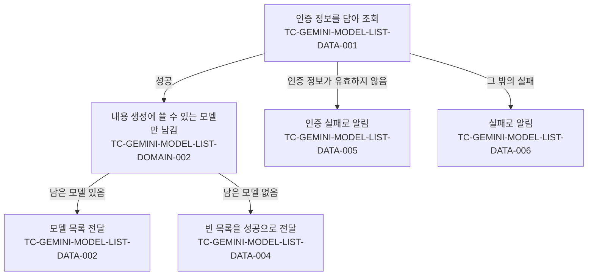

# Gemini 모델 목록 조회 테스트 케이스

기준 스펙: [Gemini 모델 목록 조회 스펙](../spec/gemini-model-list.md)

받아 온 모델을 사용자에게 보여주고 그중 하나를 고르는 케이스는 [SettingGemini 테스트 케이스](./setting-gemini.md)에서 다룬다.

## domain

### TC-GEMINI-MODEL-LIST-DOMAIN-001: 조회는 최대 개수인 1000개를 요청한다

- 근거: `domain > 모델 목록 조회`
- Given: 인증 정보가 준비되어 있다.
- When: 모델 목록 조회를 요청한다.
- Then: 외부 경계로 나가는 요청에 결과 개수 1000개가 포함된다.

### TC-GEMINI-MODEL-LIST-DOMAIN-002: 내용 생성에 쓸 수 있는 모델만 결과에 포함한다

- 근거: `domain > 포함 기준`
- Given: 외부 응답이 테스트 데이터의 모델을 담은 성공으로 제어되어 있다.
- When: 모델 목록 조회를 요청한다.
- Then: 테스트 데이터의 기대 결과에 해당하는 모델만 전달된다.
- 테스트 데이터:

| 응답에 담긴 모델이 알려 온 기능 | 기대 결과 |
| --- | --- |
| 내용 생성만 | 포함 |
| 내용 생성과 토큰 계산 | 포함 |
| 임베딩만 | 제외 |
| 토큰 계산만 | 제외 |
| 이미지 생성만 | 제외 |
| 알려 온 기능이 없음 | 제외 |

### TC-GEMINI-MODEL-LIST-DOMAIN-003: 받은 순서를 그대로 유지한다

- 근거: `domain > 모델 목록 조회`
- Given: 외부 응답이 내용 생성에 쓸 수 있는 모델 여러 개를 정해진 순서로 담은 성공으로 제어되어 있다.
- When: 모델 목록 조회를 요청한다.
- Then: 전달되는 모델의 순서가 응답에 담긴 순서와 같고, 별도 정렬 조건이 요청에 포함되지 않는다.

## data

### TC-GEMINI-MODEL-LIST-DATA-001: 인증 정보를 담아 조회한다

- 근거: `domain > 인증`, `data > 원격 조회`
- Given: 인증 정보가 준비되어 있다.
- When: 그 인증 정보로 모델 목록 조회를 요청한다.
- Then: 외부 경계로 나가는 요청에 전달한 인증 정보가 그대로 포함된다.

### TC-GEMINI-MODEL-LIST-DATA-002: 성공 응답의 모델 정보를 그대로 전달한다

- 근거: `domain > 모델 정보`, `data > 원격 조회`
- Given: 외부 응답이 내용 생성에 쓸 수 있는 모델 목록을 담은 성공으로 제어되어 있다.
- When: 모델 목록 조회를 요청한다.
- Then: 응답에 담긴 모델 개수와 각 모델의 식별자, 표시 이름, 설명이 받은 값 그대로 전달된다.

### TC-GEMINI-MODEL-LIST-DATA-003: 설명이 없는 모델도 전달한다

- 근거: `domain > 모델 정보`
- Given: 외부 응답이 설명 없이 식별자와 표시 이름만 있는 모델을 담은 성공으로 제어되어 있다.
- When: 모델 목록 조회를 요청한다.
- Then: 그 모델이 설명 없는 모델로 전달되고 조회는 실패하지 않는다.

### TC-GEMINI-MODEL-LIST-DATA-004: 기준에 맞는 모델이 없으면 빈 목록을 성공으로 전달한다

- 근거: `domain > 포함 기준`, `data > 원격 조회`
- Given: 외부 응답이 테스트 데이터의 내용을 담은 성공으로 제어되어 있다.
- When: 모델 목록 조회를 요청한다.
- Then: 빈 목록이 실패가 아닌 정상 결과로 전달된다.
- 테스트 데이터:

| 외부 응답의 내용 |
| --- |
| 모델이 하나도 없음 |
| 내용 생성에 쓸 수 없는 모델만 있음 |

### TC-GEMINI-MODEL-LIST-DATA-005: 인증 정보가 유효하지 않은 실패를 구분해 알린다

- 근거: `domain > 인증`, `data > 실패 처리`
- Given: 외부 응답이 인증 정보가 유효하지 않은 실패로 제어되어 있다.
- When: 모델 목록 조회를 요청한다.
- Then: 조회는 인증 정보가 유효하지 않은 실패로 끝나며, 그 밖의 실패와 구분할 수 있게 전달된다.

### TC-GEMINI-MODEL-LIST-DATA-006: 그 밖의 실패를 실패로 알린다

- 근거: `data > 실패 처리`
- Given: 외부 응답이 테스트 데이터의 실패로 제어되어 있다.
- When: 모델 목록 조회를 요청한다.
- Then: 조회는 실패로 끝나며, 인증 정보가 유효하지 않은 실패로 전달되지 않고 빈 목록 같은 정상 결과로도 바뀌지 않는다.
- 테스트 데이터:

| 외부 응답 |
| --- |
| 잘못된 요청 |
| 사용량 초과 |
| 서버 오류 |
| 응답을 읽을 수 없음 |

### TC-GEMINI-MODEL-LIST-DATA-007: 조회할 때마다 새로 조회한다

- 근거: `data > 원격 조회`
- Given: 외부 응답이 첫 조회와 두 번째 조회에서 서로 다른 모델 목록을 돌려주도록 제어되어 있다.
- When: 같은 인증 정보로 모델 목록 조회를 두 번 요청한다.
- Then: 두 번째 요청도 외부 경계로 나가고, 두 번째 조회 결과는 두 번째 응답의 모델 목록이다.

조회 결과에 따라 갈리는 경로와 각 경로를 덮는 케이스는 다음과 같다.

## 작성하지 않는 이유

- `domain > 모델 목록 조회`의 최대 개수를 넘는 결과를 이어서 받지 않는다는 규칙은 이어받기 기능 자체가 없어 관찰할 동작이 없다. 이어받기를 제공하는 요구사항이 생기면 그때 케이스를 추가한다.
- `domain > 모델 목록 조회`의 조회가 내용을 생성하지 않는다는 규칙은 요청에 생성 대상이 포함되지 않는 것으로만 드러나며, 이는 TC-GEMINI-MODEL-LIST-DATA-001이 확인하는 요청 내용에 이미 포함된다.
