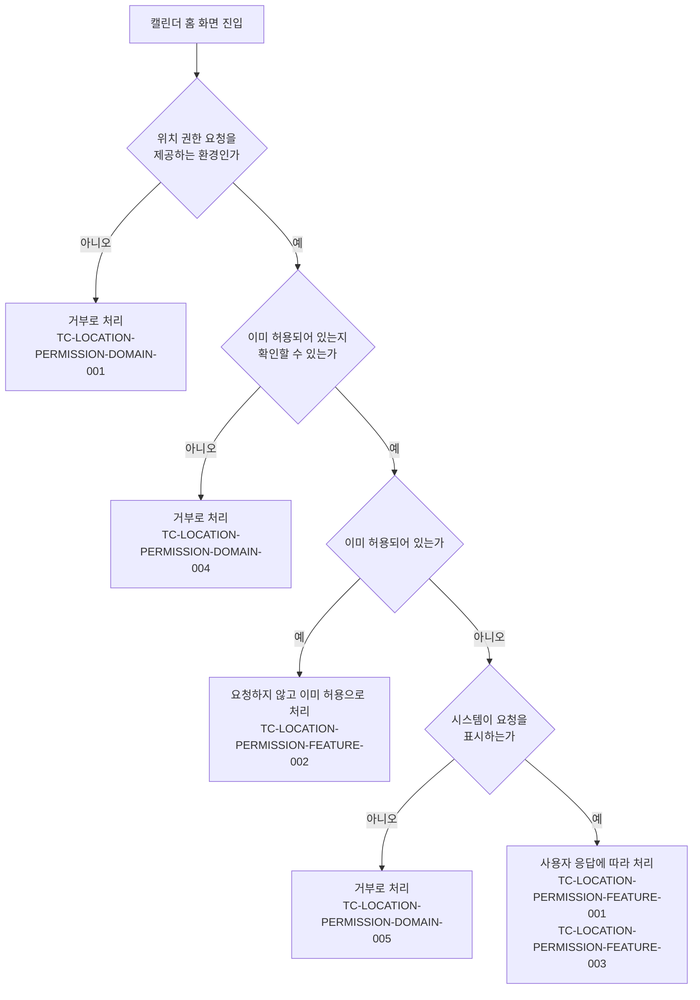

# 위치 권한 요청 테스트 케이스

기준 스펙: [위치 권한 요청 스펙](../spec/client/location-permission.md)

모든 권한이 공유하는 요청 시점, 요청 기준, 요청 결과는 [권한 요청 공통 스펙](../spec/client/permission.md)이 소유하고, 위치 권한에 적용된 결과를 이 문서가 확인한다.

위치 권한 요청에 대략적인 위치만 허용으로 응답해도 허용으로 보는 결과와, 요청 결과가 캘린더 홈 화면의 날씨 동기화에 반영되는 결과는 [CalendarHome 테스트 케이스](calendar-home.md)의 TC-CALENDAR-HOME-DATA-025 등이 다룬다.

## feature

### TC-LOCATION-PERMISSION-FEATURE-001: 위치 권한이 허용되어 있지 않으면 캘린더 홈 화면 진입 시 시스템 위치 권한 요청이 시작된다

- 근거: `feature > 캘린더 홈 화면 진입 시 위치 권한 요청`
- Given: 위치 권한 요청을 제공하는 환경에서 위치 권한이 허용되어 있지 않고, 캘린더 홈 화면이 준비되어 있다.
- When: 캘린더 홈 화면이 표시된다.
- Then: 시스템 위치 권한 요청이 한 번 시작된다.

### TC-LOCATION-PERMISSION-FEATURE-002: 위치 권한이 이미 허용되어 있으면 요청이 시작되지 않는다

- 근거: [권한 요청 공통 스펙의 요청 기준](../spec/client/permission.md#요청-기준)
- Given: 위치 권한이 이미 허용되어 있고, 캘린더 홈 화면이 준비되어 있다.
- When: 캘린더 홈 화면이 표시된다.
- Then: 시스템 위치 권한 요청이 시작되지 않는다.

### TC-LOCATION-PERMISSION-FEATURE-003: 요청에 어떻게 응답해도 화면이 유지되고 별도 안내가 표시되지 않는다

- 근거: [권한 요청 공통 스펙의 권한 요청 응답](../spec/client/permission.md#권한-요청-응답)
- Given: 위치 권한이 허용되어 있지 않아 캘린더 홈 화면 진입으로 시스템 위치 권한 요청이 시작되었고, 요청 응답이 정해져 있다.
- When: 사용자가 위치 권한 요청에 응답한다.
- Then: 캘린더 홈 화면이 그대로 유지되고 사용자에게 별도 안내가 표시되지 않는다.
- 테스트 데이터:

  | 요청 응답 |
  | --- |
  | 허용 |
  | 거부 |

## domain

스펙이 따르는 [권한 요청 공통 스펙의 요청 기준](../spec/client/permission.md#요청-기준)이 정의한 경로와 각 경로를 덮는 케이스는 다음과 같다.

### TC-LOCATION-PERMISSION-DOMAIN-001: 위치 권한 요청을 제공하지 않는 환경에서는 요청 없이 거부로 처리한다

- 근거: `domain > 요청 제공 범위`
- Given: 위치 권한 요청을 제공하지 않는 환경이다.
- When: 앱이 위치 권한을 요청한다.
- Then: 시스템 위치 권한 요청이 시작되지 않고 거부로 처리된다.

### TC-LOCATION-PERMISSION-DOMAIN-002: 캘린더 홈 화면이 유지되는 동안에는 요청 조건을 다시 확인하지 않는다

- 근거: `domain > 요청 지점`
- Given: 위치 권한이 허용되어 있지 않아 캘린더 홈 화면 진입으로 시스템 위치 권한 요청이 한 번 시작되었다.
- When: 캘린더 홈 화면을 다시 시작하지 않은 채 실행 상태가 바뀐다.
- Then: 시스템 위치 권한 요청이 다시 시작되지 않는다.
- 테스트 데이터:

  | 실행 상태 변화 |
  | --- |
  | 화면 재구성 |
  | 다른 화면으로 이동했다가 복귀 |
  | 앱이 백그라운드에 갔다가 복귀 |

### TC-LOCATION-PERMISSION-DOMAIN-003: 캘린더 홈 화면이 처음부터 다시 시작되면 요청 조건을 다시 확인한다

- 근거: `domain > 요청 지점`
- Given: 위치 권한이 아직 허용되어 있지 않고, 캘린더 홈 화면이 진입되어 시스템 위치 권한 요청이 한 번 시작되었다.
- When: 캘린더 홈 화면이 재생성되어 처음부터 다시 시작된다.
- Then: 시스템 위치 권한 요청이 다시 한 번 시작된다.

### TC-LOCATION-PERMISSION-DOMAIN-004: 위치 권한이 이미 허용되어 있는지 확인할 수 없으면 요청 없이 거부로 처리한다

- 근거: [권한 요청 공통 스펙의 요청 기준](../spec/client/permission.md#요청-기준)
- Given: 위치 권한이 이미 허용되어 있는지 확인할 수 없는 환경이다.
- When: 앱이 위치 권한을 요청한다.
- Then: 시스템 위치 권한 요청이 시작되지 않고 거부로 처리된다.
- 작성하지 않는 이유: 위치 권한 허용 여부를 확인할 수 없는 상황은 브라우저가 권한 상태 확인 기능을 제공하지 않을 때만 생기며, 현재 테스트 환경은 브라우저의 권한 상태 확인 기능이 없는 상황을 재현할 수 없다. 브라우저의 권한 상태 확인 기능 제공 여부를 제어할 수 있는 테스트 환경이 제공되면 자동화한다.

### TC-LOCATION-PERMISSION-DOMAIN-005: 시스템이 더 이상 요청을 표시하지 않으면 거부와 같이 처리한다

- 근거: [권한 요청 공통 스펙의 요청 기준](../spec/client/permission.md#요청-기준)
- Given: 사용자가 이전에 요청을 거부해 시스템이 더 이상 위치 권한 요청을 표시하지 않는 상태다.
- When: 앱이 위치 권한을 요청한다.
- Then: 사용자에게 요청이 표시되지 않고 거부로 처리된다.
- 작성하지 않는 이유: 요청을 더 이상 표시하지 않는 판단은 각 플랫폼의 권한 정책이 소유하며, 현재 테스트 환경은 실제 플랫폼의 권한 상태를 그 상태로 만들 수 없다. 플랫폼의 권한 표시 여부를 제어할 수 있는 테스트 환경이 제공되면 자동화한다.

### TC-LOCATION-PERMISSION-DOMAIN-006: 웹에서 브라우저가 위치 기능을 제공하지 않으면 요청 없이 거부로 처리한다

- 근거: `domain > 요청 제공 범위`
- Given: 브라우저가 위치 기능을 제공하지 않는 웹 환경이다.
- When: 앱이 위치 권한을 요청한다.
- Then: 시스템 위치 권한 요청이 시작되지 않고 거부로 처리된다.
- 작성하지 않는 이유: 브라우저가 위치 기능을 제공하지 않는 상황은 실제 브라우저에서만 재현되고, 현재 테스트 환경에는 웹 실행 환경이 없다. 브라우저의 위치 기능 제공 여부를 제어할 수 있는 테스트 환경이 제공되면 자동화한다.

### TC-LOCATION-PERMISSION-DOMAIN-007: 가장 정확한 위치 사용 권한을 요청한다

- 근거: `domain > 요청 범위`
- Given: 테스트 데이터의 환경에서 위치 권한이 허용되어 있지 않다.
- When: 앱이 위치 권한을 요청한다.
- Then: 테스트 데이터의 위치 권한을 요청한다.
- 테스트 데이터:

  | 환경 | 요청하는 위치 권한 |
  | --- | --- |
  | Android | 정확한 위치 사용 권한을 포함한 위치 권한 |
  | iOS | 플랫폼이 제공하는 가장 정확한 위치 사용 권한 |
  | 웹 | 정확도로 나누지 않은 하나의 위치 권한 |

- 작성하지 않는 이유: iOS와 웹 행은 요청한 위치 권한을 그 플랫폼의 시스템 권한 요청에서만 관찰할 수 있고, 현재 테스트 환경은 iOS와 브라우저를 실행하지 않으므로 그 두 행만 자동화하지 않는다. Android 행은 자동화한다. iOS와 브라우저의 권한 요청 내용을 관찰할 수 있는 테스트 환경이 제공되면 함께 자동화한다.

### TC-LOCATION-PERMISSION-DOMAIN-008: 허용 여부를 확인해도 시스템 위치 권한 요청이 시작되지 않는다

- 근거: `domain > 허용 여부 조회`, [권한 요청 공통 스펙의 허용 여부 조회](../spec/client/permission.md#허용-여부-조회)
- Given: 위치 권한 요청을 제공하는 환경에서 위치 권한이 허용되어 있지 않다.
- When: 앱이 위치 권한이 허용되어 있는지 확인한다.
- Then: 확인 결과가 `허용되지 않음`이고, 시스템 위치 권한 요청이 시작되지 않는다.

### TC-LOCATION-PERMISSION-DOMAIN-009: 앱 밖에서 위치 권한을 바꾸고 돌아오면 바뀐 허용 여부가 반영된다

- 근거: `domain > 허용 여부 조회`, [권한 요청 공통 스펙의 허용 여부 조회](../spec/client/permission.md#허용-여부-조회)
- Given: 위치 권한 허용 여부를 반영하는 화면이 테스트 데이터의 처음 허용 여부를 보여 주고 있다.
- When: 사용자가 앱을 떠나 시스템 설정에서 위치 권한을 바꾼 뒤, 그 화면으로 다시 들어가지 않고 앱으로 돌아온다.
- Then: 화면이 테스트 데이터의 바뀐 허용 여부를 반영한다.
- 테스트 데이터:

  | 처음 허용 여부 | 시스템 설정에서의 변경 | 반영되는 허용 여부 |
  | --- | --- | --- |
  | 허용되지 않음 | 허용 | 허용 |
  | 허용 | 허용 해제 | 허용되지 않음 |

### TC-LOCATION-PERMISSION-DOMAIN-010: 앱 안에서 요청에 응답하면 응답 직후 바뀐 허용 여부가 반영된다

- 근거: `domain > 허용 여부 조회`, [권한 요청 공통 스펙의 허용 여부 조회](../spec/client/permission.md#허용-여부-조회)
- Given: 위치 권한이 허용되어 있지 않아 허용 여부를 반영하는 화면이 `허용되지 않음`을 보여 주고, 같은 화면에서 시스템 위치 권한 요청이 시작된다.
- When: 사용자가 요청을 허용한다.
- Then: 화면을 다시 들어가거나 앱을 떠났다 돌아오지 않아도 허용 여부가 `허용`으로 반영된다.

### TC-LOCATION-PERMISSION-DOMAIN-011: 권한 개념이 없는 환경에서는 허용 여부가 허용되지 않음이다

- 근거: `domain > 허용 여부 조회`, [권한 요청 공통 스펙의 권한 개념이 없는 환경](../spec/client/permission.md#권한-개념이-없는-환경)
- Given: 시스템 권한 개념이 없는 환경이다.
- When: 앱이 위치 권한이 허용되어 있는지 확인한다.
- Then: 확인 결과가 `허용되지 않음`이다.

### TC-LOCATION-PERMISSION-DOMAIN-012: 대략적인 위치만 허용된 상태도 허용으로 확인한다

- 근거: `domain > 요청 범위`, `domain > 허용 여부 조회`
- Given: 시스템이 대략적인 위치만 허용하는 선택지를 제공하는 환경에서 사용자가 대략적인 위치만 허용해 두었다.
- When: 앱이 위치 권한이 허용되어 있는지 확인한다.
- Then: 확인 결과가 `허용`이다.

### TC-LOCATION-PERMISSION-DOMAIN-013: 캘린더 홈 화면 밖에서는 위치 권한을 요청하지 않는다

- 근거: `domain > 요청 지점`
- Given: 위치 권한이 허용되어 있지 않다.
- When: 사용자가 캘린더 홈 화면이 아닌 곳에서 지도를 보거나, 앱이 현재 위치를 확인한다.
- Then: 시스템 위치 권한 요청이 시작되지 않는다.
- 작성하지 않는 이유: 현재 위치 확인은 화면 없이 수행되어 권한 요청을 대신 받는 대체물을 연결할 자리가 없고, PlaceHome의 지도와 DiaryMap은 지도 제공자의 실제 지도 표시 요소가 필요해 지도를 표시한 화면을 구성할 수 없다. 같은 결과를 각 기능에서 다루는 [현재 위치 확인 테스트 케이스](current-location.md)의 TC-CURRENT-LOCATION-DOMAIN-005, [PlaceHome 테스트 케이스](place-home.md)의 TC-PLACE-HOME-DOMAIN-005, [DiaryMap 테스트 케이스](diary-map.md)의 TC-DIARY-MAP-DOMAIN-040도 같은 이유로 미작성이다. 화면 밖에서 시작되는 시스템 권한 요청을 관찰하거나 지도 표시 요소를 대체할 수 있는 테스트 환경이 제공되면 자동화한다.
