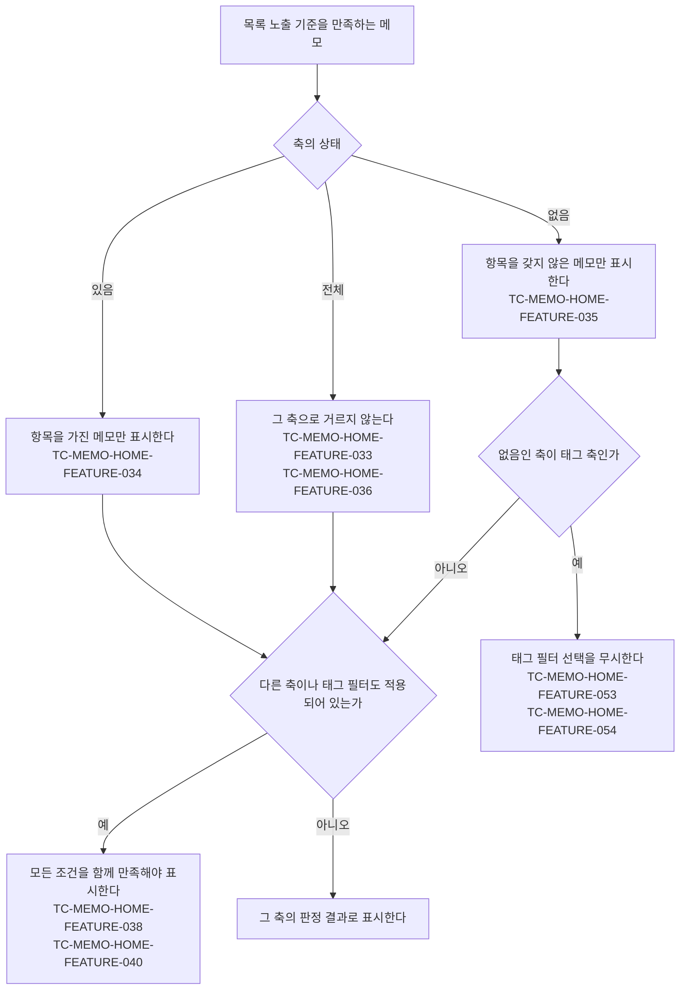

# MemoHome 목록 테스트 케이스

기준 스펙: [MemoHome 목록 스펙](../spec/memo-home.md)

태그 필터 케이스의 `근거`가 가리키는 MemoHome 목록 스펙의 태그 필터 관련 절은 공통 규칙을 [태그 필터 스펙](../spec/tag-filter.md)에, 필터를 바꾼 뒤 목록을 어디서부터 보는지는 [목록 필터 반영 스펙](../spec/list-filter.md)에 위임한다. 자리 표시 케이스의 `근거`가 가리키는 절도 같은 방식으로 [페이지 조회 목록의 자리 표시 스펙](../spec/paged-list-placeholder.md)에, 빈 상태 케이스의 `근거`가 가리키는 절은 [목록 빈 상태 스펙](../spec/list-empty-state.md)에 위임한다.

## feature

### TC-MEMO-HOME-FEATURE-001: 목록에 메모 제목이 표시된다

- 근거: `feature > 목록 표시`
- Given: 완료되지 않았고 삭제되지 않은 메모가 저장되어 있다.
- When: 사용자가 메모 목록 화면을 연다.
- Then: 각 메모의 제목이 목록에 표시된다.

### TC-MEMO-HOME-FEATURE-002: 아직 준비되지 않은 메모는 선택하거나 상태를 바꿀 수 없다

- 근거: `feature > 목록 표시`
- Given: 목록에 내용이 아직 준비되지 않은 메모가 로딩 상태로 표시되어 있다.
- When: 사용자가 해당 메모를 선택하거나 완료 또는 삭제하려고 한다.
- Then: 화면 전환이나 상태 변경이 발생하지 않는다.

### TC-MEMO-HOME-FEATURE-003: 메모를 완료하면 목록에서 사라지고 실행 취소를 제공한다

- 근거: `feature > 완료`
- Given: 완료되지 않은 메모가 목록에 표시되어 있다.
- When: 사용자가 해당 메모를 완료한다.
- Then: 해당 메모가 목록에서 사라지고 완료 안내와 실행 취소 동작이 제공된다.

### TC-MEMO-HOME-FEATURE-004: 완료를 실행 취소하면 메모가 목록에 다시 나타난다

- 근거: `feature > 완료`
- Given: 메모를 완료해 완료 안내와 실행 취소 동작이 제공되어 있다.
- When: 사용자가 실행 취소를 선택한다.
- Then: 해당 메모가 목록에 다시 나타난다.

### TC-MEMO-HOME-FEATURE-005: 메모를 삭제하면 목록에서 사라지고 실행 취소를 제공한다

- 근거: `feature > 삭제`
- Given: 삭제되지 않은 메모가 목록에 표시되어 있다.
- When: 사용자가 해당 메모를 삭제한다.
- Then: 해당 메모가 목록에서 사라지고 삭제 안내와 실행 취소 동작이 제공된다.

### TC-MEMO-HOME-FEATURE-006: 삭제를 실행 취소하면 메모가 목록에 다시 나타난다

- 근거: `feature > 삭제`
- Given: 메모를 삭제해 삭제 안내와 실행 취소 동작이 제공되어 있다.
- When: 사용자가 실행 취소를 선택한다.
- Then: 해당 메모가 목록에 다시 나타난다.

### TC-MEMO-HOME-FEATURE-010: 기간이 있는 메모에는 기간이 함께 표시된다

- 근거: `feature > 목록 표시`
- Given: 기간이 있는 미완료·미삭제 메모가 저장되어 있다.
- When: 사용자가 메모 목록 화면을 연다.
- Then: 해당 메모의 제목과 함께 저장된 기간이 표시된다.

### TC-MEMO-HOME-FEATURE-011: 기간이 없는 메모에는 기간이 표시되지 않는다

- 근거: `feature > 목록 표시`
- Given: 기간이 없는 미완료·미삭제 메모가 저장되어 있다.
- When: 사용자가 메모 목록 화면을 연다.
- Then: 해당 메모에는 제목만 표시되고 기간은 표시되지 않는다.

### TC-MEMO-HOME-FEATURE-012: 아직 준비되지 않은 메모에는 기간이 표시되지 않는다

- 근거: `feature > 목록 표시`
- Given: 목록에 내용이 아직 준비되지 않은 메모가 로딩 상태로 표시되어 있다.
- When: 사용자가 해당 메모를 확인한다.
- Then: 기간이 표시되지 않는다.

### TC-MEMO-HOME-FEATURE-013: 기간이 있는 메모에는 시작 날짜 헤더가 표시된다

- 근거: `feature > 날짜 헤더`
- Given: 오늘이 아닌 2026년 7월 19일에 시작하는 기간을 가진 미완료·미삭제 메모가 저장되어 있다.
- When: 사용자가 메모 목록 화면을 연다.
- Then: 해당 메모가 속한 묶음에 2026년 7월 19일을 나타내는 날짜 헤더가 표시된다.

### TC-MEMO-HOME-FEATURE-014: 시작 날짜가 같은 메모들에는 날짜 헤더가 하나만 표시된다

- 근거: `feature > 날짜 헤더`, `domain > 날짜 그룹과 오늘 기준`
- Given: 시작 날짜는 같고 시작 시각이 서로 다른 미완료·미삭제 메모 둘과, 다른 날짜에 시작하는 미완료·미삭제 메모 하나가 저장되어 있다.
- When: 사용자가 메모 목록 화면을 연다.
- Then: 시작 날짜가 같은 두 메모에는 그 날짜의 헤더가 하나만 표시되고, 다른 날짜에 시작하는 메모에는 그 날짜의 헤더가 따로 표시된다.

### TC-MEMO-HOME-FEATURE-015: 시작 날짜가 오늘인 메모의 날짜 헤더는 오늘임을 알린다

- 근거: `feature > 날짜 헤더`
- Given: 오늘 시작하는 기간을 가진 미완료·미삭제 메모가 저장되어 있다.
- When: 사용자가 메모 목록 화면을 연다.
- Then: 해당 날짜 헤더에는 날짜 대신 오늘임을 알리는 표시가 나타난다.

### TC-MEMO-HOME-FEATURE-016: 기간이 없는 메모에는 날짜 헤더가 표시되지 않는다

- 근거: `feature > 날짜 헤더`
- Given: 기간이 없는 미완료·미삭제 메모만 저장되어 있다.
- When: 사용자가 메모 목록 화면을 연다.
- Then: 목록에 메모 제목은 표시되지만 날짜 헤더는 표시되지 않는다.

### TC-MEMO-HOME-FEATURE-018: 화면을 벗어난 사이 날짜가 바뀌면 복귀 시 오늘 날짜 헤더가 옮겨진다

- 근거: `domain > 날짜 그룹과 오늘 기준`
- Given: 메모 목록 화면이 표시된 뒤 사용자가 화면을 벗어나 있는 동안 자정이 지나 오늘 날짜가 바뀌었다.
- When: 사용자가 메모 목록 화면으로 복귀한다.
- Then: 바뀐 오늘에 시작하는 메모의 날짜 헤더가 오늘임을 알리고, 이전 오늘의 날짜 헤더는 해당 날짜를 나타낸다.
- 작성하지 않는 이유: 오늘 판정이 시스템 시계를 따르는데 현재 테스트 환경에서는 시스템 시계를 제어할 수 없어 화면을 벗어난 사이 날짜가 바뀌는 상황을 결정적으로 재현할 수 없다. 오늘 판정에 사용하는 시계를 테스트에서 주입할 수 있는 구조가 마련되면 자동화한다.

### TC-MEMO-HOME-FEATURE-019: 아직 준비되지 않은 메모에는 날짜 헤더가 표시되지 않는다

- 근거: `feature > 날짜 헤더`
- Given: 목록에 내용이 아직 준비되지 않은 메모가 로딩 상태로 표시되어 있다.
- When: 사용자가 해당 메모를 확인한다.
- Then: 해당 메모에는 날짜 헤더가 표시되지 않는다.
- 작성하지 않는 이유: 현재 호스트 테스트 환경에서는 목록의 일부만 준비된 상태를 결정적으로 재현할 수 없어 자동화하지 않는다. 실기기 또는 에뮬레이터에서 페이지 단위 로딩을 재현할 수 있는 계측 테스트 환경이 갖춰지면 자동화할 수 있다.

### TC-MEMO-HOME-FEATURE-020: 태그 필터를 열면 태그와 선택 여부가 표시된다

- 근거: `feature > 태그 필터`
- Given: 선택할 수 있는 태그 중 하나는 필터에 선택되어 있고 다른 하나는 선택되어 있지 않다.
- When: 사용자가 메모 목록에서 태그 필터를 연다.
- Then: 선택할 수 있는 태그 전체와 각 태그의 선택 여부가 표시된다.

### TC-MEMO-HOME-FEATURE-021: 태그를 선택하면 해당 태그의 메모만 즉시 표시된다

- 근거: `feature > 태그 필터`
- Given: 태그를 선택하지 않은 상태이고 첫 번째 태그에만 연결된 메모와 두 번째 태그에만 연결된 메모가 목록에 표시되어 있다.
- When: 사용자가 태그 필터에서 첫 번째 태그를 선택한다.
- Then: 첫 번째 태그가 선택된 것으로 표시되고 첫 번째 태그와 연결된 메모만 목록에 표시된다.

### TC-MEMO-HOME-FEATURE-022: 여러 태그를 선택하면 하나 이상과 연결된 메모를 표시한다

- 근거: `feature > 태그 필터`, `domain > 태그 필터 기준`
- Given: 첫 번째 태그가 선택되어 있고 첫 번째 태그에만 연결된 메모, 두 번째 태그에만 연결된 메모와 어느 태그에도 연결되지 않은 메모가 있다.
- When: 사용자가 태그 필터에서 두 번째 태그도 선택한다.
- Then: 첫 번째 또는 두 번째 태그 중 하나 이상과 연결된 두 메모가 표시되고 어느 태그에도 연결되지 않은 메모는 표시되지 않는다.

### TC-MEMO-HOME-FEATURE-023: 마지막 태그의 선택을 해제하면 모든 메모를 표시한다

- 근거: `feature > 태그 필터`
- Given: 한 태그만 선택되어 있어 그 태그와 연결된 메모만 표시되어 있다.
- When: 사용자가 선택된 태그의 선택을 해제한다.
- Then: 태그의 선택 표시가 사라지고 태그와 관계없이 목록 노출 기준을 만족하는 메모가 모두 표시된다.

### TC-MEMO-HOME-FEATURE-024: 필터를 닫았다가 다시 열어도 선택을 표시한다

- 근거: `feature > 태그 필터`
- Given: 태그 필터에서 둘 이상의 태그를 선택했다.
- When: 사용자가 필터를 닫았다가 다시 연다.
- Then: 이전에 선택한 태그들이 선택된 상태로 표시된다.

### TC-MEMO-HOME-FEATURE-028: 태그 필터에 이모지와 제목을 함께 표시한다

- 근거: `feature > 태그 필터`
- Given: 이모지가 저장된 태그와 이모지가 비어 있는 태그가 선택할 수 있는 태그로 있다.
- When: 사용자가 메모 목록에서 태그 필터를 연다.
- Then: 이모지가 있는 태그는 이모지, 제목 순서로 함께 표시되고 이모지가 비어 있는 태그는 앞선 공백 없이 제목만 표시된다.

### TC-MEMO-HOME-FEATURE-031: 태그 필터를 열면 이동 없이 선택할 수 있는 태그 전체가 채워진다

- 근거: `feature > 태그 필터`
- Given: 현재 계정에 선택할 수 있는 태그가 한 번에 조회하는 범위보다 많이 저장되어 있다.
- When: 사용자가 메모 목록에서 태그 필터를 연다.
- Then: 사용자가 태그 영역을 이동하지 않아도 선택할 수 있는 태그 전체가 제목 오름차순으로 표시된다.
- 작성하지 않는 이유: 여러 페이지를 이어서 조회하는 상태를 만들려면 실제 페이지 조회가 동작해야 하지만, 그 조회는 화면 테스트가 제어하는 시계 밖의 스레드에서 진행되어 완료 시점을 결정적으로 기다릴 수 없다. 전체 테스트와 함께 실행할 때만 간헐적으로 실패하는 것을 확인했다. 페이지 준비 시점을 제어할 수 있는 테스트 환경이 제공되면 자동화한다.

### TC-MEMO-HOME-FEATURE-029: 완료된 메모 확인을 선택하면 MemoFinishedList 화면으로 이동한다

- 근거: `feature > 완료된 메모 확인`
- Given: 사용자가 MemoHome 목록을 보고 있다.
- When: 사용자가 완료된 메모 확인을 선택한다.
- Then: MemoFinishedList 화면으로 이동한다.

### TC-MEMO-HOME-FEATURE-030: 완료된 메모가 없어도 완료된 메모 확인 동작을 제공한다

- 근거: `feature > 완료된 메모 확인`
- Given: 현재 계정에 완료된 메모가 하나도 없다.
- When: 사용자가 MemoHome 목록에서 실행할 수 있는 동작을 확인한다.
- Then: 완료된 메모 확인 동작이 제공된다.

### TC-MEMO-HOME-FEATURE-047: 검색을 선택하면 메모 유형으로 시작하는 SearchHome 화면으로 이동한다

- 근거: `feature > 검색으로 이동`
- Given: 사용자가 MemoHome 목록을 보고 있다.
- When: 사용자가 검색을 선택한다.
- Then: SearchHome 화면으로 이동하는 동작이 한 번 실행된다.

지정하는 시작 유형은 화면 밖 내비게이션 배선이 정하므로 이 케이스에서 관찰하지 않는다. 시작 유형별 표시는 [SearchHome 테스트 케이스](./search-home.md)의 `TC-SEARCH-HOME-FEATURE-005`가 다룬다.

### TC-MEMO-HOME-FEATURE-048: 표시할 메모가 없거나 필터를 적용해 두어도 검색 동작을 제공한다

- 근거: `feature > 검색으로 이동`, `feature > 빈 상태`
- Given: 테스트 데이터의 상태로 MemoHome 목록을 보고 있다.
- When: 사용자가 화면에서 실행할 수 있는 동작을 확인한다.
- Then: 검색 동작이 제공된다.
- 테스트 데이터:

| 상태 |
| --- |
| 빈 상태 안내가 표시되어 있다 |
| 유무 필터를 `있음`으로 골라 두었다 |

### 유무 필터 판정 경로와 케이스

### TC-MEMO-HOME-FEATURE-032: 필터를 열면 세 축의 현재 상태가 표시된다

- 근거: `feature > 유무 필터`
- Given: 날짜 축은 `있음`, 태그 축은 `없음`, 장소 축은 `전체`로 유지되어 있다.
- When: 사용자가 메모 목록에서 필터를 연다.
- Then: 날짜, 태그, 장소 축이 각각 `있음`, `없음`, `전체`가 선택된 상태로 표시된다.

### TC-MEMO-HOME-FEATURE-033: 처음에는 세 축이 모두 전체이고 목록을 거르지 않는다

- 근거: `feature > 유무 필터`, `domain > 유무 필터 기준`
- Given: 기기에 유무 필터 상태를 한 번도 고르지 않았고, 기간·태그·장소를 각각 가진 메모와 아무것도 없는 메모가 있다.
- When: 사용자가 메모 목록과 필터를 연다.
- Then: 세 축 모두 `전체`가 선택된 상태로 표시되고 목록 노출 기준을 만족하는 메모가 모두 표시된다.

### TC-MEMO-HOME-FEATURE-034: 축에서 있음을 고르면 그 항목을 가진 메모만 즉시 표시된다

- 근거: `feature > 유무 필터`
- Given: 세 축이 모두 `전체`이고 테스트 데이터의 항목을 가진 메모와 갖지 않은 메모가 목록에 표시되어 있다.
- When: 사용자가 그 축에서 `있음`을 고른다.
- Then: 그 항목을 가진 메모만 목록에 표시되고, 다른 축의 조건으로는 걸러지지 않는다.
- 테스트 데이터:

  | 축 | 항목을 가진 메모 | 항목을 갖지 않은 메모 |
  | --- | --- | --- |
  | 날짜 | 기간이 있는 메모 | 기간이 없는 메모 |
  | 태그 | 태그와 연결된 메모 | 어느 태그와도 연결되지 않은 메모 |
  | 장소 | 장소와 연결된 메모 | 어느 장소와도 연결되지 않은 메모 |

### TC-MEMO-HOME-FEATURE-035: 축에서 없음을 고르면 그 항목이 없는 메모만 즉시 표시된다

- 근거: `feature > 유무 필터`
- Given: 세 축이 모두 `전체`이고 테스트 데이터의 항목을 가진 메모와 갖지 않은 메모가 목록에 표시되어 있다.
- When: 사용자가 그 축에서 `없음`을 고른다.
- Then: 그 항목을 갖지 않은 메모만 목록에 표시된다.
- 테스트 데이터: `TC-MEMO-HOME-FEATURE-034`와 같다.

### TC-MEMO-HOME-FEATURE-036: 축을 전체로 되돌리면 그 축으로 거르지 않는다

- 근거: `feature > 유무 필터`
- Given: 날짜 축이 `있음`이어서 기간이 있는 메모만 표시되어 있다.
- When: 사용자가 날짜 축에서 `전체`를 고른다.
- Then: 기간이 없는 메모도 다시 표시되어 목록 노출 기준을 만족하는 메모가 모두 표시된다.

### TC-MEMO-HOME-FEATURE-037: 필터를 닫았다가 다시 열어도 유무 필터 상태를 표시한다

- 근거: `feature > 유무 필터`
- Given: 사용자가 필터에서 장소 축을 `있음`으로 골랐다.
- When: 사용자가 필터를 닫았다가 다시 연다.
- Then: 장소 축이 `있음`으로 선택된 상태로 표시된다.

### TC-MEMO-HOME-FEATURE-038: 서로 다른 축을 함께 고르면 모두 만족하는 메모만 표시된다

- 근거: `feature > 유무 필터`, `domain > 필터 조합 기준`
- Given: 기간과 장소를 모두 가진 메모, 기간만 가진 메모, 장소만 가진 메모, 둘 다 없는 메모가 목록에 표시되어 있다.
- When: 사용자가 날짜 축을 `있음`으로, 장소 축을 `있음`으로 고른다.
- Then: 기간과 장소를 모두 가진 메모만 표시된다.

### TC-MEMO-HOME-FEATURE-053: 태그 축이 없음이면 선택한 태그를 무시하고 태그 없는 메모를 표시한다

- 근거: `domain > 필터 조합 기준`
- Given: 첫 번째 태그와 연결된 메모와 어느 태그와도 연결되지 않은 메모가 목록에 표시되어 있고, 태그 축은 `전체`이며 첫 번째 태그가 선택되어 있다.
- When: 사용자가 태그 축을 `없음`으로 고른다.
- Then: 어느 태그와도 연결되지 않은 메모만 표시되고 선택한 태그는 그대로 유지된다.

### TC-MEMO-HOME-FEATURE-054: 태그 축을 되돌리면 유지된 태그 선택이 다시 적용된다

- 근거: `domain > 필터 조합 기준`
- Given: 첫 번째 태그가 선택되어 있고 태그 축이 `없음`이어서 어느 태그와도 연결되지 않은 메모만 표시되어 있다.
- When: 사용자가 태그 축을 `전체`로 되돌린다.
- Then: 첫 번째 태그와 연결된 메모만 표시되고 첫 번째 태그는 선택된 것으로 표시된다.

### TC-MEMO-HOME-FEATURE-055: 태그 축이 없음이면 태그 필터가 적용되지 않음을 알리고 조작할 수 없다

- 근거: `feature > 유무 필터`
- Given: 첫 번째 태그가 선택되어 있고 선택하지 않은 두 번째 태그도 표시되어 있다.
- When: 사용자가 태그 축을 `없음`으로 고른 뒤 두 번째 태그의 칩과 선택 전체 해제를 실행하려고 한다.
- Then: 태그 필터가 적용되지 않는다는 안내가 표시되고, 두 태그의 선택 여부와 목록에 표시된 메모는 바뀌지 않는다.

### TC-MEMO-HOME-FEATURE-056: 선택 전체 해제를 실행하면 선택한 태그가 모두 해제된다

- 근거: `feature > 태그 필터`
- Given: 태그 축이 `전체`이고 두 태그가 선택되어 있어 그 태그들과 연결된 메모만 표시되어 있다.
- When: 사용자가 태그 필터에서 선택 전체 해제를 실행한다.
- Then: 두 태그 모두 선택되지 않은 것으로 표시되고 태그와 관계없이 목록 노출 기준을 만족하는 메모가 모두 표시된다.

### TC-MEMO-HOME-FEATURE-057: 선택한 태그가 없으면 선택 전체 해제를 실행할 수 없다

- 근거: `feature > 태그 필터`
- Given: 태그 축이 `전체`이고 선택할 수 있는 태그가 표시되어 있으며 선택한 태그가 하나도 없다.
- When: 사용자가 태그 필터에서 선택 전체 해제를 실행하려고 한다.
- Then: 선택 전체 해제가 실행되지 않고 목록에 표시된 메모도 바뀌지 않는다.

### TC-MEMO-HOME-FEATURE-058: 선택 전체 해제는 유무 필터의 축 상태를 바꾸지 않는다

- 근거: `feature > 태그 필터`
- Given: 날짜 축이 `있음`이고 태그 축과 장소 축은 `전체`이며 태그가 하나 선택되어 있다.
- When: 사용자가 태그 필터에서 선택 전체 해제를 실행한다.
- Then: 선택한 태그만 해제되고 날짜 축은 `있음`, 태그 축과 장소 축은 `전체`로 그대로 표시된다.

### TC-MEMO-HOME-FEATURE-040: 유무 필터와 태그 필터를 함께 만족하는 메모만 표시된다

- 근거: `domain > 필터 조합 기준`
- Given: 선택한 태그와 연결되고 기간도 있는 메모, 선택한 태그와 연결되었지만 기간이 없는 메모, 기간은 있지만 다른 태그에만 연결된 메모가 목록에 표시되어 있다.
- When: 사용자가 태그 필터에서 첫 번째 태그를 선택하고 날짜 축을 `있음`으로 고른다.
- Then: 선택한 태그와 연결되고 기간도 있는 메모만 표시된다.

### TC-MEMO-HOME-FEATURE-041: 필터를 적용하지 않았는데 표시할 메모가 없으면 아직 메모가 없음을 알린다

- 근거: `feature > 빈 상태`
- Given: 유무 필터의 세 축이 모두 `전체`이고 선택한 태그가 하나도 없으며, 표시할 메모가 없고 목록의 준비가 끝났다.
- When: 사용자가 MemoHome 목록을 확인한다.
- Then: 메모 카드 대신 아직 메모가 없음을 알리는 안내가 표시된다.

### TC-MEMO-HOME-FEATURE-042: 필터를 적용한 채로 표시할 메모가 없으면 조건에 맞는 메모가 없음을 알린다

- 근거: `feature > 빈 상태`, `domain > 필터 조합 기준`
- Given: 아래 테스트 데이터의 필터를 적용해 두었고, 표시할 메모가 없으며 목록의 준비가 끝났다.
- When: 사용자가 MemoHome 목록을 확인한다.
- Then: 메모 카드 대신 조건에 맞는 메모가 없음을 알리는 안내가 표시되고, 필터 선택은 그대로 유지된다.
- 테스트 데이터:

| 적용한 필터 |
| --- |
| 유무 필터의 한 축이 `있음` |
| 유무 필터의 한 축이 `없음` |
| 태그를 하나 이상 선택 |

### TC-MEMO-HOME-FEATURE-043: 목록을 준비하는 동안에는 빈 상태 안내를 표시하지 않는다

- 근거: `feature > 빈 상태`
- Given: 목록에 표시된 메모가 아직 하나도 없고 목록의 준비가 끝나지 않았다.
- When: 사용자가 MemoHome 목록을 확인한다.
- Then: 빈 상태 안내가 표시되지 않는다.

### TC-MEMO-HOME-FEATURE-044: 마지막 메모를 완료하면 빈 상태 안내가 나타나고 실행 취소하면 사라진다

- 근거: `feature > 빈 상태`, `feature > 완료`
- Given: 목록에 메모가 하나만 표시되어 있다.
- When: 사용자가 그 메모를 완료한 뒤 실행 취소를 선택한다.
- Then: 완료한 직후에는 아직 메모가 없음을 알리는 안내가 표시되고, 실행 취소한 뒤에는 그 안내가 사라지며 메모가 다시 표시된다.
- 작성하지 않는 이유: 마지막 항목이 사라지는 전환을 만들려면 화면에 연결된 페이지 조회 결과를 도중에 바꿔야 하는데, 현재 호스트 테스트 환경은 바뀐 페이지 조회 결과의 수집을 결정적으로 진행시키지 못해 전체 테스트를 함께 실행하면 결과가 갈린다. 두 끝 상태는 각각 별도 케이스로 검증한다. 페이지 조회 결과의 반영 시점을 제어할 수 있는 테스트 환경이 제공되면 자동화한다.

### TC-MEMO-HOME-FEATURE-046: 빈 상태에서도 목록을 당겨 새로고침할 수 있다

- 근거: `feature > 빈 상태`
- Given: MemoHome 목록에 빈 상태 안내가 표시되어 있다.
- When: 사용자가 빈 상태 영역을 아래로 당겨 새로고침을 요청한다.
- Then: 새로고침이 한 번 요청된다.

### TC-MEMO-HOME-FEATURE-045: 빈 상태에서도 메모 추가, 필터 열기와 완료된 메모 확인을 실행할 수 있다

- 근거: `feature > 빈 상태`
- Given: MemoHome 목록에 빈 상태 안내가 표시되어 있다.
- When: 사용자가 화면에서 실행할 수 있는 동작을 확인한다.
- Then: 메모 추가 동작, 필터 열기 동작, 완료된 메모 확인 동작이 모두 제공된다.

### TC-MEMO-HOME-FEATURE-061: 목록 위에 현재 정렬을 표시한다

- 근거: `feature > 정렬 선택`
- Given: 현재 계정에 메모가 있고 사용자가 정렬을 고르지 않았다.
- When: MemoHome 화면이 표시된다.
- Then: 목록 위에 현재 정렬이 기본순임을 알리는 컨트롤이 표시된다.

### TC-MEMO-HOME-FEATURE-062: 정렬 컨트롤을 누르면 세 정렬을 고를 수 있다

- 근거: `feature > 정렬 선택`
- Given: MemoHome 화면에 정렬 컨트롤이 표시되어 있다.
- When: 사용자가 정렬 컨트롤을 선택한다.
- Then: 기본순, 제목순, 최근 수정순을 이 순서로 고를 수 있는 목록이 나타나고 기본순이 선택 상태로 표시된다.

### TC-MEMO-HOME-FEATURE-063: 목록이 비어 있으면 정렬 컨트롤 없이 완료된 메모 확인 동작만 남는다

- 근거: `feature > 정렬 선택`
- Given: 현재 계정에 표시할 메모가 없다.
- When: MemoHome 화면이 표시된다.
- Then: 빈 상태 안내와 완료된 메모 확인 동작이 표시되고 정렬 컨트롤은 표시되지 않는다.

### TC-MEMO-HOME-FEATURE-049: 제목순을 고르면 목록이 제목 오름차순으로 바뀐다

- 근거: `feature > 정렬 선택`
- Given: 기본순과 제목 오름차순의 순서가 서로 다른 메모가 목록에 표시되어 있다.
- When: 사용자가 정렬 컨트롤을 열어 제목순을 고른다.
- Then: 선택 목록이 닫히고 메모가 제목 오름차순으로 표시되며 정렬 컨트롤이 제목순을 알린다.

### TC-MEMO-HOME-FEATURE-050: 최근 수정순을 고르면 목록이 수정 시각 내림차순으로 바뀐다

- 근거: `feature > 정렬 선택`
- Given: 기본순과 수정 시각 내림차순의 순서가 서로 다른 메모가 목록에 표시되어 있다.
- When: 사용자가 정렬 컨트롤을 열어 최근 수정순을 고른다.
- Then: 선택 목록이 닫히고 메모가 수정 시각이 늦은 것부터 표시된다.

### TC-MEMO-HOME-FEATURE-051: 기본순이 아닌 정렬에서는 날짜 헤더를 표시하지 않는다

- 근거: `feature > 정렬 선택`, `feature > 날짜 헤더`
- Given: 기간이 있는 메모가 날짜 헤더와 함께 목록에 표시되어 있다.
- When: 사용자가 정렬을 제목순으로 바꾼다.
- Then: 날짜 헤더가 사라지고 메모만 제목 오름차순으로 표시된다.

### TC-MEMO-HOME-FEATURE-052: 정렬을 바꿔도 적용한 필터는 그대로 유지된다

- 근거: `feature > 정렬 선택`
- Given: 유무 필터를 적용해 일부 메모만 표시되어 있다.
- When: 사용자가 정렬을 최근 수정순으로 바꾼다.
- Then: 필터로 걸러진 같은 메모만 순서만 달라져 표시된다.

### TC-MEMO-HOME-FEATURE-059: 유무 필터 축을 바꾸면 목록을 처음부터 다시 본다

- 근거: `feature > 유무 필터`
- Given: 한 화면에 다 들어가지 않을 만큼 메모가 목록에 표시되어 있고, 사용자가 목록을 아래로 이동해 첫 메모 카드가 보이지 않는 상태다.
- When: 사용자가 필터에서 장소 축을 `전체`에서 `있음`으로 바꾸고, 좁힌 결과가 목록에 놓인다.
- Then: 첫 메모 카드가 다시 보이고, 사용자가 이동해 보고 있던 자리의 메모 카드는 보이지 않는다.
- 작성하지 않는 이유: 이 케이스의 결과는 조회 조건을 바꾼 뒤 새로 조회한 결과가 목록에 놓이는 시점에만 관찰할 수 있다. 현재 호스트 테스트 환경은 한 실행 안에서 앞선 테스트가 남긴 화면 상태의 영향을 받아, 이어지는 테스트에서 페이지 조회 목록이 두 번째 조회 결과를 더 이상 반영하지 않는다. 그래서 새 결과가 놓이는 시점을 결정적으로 만들 수 없다. 테스트마다 실행 환경이 격리되는 테스트 환경이 제공되면 자동화한다.

### TC-MEMO-HOME-FEATURE-060: 태그 필터 선택을 바꾸면 목록을 처음부터 다시 본다

- 근거: `feature > 태그 필터`
- Given: 한 화면에 다 들어가지 않을 만큼 메모가 목록에 표시되어 있고, 사용자가 목록을 아래로 이동해 첫 메모 카드가 보이지 않는 상태다.
- When: 사용자가 태그 필터에서 테스트 데이터의 동작을 실행하고, 좁힌 결과가 목록에 놓인다.
- Then: 첫 메모 카드가 다시 보이고, 사용자가 이동해 보고 있던 자리의 메모 카드는 보이지 않는다.
- 작성하지 않는 이유: 이 케이스의 결과는 조회 조건을 바꾼 뒤 새로 조회한 결과가 목록에 놓이는 시점에만 관찰할 수 있다. 현재 호스트 테스트 환경은 한 실행 안에서 앞선 테스트가 남긴 화면 상태의 영향을 받아, 이어지는 테스트에서 페이지 조회 목록이 두 번째 조회 결과를 더 이상 반영하지 않는다. 그래서 새 결과가 놓이는 시점을 결정적으로 만들 수 없다. 테스트마다 실행 환경이 격리되는 테스트 환경이 제공되면 자동화한다.
- 테스트 데이터:

| 동작 |
| --- |
| 선택되어 있지 않은 태그를 선택한다 |
| 선택되어 있는 태그의 선택을 해제한다 |
| 선택을 전체 해제한다 |

### TC-MEMO-HOME-FEATURE-063: 태그 필터에 태그 추가 칩을 항상 표시한다

- 근거: `feature > 태그 필터`
- Given: 태그 조회 상태가 테스트 데이터와 같다.
- When: 사용자가 메모 목록에서 태그 필터를 연다.
- Then: 태그 필터에 `태그 추가` 칩이 표시되고 누를 수 있다. 태그가 하나도 없어도 빈 상태 안내는 표시되지 않는다.
- 테스트 데이터:

| 태그 조회 상태 |
| --- |
| 선택할 수 있는 태그가 있다 |
| 선택할 수 있는 태그 없이 조회가 끝났다 |
| 태그 조회가 진행 중이다 |
| 태그 조회에 실패했다 |

### TC-MEMO-HOME-FEATURE-064: 태그 추가 칩을 누르면 TagAdd 화면으로 이동한다

- 근거: `feature > 태그 필터`
- Given: 태그 필터에 `태그 추가` 칩이 표시되어 있다.
- When: 사용자가 `태그 추가` 칩을 누른다.
- Then: 태그 필터가 닫히고 TagAdd 화면으로 이동하며, 태그 필터 선택은 바뀌지 않는다.

### TC-MEMO-HOME-FEATURE-065: 태그 축이 없음이면 태그 추가 칩을 누를 수 없다

- 근거: `feature > 유무 필터`, `domain > 태그 필터 기준`
- Given: 유무 필터의 태그 축이 `없음`이고 태그 필터에 `태그 추가` 칩이 표시되어 있다.
- When: 사용자가 `태그 추가` 칩을 누른다.
- Then: 칩은 비활성으로 표시되고 TagAdd 화면으로 이동하지 않는다.

## domain

### TC-MEMO-HOME-DOMAIN-001: 완료는 메모를 제거하지 않고 완료 상태로 바꾼다

- 근거: `domain > 완료와 삭제의 상태 전이`
- Given: 완료되지 않은 메모가 저장되어 있다.
- When: 사용자가 메모를 완료한다.
- Then: 메모는 저장소에 남아 있고 완료 상태로 조회된다.

### TC-MEMO-HOME-DOMAIN-002: 삭제는 메모를 제거하지 않고 삭제 상태로 바꾼다

- 근거: `domain > 완료와 삭제의 상태 전이`
- Given: 삭제되지 않은 메모가 저장되어 있다.
- When: 사용자가 메모를 삭제한다.
- Then: 메모는 저장소에 남아 있고 삭제 상태로 조회된다.

### TC-MEMO-HOME-DOMAIN-003: 완료 실행 취소는 메모를 미완료 상태로 되돌린다

- 근거: `domain > 완료와 삭제의 상태 전이`
- Given: 완료 상태의 메모가 저장되어 있다.
- When: 사용자가 완료를 실행 취소한다.
- Then: 메모는 완료되지 않은 상태로 조회된다.

### TC-MEMO-HOME-DOMAIN-004: 삭제 실행 취소는 메모를 미삭제 상태로 되돌린다

- 근거: `domain > 완료와 삭제의 상태 전이`
- Given: 삭제 상태의 메모가 저장되어 있다.
- When: 사용자가 삭제를 실행 취소한다.
- Then: 메모는 삭제되지 않은 상태로 조회된다.

### TC-MEMO-HOME-DOMAIN-005: 상태 변경은 수정 시각을 동작 시점으로 갱신한다

- 근거: `domain > 완료와 삭제의 상태 전이`
- Given: 과거 수정 시각을 가진 메모가 저장되어 있다.
- When: 사용자가 상태 변경 동작을 실행한다.
- Then: 메모의 수정 시각이 동작 시점으로 갱신되어 조회된다.
- 테스트 데이터:

  | 동작 |
  | --- |
  | 완료 |
  | 삭제 |
  | 완료 실행 취소 |
  | 삭제 실행 취소 |

### TC-MEMO-HOME-DOMAIN-006: 필터와 일치해도 완료되거나 삭제된 메모는 표시하지 않는다

- 근거: `domain > 태그 필터 기준`
- Given: 선택한 태그와 연결된 미완료·미삭제 메모, 완료된 메모와 삭제된 메모가 있다.
- When: 선택한 태그를 기준으로 메모 목록을 확인한다.
- Then: 미완료·미삭제 메모만 표시된다.

### TC-MEMO-HOME-DOMAIN-007: 선택할 수 있는 태그만 제목 오름차순으로 제공한다

- 근거: `domain > 태그 필터 기준`
- Given: 현재 계정과 연결된 미완료·미삭제 태그, 완료된 태그와 삭제된 태그 및 다른 계정에만 연결된 태그가 있다.
- When: 태그 필터의 선택 대상을 확인한다.
- Then: 현재 계정의 미완료·미삭제 태그만 제목 오름차순으로 제공된다.

### TC-MEMO-HOME-DOMAIN-009: 선택한 태그를 선택할 수 없게 되면 그 선택을 무시한다

- 근거: `domain > 태그 필터 기준`
- Given: 필터에 선택된 유일한 태그가 있다.
- When: 그 태그가 완료되거나 삭제되거나 현재 사용자 계정과 연결되지 않게 된다.
- Then: 그 태그는 필터의 선택 대상과 선택 표시에서 사라지고 태그와 관계없이 목록 노출 기준을 만족하는 메모가 모두 표시된다.
- 테스트 데이터:

  | 선택할 수 없게 된 이유 |
  | --- |
  | 완료 |
  | 삭제 |
  | 현재 사용자 계정과의 연결 해제 |

### TC-MEMO-HOME-DOMAIN-010: 태그가 다시 선택할 수 있게 되면 이전 선택을 다시 적용한다

- 근거: `domain > 태그 필터 기준`
- Given: 필터에 선택된 유일한 태그가 완료되어 선택이 무시되고 있다.
- When: 그 태그의 완료를 실행 취소한다.
- Then: 필터에 그 태그가 선택된 상태로 표시되고 목록에는 그 태그와 연결된 메모만 다시 표시된다.

### TC-MEMO-HOME-DOMAIN-011: 날짜 축은 기간의 종일 여부와 시각을 판정에 쓰지 않는다

- 근거: `domain > 유무 필터 기준`
- Given: 종일 기간을 가진 메모, 날짜·시간 기간을 가진 메모, 오늘보다 이전에 끝난 기간을 가진 메모와 기간이 없는 메모가 있다.
- When: 날짜 축을 `있음`으로 두고 메모 목록을 확인한다.
- Then: 기간이 있는 세 메모가 모두 표시되고 기간이 없는 메모만 표시되지 않는다.

### TC-MEMO-HOME-DOMAIN-012: 태그 축은 해제된 연결과 삭제된 태그를 세지 않는다

- 근거: `domain > 유무 필터 기준`
- Given: 테스트 데이터의 태그 상태를 가진 메모가 각각 있다.
- When: 태그 축을 `있음`으로 두고 메모 목록을 확인한다.
- Then: 테스트 데이터의 기대 결과대로 표시된다.
- 테스트 데이터:

  | 메모의 태그 상태 | 기대 결과 |
  | --- | --- |
  | 현재 계정과 연결된 미완료 태그와 연결됨 | 표시된다 |
  | 현재 계정과 연결된 완료된 태그와만 연결됨 | 표시된다 |
  | 삭제된 태그와만 연결됨 | 표시되지 않는다 |
  | 연결이 모두 해제됨 | 표시되지 않는다 |
  | 다른 계정에만 연결된 태그와만 연결됨 | 표시되지 않는다 |

### TC-MEMO-HOME-DOMAIN-013: 장소 축은 해제된 연결과 삭제된 장소를 세지 않는다

- 근거: `domain > 유무 필터 기준`
- Given: 테스트 데이터의 장소 상태를 가진 메모가 각각 있다.
- When: 장소 축을 `있음`으로 두고 메모 목록을 확인한다.
- Then: 테스트 데이터의 기대 결과대로 표시된다.
- 테스트 데이터:

  | 메모의 장소 상태 | 기대 결과 |
  | --- | --- |
  | 현재 계정과 연결된 장소와 연결됨 | 표시된다 |
  | 삭제된 장소와만 연결됨 | 표시되지 않는다 |
  | 연결이 모두 해제됨 | 표시되지 않는다 |
  | 다른 계정에만 연결된 장소와만 연결됨 | 표시되지 않는다 |

### TC-MEMO-HOME-DOMAIN-014: 유무 필터를 만족해도 완료되거나 삭제된 메모는 표시하지 않는다

- 근거: `domain > 필터 조합 기준`
- Given: 기간이 있는 미완료·미삭제 메모, 기간이 있는 완료된 메모와 기간이 있는 삭제된 메모가 있다.
- When: 날짜 축을 `있음`으로 두고 메모 목록을 확인한다.
- Then: 미완료·미삭제 메모만 표시된다.

### TC-MEMO-HOME-DOMAIN-015: 메모의 항목이 바뀌면 유무 필터로 다시 판정한다

- 근거: `domain > 유무 필터 기준`
- Given: 테스트 데이터의 축이 `있음`으로 적용되어 그 항목이 없는 메모가 목록에서 빠져 있다.
- When: 그 메모에 테스트 데이터의 항목이 더해진다.
- Then: 그 메모가 목록에 나타난다.
- 테스트 데이터:

  | 축 | 더해지는 항목 |
  | --- | --- |
  | 날짜 | 기간 |
  | 태그 | 태그 연결 |
  | 장소 | 장소 연결 |

### TC-MEMO-HOME-DOMAIN-016: 기본순에서만 날짜 헤더로 묶는다

- 근거: `domain > 날짜 그룹과 오늘 기준`
- Given: 시작 날짜가 서로 다른 기간 있는 메모들이 저장되어 있다.
- When: 테스트 데이터의 정렬로 메모 목록을 표시한다.
- Then: 테스트 데이터의 기대 결과가 표시된다.
- 테스트 데이터:

| 정렬 | 기대 결과 |
| --- | --- |
| 기본순 | 시작 날짜마다 날짜 헤더가 나타남 |
| 제목순 | 날짜 헤더가 나타나지 않음 |
| 최근 수정순 | 날짜 헤더가 나타나지 않음 |

### TC-MEMO-HOME-DOMAIN-017: 이미 고른 값을 다시 골라도 목록 위치를 유지한다

- 근거: `feature > 유무 필터`
- Given: 장소 축이 `있음`으로 골라져 있고, TC-MEMO-HOME-FEATURE-059와 같이 사용자가 목록을 아래로 이동해 첫 메모 카드가 보이지 않는 상태다.
- When: 사용자가 필터에서 장소 축의 `있음`을 다시 고른다.
- Then: 첫 메모 카드는 여전히 보이지 않고 사용자가 보고 있던 자리가 그대로 유지된다.
- 작성하지 않는 이유: 이 케이스의 결과는 조회 조건을 바꾼 뒤 새로 조회한 결과가 목록에 놓이는 시점에만 관찰할 수 있다. 현재 호스트 테스트 환경은 한 실행 안에서 앞선 테스트가 남긴 화면 상태의 영향을 받아, 이어지는 테스트에서 페이지 조회 목록이 두 번째 조회 결과를 더 이상 반영하지 않는다. 그래서 새 결과가 놓이는 시점을 결정적으로 만들 수 없다. 테스트마다 실행 환경이 격리되는 테스트 환경이 제공되면 자동화한다.

## data

### TC-MEMO-HOME-DATA-001: 완료되었거나 삭제된 메모는 목록 조회에서 제외된다

- 근거: `data > 목록 조회`
- Given: 미완료·미삭제 메모, 완료된 메모, 삭제된 메모가 함께 저장되어 있다.
- When: 메모 목록을 조회한다.
- Then: 미완료·미삭제 메모만 조회된다.

### TC-MEMO-HOME-DATA-004: 목록은 기간, 시작 시점, 종료 시점, 제목 순으로 정렬해 조회한다

- 근거: `domain > 정렬`
- Given: 테스트 데이터의 메모들이 저장되어 있고 사용자가 정렬을 고르지 않았다.
- When: 메모 목록을 조회한다.
- Then: 테스트 데이터의 기대 순서로 조회된다.
- 테스트 데이터:

  | 메모 | 제목 | 종일 여부 | 시작 | 종료 | 기대 순서 |
  | --- | --- | --- | --- | --- | --- |
  | A | Bravo | 기간 없음 | | | 2 |
  | B | Alpha | 기간 없음 | | | 1 |
  | C | Charlie | 종일 | 2026-07-19 | 2026-07-19 | 3 |
  | D | Bravo | 종일 아님 | 2026-07-19 09:00 | 2026-07-19 10:00 | 5 |
  | E | Alpha | 종일 아님 | 2026-07-19 09:00 | 2026-07-19 10:00 | 4 |
  | F | Delta | 종일 아님 | 2026-07-19 09:00 | 2026-07-20 10:00 | 6 |
  | G | Echo | 종일 | 2026-07-20 | 2026-07-20 | 7 |

### TC-MEMO-HOME-DATA-005: 기본순에서 수정 시각은 목록 순서에 영향을 주지 않는다

- 근거: `domain > 정렬`
- Given: 시작 시점이 늦은 메모의 수정 시각이 시작 시점이 이른 메모보다 나중인 미완료·미삭제 메모들이 저장되어 있고 사용자가 정렬을 고르지 않았다.
- When: 메모 목록을 조회한다.
- Then: 시작 시점이 이른 메모가 먼저 조회된다.

### TC-MEMO-HOME-DATA-003: 현재 계정과 연결된 메모만 목록에서 조회한다

- 근거: `domain > 대상 메모`, `data > 목록 조회`
- Given: 현재 계정과 다른 계정에 각각 연결된 미완료·미삭제 메모가 저장되어 있다.
- When: 현재 계정의 메모 목록을 조회한다.
- Then: 현재 계정과 연결된 메모만 조회된다.

### TC-MEMO-HOME-DATA-006: 필터 선택을 현재 사용자 계정에 즉시 저장한다

- 근거: `data > 필터 선택 저장`
- Given: 현재 사용자 계정의 필터에 선택되지 않은 태그가 있다.
- When: 사용자가 그 태그를 선택한다.
- Then: 그 태그가 현재 사용자 계정의 필터 선택으로 기기에 저장된다.

### TC-MEMO-HOME-DATA-007: 계정마다 서로 다른 태그 선택을 유지한다

- 근거: `domain > 필터 선택 유지`
- Given: 첫 번째 계정과 두 번째 계정에 서로 다른 태그 선택이 기기에 저장되어 있다.
- When: 현재 사용자 계정이 첫 번째 계정에서 두 번째 계정으로 바뀐다.
- Then: 두 번째 계정에 저장된 태그 선택이 적용되고 첫 번째 계정의 선택은 적용되지 않는다.

### TC-MEMO-HOME-DATA-012: 계정이 바뀌어도 유무 필터 상태를 그대로 유지한다

- 근거: `domain > 필터 선택 유지`
- Given: 유무 필터의 한 축이 `전체`가 아닌 상태로 기기에 저장되어 있다.
- When: 현재 사용자 계정이 다른 계정으로 바뀐다.
- Then: 바뀐 계정에서도 같은 유무 필터 상태가 적용되고, 그 상태로 거른 메모 목록이 표시된다.

### TC-MEMO-HOME-DATA-008: 앱을 다시 실행해도 필터 선택을 유지한다

- 근거: `domain > 필터 선택 유지`
- Given: 현재 사용자 계정의 필터에 하나 이상의 태그가 선택되어 있고, 기기의 유무 필터에 `전체`가 아닌 축이 있다.
- When: 앱을 종료하고 다시 실행해 같은 사용자 계정의 메모 목록을 연다.
- Then: 이전에 선택한 태그와 유무 필터 상태가 그대로 적용된다.

### TC-MEMO-HOME-DATA-009: 필터 선택을 서버 동기화 대상으로 보내지 않는다

- 근거: `data > 필터 선택 저장`
- Given: 현재 사용자 계정의 태그 필터 선택과 유무 필터 상태를 바꿀 수 있다.
- When: 사용자가 태그를 선택하거나 선택을 해제하거나 유무 필터의 한 축을 바꾼다.
- Then: 선택은 기기에 저장되고 필터 선택을 서버에 반영하는 요청은 발생하지 않는다.

### TC-MEMO-HOME-DATA-010: 유무 필터의 축 상태를 즉시 저장하고 다른 축은 바꾸지 않는다

- 근거: `data > 필터 선택 저장`
- Given: 기기의 날짜 축이 `있음`이고 태그 축과 장소 축은 `전체`다.
- When: 사용자가 장소 축을 `없음`으로 바꾼다.
- Then: 기기의 유무 필터 상태가 날짜 `있음`, 태그 `전체`, 장소 `없음`으로 저장된다.

### TC-MEMO-HOME-DATA-015: 선택 전체 해제는 무시되고 있던 선택까지 지운다

- 근거: `data > 필터 선택 저장`
- Given: 현재 사용자 계정의 필터에 첫 번째 태그와 두 번째 태그가 선택되어 있고, 두 번째 태그는 삭제되어 필터에 표시되지 않는다.
- When: 사용자가 태그 필터에서 선택 전체 해제를 실행한 뒤 두 번째 태그의 삭제를 되돌린다.
- Then: 두 태그 모두 선택되지 않은 것으로 표시되고 목록 노출 기준을 만족하는 메모가 모두 표시된다.

### TC-MEMO-HOME-DATA-016: 선택 전체 해제는 다른 계정의 필터 선택을 지우지 않는다

- 근거: `data > 필터 선택 저장`
- Given: 두 사용자 계정의 필터에 각각 같은 태그가 선택되어 있다.
- When: 한 계정에서 태그 필터의 선택 전체 해제를 실행한 뒤 다른 계정으로 바꾼다.
- Then: 다른 계정의 필터에는 그 태그가 선택된 상태로 남아 있다.

### TC-MEMO-HOME-DATA-011: 유지된 상태가 없으면 세 축을 전체로 본다

- 근거: `data > 유무 필터 조회`
- Given: 기기에 저장된 유무 필터 상태가 없다.
- When: 사용자가 메모 목록의 필터를 연다.
- Then: 날짜, 태그, 장소 축이 모두 `전체`로 조회되어 표시된다.

### 작성하지 않는 이유

시작 시점, 종료 시점, 제목이 모두 같은 메모끼리의 순서는 스펙에서 정하지 않으므로 기대 결과를 판정할 수 없어 작성하지 않는다.

메모 카드 제목의 한 줄 배치와 폭을 넘는 제목의 무한 반복 가로 이동은 시각적 레이아웃과 애니메이션이므로 현재 단위 테스트 환경에서 외부 결과로 결정적으로 판정할 수 없다. 제목 폭을 제어하고 여러 시점의 화면 프레임을 비교할 수 있는 시각 회귀 테스트 환경이 갖춰지면 자동화한다.

### TC-MEMO-HOME-DATA-013: 선택한 정렬을 조회 조건으로 넘겨 정렬된 순서로 조회한다

- 근거: `data > 목록 조회`
- Given: 테스트 데이터의 메모들이 저장되어 있다.
- When: 사용자가 정렬을 테스트 데이터의 기준으로 바꾼다.
- Then: 메모 목록이 그 기준의 순서로 다시 조회된다.
- 테스트 데이터:

| 정렬 | 기대 순서 |
| --- | --- |
| 제목순 | 제목 오름차순 |
| 최근 수정순 | 수정 시각 내림차순, 같으면 제목 오름차순 |

### TC-MEMO-HOME-DATA-014: 정렬을 바꿔도 필터 조건은 조회에서 유지된다

- 근거: `data > 목록 조회`
- Given: 태그 필터가 선택된 상태로 메모 목록이 조회되어 있다.
- When: 사용자가 정렬을 최근 수정순으로 바꾼다.
- Then: 같은 태그 필터 조건으로 조회하고 순서만 최근 수정순으로 바뀐다.
