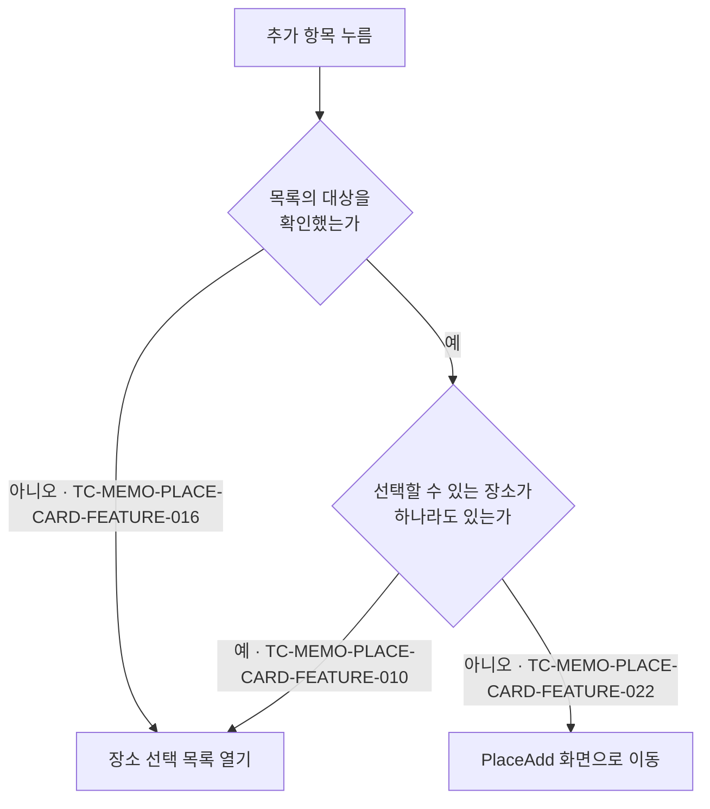

# 메모 장소 카드 테스트 케이스

기준 스펙: [메모 장소 카드 컴포넌트 스펙](../spec/memo-place-card.md)

지도의 표시·조작·제공자 전환과 핀 표시·핀 선택 자체의 케이스는 [DiaryMap 테스트 케이스](./diary-map.md)에서 다룬다. 핀을 눌러 이동한 상세 화면의 내용과 수정·삭제 케이스는 [PlaceDetail 테스트 케이스](./place-detail.md)에서 다룬다. 현재 위치를 확인하는 규칙 자체의 케이스는 [현재 위치 확인 테스트 케이스](./current-location.md)에서 다룬다. 기본 지도를 고르고 저장하는 케이스는 [SettingMap 테스트 케이스](./setting-map.md)에서 다룬다. 메모와 장소 연결 규칙 자체의 케이스는 [메모 장소 테스트 케이스](./memo-place.md)에서, 선택이 반영되는 화면별 케이스는 [MemoAdd 테스트 케이스](./memo-add.md)와 [MemoDetail 테스트 케이스](./memo-detail.md)에서 다룬다. 자리 표시 케이스의 `근거`가 가리키는 절은 공통 규칙을 [페이지 조회 목록의 자리 표시 스펙](../spec/paged-list-placeholder.md)에 위임한다. 검색어의 정규화와 일치 판정, 검색 결과 없음 판정도 [검색어 일치 판정 스펙](../spec/search-match.md)에 위임되어 있으며, 장소 선택 목록에서의 결과를 이 문서의 케이스로 덮는다.

## feature

### TC-MEMO-PLACE-CARD-FEATURE-001: MemoAdd 화면 본문에 장소 카드가 표시된다

- 근거: `feature > 카드 표시`
- Given: MemoAdd 화면이 표시되어 있다.
- When: 사용자가 본문을 확인한다.
- Then: 메모의 장소를 보여 주는 장소 카드가 표시된다.

### TC-MEMO-PLACE-CARD-FEATURE-002: MemoDetail 화면 본문에 장소 카드가 표시된다

- 근거: `feature > 카드 표시`
- Given: 메모 조회가 완료된 MemoDetail 화면이 표시되어 있다.
- When: 사용자가 본문을 확인한다.
- Then: 메모의 장소를 보여 주는 장소 카드가 표시된다.

### TC-MEMO-PLACE-CARD-FEATURE-003: 기본 지도를 확인하지 못하면 지도를 표시하지 않는다

- 근거: `feature > 지도 표시`
- Given: 사용자가 고른 기본 지도를 아직 확인하지 못했거나 읽지 못한 상태로 장소 카드가 표시되어 있다.
- When: 사용자가 장소 카드를 확인한다.
- Then: 지도가 표시되지 않고 별도의 로딩 안내나 오류 안내도 표시되지 않으며, 카드와 장소 목록은 그대로 표시된다.

### TC-MEMO-PLACE-CARD-FEATURE-004: 연결된 장소가 컬러와 제목으로 표시된다

- 근거: `feature > 장소 표시`
- Given: 카드가 노출하는 장소가 테스트 데이터와 같다.
- When: 사용자가 장소 카드의 장소 목록을 확인한다.
- Then: 각 장소가 저장된 컬러와 제목으로 구분되어 모두 표시된다.
- 테스트 데이터:

| 노출하는 장소 |
| --- |
| 장소 한 개 |
| 서로 다른 제목과 컬러의 장소 여러 개 |

### TC-MEMO-PLACE-CARD-FEATURE-005: 장소를 누르면 지도가 그 장소로 이동한다

- 근거: `feature > 장소 위치 보기`, `domain > 장소 위치 보기와 지도 이동`
- Given: 기본 지도가 확인되어 지도가 표시되어 있고, 카드가 서로 다른 좌표의 장소 여러 개를 노출하고 있다.
- When: 사용자가 장소 하나를 누른다.
- Then: 지도가 그 장소의 좌표를 가운데에 두도록 이동하고, 확대 수준은 보고 있던 수준을 유지한다.
- 작성하지 않는 이유: 지도 이동을 관찰하려면 지도 제공자의 실제 표시 요소가 필요하고, 현재 호스트 테스트 환경은 이를 제공하지 않는다. 지도 표시를 대체할 수 있는 테스트 환경이 제공되면 자동화한다.

### TC-MEMO-PLACE-CARD-FEATURE-006: 지도가 표시되지 않는 동안 장소를 눌러도 지도 이동이 일어나지 않는다

- 근거: `feature > 장소 위치 보기`
- Given: 기본 지도를 아직 확인하지 못해 지도가 표시되지 않고, 카드가 장소를 노출하고 있다.
- When: 사용자가 장소 하나를 누른다.
- Then: 지도 이동이 일어나지 않는다.

### TC-MEMO-PLACE-CARD-FEATURE-007: 같은 장소를 다시 누르면 지도를 다시 그 좌표로 옮긴다

- 근거: `domain > 장소 위치 보기와 지도 이동`
- Given: 기본 지도가 확인되어 지도가 표시되어 있고, 사용자가 장소 하나를 눌러 지도가 그 좌표로 이동한 뒤 지도를 다른 곳으로 옮겼다.
- When: 사용자가 같은 장소를 다시 누른다.
- Then: 지도가 다시 그 장소의 좌표를 가운데에 두도록 이동한다.
- 작성하지 않는 이유: 지도를 다른 곳으로 옮긴 상태를 만들려면 지도 제공자의 실제 표시 요소가 필요하고, 현재 호스트 테스트 환경은 이를 제공하지 않는다. 지도 표시를 대체할 수 있는 테스트 환경이 제공되면 자동화한다.

### TC-MEMO-PLACE-CARD-FEATURE-008: 지도를 눌러도 지점이 만들어지지 않는다

- 근거: `feature > 지도 표시`
- Given: 기본 지도가 확인되어 카드의 지도가 표시되어 있다.
- When: 사용자가 지도의 한 곳을 누른다.
- Then: 지점이 만들어지지 않고 지점 표시도 나타나지 않는다.
- 작성하지 않는 이유: 지도 누르기는 지도 제공자의 실제 표시 요소가 필요하고, 현재 호스트 테스트 환경은 이를 제공하지 않는다. 지도 표시를 대체할 수 있는 테스트 환경이 제공되면 자동화한다.

### TC-MEMO-PLACE-CARD-FEATURE-009: 장소 추가 항목이 장소 목록 하단에 항상 표시된다

- 근거: `feature > 장소 선택 목록`
- Given: 카드가 노출하는 장소가 테스트 데이터와 같다.
- When: 사용자가 장소 카드의 장소 목록을 확인한다.
- Then: 장소 목록 하단에 추가 항목이 표시된다.
- 테스트 데이터:

| 노출하는 장소 |
| --- |
| 없음 |
| 장소 여러 개 |

추가 항목을 눌렀을 때의 동작 판정은 다음 케이스가 나누어 덮는다.

### TC-MEMO-PLACE-CARD-FEATURE-010: 추가 항목을 누르면 장소 선택 목록이 열린다

- 근거: `feature > 장소 선택 목록`
- Given: 계정과 연결된 삭제되지 않은 장소 여러 개가 저장되어 있고, 그중 일부가 선택되어 있다.
- When: 사용자가 장소 목록의 추가 항목을 누른다.
- Then: 장소 선택 목록이 열리고 준비된 장소가 각 장소의 선택 여부와 함께 표시된다.

### TC-MEMO-PLACE-CARD-FEATURE-022: 선택할 수 있는 장소가 없는 것으로 확정되면 추가 항목이 PlaceAdd 이동을 요청한다

- 근거: `feature > 장소 추가 이동`, `domain > 추가 항목의 동작 판정`
- Given: 선택할 수 있는 장소가 하나도 없는 것으로 확정되어 있다.
- When: 사용자가 장소 목록의 추가 항목을 누른다.
- Then: PlaceAdd 화면 이동이 한 번 요청되고 장소 선택 목록은 열리지 않는다.

### TC-MEMO-PLACE-CARD-FEATURE-023: 확인 중에 연 목록이 대상 없음으로 확정되면 목록 영역이 비어 있는 채로 유지된다

- 근거: `feature > 장소 선택 목록`
- Given: 선택할 수 있는 장소의 확인이 끝나지 않은 상태에서 장소 선택 목록이 열려 있다.
- When: 확인이 끝나 선택할 수 있는 장소가 하나도 없는 것으로 확정된다.
- Then: 목록 영역이 비어 있는 채로 유지되고 별도의 안내 문구가 표시되지 않는다.

### TC-MEMO-PLACE-CARD-FEATURE-024: 장소 선택 목록에 장소 추가 항목이 항상 표시된다

- 근거: `feature > 장소 선택 목록`
- Given: 장소 선택 목록이 열려 있고 목록에 나타나는 장소가 테스트 데이터와 같다.
- When: 사용자가 장소 선택 목록을 확인한다.
- Then: 목록과 함께 장소 추가 항목이 표시된다.
- 테스트 데이터:

| 목록에 나타나는 장소 |
| --- |
| 없음 |
| 장소 여러 개 |

### TC-MEMO-PLACE-CARD-FEATURE-025: 목록의 장소 추가 항목을 누르면 목록이 닫히고 PlaceAdd 이동이 요청된다

- 근거: `feature > 장소 선택 목록`, `feature > 장소 추가 이동`, `domain > 추가 항목의 동작 판정`
- Given: 장소 선택 목록이 열려 있고 목록에 나타나는 장소가 테스트 데이터와 같다.
- When: 사용자가 장소 선택 목록의 장소 추가 항목을 누른다.
- Then: PlaceAdd 화면 이동이 한 번 요청되고 장소 선택 목록이 닫히며, 선택은 바뀌지 않는다.
- 테스트 데이터:

| 목록에 나타나는 장소 |
| --- |
| 없음 |
| 장소 여러 개 |

### TC-MEMO-PLACE-CARD-FEATURE-026: PlaceAdd 화면에서 추가한 장소가 돌아왔을 때 선택된다

- 근거: `feature > 장소 추가 이동`, `domain > 추가한 장소의 자동 선택`
- Given: 장소 하나가 선택된 상태에서 사용자가 PlaceAdd 화면으로 이동해 테스트 데이터만큼 장소를 추가했다.
- When: 사용자가 카드가 있는 화면으로 돌아온다.
- Then: 이동하기 전에 선택했던 장소가 유지된 채로 추가한 장소가 모두 카드의 장소 목록에 나타난다.
- 테스트 데이터:

| 추가한 장소 |
| --- |
| 한 개 |
| 여러 개 |

### TC-MEMO-PLACE-CARD-FEATURE-027: 장소를 추가하지 않고 돌아오면 선택이 그대로 유지된다

- 근거: `feature > 장소 추가 이동`
- Given: 장소 두 개가 선택된 상태에서 사용자가 PlaceAdd 화면으로 이동해 장소를 하나도 추가하지 않았다.
- When: 사용자가 카드가 있는 화면으로 돌아온다.
- Then: 선택한 두 장소가 그대로 유지된다.

### TC-MEMO-PLACE-CARD-FEATURE-028: PlaceAdd 화면에서 돌아와도 장소 선택 목록이 저절로 열리지 않는다

- 근거: `feature > 장소 추가 이동`
- Given: 사용자가 장소 선택 목록의 장소 추가 항목을 눌러 PlaceAdd 화면으로 이동해 장소를 추가했다.
- When: 사용자가 카드가 있는 화면으로 돌아온다.
- Then: 장소 선택 목록이 닫힌 채로 유지된다.

### TC-MEMO-PLACE-CARD-FEATURE-012: 목록에서 장소를 선택하면 즉시 반영된다

- 근거: `feature > 장소 선택과 해제`
- Given: 장소 선택 목록이 열려 있고 선택되지 않은 장소가 표시되어 있다.
- When: 사용자가 그 장소를 선택한다.
- Then: 별도의 확정 동작 없이 그 장소가 선택된 것으로 표시되고, 카드의 장소 목록에 나타난다.

### TC-MEMO-PLACE-CARD-FEATURE-013: 목록에서 장소 선택을 해제하면 즉시 반영된다

- 근거: `feature > 장소 선택과 해제`
- Given: 장소 선택 목록이 열려 있고 선택된 장소가 표시되어 있다.
- When: 사용자가 그 장소의 선택을 해제한다.
- Then: 별도의 확정 동작 없이 그 장소가 선택되지 않은 것으로 표시되고, 카드의 장소 목록에서 사라진다.

### TC-MEMO-PLACE-CARD-FEATURE-014: 목록을 닫아도 반영한 선택이 유지된다

- 근거: `feature > 장소 선택 목록`
- Given: 사용자가 장소 선택 목록에서 장소를 선택하거나 해제했다.
- When: 사용자가 목록을 닫는다.
- Then: 목록에서 반영한 선택이 카드의 장소 목록에 그대로 유지된다.

### TC-MEMO-PLACE-CARD-FEATURE-015: 장소를 선택하거나 해제해도 지도가 보고 있는 위치가 바뀌지 않는다

- 근거: `feature > 장소 선택과 해제`, `domain > 초기 지도 위치`
- Given: 기본 지도가 확인되어 지도가 표시되어 있고 장소 선택 목록이 열려 있다.
- When: 사용자가 장소를 선택하거나 해제한다.
- Then: 지도가 보고 있는 위치와 확대 수준이 바뀌지 않는다.
- 작성하지 않는 이유: 지도가 보고 있는 위치를 관찰하려면 지도 제공자의 실제 표시 요소가 필요하고, 현재 호스트 테스트 환경은 이를 제공하지 않는다. 지도 표시를 대체할 수 있는 테스트 환경이 제공되면 자동화한다.

### TC-MEMO-PLACE-CARD-FEATURE-016: 목록을 준비하는 동안 추가 항목을 누르면 목록이 열리고 안내를 표시하지 않는다

- 근거: `feature > 장소 선택 목록`, `domain > 추가 항목의 동작 판정`
- Given: 계정과 연결된 장소의 목록 준비가 아직 끝나지 않았다.
- When: 사용자가 장소 목록의 추가 항목을 누른다.
- Then: 장소 선택 목록이 열리고 PlaceAdd 화면 이동은 요청되지 않으며, 빈 상태 안내나 진행 안내가 표시되지 않는다.

### TC-MEMO-PLACE-CARD-FEATURE-017: 목록을 내려 보면 아직 준비되지 않은 구간의 장소가 이어서 나타난다

- 근거: `feature > 장소 선택 목록`
- Given: 계정과 연결된 삭제되지 않은 장소가 한 번에 준비되는 양보다 많이 저장되어 있고 장소 선택 목록이 열려 있다.
- When: 사용자가 목록을 아직 준비되지 않은 구간까지 내려 본다.
- Then: 그 구간의 장소가 정렬 순서에 이어서 나타나고, 준비를 기다리는 동안에도 이미 나타난 장소를 선택하고 해제할 수 있다.
- 작성하지 않는 이유: 아직 준비되지 않은 구간이 있는 목록 상태를 만들려면 저장소에서 페이지 단위로 이어서 조회되는 환경이 필요하고, 현재 호스트 테스트 환경은 화면에 전달할 목록을 직접 구성하므로 이 상태를 결정적으로 만들 수 없다. 페이지 준비 시점을 제어할 수 있는 테스트 환경이 제공되면 자동화한다.

### TC-MEMO-PLACE-CARD-FEATURE-018: 연결된 장소가 지도 핀으로 지정된다

- 근거: `feature > 장소 표시`, `domain > 지도에 표시하는 핀`
- Given: 기본 지도가 확인되었고 카드가 서로 다른 좌표, 컬러와 제목의 장소 여러 개를 노출하고 있다.
- When: 사용자가 카드의 지도를 확인한다.
- Then: 카드의 장소 목록과 같은 장소들이 지도 기능의 핀으로 지정되고, 각 핀은 그 장소의 좌표에 놓이며 핀의 색은 장소의 컬러, 라벨은 장소의 제목이다.
- 작성하지 않는 이유: 장소가 좌표, 컬러 색과 제목 라벨의 핀으로 변환되는 것은 자동화한다. 핀이 지도 기능에 지정되는 것은 지도가 표시된 화면을 구성해야 관찰할 수 있는데, 현재 호스트 테스트 환경은 실제 지도의 플랫폼 표시 요소를 제공하지 않는다. 지도 표시를 대체할 수 있는 테스트 환경이 제공되면 자동화한다.

### TC-MEMO-PLACE-CARD-FEATURE-019: 노출하는 장소가 바뀌면 핀도 함께 바뀐다

- 근거: `feature > 장소 표시`, `domain > 지도에 표시하는 핀`
- Given: 기본 지도가 확인되었고 카드가 장소 여러 개를 노출하고 있다.
- When: 사용자가 장소를 선택하거나 해제해 카드가 노출하는 장소가 바뀐다.
- Then: 지도 기능에 지정되는 핀이 바뀐 장소 목록과 같은 장소들로 갱신되어, 새로 노출된 장소의 핀이 더해지고 노출에서 빠진 장소의 핀은 빠진다.
- 작성하지 않는 이유: 핀이 지도 기능에 지정되는 것은 지도가 표시된 화면을 구성해야 관찰할 수 있는데, 현재 호스트 테스트 환경은 실제 지도의 플랫폼 표시 요소를 제공하지 않는다. 장소 목록의 갱신 자체는 TC-MEMO-PLACE-CARD-FEATURE-012와 TC-MEMO-PLACE-CARD-FEATURE-013에서 검증한다. 지도 표시를 대체할 수 있는 테스트 환경이 제공되면 자동화한다.

### TC-MEMO-PLACE-CARD-FEATURE-020: 노출하는 장소가 없으면 핀도 없다

- 근거: `feature > 장소 표시`, `domain > 지도에 표시하는 핀`
- Given: 기본 지도가 확인되었고 카드가 노출하는 장소가 없다.
- When: 사용자가 카드의 지도를 확인한다.
- Then: 지도 기능에 지정되는 핀이 없다.
- 작성하지 않는 이유: 핀이 지도 기능에 지정되지 않는 것은 지도가 표시된 화면을 구성해야 관찰할 수 있는데, 현재 호스트 테스트 환경은 실제 지도의 플랫폼 표시 요소를 제공하지 않는다. 노출하는 장소가 없는 상태 자체는 TC-MEMO-PLACE-CARD-FEATURE-009에서 검증한다. 지도 표시를 대체할 수 있는 테스트 환경이 제공되면 자동화한다.

### TC-MEMO-PLACE-CARD-FEATURE-021: 지도 핀을 누르면 그 장소의 상세로 이동한다

- 근거: `feature > 장소 상세 이동`, `domain > 장소 상세 이동 대상`
- Given: 기본 지도가 확인되어 서로 다른 장소들이 핀으로 표시되어 있다.
- When: 사용자가 그중 한 핀을 누른다.
- Then: 그 핀이 가리키는 장소의 식별자로 장소 상세 이동이 한 번 요청되고, 지도가 보고 있는 위치와 확대 수준, 지도 제공자와 카드의 선택 상태는 바뀌지 않는다.
- 작성하지 않는 이유: 핀 누르기는 지도가 표시된 화면과 지도 제공자의 입력 처리가 필요한데, 현재 호스트 테스트 환경은 실제 지도의 플랫폼 표시 요소를 제공하지 않는다. 핀의 식별 값으로 상세 대상을 정하는 것은 TC-MEMO-PLACE-CARD-DOMAIN-016에서 검증한다. 지도 표시와 지도 입력을 대체할 수 있는 테스트 환경이 제공되면 자동화한다.

### TC-MEMO-PLACE-CARD-FEATURE-029: 목록을 열면 검색어가 비어 있고 대상 전체가 나타난다

- 근거: `feature > 장소 검색`
- Given: 선택할 수 있는 장소가 여러 개 있고 장소 선택 목록이 닫혀 있다.
- When: 사용자가 카드의 추가 항목을 눌러 장소 선택 목록을 연다.
- Then: 검색 입력이 비어 있는 상태로 함께 표시되고 목록에는 대상 장소가 모두 나타난다.

### TC-MEMO-PLACE-CARD-FEATURE-036: 목록을 열면 검색어 입력에 초점이 놓인다

- 근거: `feature > 장소 검색`
- Given: 선택할 수 있는 장소가 여러 개 있고 장소 선택 목록이 닫혀 있다.
- When: 사용자가 카드의 추가 항목을 눌러 장소 선택 목록을 연다.
- Then: 검색어 입력이 입력 초점을 받아, 입력을 따로 누르지 않고 입력한 글자가 검색어 입력에 들어간다.

### TC-MEMO-PLACE-CARD-FEATURE-030: 검색어를 입력하면 목록이 즉시 좁혀진다

- 근거: `feature > 장소 검색`
- Given: 제목이 서로 다른 장소 여러 개가 목록에 나타난 상태로 장소 선택 목록이 열려 있다.
- When: 사용자가 그중 한 장소의 제목 일부를 검색어로 입력한다.
- Then: 별도의 확정 동작 없이 검색어를 만족하는 장소만 목록에 남고, 만족하지 않는 장소는 목록에서 빠진다.
- 작성하지 않는 이유: 확정 동작 없이 입력한 검색어가 목록 조회에 반영되는 것까지는 화면 테스트로 검증하지만, 좁혀진 목록이 화면에 나타나는 것은 검증하지 않는다. 화면 테스트 환경에서 선택 목록이 두 번째 조회 결과를 받지 못해 같은 조건에서 결과가 일정하지 않다. 검색어를 만족하는 장소만 조회된다는 결과는 `TC-MEMO-PLACE-CARD-DOMAIN-020`과 `TC-MEMO-PLACE-CARD-DATA-003`으로, 검색어가 바뀌면 다시 조회한다는 결과는 `TC-MEMO-PLACE-CARD-DATA-004`로 검증한다. 화면 테스트에서 이어지는 조회 결과를 받을 수 있게 되면 작성한다.

### TC-MEMO-PLACE-CARD-FEATURE-031: 검색어를 지우면 대상 전체가 다시 나타난다

- 근거: `feature > 장소 검색`
- Given: 장소 선택 목록이 열려 있고 검색어로 목록이 일부 장소만 남도록 좁혀져 있다.
- When: 사용자가 검색어를 모두 지운다.
- Then: 목록에 대상 장소가 모두 다시 나타난다.
- 작성하지 않는 이유: 검색어를 지운 상태가 목록 조회에 반영되는 것까지는 화면 테스트로 검증하고, 다시 나타난 목록은 `TC-MEMO-PLACE-CARD-FEATURE-030`과 같은 이유로 검증하지 않는다. 빈 검색어가 목록을 좁히지 않는다는 결과는 `TC-MEMO-PLACE-CARD-DOMAIN-021`로 검증한다.

### TC-MEMO-PLACE-CARD-FEATURE-032: 검색으로 좁힌 목록에서도 선택과 해제를 할 수 있다

- 근거: `feature > 장소 검색`
- Given: 장소 선택 목록이 열려 있고 검색어로 목록이 한 장소만 남도록 좁혀져 있다.
- When: 사용자가 그 장소를 선택한 뒤 선택을 해제한다.
- Then: 각 조작이 그 장소에 즉시 반영되고, 그 장소는 검색어를 만족하는 동안 목록에 그대로 남는다.

### TC-MEMO-PLACE-CARD-FEATURE-033: 검색어에 맞는 장소가 없으면 안내가 표시된다

- 근거: `feature > 장소 검색`
- Given: 목록에 나타나는 장소가 여러 개인 상태로 장소 선택 목록이 열려 있다.
- When: 사용자가 어느 장소도 만족하지 않는 검색어를 입력한다.
- Then: 목록 자리에 검색어에 맞는 장소가 없으며 다른 검색어로 다시 찾을 수 있음을 알리는 안내가 표시된다.

### TC-MEMO-PLACE-CARD-FEATURE-034: 검색 결과가 없어도 장소 추가 항목으로 PlaceAdd 이동을 요청할 수 있다

- 근거: `feature > 장소 검색`, `feature > 장소 추가 이동`
- Given: 장소 선택 목록이 열려 있고 어느 장소도 만족하지 않는 검색어가 입력되어 있다.
- When: 사용자가 장소 선택 목록의 장소 추가 항목을 누른다.
- Then: 장소 추가 항목이 그대로 표시되어 있고, 누르면 PlaceAdd 화면 이동이 한 번 요청되며 장소 선택 목록이 닫힌다.

### TC-MEMO-PLACE-CARD-FEATURE-035: 목록을 닫았다가 다시 열면 검색어가 비어 있다

- 근거: `feature > 장소 검색`
- Given: 장소 선택 목록이 열려 있고 일부 장소만 남도록 검색어가 입력되어 있다.
- When: 사용자가 목록을 닫고 다시 연다.
- Then: 검색 입력이 비어 있고 목록에는 대상 장소가 모두 나타난다.

## domain

### TC-MEMO-PLACE-CARD-DOMAIN-001: 초기 지도 위치는 첫 번째 장소의 좌표다

- 근거: `domain > 초기 지도 위치`
- Given: 기본 지도가 확인되었고 카드가 서로 다른 좌표의 장소 여러 개를 노출하고 있다.
- When: 장소 카드의 지도가 처음 표시된다.
- Then: 첫 번째 장소의 좌표가 지도의 초기 위치로 지정된다.
- 작성하지 않는 이유: 지도가 처음 표시될 때의 초기 위치를 관찰하려면 지도 제공자의 실제 표시 요소가 필요하고, 현재 호스트 테스트 환경은 이를 제공하지 않는다. 지도 표시를 대체할 수 있는 테스트 환경이 제공되면 자동화한다.

### TC-MEMO-PLACE-CARD-DOMAIN-002: 노출하는 장소가 없으면 현재 위치를 초기 위치로 사용한다

- 근거: `domain > 초기 지도 위치`
- Given: 기본 지도가 확인되었고 카드가 노출하는 장소가 없으며, 디바이스가 테스트 데이터의 위도와 경도를 현재 위치로 제공하도록 정해져 있다.
- When: 사용자가 화면에 진입해 현재 위치 확인이 끝난다.
- Then: 확인한 위도와 경도가 지도의 초기 위치로 지정된다.
- 테스트 데이터:

| 위도 | 경도 |
| --- | --- |
| 서울 도심의 위도 | 서울 도심의 경도 |
| 남반구 도시의 위도 | 서반구 도시의 경도 |

### TC-MEMO-PLACE-CARD-DOMAIN-003: 현재 위치를 확인하지 못하면 초기 위치를 지정하지 않는다

- 근거: `domain > 초기 지도 위치`
- Given: 기본 지도가 확인되었고 카드가 노출하는 장소가 없으며, 디바이스 위치와 공인 IP 기준 위치를 모두 확인하지 못하도록 정해져 있다.
- When: 사용자가 화면에 진입해 현재 위치 확인이 끝난다.
- Then: 지도에 초기 위치를 지정하지 않아 지도 제공자의 기본 위치에서 시작한다.

### TC-MEMO-PLACE-CARD-DOMAIN-004: 화면이 재생성되어도 현재 위치를 다시 확인하지 않는다

- 근거: `domain > 초기 지도 위치`
- Given: 장소 카드가 있는 화면에서 현재 위치 확인이 이미 끝났다.
- When: 화면 회전이나 시스템에 의한 화면 재생성을 지나 같은 화면으로 돌아온다.
- Then: 현재 위치를 다시 확인하지 않는다.

### TC-MEMO-PLACE-CARD-DOMAIN-005: 화면을 떠난 뒤 다시 들어오면 현재 위치를 새로 확인한다

- 근거: `domain > 초기 지도 위치`
- Given: 장소 카드가 있는 화면에서 현재 위치 확인이 끝난 뒤 사용자가 화면을 떠났고, 디바이스가 제공하는 위치가 다른 위도와 경도로 바뀌었다.
- When: 사용자가 같은 화면에 다시 진입한다.
- Then: 바뀐 위도와 경도를 새 초기 위치로 지정한다.

### TC-MEMO-PLACE-CARD-DOMAIN-006: 저장된 기본 지도가 초기 제공자로 표시된다

- 근거: `domain > 카드의 지도`
- Given: 기본 지도가 테스트 데이터의 지도로 저장되어 있다.
- When: 장소 카드의 지도가 처음 표시된다.
- Then: 저장된 기본 지도 제공자가 초기 제공자로 지정된다.
- 테스트 데이터:

| 저장된 기본 지도 |
| --- |
| 네이버 지도 |
| Google 지도 |

### TC-MEMO-PLACE-CARD-DOMAIN-007: 카드가 표시된 뒤 기본 지도가 바뀌면 바뀐 기본 지도로 새로 시작한다

- 근거: `domain > 카드의 지도`
- Given: 기본 지도가 네이버 지도로 저장된 상태에서 장소 카드의 지도가 표시되어 있다.
- When: 기본 지도가 Google 지도로 바뀐다.
- Then: 카드의 지도가 Google 지도로 새로 시작한다.

### TC-MEMO-PLACE-CARD-DOMAIN-008: 화면이 재생성되어도 보고 있던 지도 위치와 제공자를 유지한다

- 근거: `domain > 진행 상태 유지`
- Given: 장소 카드의 지도가 표시되어 있고 사용자가 지도를 옮기고 제공자를 바꿔 보고 있다.
- When: 화면 회전이나 시스템에 의한 화면 재생성을 지나 같은 화면으로 돌아온다.
- Then: 보고 있던 지도 위치와 확대 수준, 지도 제공자가 유지된다.
- 작성하지 않는 이유: 사용자가 옮긴 지도 위치를 만들려면 지도 제공자의 실제 표시 요소가 필요하고, 현재 호스트 테스트 환경은 이를 제공하지 않는다. 지도 표시를 대체할 수 있는 테스트 환경이 제공되면 자동화한다.

### TC-MEMO-PLACE-CARD-DOMAIN-009: 상세 대상 메모가 바뀌면 새 대상 메모에 연결된 장소를 노출한다

- 근거: `domain > 진행 상태 유지`
- Given: 서로 다른 장소가 연결된 메모 두 개가 저장되어 있고, 한 메모의 MemoDetail 화면에 장소 카드가 표시되어 있다.
- When: 상세 대상이 다른 메모로 바뀐다.
- Then: 카드가 새 대상 메모에 연결된 장소를 노출한다.

### TC-MEMO-PLACE-CARD-DOMAIN-010: 선택할 수 있는 장소는 삭제되지 않은 계정의 장소이고 제목 오름차순으로 정렬된다

- 근거: `domain > 선택할 수 있는 장소`, `domain > 장소 선택 목록에 나타나는 장소`
- Given: 현재 계정에 삭제되지 않은 장소 여러 개와 삭제된 장소가 함께 저장되어 있다.
- When: 사용자가 장소 선택 목록을 연다.
- Then: 삭제되지 않은 장소가 제목 오름차순으로 표시되고 삭제된 장소는 나타나지 않는다.

### TC-MEMO-PLACE-CARD-DOMAIN-015: 목록을 확인하지 않아도 선택한 장소가 카드에 표시된다

- 근거: `domain > 선택한 것으로 표시하는 장소`
- Given: 계정과 연결된 삭제되지 않은 장소가 한 번에 준비되는 양보다 많이 저장되어 있고, 그중 정렬 순서에서 뒤쪽에 있는 장소가 선택되어 있다.
- When: 사용자가 장소 선택 목록을 열지 않고 카드의 장소 목록을 확인한다.
- Then: 선택한 장소가 카드의 장소 목록에 표시된다.

### TC-MEMO-PLACE-CARD-DOMAIN-019: 자동 선택된 장소의 선택을 해제하면 다시 선택되지 않는다

- 근거: `domain > 추가한 장소의 자동 선택`
- Given: 사용자가 PlaceAdd 화면에서 추가한 장소가 돌아온 화면에서 자동으로 선택되어 있다.
- When: 사용자가 장소 선택 목록에서 그 장소의 선택을 해제한다.
- Then: 그 장소가 카드의 장소 목록에서 사라진 상태로 유지되고 다시 선택되지 않는다.

### TC-MEMO-PLACE-CARD-DOMAIN-011: 삭제된 장소는 선택한 것으로 표시하지 않는다

- 근거: `domain > 선택한 것으로 표시하는 장소`
- Given: 선택된 장소가 카드의 장소 목록에 표시되어 있다.
- When: 그 장소가 삭제된 상태로 바뀐다.
- Then: 그 장소는 카드의 장소 목록에서 사라진다.

### TC-MEMO-PLACE-CARD-DOMAIN-012: 상세 대상 메모가 바뀌면 초기 지도 제공자와 초기 지도 위치를 다시 정한다

- 근거: `domain > 진행 상태 유지`
- Given: 서로 다른 장소가 연결된 메모 두 개가 저장되어 있고, 한 메모의 MemoDetail 화면에 장소 카드의 지도가 표시되어 있다.
- When: 상세 대상이 다른 메모로 바뀐다.
- Then: 초기 지도 제공자와 초기 지도 위치를 새 진입 기준으로 다시 정한다.
- 작성하지 않는 이유: 초기 지도 위치의 재결정을 관찰하려면 지도 제공자의 실제 표시 요소가 필요하고, 현재 호스트 테스트 환경은 이를 제공하지 않는다. 지도 표시를 대체할 수 있는 테스트 환경이 제공되면 자동화한다.

### TC-MEMO-PLACE-CARD-DOMAIN-013: 노출하는 장소를 확인하기 전에는 지도를 표시하지 않는다

- 근거: `domain > 초기 지도 위치`
- Given: 기본 지도는 확인되었지만 카드에 노출하는 장소를 아직 확인하지 못했다.
- When: 사용자가 장소 카드를 확인한다.
- Then: 지도가 표시되지 않고, 노출하는 장소 확인이 끝나면 지도가 표시된다.
- 작성하지 않는 이유: 지도가 표시되지 않는 절반만 자동화했다. 노출하는 장소 확인이 끝난 뒤 지도가 표시되는 것을 관찰하려면 지도 제공자의 실제 표시 요소가 필요하고, 현재 호스트 테스트 환경은 이를 제공하지 않는다. 지도 표시를 대체할 수 있는 테스트 환경이 제공되면 나머지 절반을 자동화한다.

### TC-MEMO-PLACE-CARD-DOMAIN-016: 각 핀의 식별 값으로 그 핀의 장소를 정한다

- 근거: `domain > 지도에 표시하는 핀`, `domain > 장소 상세 이동 대상`
- Given: 카드가 서로 다른 장소 여러 개를 노출하고 있다.
- When: 지도 기능에 지정되는 핀들을 확인한다.
- Then: 각 핀의 식별 값이 그 핀이 나타내는 장소의 식별자와 같고, 서로 다른 장소의 식별 값이 겹치지 않는다.

### TC-MEMO-PLACE-CARD-DOMAIN-017: 삭제된 장소는 핀에서도 사라진다

- 근거: `domain > 장소 상세 이동 대상`, `domain > 선택한 것으로 표시하는 장소`
- Given: 선택된 장소가 카드의 장소 목록과 지도 핀으로 표시되어 있다.
- When: 그 장소가 삭제된 상태로 바뀐다.
- Then: 그 장소는 카드가 노출하는 장소에서 빠지므로 지도 기능에 지정되는 핀에서도 빠진다.
- 작성하지 않는 이유: 핀이 지도 기능에서 빠지는 것은 지도가 표시된 화면을 구성해야 관찰할 수 있는데, 현재 호스트 테스트 환경은 실제 지도의 플랫폼 표시 요소를 제공하지 않는다. 삭제된 장소가 노출에서 빠지는 것 자체는 TC-MEMO-PLACE-CARD-DOMAIN-011에서 검증한다. 지도 표시를 대체할 수 있는 테스트 환경이 제공되면 자동화한다.

### TC-MEMO-PLACE-CARD-DOMAIN-018: 장소 상세에서 돌아와도 선택과 지도 상태가 유지된다

- 근거: `domain > 진행 상태 유지`, `feature > 장소 상세 이동`
- Given: 사용자가 카드의 핀을 눌러 장소 상세로 이동했다.
- When: 사용자가 카드가 있는 화면으로 돌아온다.
- Then: 선택한 장소가 그대로 유지되고, 보고 있던 지도 위치와 확대 수준, 지도 제공자도 유지되며 초기 지도 위치를 다시 정하지 않는다.
- 작성하지 않는 이유: 핀 누르기와 지도 위치의 유지는 지도가 표시된 화면과 지도 제공자의 입력 처리가 필요한데, 현재 호스트 테스트 환경은 실제 지도의 플랫폼 표시 요소를 제공하지 않는다. 지도 표시와 지도 입력을 대체할 수 있는 테스트 환경이 제공되면 자동화한다.

### TC-MEMO-PLACE-CARD-DOMAIN-020: 검색어는 제목·설명·주소 중 하나 이상을 포함하면 만족한다

- 근거: `domain > 장소 검색어`
- Given: 테스트 데이터의 값을 가진 장소가 선택할 수 있는 장소로 저장되어 있고 장소 선택 목록이 열려 있다.
- When: 사용자가 테스트 데이터의 검색어를 입력한다.
- Then: 테스트 데이터의 기대 결과와 같이 그 장소가 목록에 남거나 빠진다.
- 테스트 데이터:

| 장소의 값 | 검색어 | 기대 결과 |
| --- | --- | --- |
| 제목 `한강 공원` | `한강` | 남음 |
| 제목 `Cafe Seoul` | `cafe` | 남음 |
| 설명에 `주차` 포함 | `주차` | 남음 |
| 주소에 `성수동` 포함 | `성수동` | 남음 |
| 제목 `한강 공원`, 좌표만 다름 | `사무실` | 빠짐 |

### TC-MEMO-PLACE-CARD-DOMAIN-021: 앞뒤 공백만 있는 검색어는 목록을 좁히지 않는다

- 근거: `domain > 장소 검색어`
- Given: 목록에 나타나는 장소가 여러 개인 상태로 장소 선택 목록이 열려 있다.
- When: 사용자가 공백만으로 이루어진 검색어를 입력한다.
- Then: 목록에 대상 장소가 모두 그대로 나타나고 검색 결과 없음 안내도 표시되지 않는다.

### TC-MEMO-PLACE-CARD-DOMAIN-022: 검색어는 카드에 노출하는 장소와 지도 핀을 좁히지 않는다

- 근거: `domain > 장소 검색어`
- Given: 선택한 장소 두 개가 카드의 장소 목록과 지도 핀으로 표시된 상태로 장소 선택 목록이 열려 있다.
- When: 사용자가 그중 한 장소만 만족하는 검색어를 입력한다.
- Then: 목록에는 그 한 장소만 남고, 카드의 장소 목록과 지도 핀에는 선택한 두 장소가 모두 그대로 표시되며 지도가 보고 있는 위치와 확대 수준도 바뀌지 않는다.

### TC-MEMO-PLACE-CARD-DOMAIN-023: 화면이 재생성되어도 열려 있는 목록의 검색어가 유지된다

- 근거: `domain > 장소 검색어`
- Given: 장소 선택 목록이 열려 있고 일부 장소만 남도록 검색어가 입력되어 있다.
- When: 화면이 시스템에 의해 재생성된다.
- Then: 목록이 열린 채로 검색어와 그 검색어로 좁힌 결과가 그대로 유지된다.

## data

### TC-MEMO-PLACE-CARD-DOMAIN-024: 장소 추가로 이동할 때 카드의 지도가 보고 있던 위치를 넘긴다

- 근거: `domain > 장소 추가로 넘기는 지도 위치`, `feature > 장소 추가 이동`
- Given: 기본 지도가 확인되어 카드의 지도가 표시되어 있고, 지도가 테스트 데이터의 위도와 경도를 보고 있다고 알려왔다.
- When: 사용자가 테스트 데이터의 경로로 장소 추가로 이동한다.
- Then: PlaceAdd 화면 이동 요청에 지도가 알려온 위도와 경도가 초기 지도 위치로 함께 담긴다.
- 테스트 데이터:

| 이동 경로 | 보고 있던 위도 | 보고 있던 경도 |
| --- | --- | --- |
| 카드의 추가 항목 | 서울 도심의 위도 | 서울 도심의 경도 |
| 장소 선택 목록의 장소 추가 항목 | 남반구 도시의 위도 | 서반구 도시의 경도 |
- 작성하지 않는 이유: 지도가 알려온 위치를 만들려면 지도 제공자의 실제 표시 요소가 필요하고, 현재 호스트 테스트 환경은 이를 제공하지 않는다. 지도 표시를 대체할 수 있는 테스트 환경이 제공되면 자동화한다.

### TC-MEMO-PLACE-CARD-DOMAIN-025: 지도가 표시되지 않으면 지도 위치를 넘기지 않는다

- 근거: `domain > 장소 추가로 넘기는 지도 위치`, `feature > 장소 추가 이동`
- Given: 기본 지도를 아직 확인하지 못해 카드의 지도가 표시되지 않았고, 선택할 수 있는 장소가 하나도 없는 것으로 확정되어 있다.
- When: 사용자가 장소 목록의 추가 항목을 누른다.
- Then: 초기 지도 위치를 담지 않고 PlaceAdd 화면 이동이 한 번 요청된다.

### TC-MEMO-PLACE-CARD-DOMAIN-026: 장소 추가로 이동할 때 보고 있던 지도 제공자는 넘기지 않는다

- 근거: `domain > 장소 추가로 넘기는 지도 위치`
- Given: 기본 지도가 네이버 지도로 저장되어 있고, 사용자가 카드에서 Google 지도로 잠시 바꿔 보고 있다.
- When: 사용자가 장소 추가로 이동한다.
- Then: PlaceAdd 화면 이동 요청에 지도 제공자가 담기지 않는다.
- 작성하지 않는 이유: 현재 호스트 테스트 환경은 카드에 표시되는 실제 지도의 플랫폼 표시 요소를 제공하지 않아 제공자를 바꿔 보는 상태를 결정적으로 구성할 수 없다. 지도 표시를 포함한 카드를 반복 가능하게 구성할 수 있는 테스트 환경이 제공되면 자동화한다.

### TC-MEMO-PLACE-CARD-DOMAIN-027: 돌아온 뒤 다시 장소 추가로 이동하면 그때 보고 있던 위치를 새로 넘긴다

- 근거: `domain > 장소 추가로 넘기는 지도 위치`
- Given: 사용자가 장소 추가로 이동해 장소를 추가하고 카드가 있는 화면으로 돌아온 뒤, 카드의 지도를 다른 위치로 옮겼다.
- When: 사용자가 다시 장소 추가로 이동한다.
- Then: 옮긴 뒤 지도가 알려온 위도와 경도가 초기 지도 위치로 담기고, 이전 이동에서 넘긴 위치는 담기지 않는다.
- 작성하지 않는 이유: 사용자가 옮긴 지도 위치를 만들려면 지도 제공자의 실제 표시 요소가 필요하고, 현재 호스트 테스트 환경은 이를 제공하지 않는다. 지도 표시를 대체할 수 있는 테스트 환경이 제공되면 자동화한다.

### TC-MEMO-PLACE-CARD-DATA-001: 저장된 장소의 변화가 선택 목록에 반영된다

- 근거: `data > 장소 목록 조회`
- Given: 장소 선택 목록이 열려 있다.
- When: 저장소의 장소가 테스트 데이터처럼 바뀐다.
- Then: 별도의 새로 고침 없이 바뀐 내용이 선택 목록에 반영된다.
- 테스트 데이터:

| 저장소 변화 | 기대 반영 |
| --- | --- |
| 새 장소 추가 | 목록에 새 장소가 나타난다 |
| 장소 제목 변경 | 바뀐 제목이 표시된다 |
| 장소 삭제 상태로 변경 | 목록에서 사라진다 |

### TC-MEMO-PLACE-CARD-DATA-002: 목록 조회에 실패해도 이미 표시된 장소를 유지한다

- 근거: `data > 장소 목록 조회`
- Given: 장소 선택 목록에 장소가 표시되어 있다.
- When: 이어지는 장소 조회가 실패한다.
- Then: 이미 표시된 장소가 그대로 유지되고 오류 안내나 재시도 동작이 표시되지 않는다.

### TC-MEMO-PLACE-CARD-DATA-003: 검색어가 있으면 검색어를 만족하는 장소만 조회한다

- 근거: `data > 장소 목록 조회`
- Given: 로그인한 계정에 선택할 수 있는 장소가 여러 페이지 분량으로 저장되어 있고, 검색어를 만족하는 장소는 정렬 순서 뒤쪽에 하나만 있다.
- When: 장소 선택 목록에 그 검색어가 적용된다.
- Then: 검색어를 만족하는 그 장소가 목록의 첫 페이지에 나타난다.

### TC-MEMO-PLACE-CARD-DATA-004: 검색어가 바뀌면 첫 페이지부터 다시 조회한다

- 근거: `data > 장소 목록 조회`
- Given: 로그인한 계정에 검색어를 만족하는 장소가 한 번에 조회하는 범위보다 많이 저장되어 있고, 사용자가 목록의 뒤쪽 구간까지 확인한 상태다.
- When: 사용자가 검색어를 다른 값으로 바꾼다.
- Then: 새 검색어를 만족하는 장소가 정렬 순서 앞쪽부터 조회되어 목록의 처음부터 나타난다.
