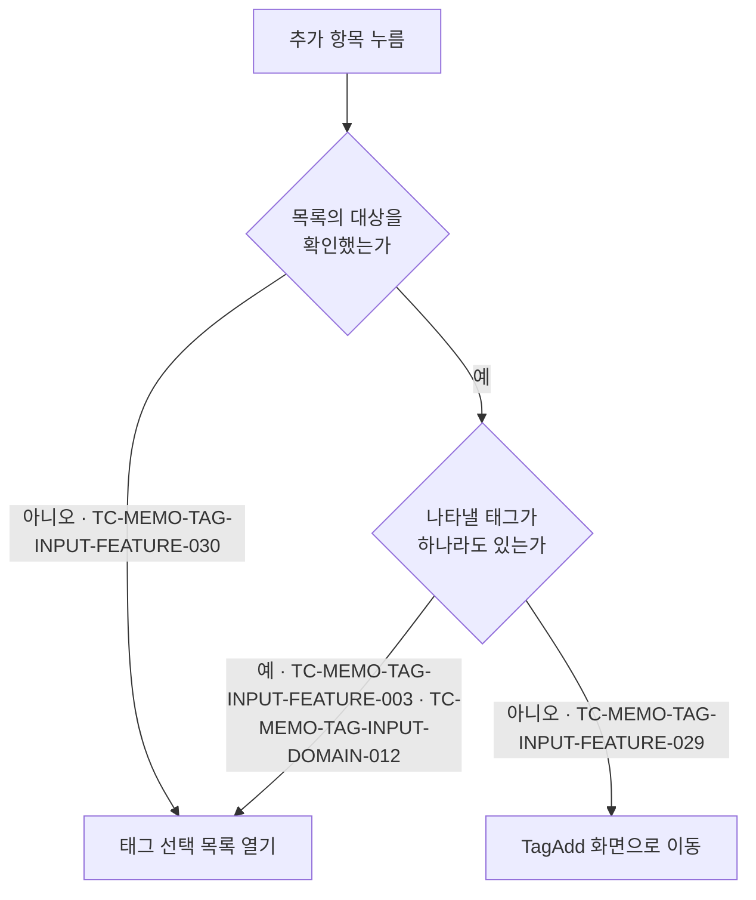

# 메모 태그 입력 컴포넌트 테스트 케이스

기준 스펙: [메모 태그 입력 컴포넌트 스펙](../spec/client/memo-tag-input.md)

이 문서에서 `domain > 추가 항목의 동작 판정`, `domain > 추가한 태그의 자동 선택`, `domain > 태그 검색어`, `feature > 선택 상태 표시`, `feature > 태그 검색`, `feature > 태그 상세 이동`, `feature > 태그 선택 목록`, `feature > 태그 선택과 해제`, `feature > 태그 추가 이동` 절은 [태그 선택 입력 공통 스펙](../spec/client/tag-select-input.md)이 소유한다. 나머지 케이스의 절은 기준 스펙이 소유한다.

이 문서의 케이스는 MemoAdd 화면과 MemoDetail 화면에서 같은 결과로 판정된다. 사용자가 반영한 선택이 어디에 반영되는지는 [MemoAdd 테스트 케이스](./memo-add.md)와 [MemoDetail 테스트 케이스](./memo-detail.md)에서 다룬다.

검색어의 정규화와 일치 판정, 검색 결과 없음 판정은 [검색어 일치 판정 스펙](../spec/client/search-match.md)에 위임되어 있으며, 태그 선택 목록에서의 결과를 이 문서의 케이스로 덮는다.

완료된 태그를 선택한 것으로 표시하는지는 화면마다 다르므로 이 문서에서 다루지 않는다. MemoAdd 화면의 케이스는 [MemoAdd 테스트 케이스](./memo-add.md)에서, MemoDetail 화면의 케이스는 [MemoDetail 테스트 케이스](./memo-detail.md)에서 다룬다.

## feature

### TC-MEMO-TAG-INPUT-FEATURE-003: 태그 선택 목록을 열면 목록에 나타나는 태그가 표시된다

- 근거: `feature > 태그 선택 목록`
- Given: 선택할 수 있는 태그가 있고 태그 선택 목록이 닫혀 있다.
- When: 사용자가 태그 입력의 추가 항목을 눌러 태그 선택 목록을 연다.
- Then: 목록에 나타나는 태그와 각 태그의 선택 여부와 대표 태그 지정 여부가 표시된다.

### TC-MEMO-TAG-INPUT-FEATURE-028: 태그 추가 항목이 태그 입력에 항상 표시된다

- 근거: `feature > 태그 선택 목록`
- Given: 선택한 태그가 테스트 데이터와 같다.
- When: 사용자가 태그 입력을 확인한다.
- Then: 태그 입력에 추가 항목이 표시된다.
- 테스트 데이터:

| 선택한 태그 |
| --- |
| 없음 |
| 태그 여러 개 |

추가 항목을 눌렀을 때의 동작 판정은 다음 케이스가 나누어 덮는다.

### TC-MEMO-TAG-INPUT-FEATURE-029: 나타낼 태그가 없는 것으로 확정되면 추가 항목이 TagAdd 이동을 요청한다

- 근거: `feature > 태그 추가 이동`, `domain > 추가 항목의 동작 판정`
- Given: 태그 선택 목록에 나타낼 태그가 하나도 없는 것으로 확정되어 있다.
- When: 사용자가 태그 입력의 추가 항목을 누른다.
- Then: TagAdd 화면 이동이 한 번 요청되고 태그 선택 목록은 열리지 않는다.

### TC-MEMO-TAG-INPUT-FEATURE-030: 목록의 대상을 확인하는 중에는 추가 항목이 목록을 연다

- 근거: `domain > 추가 항목의 동작 판정`
- Given: 태그 선택 목록에 나타낼 태그의 확인이 아직 끝나지 않도록 제어되어 있다.
- When: 사용자가 태그 입력의 추가 항목을 누른다.
- Then: 태그 선택 목록이 열리고 TagAdd 화면 이동은 요청되지 않는다.

### TC-MEMO-TAG-INPUT-FEATURE-031: 확인 중에 연 목록이 대상 없음으로 확정되면 목록 영역이 비어 있는 채로 유지된다

- 근거: `feature > 태그 선택 목록`
- Given: 나타낼 태그의 확인이 끝나지 않은 상태에서 태그 선택 목록이 열려 있다.
- When: 확인이 끝나 나타낼 태그가 하나도 없는 것으로 확정된다.
- Then: 목록 영역이 비어 있는 채로 유지되고 별도의 안내 문구가 표시되지 않는다.

### TC-MEMO-TAG-INPUT-FEATURE-032: 태그 선택 목록에 태그 추가 항목이 항상 표시된다

- 근거: `feature > 태그 선택 목록`
- Given: 태그 선택 목록이 열려 있고 목록에 나타나는 태그가 테스트 데이터와 같다.
- When: 사용자가 태그 선택 목록을 확인한다.
- Then: 목록과 함께 태그 추가 항목이 표시된다.
- 테스트 데이터:

| 목록에 나타나는 태그 |
| --- |
| 없음 |
| 태그 여러 개 |

### TC-MEMO-TAG-INPUT-FEATURE-033: 목록의 태그 추가 항목을 누르면 목록이 닫히고 TagAdd 이동이 요청된다

- 근거: `feature > 태그 선택 목록`, `feature > 태그 추가 이동`, `feature > 태그 추가 이동에 더하는 것`, `domain > 추가 항목의 동작 판정`
- Given: 태그 선택 목록이 열려 있고 목록에 나타나는 태그가 테스트 데이터와 같다.
- When: 사용자가 태그 선택 목록의 태그 추가 항목을 누른다.
- Then: TagAdd 화면 이동이 한 번 요청되고 태그 선택 목록이 닫히며, 선택과 대표 태그 지정은 바뀌지 않는다.
- 테스트 데이터:

| 목록에 나타나는 태그 |
| --- |
| 없음 |
| 태그 여러 개 |

### TC-MEMO-TAG-INPUT-FEATURE-034: TagAdd 화면에서 추가한 태그가 돌아왔을 때 선택된다

- 근거: `feature > 태그 추가 이동`, `domain > 추가한 태그의 자동 선택`
- Given: 태그 하나가 선택된 상태에서 사용자가 TagAdd 화면으로 이동해 테스트 데이터만큼 태그를 추가했다.
- When: 사용자가 태그 입력이 있는 화면으로 돌아온다.
- Then: 이동하기 전에 선택했던 태그가 유지된 채로 추가한 태그가 모두 선택 상태로 표시된다.
- 테스트 데이터:

| 추가한 태그 |
| --- |
| 한 개 |
| 여러 개 |

### TC-MEMO-TAG-INPUT-FEATURE-035: 태그를 추가하지 않고 돌아오면 선택이 그대로 유지된다

- 근거: `feature > 태그 추가 이동`, `feature > 태그 추가 이동에 더하는 것`
- Given: 태그 두 개가 선택되고 그중 하나가 대표 태그로 지정된 상태에서 사용자가 TagAdd 화면으로 이동해 태그를 하나도 추가하지 않았다.
- When: 사용자가 태그 입력이 있는 화면으로 돌아온다.
- Then: 선택한 두 태그와 대표 태그 지정이 그대로 유지된다.

### TC-MEMO-TAG-INPUT-FEATURE-036: TagAdd 화면에서 돌아와도 태그 선택 목록이 저절로 열리지 않는다

- 근거: `feature > 태그 추가 이동`
- Given: 사용자가 태그 선택 목록의 태그 추가 항목을 눌러 TagAdd 화면으로 이동해 태그를 추가했다.
- When: 사용자가 태그 입력이 있는 화면으로 돌아온다.
- Then: 태그 선택 목록이 닫힌 채로 유지된다.

### TC-MEMO-TAG-INPUT-FEATURE-008: 목록에서 태그를 선택하면 선택 상태로 표시된다

- 근거: `feature > 태그 선택과 해제`, `feature > 선택 상태 표시`
- Given: 선택할 수 있는 태그가 여러 개 있고 태그 선택 목록이 열려 있다.
- When: 사용자가 태그 두 개를 선택한다.
- Then: 태그 입력에 선택한 두 태그가 즉시 선택 상태로 표시된다.

### TC-MEMO-TAG-INPUT-FEATURE-009: 목록에서 선택을 해제하면 선택 상태에서 제외된다

- 근거: `feature > 태그 선택과 해제`
- Given: 태그 하나가 선택된 상태에서 태그 선택 목록이 열려 있다.
- When: 사용자가 그 태그의 선택을 해제한다.
- Then: 그 태그가 즉시 선택 상태에서 제외된다.

### TC-MEMO-TAG-INPUT-FEATURE-013: 선택한 태그의 이모지나 제목이 바뀌면 태그 입력에 반영된다

- 근거: `feature > 선택 상태 표시`, `data > 태그 목록 조회`
- Given: 태그 하나가 선택되어 표시되어 있다.
- When: 그 태그의 이모지나 제목이 다른 경로로 수정되어 저장된다.
- Then: 태그 입력에 수정된 이모지와 제목이 표시되고 선택 상태와 대표 태그 지정은 바뀌지 않는다.

### TC-MEMO-TAG-INPUT-FEATURE-023: 태그 입력과 선택 목록에 이모지와 제목을 함께 표시한다

- 근거: `feature > 선택 상태 표시`, `feature > 태그 선택 목록`
- Given: 이모지가 저장된 태그와 이모지가 비어 있는 태그가 선택할 수 있는 태그로 있고 둘 다 선택되어 있다.
- When: 사용자가 태그 입력과 태그 선택 목록을 확인한다.
- Then: 이모지가 있는 태그는 이모지, 제목 순서로 함께 표시되고 이모지가 비어 있는 태그는 앞선 공백 없이 제목만 표시된다.

### TC-MEMO-TAG-INPUT-FEATURE-014: 선택한 태그가 표시 기준에서 빠지면 선택에서 제외된다

- 근거: `feature > 선택 상태 표시`
- Given: 태그 두 개가 선택되어 표시되고 그중 하나가 대표 태그로 지정된 상태다.
- When: 선택한 것으로 표시하는 태그가 그중 한 태그를 포함하지 않는 목록으로 바뀐다.
- Then: 목록에서 빠진 태그가 선택에서 제외되고 남은 태그의 선택과 대표 태그 지정은 그대로 유지된다.

### TC-MEMO-TAG-INPUT-FEATURE-015: 대표 태그로 지정하면 그 태그가 함께 선택된다

- 근거: `feature > 대표 태그 지정`
- Given: 선택할 수 있는 태그가 있고 태그 선택 목록이 열려 있으며 그 태그는 선택되어 있지 않다.
- When: 사용자가 그 태그를 대표 태그로 지정한다.
- Then: 그 태그가 선택되고 대표 태그로 지정된 상태로 표시된다.

### TC-MEMO-TAG-INPUT-FEATURE-016: 대표 태그 지정을 다시 실행하면 대표 지정만 해제된다

- 근거: `feature > 대표 태그 지정`
- Given: 태그 선택 목록이 열려 있고 한 태그가 선택된 상태로 대표 태그로 지정되어 있다.
- When: 사용자가 그 태그의 대표 태그 지정을 다시 실행한다.
- Then: 그 태그의 선택은 유지되고 대표 태그 지정만 해제된다.

### TC-MEMO-TAG-INPUT-FEATURE-017: 다른 태그를 대표로 지정하면 이전 대표 지정이 해제된다

- 근거: `feature > 대표 태그 지정`
- Given: 태그 선택 목록이 열려 있고 태그 두 개가 선택된 상태에서 그중 하나가 대표 태그로 지정되어 있다.
- When: 사용자가 다른 태그를 대표 태그로 지정한다.
- Then: 새 태그만 대표 태그로 지정되고 두 태그의 선택은 모두 유지된다.

### TC-MEMO-TAG-INPUT-FEATURE-018: 대표 태그의 선택을 해제하면 대표 지정도 해제된다

- 근거: `feature > 대표 태그 지정`
- Given: 태그 선택 목록이 열려 있고 한 태그가 선택된 상태로 대표 태그로 지정되어 있다.
- When: 사용자가 그 태그의 선택을 해제한다.
- Then: 그 태그가 선택에서 제외되고 대표 태그 지정도 함께 해제된다.

### TC-MEMO-TAG-INPUT-FEATURE-020: 목록을 닫아도 반영된 선택과 대표 태그 지정이 유지된다

- 근거: `feature > 태그 선택 목록`
- Given: 태그 선택 목록이 열려 있고, 사용자가 목록에서 태그 두 개를 선택하고 그중 하나를 대표 태그로 지정했다.
- When: 사용자가 목록을 닫는다.
- Then: 태그 선택 목록이 닫히고 선택한 두 태그와 대표 태그 지정이 그대로 유지된다.

### TC-MEMO-TAG-INPUT-FEATURE-021: 태그 칩을 누르면 그 태그의 TagDetail 화면으로 이동한다

- 근거: `feature > 태그 상세 이동`
- Given: 선택한 태그 두 개가 태그 입력에 표시되어 있고, 그중 하나가 대표 태그로 지정되어 있다.
- When: 사용자가 아래 태그의 칩을 누른다.
- Then: 누른 칩의 태그를 대상으로 하는 TagDetail 화면 이동이 한 번 요청된다.

테스트 데이터

| 누르는 칩 | 이동 대상 |
| --- | --- |
| 대표 태그가 아닌 태그의 칩 | 그 태그 |
| 대표 태그로 지정한 태그의 칩 | 그 태그 |

### TC-MEMO-TAG-INPUT-FEATURE-022: 태그 칩을 눌러도 선택 상태와 태그 선택 목록은 바뀌지 않는다

- 근거: `feature > 태그 상세 이동`
- Given: 선택한 태그 두 개가 태그 입력에 표시되어 있고, 그중 하나가 대표 태그로 지정되어 있으며 태그 선택 목록은 닫혀 있다.
- When: 사용자가 대표 태그가 아닌 태그의 칩을 누른다.
- Then: 태그 선택 목록은 열리지 않고, 선택한 두 태그와 대표 태그 지정도 그대로 유지된다.

### TC-MEMO-TAG-INPUT-FEATURE-024: 목록의 끝으로 이동하면 다음 태그가 이어서 나타난다

- 근거: `feature > 태그 선택 목록`
- Given: 한 화면에 모두 담기지 않는 수의 선택할 수 있는 태그가 저장되어 있고 태그 선택 목록이 열려 있다.
- When: 사용자가 목록의 끝까지 이동한다.
- Then: 정렬 순서의 앞부분부터 나타난 목록에 다음 태그가 이어서 나타나고, 사용자는 목록에 나타나는 기준을 만족하는 태그를 모두 확인할 수 있다.
- 작성하지 않는 이유: 목록을 끝으로 옮긴 뒤 다음 태그가 준비되는 과정은 화면 테스트 환경에서 배경 조회가 끝나는 시점을 제어할 수 없어 같은 조건에서 결과가 일정하지 않다. 조회가 정렬 순서 앞쪽부터 나뉘어 이루어지고 이어지는 조회가 그다음 태그를 가져온다는 결과는 `TC-MEMO-TAG-INPUT-DATA-003`으로 검증한다. 화면 테스트에서 배경 조회 완료 시점을 제어할 수 있게 되면 작성한다.

### TC-MEMO-TAG-INPUT-FEATURE-025: 다음 태그를 불러오는 동안에도 이미 나타난 태그를 조작할 수 있다

- 근거: `feature > 태그 선택 목록`
- Given: 태그 선택 목록에 태그 일부가 나타나 있고 다음 태그의 조회가 아직 끝나지 않도록 제어되어 있다.
- When: 사용자가 이미 나타난 태그를 선택하고 대표 태그로 지정한다.
- Then: 그 태그가 선택 상태이자 대표 태그로 지정된 상태로 표시된다.

### TC-MEMO-TAG-INPUT-FEATURE-026: 목록을 불러오지 못해도 이미 나타난 태그를 유지한다

- 근거: `feature > 태그 선택 목록`
- Given: 태그 선택 목록에 태그 일부가 나타나 있고 다음 태그의 조회가 실패하도록 제어되어 있다.
- When: 사용자가 목록의 끝으로 이동한다.
- Then: 이미 나타난 태그가 그대로 유지되고 오류 안내나 재시도 동작은 나타나지 않는다.

### TC-MEMO-TAG-INPUT-FEATURE-027: 목록을 닫았다가 다시 열면 앞부분부터 나타난다

- 근거: `feature > 태그 선택 목록`
- Given: 한 화면에 모두 담기지 않는 수의 선택할 수 있는 태그가 저장되어 있고, 사용자가 태그 선택 목록을 열어 아래로 이동한 상태다.
- When: 사용자가 목록을 닫고 다시 연다.
- Then: 목록이 정렬 순서의 앞부분부터 나타난다.

### TC-MEMO-TAG-INPUT-FEATURE-037: 목록을 열면 검색어가 비어 있고 대상 전체가 나타난다

- 근거: `feature > 태그 검색`
- Given: 목록에 나타나는 태그가 여러 개 있고 태그 선택 목록이 닫혀 있다.
- When: 사용자가 태그 입력의 추가 항목을 눌러 태그 선택 목록을 연다.
- Then: 검색 입력이 비어 있는 상태로 함께 표시되고 목록에는 대상 태그가 모두 나타난다.

### TC-MEMO-TAG-INPUT-FEATURE-046: 목록을 열면 검색어 입력에 초점이 놓인다

- 근거: `feature > 태그 검색에 더하는 것`
- Given: 목록에 나타나는 태그가 여러 개 있고 태그 선택 목록이 닫혀 있다.
- When: 사용자가 태그 입력의 추가 항목을 눌러 태그 선택 목록을 연다.
- Then: 검색어 입력이 입력 초점을 받아, 입력을 따로 누르지 않고 입력한 글자가 검색어 입력에 들어간다.

### TC-MEMO-TAG-INPUT-FEATURE-038: 검색어를 입력하면 목록이 즉시 좁혀진다

- 근거: `feature > 태그 검색`
- Given: 제목이 서로 다른 태그 여러 개가 목록에 나타난 상태로 태그 선택 목록이 열려 있다.
- When: 사용자가 그중 한 태그의 제목 일부를 검색어로 입력한다.
- Then: 별도의 확정 동작 없이 검색어를 만족하는 태그만 목록에 남고, 만족하지 않는 태그는 목록에서 빠진다.
- 작성하지 않는 이유: 확정 동작 없이 입력한 검색어가 목록 조회에 반영되는 것까지는 화면 테스트로 검증하지만, 좁혀진 목록이 화면에 나타나는 것은 검증하지 않는다. 화면 테스트 환경에서 선택 목록이 두 번째 조회 결과를 받지 못해 같은 조건에서 결과가 일정하지 않다. 검색어를 만족하는 태그만 조회된다는 결과는 `TC-MEMO-TAG-INPUT-DOMAIN-015`와 `TC-MEMO-TAG-INPUT-DATA-005`로, 검색어가 바뀌면 다시 조회한다는 결과는 `TC-MEMO-TAG-INPUT-DATA-006`으로 검증한다. 화면 테스트에서 이어지는 조회 결과를 받을 수 있게 되면 작성한다.

### TC-MEMO-TAG-INPUT-FEATURE-039: 검색어를 지우면 대상 전체가 다시 나타난다

- 근거: `feature > 태그 검색`
- Given: 태그 선택 목록이 열려 있고 검색어로 목록이 일부 태그만 남도록 좁혀져 있다.
- When: 사용자가 검색어를 모두 지운다.
- Then: 목록에 대상 태그가 모두 다시 나타난다.
- 작성하지 않는 이유: 검색어를 지운 상태가 목록 조회에 반영되는 것까지는 화면 테스트로 검증하고, 다시 나타난 목록은 `TC-MEMO-TAG-INPUT-FEATURE-038`과 같은 이유로 검증하지 않는다. 빈 검색어가 목록을 좁히지 않는다는 결과는 `TC-MEMO-TAG-INPUT-DOMAIN-016`으로 검증한다.

### TC-MEMO-TAG-INPUT-FEATURE-044: 연속으로 입력하는 동안에는 마지막 검색어만 목록에 반영된다

- 근거: `feature > 태그 검색`
- Given: 목록에 나타나는 태그가 여러 개인 상태로 태그 선택 목록이 열려 있다.
- When: 사용자가 입력을 멈추지 않고 검색어를 여러 글자 이어서 입력한다.
- Then: 중간 검색어의 결과는 목록에 나타나지 않고, 입력을 멈춘 뒤 마지막 검색어를 만족하는 태그만 목록에 나타난다.

### TC-MEMO-TAG-INPUT-FEATURE-045: 검색어를 지우면 기다리지 않고 목록이 되돌아온다

- 근거: `feature > 태그 검색`
- Given: 태그 선택 목록이 열려 있고 검색어로 목록이 일부 태그만 남도록 좁혀져 있다.
- When: 사용자가 검색어를 모두 지운다.
- Then: 입력을 멈춘 뒤를 기다리지 않고 좁히지 않은 목록이 곧바로 나타난다.

### TC-MEMO-TAG-INPUT-FEATURE-040: 검색으로 좁힌 목록에서도 선택과 대표 태그 지정을 바꿀 수 있다

- 근거: `feature > 태그 검색`
- Given: 태그 선택 목록이 열려 있고 검색어로 목록이 한 태그만 남도록 좁혀져 있다.
- When: 사용자가 그 태그를 선택하고 대표 태그로 지정한 뒤 선택을 해제한다.
- Then: 각 조작이 그 태그에 즉시 반영되고, 그 태그는 검색어를 만족하는 동안 목록에 그대로 남는다.

### TC-MEMO-TAG-INPUT-FEATURE-041: 검색어에 맞는 태그가 없으면 안내가 표시된다

- 근거: `feature > 태그 검색`
- Given: 목록에 나타나는 태그가 여러 개인 상태로 태그 선택 목록이 열려 있다.
- When: 사용자가 어느 태그도 만족하지 않는 검색어를 입력한다.
- Then: 목록 자리에 검색어에 맞는 태그가 없으며 다른 검색어로 다시 찾을 수 있음을 알리는 안내가 표시된다.

### TC-MEMO-TAG-INPUT-FEATURE-042: 검색 결과가 없어도 태그 추가 항목으로 TagAdd 이동을 요청할 수 있다

- 근거: `feature > 태그 검색`, `feature > 태그 추가 이동`
- Given: 태그 선택 목록이 열려 있고 어느 태그도 만족하지 않는 검색어가 입력되어 있다.
- When: 사용자가 태그 선택 목록의 태그 추가 항목을 누른다.
- Then: 태그 추가 항목이 그대로 표시되어 있고, 누르면 TagAdd 화면 이동이 한 번 요청되며 태그 선택 목록이 닫힌다.

### TC-MEMO-TAG-INPUT-FEATURE-043: 목록을 닫았다가 다시 열면 검색어가 비어 있다

- 근거: `feature > 태그 검색`
- Given: 태그 선택 목록이 열려 있고 일부 태그만 남도록 검색어가 입력되어 있다.
- When: 사용자가 목록을 닫고 다시 연다.
- Then: 검색 입력이 비어 있고 목록에는 대상 태그가 모두 나타난다.

## domain

### TC-MEMO-TAG-INPUT-DOMAIN-001: 선택할 수 있는 태그는 계정과 연결된 완료·삭제되지 않은 태그다

- 근거: `domain > 선택할 수 있는 태그`
- Given: 테스트 데이터의 태그가 저장되어 있고 현재 사용자 계정으로 태그 입력을 사용할 수 있다.
- When: 선택할 수 있는 태그를 확인한다.
- Then: 테스트 데이터의 기대 결과와 같이 태그가 포함되거나 제외된다.
- 테스트 데이터:

| 태그 상태 | 기대 결과 |
| --- | --- |
| 현재 계정과 연결되고 완료·삭제되지 않음 | 포함 |
| 현재 계정과 연결되고 완료됨 | 제외 |
| 현재 계정과 연결되고 삭제됨 | 제외 |
| 현재 계정과 연결되지 않음 | 제외 |

### TC-MEMO-TAG-INPUT-DOMAIN-002: 선택할 수 있는 태그는 제목 오름차순으로 정렬된다

- 근거: `domain > 선택할 수 있는 태그`
- Given: 제목과 수정·생성 시각이 서로 다른 태그들이 계정과 연결되어 저장되어 있다.
- When: 선택할 수 있는 태그의 순서를 확인한다.
- Then: 수정·생성 시각과 관계없이 제목이 이른 태그가 먼저 온다.

### TC-MEMO-TAG-INPUT-DOMAIN-004: 표시 기준에 없는 태그는 선택에서 제외된 것으로 판정한다

- 근거: `domain > 선택한 것으로 표시하는 태그`
- Given: 태그 두 개가 선택되고 그중 하나가 대표 태그로 지정된 뒤, 선택한 것으로 표시하는 태그가 테스트 데이터의 목록으로 바뀐 상태다.
- When: 태그 입력의 선택 여부와 대표 태그 지정 여부를 확인한다.
- Then: 표시 기준에 있는 태그만 선택된 것으로 판정되고, 대표 태그로 지정했던 태그가 목록에 없으면 대표 태그 지정도 해제된 것으로 판정된다.
- 테스트 데이터:

| 선택한 것으로 표시하는 태그의 목록 |
| --- |
| 선택한 태그 중 대표 태그로 지정하지 않은 태그만 포함됨 |
| 선택한 태그 중 대표 태그로 지정한 태그만 포함됨 |
| 선택한 태그가 모두 포함되지 않음 |

### TC-MEMO-TAG-INPUT-DOMAIN-005: 선택한 태그가 삭제되면 태그 입력에서 선택과 대표 지정이 해제된 것으로 표시된다

- 근거: `domain > 선택한 것으로 표시하는 태그`
- Given: 한 태그가 선택되고 대표 태그로 지정된 상태다.
- When: 그 태그가 다른 경로로 삭제된다.
- Then: 태그 입력에서 그 태그가 선택에서 제외되고 대표 태그 지정도 해제된 것으로 표시된다.

### TC-MEMO-TAG-INPUT-DOMAIN-006: 태그가 복구되면 유지되어 있던 선택이 다시 나타난다

- 근거: `domain > 선택한 것으로 표시하는 태그`
- Given: 선택되고 대표 태그로 지정되어 있던 태그가 삭제되어 태그 입력의 선택에서 제외된 상태이며, 그 선택과 대표 태그 지정은 저장된 채 유지되어 있다.
- When: 그 태그가 다른 경로로 복구되어 표시 기준을 다시 만족한다.
- Then: 태그 입력에 그 태그의 선택과 대표 태그 지정이 다시 나타난다.

### TC-MEMO-TAG-INPUT-DOMAIN-008: 선택한 것으로 표시하지 않는 완료된 태그는 태그 선택 목록에 나타나지 않는다

- 근거: `domain > 선택할 수 있는 태그`, `domain > 태그 선택 목록에 나타나는 태그`
- Given: 현재 사용자 계정과 연결된 완료된 태그와 완료되지 않은 태그가 저장되어 있고, 완료된 태그는 선택한 것으로 표시되어 있지 않다.
- When: 사용자가 태그 선택 목록을 연다.
- Then: 완료되지 않은 태그만 목록에 나타나고, 완료된 태그는 목록에 나타나지 않아 선택하거나 대표 태그로 지정할 수 없다.

### TC-MEMO-TAG-INPUT-DOMAIN-009: 선택할 수 있는 태그에 없는 선택한 태그도 목록에 함께 나타난다

- 근거: `domain > 태그 선택 목록에 나타나는 태그`
- Given: 선택할 수 있는 태그가 있고, 선택할 수 있는 태그에 없는 완료된 태그가 선택한 것으로 표시되어 있다.
- When: 사용자가 태그 선택 목록을 연다.
- Then: 선택할 수 있는 태그와 그 완료된 태그가 모두 목록에 나타나고, 그 완료된 태그는 선택된 상태로 표시된다.

### TC-MEMO-TAG-INPUT-DOMAIN-010: 목록의 태그는 완료 여부로 구분하지 않고 제목 오름차순으로 정렬된다

- 근거: `domain > 태그 선택 목록에 나타나는 태그`
- Given: 선택할 수 있는 태그와, 선택할 수 있는 태그에 없는 선택한 완료된 태그가 제목 순서로 섞이도록 저장되어 있다.
- When: 사용자가 태그 선택 목록을 연다.
- Then: 완료된 태그가 별도 구간으로 묶이지 않고 제목 오름차순 위치에 함께 나타난다.

### TC-MEMO-TAG-INPUT-DOMAIN-011: 목록에 나타난 완료된 태그의 선택과 대표 태그 지정을 바꿀 수 있다

- 근거: `domain > 태그 선택 목록에 나타나는 태그`
- Given: 선택할 수 있는 태그에 없는 완료된 태그가 선택한 것으로 표시된 상태로 태그 선택 목록이 열려 있다.
- When: 사용자가 그 태그의 선택 해제 또는 대표 태그 지정을 실행한다.
- Then: 실행한 조작이 그 태그를 대상으로 반영된다.

### TC-MEMO-TAG-INPUT-DOMAIN-012: 선택할 수 있는 태그가 없어도 목록 대상이 있으면 목록이 열린다

- 근거: `domain > 추가 항목의 동작 판정`, `domain > 태그 선택 목록에 나타나는 태그`
- Given: 선택할 수 있는 태그가 하나도 없고, 선택할 수 있는 태그에 없는 완료된 태그가 선택한 것으로 표시되어 목록의 대상 확인이 끝나 있다.
- When: 사용자가 태그 입력의 추가 항목을 누른다.
- Then: 그 완료된 태그가 나타나는 태그 선택 목록이 열리고 TagAdd 화면 이동은 요청되지 않는다.

### TC-MEMO-TAG-INPUT-DOMAIN-013: 자동 선택은 대표 태그 지정을 바꾸지 않는다

- 근거: `domain > 추가한 태그의 자동 선택에 더하는 것`
- Given: 대표 태그 지정이 테스트 데이터와 같은 상태에서 사용자가 TagAdd 화면으로 이동해 태그를 추가했다.
- When: 사용자가 태그 입력이 있는 화면으로 돌아온다.
- Then: 추가한 태그가 선택되고 대표 태그 지정은 테스트 데이터의 상태 그대로 유지된다.
- 테스트 데이터:

| 이동하기 전의 대표 태그 지정 |
| --- |
| 지정하지 않음 |
| 선택한 태그 하나를 지정함 |

### TC-MEMO-TAG-INPUT-DOMAIN-014: 자동 선택된 태그의 선택을 해제하면 다시 선택되지 않는다

- 근거: `domain > 추가한 태그의 자동 선택`
- Given: 사용자가 TagAdd 화면에서 추가한 태그가 돌아온 화면에서 자동으로 선택되어 있다.
- When: 사용자가 그 태그의 선택을 해제한다.
- Then: 그 태그가 선택에서 제외된 상태로 유지되고 다시 선택되지 않는다.

### TC-MEMO-TAG-INPUT-DOMAIN-020: 이 입력에서 이동하지 않은 TagAdd 화면의 태그는 자동 선택되지 않는다

- 근거: `domain > 추가한 태그의 자동 선택`
- Given: 사용자가 이 태그 입력이 아닌 곳에서 TagAdd 화면을 열어 태그를 추가했다.
- When: 사용자가 태그 입력이 있는 화면을 확인한다.
- Then: 추가한 태그는 선택한 것으로 표시되지 않는다.

### TC-MEMO-TAG-INPUT-DOMAIN-007: 대표 태그는 최대 하나이며 선택한 태그 중 하나다

- 근거: `domain > 대표 태그 지정 기준`
- Given: 태그 여러 개가 선택된 상태다.
- When: 선택한 태그 가운데 하나를 대표 태그로 지정하고, 이어서 다른 태그를 대표 태그로 지정한다.
- Then: 대표 태그로 지정된 태그는 항상 하나이며 그 태그는 선택한 태그에 포함된다.

### TC-MEMO-TAG-INPUT-DOMAIN-015: 검색어는 이모지·제목·설명 중 하나 이상을 포함하면 만족한다

- 근거: `domain > 태그 검색어`
- Given: 테스트 데이터의 값을 가진 태그가 목록에 나타나는 태그로 저장되어 있고 태그 선택 목록이 열려 있다.
- When: 사용자가 테스트 데이터의 검색어를 입력한다.
- Then: 테스트 데이터의 기대 결과와 같이 그 태그가 목록에 남거나 빠진다.
- 테스트 데이터:

| 태그의 값 | 검색어 | 기대 결과 |
| --- | --- | --- |
| 제목 `여행 기록` | `여행` | 남음 |
| 제목 `Travel` | `trav` | 남음 |
| 설명에 `가족` 포함 | `가족` | 남음 |
| 이모지 `✈️` | `✈️` | 남음 |
| 제목 `여행 기록`, 컬러만 다름 | `업무` | 빠짐 |

### TC-MEMO-TAG-INPUT-DOMAIN-016: 앞뒤 공백만 있는 검색어는 목록을 좁히지 않는다

- 근거: `domain > 태그 검색어`
- Given: 목록에 나타나는 태그가 여러 개인 상태로 태그 선택 목록이 열려 있다.
- When: 사용자가 공백만으로 이루어진 검색어를 입력한다.
- Then: 목록에 대상 태그가 모두 그대로 나타나고 검색 결과 없음 안내도 표시되지 않는다.

### TC-MEMO-TAG-INPUT-DOMAIN-017: 검색어는 선택한 태그에도 같은 기준으로 적용된다

- 근거: `domain > 태그 검색어`
- Given: 선택할 수 있는 태그에 없는 완료된 태그가 선택한 것으로 표시되어 목록에 나타난 상태로 태그 선택 목록이 열려 있다.
- When: 사용자가 그 완료된 태그가 만족하지 않는 검색어를 입력한다.
- Then: 그 태그가 목록에서 빠지고, 태그 입력에 표시된 그 태그의 선택과 대표 태그 지정은 그대로 유지된다.

### TC-MEMO-TAG-INPUT-DOMAIN-018: 검색어는 태그 입력에 선택한 것으로 표시하는 태그를 좁히지 않는다

- 근거: `domain > 태그 검색어`
- Given: 선택한 태그 두 개가 태그 입력에 표시된 상태로 태그 선택 목록이 열려 있다.
- When: 사용자가 그중 한 태그만 만족하는 검색어를 입력한다.
- Then: 목록에는 그 한 태그만 남고, 태그 입력에는 선택한 두 태그가 모두 그대로 표시된다.

### TC-MEMO-TAG-INPUT-DOMAIN-019: 화면이 회전해도 열려 있는 목록의 검색어와 좁힌 결과가 유지된다

- 근거: `domain > 태그 검색어`, `domain > 태그 선택 목록의 열림 상태`
- Given: 태그 선택 목록이 열려 있고 일부 태그만 남도록 검색어가 입력되어 있다.
- When: 화면이 회전하거나 창 크기가 바뀐다.
- Then: 목록이 열린 채로 검색어와 그 검색어로 좁힌 결과가 그대로 유지된다.

### TC-MEMO-TAG-INPUT-DOMAIN-021: 메모리 정리 뒤 복원하면 검색어가 다시 나타나고 입력 정지 대기 시간이 지난 뒤 다시 좁혀진다

- 근거: `domain > 태그 검색어`, `domain > 태그 선택 목록의 열림 상태`
- Given: 태그 선택 목록이 열려 있고 일부 태그만 남도록 검색어가 입력되어 있다.
- When: 시스템이 앱을 메모리에서 정리한 뒤 화면을 복원한다.
- Then: 목록이 다시 열리고 입력하던 검색어가 다시 나타난다. 목록은 좁히지 않은 대상 전체로 먼저 나타나고, 입력 정지 대기 시간이 지나면 그 검색어로 다시 좁혀진다.
- 작성하지 않는 이유: 현재 테스트 환경에서는 시스템의 앱 정리와 복원을 결정적으로 제어할 수 없다. 앱 정리와 복원을 제어하는 테스트 환경이 갖춰지면 자동화한다.

## data

### TC-MEMO-TAG-INPUT-DATA-002: 저장된 태그가 바뀌면 태그 입력과 태그 선택 목록에 함께 반영된다

- 근거: `data > 태그 목록 조회`
- Given: 로그인한 계정에 선택할 수 있는 태그가 저장되어 있고 태그 입력이 표시되어 있다.
- When: 선택할 수 있는 태그가 추가되거나 저장된 태그의 이모지나 제목이 바뀐다.
- Then: 태그 입력의 선택 상태와 태그 선택 목록이 변경된 조회 결과로 갱신된다.

### TC-MEMO-TAG-INPUT-DATA-003: 태그 선택 목록을 페이지 단위로 조회한다

- 근거: `data > 태그 목록 조회`
- Given: 로그인한 계정에 목록에 나타나는 기준을 만족하는 태그가 한 번에 조회하는 범위보다 많이 저장되어 있다.
- When: 태그 선택 목록이 태그를 조회한다.
- Then: 저장된 태그 전체가 아니라 정렬 순서 앞쪽의 일부만 먼저 조회되고, 이어지는 조회에서 그다음 태그가 정렬 순서대로 조회된다.

### TC-MEMO-TAG-INPUT-DATA-004: 선택 상태로 표시하는 태그는 목록 조회와 분리해 조회한다

- 근거: `data > 태그 목록 조회`
- Given: 로그인한 계정에 목록에 나타나는 기준을 만족하는 태그가 여러 페이지 분량으로 저장되어 있고, 그중 정렬 순서 뒤쪽에 있어 목록에 아직 나타나지 않은 태그 하나가 선택되어 있다.
- When: 사용자가 태그 입력을 확인한다.
- Then: 목록에 아직 나타나지 않은 그 태그도 선택 상태로 표시된다.

### TC-MEMO-TAG-INPUT-DATA-005: 검색어가 있으면 검색어를 만족하는 태그만 조회한다

- 근거: `data > 태그 목록 조회`
- Given: 로그인한 계정에 목록에 나타나는 기준을 만족하는 태그가 여러 페이지 분량으로 저장되어 있고, 검색어를 만족하는 태그는 정렬 순서 뒤쪽에 하나만 있다.
- When: 태그 선택 목록에 그 검색어가 적용된다.
- Then: 검색어를 만족하는 그 태그가 목록의 첫 페이지에 나타난다.

### TC-MEMO-TAG-INPUT-DATA-006: 검색어가 바뀌면 첫 페이지부터 다시 조회한다

- 근거: `data > 태그 목록 조회`
- Given: 로그인한 계정에 검색어를 만족하는 태그가 한 번에 조회하는 범위보다 많이 저장되어 있고, 사용자가 목록의 뒤쪽 구간까지 확인한 상태다.
- When: 사용자가 검색어를 다른 값으로 바꾼다.
- Then: 새 검색어를 만족하는 태그가 정렬 순서 앞쪽부터 조회되어 목록의 처음부터 나타난다.
