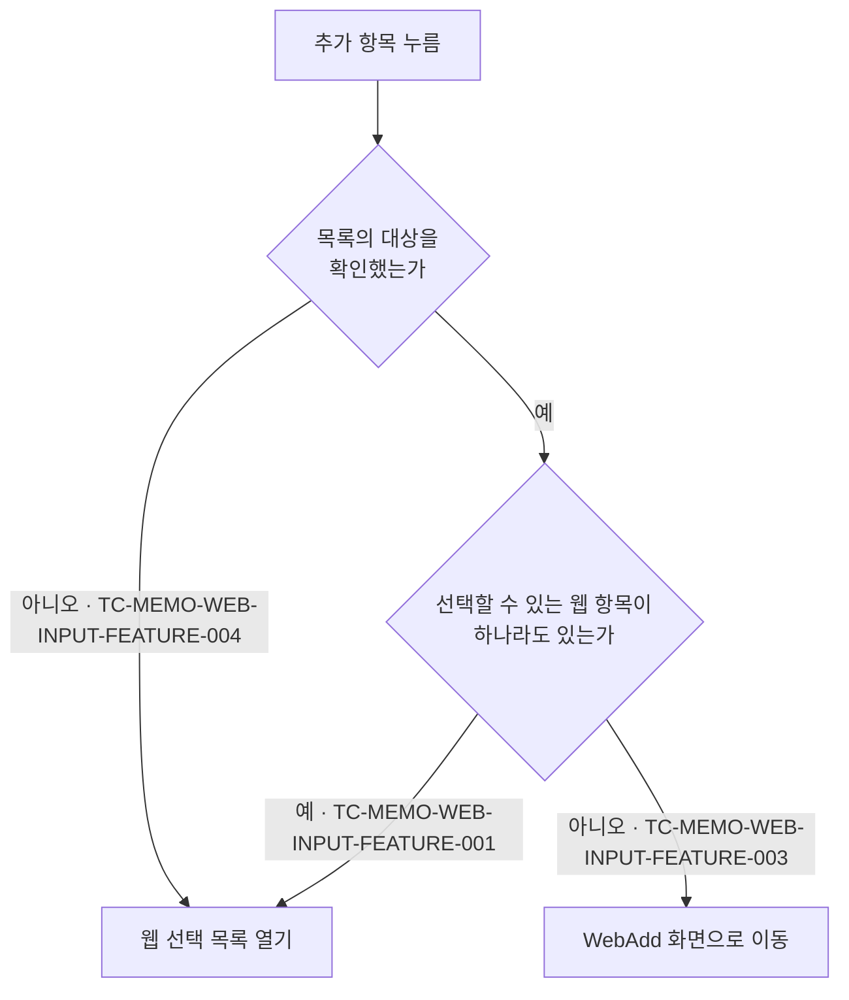

# 메모 웹 입력 컴포넌트 테스트 케이스

기준 스펙: [메모 웹 입력 컴포넌트 스펙](../spec/memo-web-input.md)

이 문서의 케이스는 MemoAdd 화면과 MemoDetail 화면에서 같은 결과로 판정된다. 사용자가 반영한 선택이 어디에 반영되는지는 [MemoAdd 테스트 케이스](./memo-add.md)와 [MemoDetail 테스트 케이스](./memo-detail.md)에서 다룬다.

검색어의 정규화와 일치 판정, 검색 결과 없음 판정은 [검색어 일치 판정 스펙](../spec/search-match.md)에 위임되어 있으며, 웹 선택 목록에서의 결과를 이 문서의 케이스로 덮는다. 아직 준비되지 않은 자리의 표시는 [페이지 조회 목록의 자리 표시 스펙](../spec/paged-list-placeholder.md)에 위임되어 있다.

## feature

### TC-MEMO-WEB-INPUT-FEATURE-001: 웹 선택 목록을 열면 목록에 나타나는 웹 항목이 표시된다

- 근거: `feature > 웹 선택 목록`
- Given: 선택할 수 있는 웹 항목이 있고 웹 선택 목록이 닫혀 있다.
- When: 사용자가 웹 입력의 추가 항목을 눌러 웹 선택 목록을 연다.
- Then: 목록에 나타나는 웹 항목과 각 웹 항목의 선택 여부가 표시된다.

### TC-MEMO-WEB-INPUT-FEATURE-002: 웹 추가 항목이 웹 입력에 항상 표시된다

- 근거: `feature > 웹 선택 목록`
- Given: 선택한 웹 항목이 테스트 데이터와 같다.
- When: 사용자가 웹 입력을 확인한다.
- Then: 웹 입력에 추가 항목이 표시된다.
- 테스트 데이터:

| 선택한 웹 항목 |
| --- |
| 없음 |
| 웹 항목 여러 개 |

추가 항목을 눌렀을 때의 동작 판정은 다음 케이스가 나누어 덮는다.

### TC-MEMO-WEB-INPUT-FEATURE-003: 선택할 수 있는 웹 항목이 없는 것으로 확정되면 추가 항목이 WebAdd 이동을 요청한다

- 근거: `feature > 웹 추가 이동`, `domain > 추가 항목의 동작 판정`
- Given: 선택할 수 있는 웹 항목이 하나도 없는 것으로 확정되어 있다.
- When: 사용자가 웹 입력의 추가 항목을 누른다.
- Then: WebAdd 화면 이동이 한 번 요청되고 웹 선택 목록은 열리지 않는다.

### TC-MEMO-WEB-INPUT-FEATURE-004: 목록의 대상을 확인하는 중에는 추가 항목이 목록을 연다

- 근거: `domain > 추가 항목의 동작 판정`
- Given: 웹 선택 목록에 나타낼 웹 항목의 확인이 아직 끝나지 않도록 제어되어 있다.
- When: 사용자가 웹 입력의 추가 항목을 누른다.
- Then: 웹 선택 목록이 열리고 WebAdd 화면 이동은 요청되지 않는다.

### TC-MEMO-WEB-INPUT-FEATURE-005: 확인 중에 연 목록이 대상 없음으로 확정되면 목록 영역이 비어 있는 채로 유지된다

- 근거: `feature > 웹 선택 목록`
- Given: 대상 확인이 끝나지 않은 상태에서 웹 선택 목록을 열어 두었다.
- When: 선택할 수 있는 웹 항목이 없는 것으로 확정된다.
- Then: 목록 영역은 비어 있는 채로 유지되고 검색 결과 없음 안내는 표시되지 않는다.

### TC-MEMO-WEB-INPUT-FEATURE-006: 웹 선택 목록에 웹 추가 항목이 항상 표시된다

- 근거: `feature > 웹 선택 목록`
- Given: 웹 선택 목록이 테스트 데이터의 상태로 열려 있다.
- When: 사용자가 목록을 확인한다.
- Then: 목록에 웹 추가 항목이 표시된다.
- 테스트 데이터:

| 목록 상태 |
| --- |
| 나타낼 웹 항목이 없음 |
| 웹 항목이 나타나 있음 |
| 검색어에 맞는 웹 항목이 없음 |

### TC-MEMO-WEB-INPUT-FEATURE-007: 목록의 웹 추가 항목을 누르면 목록이 닫히고 WebAdd 이동이 요청된다

- 근거: `feature > 웹 선택 목록`, `feature > 웹 추가 이동`
- Given: 웹 선택 목록이 테스트 데이터의 상태로 열려 있다.
- When: 사용자가 목록의 웹 추가 항목을 누른다.
- Then: 목록이 닫히고 WebAdd 화면 이동이 한 번 요청되며 선택은 바뀌지 않는다.
- 테스트 데이터:

| 목록 상태 |
| --- |
| 나타낼 웹 항목이 없음 |
| 웹 항목이 나타나 있음 |

### TC-MEMO-WEB-INPUT-FEATURE-008: WebAdd 화면에서 추가한 웹 항목이 돌아왔을 때 선택된다

- 근거: `feature > 웹 추가 이동`, `domain > 추가한 웹 항목의 자동 선택`
- Given: 이미 선택한 웹 항목이 있는 화면에서 WebAdd 화면으로 이동했다.
- When: 테스트 데이터의 웹 항목을 추가하고 웹 입력이 있는 화면으로 돌아온다.
- Then: 이동 전에 있던 선택이 유지된 채 추가한 웹 항목이 모두 선택으로 더해진다.
- 테스트 데이터:

| 추가한 웹 항목 수 |
| --- |
| 1개 |
| 여러 개 |

### TC-MEMO-WEB-INPUT-FEATURE-009: 웹 항목을 추가하지 않고 돌아오면 선택이 그대로 유지된다

- 근거: `feature > 웹 추가 이동`
- Given: 이미 선택한 웹 항목이 있는 화면에서 WebAdd 화면으로 이동했다.
- When: 웹 항목을 하나도 추가하지 않고 웹 입력이 있는 화면으로 돌아온다.
- Then: 선택한 웹 항목이 이동 전과 같다.

### TC-MEMO-WEB-INPUT-FEATURE-010: WebAdd 화면에서 돌아와도 웹 선택 목록이 저절로 열리지 않는다

- 근거: `feature > 웹 추가 이동`
- Given: 웹 선택 목록에서 웹 추가로 이동해 목록이 닫힌 상태다.
- When: 웹 항목을 추가하고 웹 입력이 있는 화면으로 돌아온다.
- Then: 웹 선택 목록은 닫힌 상태로 유지되고, 추가 항목을 다시 누르면 추가한 웹 항목이 나타나는 목록이 열린다.

### TC-MEMO-WEB-INPUT-FEATURE-011: 목록에서 웹 항목을 선택하면 선택 상태로 표시된다

- 근거: `feature > 웹 선택과 해제`
- Given: 웹 선택 목록이 열려 있고 선택하지 않은 웹 항목이 나타나 있다.
- When: 사용자가 그 웹 항목을 누른다.
- Then: 그 웹 항목이 목록에서 선택 상태로 표시되고 웹 입력의 칩 영역에도 나타난다.

### TC-MEMO-WEB-INPUT-FEATURE-012: 목록에서 선택을 해제하면 선택 상태에서 제외된다

- 근거: `feature > 웹 선택과 해제`
- Given: 웹 선택 목록이 열려 있고 선택한 웹 항목이 나타나 있다.
- When: 사용자가 그 웹 항목을 누른다.
- Then: 그 웹 항목이 목록에서 선택되지 않은 상태로 표시되고 웹 입력의 칩 영역에서 사라진다.

### TC-MEMO-WEB-INPUT-FEATURE-013: 한 번에 여러 웹 항목을 선택할 수 있다

- 근거: `feature > 웹 선택과 해제`
- Given: 웹 선택 목록이 열려 있고 선택하지 않은 웹 항목이 여러 개 나타나 있다.
- When: 사용자가 그 웹 항목을 차례로 누른다.
- Then: 누른 웹 항목이 모두 선택 상태로 표시되고, 뒤에 누른 선택이 앞서 누른 선택을 해제하지 않는다.

### TC-MEMO-WEB-INPUT-FEATURE-014: 목록을 닫아도 반영된 선택이 유지된다

- 근거: `feature > 웹 선택 목록`
- Given: 웹 선택 목록에서 웹 항목의 선택을 바꾸었다.
- When: 사용자가 목록을 닫는다.
- Then: 웹 입력에 목록에서 바꾼 선택이 그대로 표시된다.

### TC-MEMO-WEB-INPUT-FEATURE-015: 선택한 웹 항목의 제목이 바뀌면 웹 입력에 반영된다

- 근거: `feature > 선택 상태 표시`
- Given: 선택한 웹 항목이 웹 입력에 표시되어 있다.
- When: 그 웹 항목의 제목이 다른 경로로 바뀐다.
- Then: 웹 입력에 바뀐 제목이 표시된다.

### TC-MEMO-WEB-INPUT-FEATURE-016: 웹 칩을 누르면 그 웹 항목의 WebDetail 화면으로 이동한다

- 근거: `feature > 웹 상세 이동`
- Given: 선택한 웹 항목이 웹 입력에 표시되어 있다.
- When: 사용자가 그 웹 칩을 누른다.
- Then: 그 웹 항목을 대상으로 하는 WebDetail 화면 이동이 한 번 요청된다.

### TC-MEMO-WEB-INPUT-FEATURE-017: 웹 칩을 눌러도 선택 상태와 웹 선택 목록은 바뀌지 않는다

- 근거: `feature > 웹 상세 이동`
- Given: 선택한 웹 항목이 웹 입력에 표시되어 있고 웹 선택 목록은 닫혀 있다.
- When: 사용자가 그 웹 칩을 누른다.
- Then: 그 웹 항목의 선택이 유지되고 웹 선택 목록은 열리지 않는다.

### TC-MEMO-WEB-INPUT-FEATURE-018: 목록의 끝으로 이동하면 다음 웹 항목이 이어서 나타난다

- 근거: `feature > 웹 선택 목록`
- Given: 한 번에 다 나타나지 않는 수의 웹 항목이 선택할 수 있는 상태로 있고 목록이 열려 있다.
- When: 사용자가 목록의 끝으로 이동한다.
- Then: 정렬 순서의 다음 웹 항목이 이어서 나타난다.
- 작성하지 않는 이유: 목록을 끝으로 옮긴 뒤 다음 웹 항목이 준비되는 과정은 화면 테스트 환경에서 배경 조회가 끝나는 시점을 제어할 수 없어 같은 조건에서 결과가 일정하지 않다. 조회가 정렬 순서 앞쪽부터 나뉘어 이루어지고 이어지는 조회가 그다음 웹 항목을 가져온다는 결과는 `TC-MEMO-WEB-INPUT-DATA-001`으로 검증한다. 화면 테스트에서 배경 조회 완료 시점을 제어할 수 있게 되면 작성한다.

### TC-MEMO-WEB-INPUT-FEATURE-019: 다음 웹 항목을 불러오는 동안에도 이미 나타난 웹 항목을 조작할 수 있다

- 근거: `feature > 웹 선택 목록`
- Given: 웹 선택 목록이 열려 있고 다음 웹 항목의 조회가 끝나지 않도록 제어되어 있다.
- When: 사용자가 이미 나타난 웹 항목을 누른다.
- Then: 그 웹 항목의 선택이 바뀌어 표시된다.

### TC-MEMO-WEB-INPUT-FEATURE-020: 목록을 불러오지 못해도 이미 나타난 웹 항목을 유지한다

- 근거: `feature > 웹 선택 목록`
- Given: 웹 선택 목록에 웹 항목이 나타나 있고 다음 조회가 실패하도록 제어되어 있다.
- When: 사용자가 목록의 끝으로 이동한다.
- Then: 이미 나타난 웹 항목이 그대로 표시되고 오류 안내나 재시도 동작은 표시되지 않는다.

### TC-MEMO-WEB-INPUT-FEATURE-021: 목록을 닫았다가 다시 열면 앞부분부터 나타난다

- 근거: `feature > 웹 선택 목록`
- Given: 웹 선택 목록을 열어 뒷부분까지 확인한 뒤 목록을 닫았다.
- When: 사용자가 웹 선택 목록을 다시 연다.
- Then: 목록이 정렬 순서의 앞부분부터 나타난다.
- 작성하지 않는 이유: 뒷부분까지 확인한 상태를 만들려면 목록의 다음 구간이 준비되기를 기다려야 하고, 그 시점을 화면 테스트 환경에서 제어할 수 없어 결과가 일정하지 않다. 목록을 다시 열면 검색어가 비워지고 대상 전체를 앞부분부터 다시 조회한다는 결과는 `TC-MEMO-WEB-INPUT-FEATURE-029`와 `TC-MEMO-WEB-INPUT-DATA-004`로 검증한다. 화면 테스트에서 배경 조회 완료 시점을 제어할 수 있게 되면 작성한다.

### TC-MEMO-WEB-INPUT-FEATURE-022: 목록의 웹 항목을 눌러도 웹 상세로 이동하지 않는다

- 근거: `feature > 웹 선택 목록`
- Given: 웹 선택 목록이 열려 있고 웹 항목이 나타나 있다.
- When: 사용자가 목록의 웹 항목을 누른다.
- Then: 그 웹 항목의 선택 여부만 바뀌고 WebDetail 화면 이동은 요청되지 않는다.

### TC-MEMO-WEB-INPUT-FEATURE-023: 목록을 열면 검색어가 비어 있고 대상 전체가 나타난다

- 근거: `feature > 웹 검색`
- Given: 선택할 수 있는 웹 항목이 여러 개 있고 웹 선택 목록이 닫혀 있다.
- When: 사용자가 웹 선택 목록을 연다.
- Then: 검색 입력이 비어 있고 목록의 대상 전체가 정렬 순서의 앞부분부터 나타난다.

### TC-MEMO-WEB-INPUT-FEATURE-024: 검색어를 입력하면 목록이 좁혀진다

- 근거: `feature > 웹 검색`
- Given: 웹 선택 목록이 열려 있고 제목이 서로 다른 웹 항목이 나타나 있다.
- When: 사용자가 일부 웹 항목의 제목만 만족하는 검색어를 입력한다.
- Then: 검색어를 만족하는 웹 항목만 목록에 나타나고 별도의 확정 동작 없이 반영된다.

### TC-MEMO-WEB-INPUT-FEATURE-025: 검색어를 지우면 대상 전체가 다시 나타난다

- 근거: `feature > 웹 검색`
- Given: 웹 선택 목록에 검색어를 입력해 목록이 좁혀져 있다.
- When: 사용자가 검색어를 모두 지운다.
- Then: 목록의 대상 전체가 다시 나타난다.

### TC-MEMO-WEB-INPUT-FEATURE-026: 검색으로 좁힌 목록에서도 선택과 해제를 바꿀 수 있다

- 근거: `feature > 웹 검색`
- Given: 웹 선택 목록에 검색어를 입력해 목록이 좁혀져 있다.
- When: 사용자가 좁혀진 목록의 웹 항목을 눌러 선택하고 다시 눌러 해제한다.
- Then: 선택과 해제가 반영되고 그 웹 항목은 검색어를 만족하는 동안 목록에 그대로 남는다.

### TC-MEMO-WEB-INPUT-FEATURE-027: 검색어에 맞는 웹 항목이 없으면 안내가 표시된다

- 근거: `feature > 웹 검색`
- Given: 웹 선택 목록이 열려 있고 웹 항목이 나타나 있다.
- When: 사용자가 어느 웹 항목도 만족하지 않는 검색어를 입력한다.
- Then: 목록 자리에 검색어에 맞는 웹 항목이 없으며 다른 검색어로 다시 찾을 수 있음을 알리는 안내가 표시된다.

### TC-MEMO-WEB-INPUT-FEATURE-028: 검색 결과가 없어도 웹 추가 항목으로 WebAdd 이동을 요청할 수 있다

- 근거: `feature > 웹 검색`
- Given: 검색어를 입력해 목록에 나타낼 웹 항목이 없는 상태다.
- When: 사용자가 목록의 웹 추가 항목을 누른다.
- Then: 목록이 닫히고 WebAdd 화면 이동이 한 번 요청된다.

### TC-MEMO-WEB-INPUT-FEATURE-029: 목록을 닫았다가 다시 열면 검색어가 비어 있다

- 근거: `feature > 웹 검색`
- Given: 웹 선택 목록에 검색어를 입력해 목록이 좁혀져 있다.
- When: 사용자가 목록을 닫고 다시 연다.
- Then: 검색 입력이 비어 있고 목록의 대상 전체가 다시 나타난다.

## domain

### TC-MEMO-WEB-INPUT-DOMAIN-001: 선택할 수 있는 웹 항목은 계정과 연결된 삭제되지 않은 웹 항목이다

- 근거: `domain > 선택할 수 있는 웹 항목`
- Given: 테스트 데이터의 웹 항목이 저장되어 있다.
- When: 웹 선택 목록을 연다.
- Then: 테스트 데이터의 기대 결과대로 목록에 나타나거나 나타나지 않는다.
- 테스트 데이터:

| 웹 항목 상태 | 목록 노출 |
| --- | --- |
| 현재 계정과 연결, 삭제되지 않음 | 나타난다 |
| 현재 계정과 연결, 삭제됨 | 나타나지 않는다 |
| 다른 계정과만 연결, 삭제되지 않음 | 나타나지 않는다 |

### TC-MEMO-WEB-INPUT-DOMAIN-002: 선택할 수 있는 웹 항목은 제목 오름차순으로 정렬된다

- 근거: `domain > 선택할 수 있는 웹 항목`
- Given: 제목이 서로 다른 웹 항목이 여러 개 저장되어 있다.
- When: 웹 선택 목록을 연다.
- Then: 목록이 제목 오름차순으로 나타난다.

### TC-MEMO-WEB-INPUT-DOMAIN-003: 웹 목록의 정렬 선택은 웹 선택 목록의 순서를 바꾸지 않는다

- 근거: `domain > 선택할 수 있는 웹 항목`
- Given: 사용자가 웹 목록에서 제목 오름차순이 아닌 정렬을 골라 두었다.
- When: 웹 선택 목록을 연다.
- Then: 웹 선택 목록은 제목 오름차순으로 나타난다.
- 작성하지 않는 이유: 웹 선택 목록의 조회에는 정렬을 고르는 입력이 아예 없어, 사용자가 웹 목록에서 고른 정렬을 이 조회에 전달하는 경로가 존재하지 않는다. 관찰할 수 있는 결과는 항상 제목 오름차순이라는 `TC-MEMO-WEB-INPUT-DOMAIN-002`와 같으므로 별도 케이스로 구분해 판정할 수 없다.

### TC-MEMO-WEB-INPUT-DOMAIN-004: 선택할 수 있는 웹 항목 외에 목록에 나타나는 웹 항목은 없다

- 근거: `domain > 웹 선택 목록에 나타나는 웹 항목`
- Given: 선택한 웹 항목 가운데 삭제된 웹 항목이 있다.
- When: 웹 선택 목록을 연다.
- Then: 목록에는 선택할 수 있는 웹 항목만 나타나고 삭제된 웹 항목은 나타나지 않는다.

### TC-MEMO-WEB-INPUT-DOMAIN-005: 선택한 웹 항목이 삭제되면 선택에서 제외된 것으로 표시된다

- 근거: `domain > 선택한 것으로 표시하는 웹 항목`
- Given: 선택한 웹 항목이 웹 입력에 표시되어 있다.
- When: 그 웹 항목이 삭제된 상태로 바뀐다.
- Then: 그 웹 항목이 웹 입력의 칩 영역에서 사라진다.

### TC-MEMO-WEB-INPUT-DOMAIN-006: 웹 항목이 복구되면 유지되어 있던 선택이 다시 나타난다

- 근거: `domain > 선택한 것으로 표시하는 웹 항목`
- Given: 선택이 유지된 채 삭제되어 웹 입력에서 빠진 웹 항목이 있다.
- When: 그 웹 항목이 삭제되지 않은 상태로 되돌아간다.
- Then: 그 웹 항목이 다시 선택한 것으로 웹 입력에 나타난다.

### TC-MEMO-WEB-INPUT-DOMAIN-007: 선택한 것으로 표시하는 웹 항목은 목록을 확인한 범위와 무관하다

- 근거: `domain > 선택한 것으로 표시하는 웹 항목`
- Given: 선택한 웹 항목이 웹 선택 목록의 뒷부분에 놓이는 정렬 순서를 갖는다.
- When: 사용자가 목록을 내려 보지 않고 웹 입력을 확인한다.
- Then: 그 웹 항목이 선택한 것으로 웹 입력에 나타난다.

### TC-MEMO-WEB-INPUT-DOMAIN-008: 검색어는 제목만으로 판정한다

- 근거: `domain > 웹 검색어`
- Given: 테스트 데이터의 값만 검색어를 포함하는 웹 항목이 저장되어 있다.
- When: 웹 선택 목록에 그 검색어를 입력한다.
- Then: 테스트 데이터의 기대 결과대로 그 웹 항목이 목록에 나타나거나 나타나지 않는다.
- 테스트 데이터:

| 검색어를 포함하는 값 | 목록 노출 |
| --- | --- |
| 제목 | 나타난다 |
| 설명 | 나타나지 않는다 |
| URL | 나타나지 않는다 |
| 요청 헤더의 이름이나 값 | 나타나지 않는다 |

### TC-MEMO-WEB-INPUT-DOMAIN-009: 앞뒤 공백만 있는 검색어는 목록을 좁히지 않는다

- 근거: `domain > 웹 검색어`
- Given: 웹 선택 목록이 열려 있고 웹 항목이 여러 개 나타나 있다.
- When: 사용자가 공백 문자만 입력한다.
- Then: 목록의 대상 전체가 그대로 나타나고 검색 결과 없음 안내는 표시되지 않는다.

### TC-MEMO-WEB-INPUT-DOMAIN-010: 검색어는 선택한 웹 항목에도 같은 기준으로 적용된다

- 근거: `domain > 웹 검색어`
- Given: 선택한 웹 항목이 있고 웹 선택 목록이 열려 있다.
- When: 사용자가 그 웹 항목의 제목을 만족하지 않는 검색어를 입력한다.
- Then: 그 웹 항목은 목록에서 빠지지만 선택은 그대로 유지된다.

### TC-MEMO-WEB-INPUT-DOMAIN-011: 검색어는 웹 입력에 표시하는 웹 항목을 좁히지 않는다

- 근거: `domain > 웹 검색어`
- Given: 선택한 웹 항목이 웹 입력에 표시되어 있다.
- When: 사용자가 웹 선택 목록에 그 웹 항목을 만족하지 않는 검색어를 입력한다.
- Then: 웹 입력의 칩 영역에는 선택한 웹 항목이 그대로 표시된다.

### TC-MEMO-WEB-INPUT-DOMAIN-012: 화면이 재생성되어도 열려 있는 목록의 검색어가 유지된다

- 근거: `domain > 웹 검색어`, `domain > 진행 상태 유지`
- Given: 웹 선택 목록이 열려 있고 검색어가 입력되어 목록이 좁혀져 있다.
- When: 화면이 재생성된다.
- Then: 목록이 열린 상태로 유지되고 검색어와 좁혀진 결과가 그대로 남는다.

### TC-MEMO-WEB-INPUT-DOMAIN-013: 자동 선택된 웹 항목의 선택을 해제하면 다시 선택되지 않는다

- 근거: `domain > 추가한 웹 항목의 자동 선택`
- Given: WebAdd 화면에서 추가한 웹 항목이 돌아온 뒤 자동 선택되었다.
- When: 사용자가 그 웹 항목의 선택을 해제한다.
- Then: 그 웹 항목은 선택되지 않은 상태로 유지되고 다시 자동 선택되지 않는다.

### TC-MEMO-WEB-INPUT-DOMAIN-014: 상세 대상 메모가 바뀌면 열려 있던 목록과 검색어를 유지하지 않는다

- 근거: `domain > 진행 상태 유지`
- Given: MemoDetail 화면에서 웹 선택 목록이 열려 있고 검색어가 입력되어 있다.
- When: 상세 대상이 다른 메모로 바뀐다.
- Then: 웹 선택 목록이 닫히고 검색어가 남지 않으며, 웹 입력에는 새 대상 메모에 연결된 웹 항목이 표시된다.

## data

### TC-MEMO-WEB-INPUT-DATA-001: 웹 선택 목록을 페이지 단위로 조회한다

- 근거: `data > 웹 목록 조회`
- Given: 한 페이지에 담기지 않는 수의 웹 항목이 선택할 수 있는 상태로 저장되어 있다.
- When: 웹 선택 목록을 열고 목록의 끝으로 이동한다.
- Then: 처음에는 첫 페이지만 조회되고, 끝으로 이동한 뒤 다음 페이지가 이어서 조회된다.

### TC-MEMO-WEB-INPUT-DATA-002: 선택 상태로 표시하는 웹 항목은 목록 조회와 분리해 조회한다

- 근거: `data > 웹 목록 조회`
- Given: 선택한 웹 항목이 있고 웹 선택 목록의 조회가 진행되지 않도록 제어되어 있다.
- When: 웹 입력을 확인한다.
- Then: 선택한 웹 항목이 칩 영역에 표시된다.

### TC-MEMO-WEB-INPUT-DATA-003: 검색어가 있으면 검색어를 만족하는 웹 항목만 조회한다

- 근거: `data > 웹 목록 조회`
- Given: 검색어를 만족하는 웹 항목과 만족하지 않는 웹 항목이 함께 저장되어 있다.
- When: 웹 선택 목록에 그 검색어를 입력한다.
- Then: 검색어를 만족하는 웹 항목만 조회 결과로 나타난다.

### TC-MEMO-WEB-INPUT-DATA-004: 검색어가 바뀌면 첫 페이지부터 다시 조회한다

- 근거: `data > 웹 목록 조회`
- Given: 웹 선택 목록에서 뒷부분까지 확인한 상태다.
- When: 사용자가 검색어를 바꾼다.
- Then: 새 검색어 기준으로 첫 페이지부터 다시 조회되어 목록이 정렬 순서의 앞부분부터 나타난다.

### TC-MEMO-WEB-INPUT-DATA-005: 저장된 웹 항목이 바뀌면 웹 입력과 웹 선택 목록에 함께 반영된다

- 근거: `data > 웹 목록 조회`
- Given: 선택한 웹 항목이 웹 입력에 표시되어 있고 웹 선택 목록이 열려 있다.
- When: 그 웹 항목의 제목이 바뀌거나 새 웹 항목이 추가된다.
- Then: 바뀐 내용이 웹 입력의 칩과 웹 선택 목록에 함께 나타난다.
