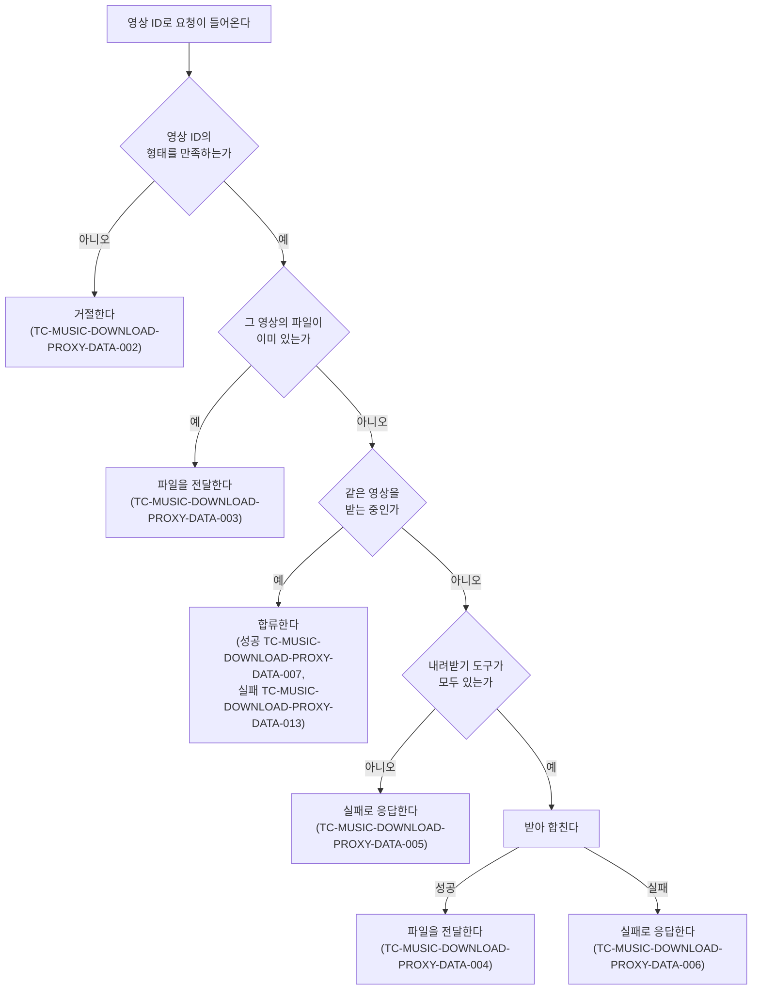

# 곡 다운로드 프록시 테스트 케이스

기준 스펙: [곡 다운로드 프록시 스펙](../spec/client/music-download-proxy.md)

프록시를 사용하는 기기에서 관찰하는 곡별 상태와 안내는 [곡 다운로드 테스트 케이스](./music-download.md)에서, 프록시 주소를 화면에서 확인하고 저장하는 케이스는 [SettingDownload 테스트 케이스](./setting-download.md)에서 다룬다. 이 문서의 케이스는 프록시가 받는 요청과 돌려주는 응답, 프록시 기기에 남는 파일을 기준으로 한다.

## feature

### TC-MUSIC-DOWNLOAD-PROXY-FEATURE-001: 앱을 실행하면 조작 없이 프록시가 시작된다

- 근거: `feature > 프록시 제공`
- Given: 데스크톱 앱이다.
- When: 앱을 실행한다.
- Then: 사용자가 아무것도 하지 않아도 연결 확인 요청에 제공 중임을 응답한다.
- 작성하지 않는 이유: 앱 실행은 프로세스를 띄우는 일이라 같은 프로세스 안에서 결과를 판정할 수 없다. 앱 프로세스를 띄우고 요청을 보낼 수 있는 테스트 환경이 마련되면 작성한다. 프록시가 시작된 뒤 요청을 처리하는 것은 `data`의 케이스가 확인한다.

## domain

### TC-MUSIC-DOWNLOAD-PROXY-DOMAIN-001: 주소 후보는 이 기기의 내부 주소마다 하나씩이다

- 근거: `domain > 프록시 주소`
- Given: 프록시가 제공 중이고, 이 기기의 네트워크 주소가 테스트 데이터와 같다.
- When: 프록시 주소 후보를 확인한다.
- Then: 테스트 데이터의 `후보 여부`가 `포함`인 주소마다 `http://<주소>:<프록시가 열린 포트>` 형태의 후보가 하나씩 있고, `제외`인 주소는 후보에 없다.
- 테스트 데이터:

| 주소 | 후보 여부 |
| --- | --- |
| `192.168.0.10` | 포함 |
| `10.0.0.5` | 포함 |
| `172.16.4.2` | 포함 |
| `127.0.0.1` | 제외 |
| `8.8.8.8` | 제외 |
| `fe80::1` | 제외 |

### TC-MUSIC-DOWNLOAD-PROXY-DOMAIN-003: 시작하지 못하면 제공하지 못함이 된다

- 근거: `domain > 프록시 상태`
- Given: 프록시를 시작할 수 없는 조건이다.
- When: 프록시를 시작한다.
- Then: 프록시 상태가 제공하지 못함이 되고, 스스로 다시 시도하지 않는다.
- 작성하지 않는 이유: 포트를 운영체제가 고르므로 포트 충돌로는 시작 실패를 만들 수 없고, 그 밖의 시작 실패는 네트워크 스택 자체가 없는 환경처럼 테스트 환경에서 결정적으로 재현할 수단이 없다. 시작 실패를 주입할 수 있는 실행 환경이 갖춰지면 작성한다.

### TC-MUSIC-DOWNLOAD-PROXY-DOMAIN-004: 시작하면 운영체제가 고른 포트로 제공 중이 된다

- 근거: `domain > 프록시 주소`, `domain > 프록시 상태`
- Given: 이 기기에 내부 주소가 하나 있다.
- When: 프록시를 시작한다.
- Then: 프록시 상태가 제공 중이 되고, 주소 후보의 포트는 운영체제가 고른 0이 아닌 값이다.

### TC-MUSIC-DOWNLOAD-PROXY-DOMAIN-005: 주소 후보는 프록시를 시작할 때 한 번 정하고 그 뒤 네트워크가 바뀌어도 바꾸지 않는다

- 근거: `domain > 프록시 주소`
- Given: 이 기기에 내부 주소가 하나 있는 상태로 프록시가 시작되어 제공 중이다.
- When: 이 기기가 다른 내부 주소를 갖는 네트워크로 옮겨 간 뒤 프록시 주소 후보를 다시 확인한다.
- Then: 후보는 프록시를 시작할 때의 주소 그대로이고, 이 기기의 네트워크 주소를 다시 확인하지 않는다.

## data

요청 하나가 어느 경로로 처리되는지는 다음 케이스가 나누어 덮는다.

### TC-MUSIC-DOWNLOAD-PROXY-DATA-001: 연결 확인 요청에 제공 중임을 응답한다

- 근거: `data > 요청과 응답`
- Given: 프록시가 제공 중이다.
- When: 연결 확인 요청이 들어온다.
- Then: 제공 중임을 알리는 성공 응답을 돌려주고, 어떤 영상도 받지 않는다.

### TC-MUSIC-DOWNLOAD-PROXY-DATA-002: 영상 ID의 형태를 만족하지 않는 요청은 거절한다

- 근거: `domain > 요청의 성립`, `data > 요청과 응답`
- Given: 프록시가 제공 중이고 내려받기 도구가 모두 있다.
- When: 테스트 데이터의 값으로 영상 요청이 들어온다.
- Then: 잘못된 요청으로 응답하고, 어떤 영상도 받지 않으며, 파일도 남지 않는다.
- 테스트 데이터:

| 값 |
| --- |
| 10자 영숫자 |
| 12자 영숫자 |
| 11자이지만 `-`와 `_` 밖의 기호가 섞임 |
| 11자이지만 공백이 섞임 |

### TC-MUSIC-DOWNLOAD-PROXY-DATA-003: 파일이 이미 있으면 받지 않고 그 파일을 전달한다

- 근거: `domain > 요청의 처리`, `data > 요청과 응답`
- Given: 프록시가 제공 중이고, 요청할 영상 ID의 파일이 이미 있다.
- When: 그 영상 ID로 영상 요청이 들어온다.
- Then: 내려받기를 요청하지 않고, 있는 파일의 내용 전체와 그 크기를 성공 응답으로 돌려준다.

### TC-MUSIC-DOWNLOAD-PROXY-DATA-004: 파일이 없으면 받아 합친 뒤 전달한다

- 근거: `domain > 요청의 처리`, `data > 요청과 응답`
- Given: 프록시가 제공 중이고 내려받기 도구가 모두 있으며, 요청할 영상 ID의 파일이 없고, 내려받기가 성공하도록 설정되어 있다.
- When: 그 영상 ID로 영상 요청이 들어온다.
- Then: 그 영상의 내려받기가 한 번 요청되고, 끝난 뒤 완성된 파일의 내용 전체와 그 크기를 성공 응답으로 돌려주며, 그 영상 ID의 파일이 남는다.

### TC-MUSIC-DOWNLOAD-PROXY-DATA-005: 내려받기 도구가 없으면 설치하지 않고 실패로 응답한다

- 근거: `domain > 요청의 처리`
- Given: 프록시가 제공 중이고 테스트 데이터의 도구가 없으며, 요청할 영상 ID의 파일이 없다.
- When: 그 영상 ID로 영상 요청이 들어온다.
- Then: 도구 설치를 요청하지 않고, 내려받기도 요청하지 않으며, 처리 실패로 응답한다.
- 테스트 데이터:

| 없는 도구 |
| --- |
| `yt-dlp`만 없다 |
| `ffmpeg`만 없다 |
| 둘 다 없다 |

### TC-MUSIC-DOWNLOAD-PROXY-DATA-006: 내려받기에 실패하면 실패로 응답하고 파일을 남기지 않는다

- 근거: `domain > 요청의 처리`, `data > 완성된 파일만 남기기`
- Given: 프록시가 제공 중이고 내려받기 도구가 모두 있으며, 요청할 영상 ID의 파일이 없고, 내려받기가 실패로 끝나도록 설정되어 있다.
- When: 그 영상 ID로 영상 요청이 들어온다.
- Then: 처리 실패로 응답하고, 그 영상 ID의 파일이 남지 않는다.

### TC-MUSIC-DOWNLOAD-PROXY-DATA-007: 같은 영상을 받는 중에 들어온 요청은 진행 중인 작업에 합류한다

- 근거: `domain > 요청의 처리`
- Given: 프록시가 제공 중이고 내려받기 도구가 모두 있으며, 한 영상 ID의 영상 요청이 들어와 내려받기가 끝나지 않은 채 멈춰 있다.
- When: 같은 영상 ID로 영상 요청이 하나 더 들어온 뒤 내려받기가 성공으로 끝난다.
- Then: 그 영상의 내려받기는 한 번만 요청되고, 두 요청 모두 같은 파일의 내용 전체와 크기를 성공 응답으로 받는다.

### TC-MUSIC-DOWNLOAD-PROXY-DATA-013: 합류한 작업이 실패하면 합류한 요청 모두 실패로 응답받는다

- 근거: `domain > 요청의 처리`
- Given: 프록시가 제공 중이고 내려받기 도구가 모두 있으며, 한 영상 ID의 영상 요청이 들어와 내려받기가 끝나지 않은 채 멈춰 있다.
- When: 같은 영상 ID로 영상 요청이 하나 더 들어온 뒤 내려받기가 실패로 끝난다.
- Then: 그 영상의 내려받기는 한 번만 요청되고, 두 요청 모두 실패 결과를 받는다.

### TC-MUSIC-DOWNLOAD-PROXY-DATA-014: 파일을 전달하는 도중 연결이 끊겨도 프록시의 파일은 남는다

- 근거: `domain > 요청이 끊긴 뒤의 처리`
- Given: 프록시가 제공 중이고 요청할 영상 ID의 완성된 파일이 있다.
- When: 그 영상 ID로 영상 요청이 들어와 파일을 전달하기 시작한 뒤, 요청한 쪽이 파일을 끝까지 받지 않고 연결을 끊는다.
- Then: 프록시에 있는 그 영상 ID의 파일은 지워지지 않고 내용도 그대로 남는다.

### TC-MUSIC-DOWNLOAD-PROXY-DATA-008: 요청이 끊겨도 끝까지 받아 파일을 남긴다

- 근거: `domain > 요청이 끊긴 뒤의 처리`
- Given: 프록시가 제공 중이고 내려받기 도구가 모두 있으며, 한 영상 ID의 영상 요청이 들어와 내려받기가 끝나지 않은 채 멈춰 있다.
- When: 요청한 쪽이 연결을 끊은 뒤 내려받기가 성공으로 끝난다.
- Then: 내려받기가 중단되지 않고 그 영상 ID의 파일이 남으며, 같은 영상 ID로 다시 요청하면 내려받기를 요청하지 않고 그 파일을 전달한다.

### TC-MUSIC-DOWNLOAD-PROXY-DATA-009: 받는 도중에는 완성된 파일의 이름으로 파일을 두지 않는다

- 근거: `data > 완성된 파일만 남기기`
- Given: 프록시가 제공 중이고 내려받기 도구가 모두 있으며, 한 영상 ID의 영상 요청이 들어와 내려받기가 파일을 일부까지 내보낸 채 멈춰 있다.
- When: 그 영상 ID의 파일이 있는지 확인한다.
- Then: 완성된 파일의 이름으로는 파일이 없다.

### TC-MUSIC-DOWNLOAD-PROXY-DATA-010: 서로 다른 영상의 요청은 순서를 두지 않고 함께 처리한다

- 근거: `domain > 요청의 처리`
- Given: 프록시가 제공 중이고 내려받기 도구가 모두 있으며, 한 영상 ID의 영상 요청이 들어와 내려받기가 끝나지 않은 채 멈춰 있다.
- When: 다른 영상 ID로 영상 요청이 들어온다.
- Then: 첫 영상의 내려받기가 끝나기를 기다리지 않고 다른 영상의 내려받기가 요청된다.

### TC-MUSIC-DOWNLOAD-PROXY-DATA-011: 연결 확인에 10초 안에 성공 응답을 받지 못하면 연결할 수 없는 것으로 본다

- 근거: `data > 요청과 응답`
- Given: Android 또는 iOS에 프록시 주소가 저장되어 있고, 그 주소의 프록시가 연결 확인에 테스트 데이터의 시간이 지난 뒤 성공으로 응답하도록 제어되어 있다.
- When: 다운로드를 실행해 내려받기를 준비한다.
- Then: 테스트 데이터의 준비 결과가 된다.
- 테스트 데이터:

| 응답까지 걸리는 시간 | 준비 결과 |
| --- | --- |
| 10초보다 짧음 | 준비에 성공한다 |
| 10초보다 김 | 프록시에 연결할 수 없는 것으로 끝난다 |

### TC-MUSIC-DOWNLOAD-PROXY-DATA-012: 영상 요청에 10초 안에 연결하지 못하거나 1시간 동안 아무것도 받지 못하면 그 곡은 실패로 끝난다

- 근거: `data > 요청과 응답`
- Given: Android 또는 iOS에서 내려받기 준비가 끝나 한 곡의 차례가 되었고, 프록시가 테스트 데이터처럼 동작하도록 제어되어 있다.
- When: 그 곡의 영상을 프록시에 요청한다.
- Then: 그 곡은 실패로 끝나고 파일이 남지 않는다.
- 테스트 데이터:

| 프록시의 동작 |
| --- |
| 10초가 지나도록 연결을 받아 주지 않는다 |
| 연결한 뒤 1시간 동안 아무것도 전달하지 않는다 |

- 작성하지 않는 이유: 두 시간 기준은 Android와 iOS의 실제 네트워크 연결이 지키는 것이라, 데스크톱에서만 도는 이 프로젝트의 테스트 환경에서는 그 연결을 만들 수 없고 실제 시간 10초와 1시간을 기다리지 않고 판정할 수단도 없다. Android와 iOS의 네트워크 연결을 가상 시간으로 제어할 수 있는 테스트 환경이 갖춰지면 작성한다. 영상 요청이 실패로 끝났을 때 곡이 실패하고 파일이 남지 않는 것 자체는 TC-MUSIC-DOWNLOAD-DATA-006과 TC-MUSIC-DOWNLOAD-DATA-011이 확인한다.
