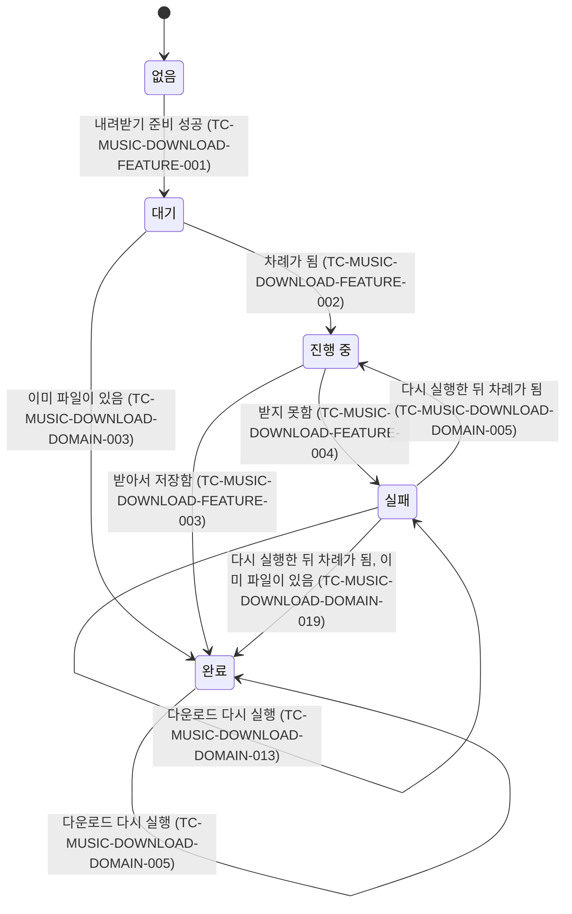

# 곡 다운로드 테스트 케이스

기준 스펙: [곡 다운로드 스펙](../spec/client/music-download.md)

다운로드 대상이 되는 곡의 노출 기준은 [PlaylistHome 화면 스펙](../spec/client/playlist-home.md)의 `목록에 노출하는 곡`에, 링크에서 영상 ID를 얻는 판정은 [MusicAdd 화면 스펙](../spec/client/music-add.md)의 `썸네일의 판정`에 위임되어 있으며, 이 문서의 케이스는 다운로드에서 관찰하는 결과를 기준으로 한다. 상단 바에 다운로드를 실행하는 수단이 놓이는지는 [PlaylistHome 테스트 케이스](./playlist-home.md)에서, 프록시가 요청을 받아 처리하는 계약은 [곡 다운로드 프록시 테스트 케이스](./music-download-proxy.md)에서, 프록시 주소를 저장하는 화면은 [SettingDownload 테스트 케이스](./setting-download.md)에서, 실패를 로그로 남기는 케이스는 [기능 실패 로깅 테스트 케이스](./usecase-failure-logging.md)에서 다룬다.

## feature

곡 하나의 상태 전이를 어느 케이스가 덮는지는 다음과 같다.

### TC-MUSIC-DOWNLOAD-FEATURE-011: 두 도구가 모두 있으면 알리지 않고 곧바로 받는다

- 근거: `feature > 내려받기 준비`
- Given: 데스크톱 앱에서 `yt-dlp`와 `ffmpeg`이 모두 준비되어 있고, 영상 ID를 얻을 수 있는 곡이 있다.
- When: 사용자가 다운로드를 실행한다.
- Then: 도구를 설치하지 않고 그 곡을 받기 시작하며 어떤 안내도 나타나지 않는다.

### TC-MUSIC-DOWNLOAD-FEATURE-012: 없는 도구를 설치한 뒤 이어서 받는다

- 근거: `feature > 내려받기 준비`
- Given: 데스크톱 앱에서 테스트 데이터의 도구가 없고 Homebrew는 있으며, 설치가 성공하도록 설정되어 있다.
- When: 사용자가 다운로드를 실행한다.
- Then: 없는 도구의 설치가 요청되고, 설치가 끝난 뒤 곡을 받기 시작한다.
- 테스트 데이터:

| 없는 도구 |
| --- |
| `yt-dlp`만 없다 |
| `ffmpeg`만 없다 |
| 둘 다 없다 |

### TC-MUSIC-DOWNLOAD-FEATURE-013: Homebrew가 없으면 직접 설치할 것을 알린다

- 근거: `feature > 내려받기 준비`
- Given: 데스크톱 앱에서 `yt-dlp`가 없고 Homebrew도 없으며, 영상 ID를 얻을 수 있는 곡이 있다.
- When: 사용자가 다운로드를 실행한다.
- Then: 직접 설치해야 함을 알리고, 어떤 곡도 받지 않으며, 어떤 곡에도 상태가 생기지 않는다.

### TC-MUSIC-DOWNLOAD-FEATURE-014: 도구를 설치하지 못하면 준비 실패를 알린다

- 근거: `feature > 내려받기 준비`
- Given: 데스크톱 앱에서 `yt-dlp`가 없고 Homebrew는 있으며, 설치가 실패하도록 설정되어 있다.
- When: 사용자가 다운로드를 실행한다.
- Then: 준비하지 못했음을 알리고, 어떤 곡도 받지 않으며, 어떤 곡에도 상태가 생기지 않는다.

### TC-MUSIC-DOWNLOAD-FEATURE-015: 프록시 주소가 없으면 설정에서 입력할 것을 알린다

- 근거: `feature > 내려받기 준비`
- Given: Android 또는 iOS에서 프록시 주소가 저장되어 있지 않고, 영상 ID를 얻을 수 있는 곡이 있다.
- When: 사용자가 다운로드를 실행한다.
- Then: 설정에서 프록시 주소를 입력해야 함을 알리고, 프록시에 아무것도 요청하지 않으며, 어떤 곡에도 상태가 생기지 않는다.

### TC-MUSIC-DOWNLOAD-FEATURE-016: 프록시에 연결할 수 없으면 연결할 수 없음을 알린다

- 근거: `feature > 내려받기 준비`
- Given: Android 또는 iOS에서 프록시 주소가 저장되어 있고, 그 주소의 연결 확인 요청이 실패하도록 설정되어 있으며, 영상 ID를 얻을 수 있는 곡이 있다.
- When: 사용자가 다운로드를 실행한다.
- Then: 프록시에 연결할 수 없음을 알리고, 어떤 영상도 요청하지 않으며, 어떤 곡에도 상태가 생기지 않는다.

### TC-MUSIC-DOWNLOAD-FEATURE-017: 프록시에 연결되면 알리지 않고 곧바로 받는다

- 근거: `feature > 내려받기 준비`
- Given: Android 또는 iOS에서 프록시 주소가 저장되어 있고, 그 주소의 연결 확인 요청이 성공하도록 설정되어 있으며, 영상 ID를 얻을 수 있는 곡이 있다.
- When: 사용자가 다운로드를 실행한다.
- Then: 그 곡의 영상을 프록시에 요청하기 시작하며 어떤 안내도 나타나지 않는다.

### TC-MUSIC-DOWNLOAD-FEATURE-018: 프록시가 응답을 시작하기 전에는 백분율 없이 진행 중임을 확인한다

- 근거: `feature > 진행 확인`, `domain > 곡의 다운로드 상태`
- Given: Android 또는 iOS에서 영상 ID를 얻을 수 있는 링크가 저장된 곡이 있는 PlaylistHome 화면이 표시되어 있고, 프록시에 연결되지만 영상 요청의 응답이 시작되지 않은 채 멈추도록 설정되어 있다.
- When: 사용자가 다운로드를 실행한다.
- Then: 그 곡의 항목에서 다운로드 중임을 확인할 수 있고 백분율은 표시되지 않는다.

### TC-MUSIC-DOWNLOAD-FEATURE-019: 프록시가 전달을 시작한 뒤에는 받은 만큼을 백분율로 확인한다

- 근거: `feature > 진행 확인`, `domain > 곡의 다운로드 상태`, `data > 영상 내려받기`
- Given: Android 또는 iOS에서 영상 ID를 얻을 수 있는 링크가 저장된 곡이 있는 PlaylistHome 화면이 표시되어 있고, 프록시가 크기 `100`의 파일 응답을 시작해 `62`까지 전달한 뒤 멈추도록 설정되어 있다.
- When: 사용자가 다운로드를 실행한다.
- Then: 그 곡의 항목에서 다운로드 중 `62%`임을 확인할 수 있다.

### TC-MUSIC-DOWNLOAD-FEATURE-001: 다운로드를 실행하면 대상 곡이 대기 상태가 된다

- 근거: `feature > 다운로드 실행`
- Given: 영상 ID를 얻을 수 있는 링크가 저장된 곡이 여러 개 있는 PlaylistHome 화면이 표시되어 있고, 내려받기가 아직 끝나지 않도록 설정되어 있다.
- When: 사용자가 다운로드를 실행한다.
- Then: 아직 차례가 오지 않은 곡의 항목에서 다운로드 대기 중임을 확인할 수 있다.

### TC-MUSIC-DOWNLOAD-FEATURE-002: 진행 중인 곡의 항목에서 받은 만큼을 백분율로 확인한다

- 근거: `feature > 진행 확인`, `domain > 곡의 다운로드 상태`
- Given: 데스크톱 앱에서 영상 ID를 얻을 수 있는 링크가 저장된 곡이 있는 PlaylistHome 화면이 표시되어 있고, 그 곡의 내려받기가 테스트 데이터의 단계에서 내려받기 도구가 알린 진행률까지 진행된 뒤 멈추도록 설정되어 있다.
- When: 사용자가 다운로드를 실행한다.
- Then: 그 곡의 항목에서 테스트 데이터의 백분율로 다운로드 중임을 확인할 수 있다.
- 테스트 데이터:

| 멈춘 단계 | 내려받기 도구가 알린 진행률 | 확인하는 백분율 |
| --- | --- | --- |
| 먼저 받는 화면 | `50%` | `45%` |
| 이어서 받는 소리 | `100%` | `99%` |

### TC-MUSIC-DOWNLOAD-FEATURE-003: 받기를 마친 곡의 항목에서 완료를 확인한다

- 근거: `feature > 진행 확인`
- Given: 영상 ID를 얻을 수 있는 링크가 저장된 곡이 있는 PlaylistHome 화면이 표시되어 있고, 그 곡의 내려받기가 성공하도록 설정되어 있다.
- When: 사용자가 다운로드를 실행한다.
- Then: 그 곡의 항목에서 다운로드 완료를 확인할 수 있다.

### TC-MUSIC-DOWNLOAD-FEATURE-004: 받지 못한 곡의 항목에서 실패를 확인한다

- 근거: `feature > 실패와 다시 시도`
- Given: 영상 ID를 얻을 수 있는 링크가 저장된 곡이 있는 PlaylistHome 화면이 표시되어 있고, 테스트 데이터의 실패 조건이 설정되어 있다.
- When: 사용자가 다운로드를 실행한다.
- Then: 그 곡의 항목에서 다운로드 실패를 확인할 수 있다.
- 테스트 데이터:

| 실패 조건 |
| --- |
| 내려받기가 실패로 끝난다 |
| 내려받기가 도중에 끊긴다 |
| 받은 파일을 저장하지 못한다 |

### TC-MUSIC-DOWNLOAD-FEATURE-005: 한 곡이 실패해도 나머지 곡을 계속 받는다

- 근거: `feature > 실패와 다시 시도`
- Given: 영상 ID를 얻을 수 있는 링크가 저장된 곡이 목록 순서대로 세 개 있는 PlaylistHome 화면이 표시되어 있고, 첫째 곡만 내려받기가 실패하고 나머지는 성공하도록 설정되어 있다.
- When: 사용자가 다운로드를 실행한다.
- Then: 첫째 곡의 항목에서 실패를, 둘째와 셋째 곡의 항목에서 완료를 확인할 수 있다.

### TC-MUSIC-DOWNLOAD-FEATURE-006: 진행 중에 다시 실행해도 상태가 바뀌지 않는다

- 근거: `feature > 다시 실행`
- Given: 다운로드를 실행해 한 곡이 62%까지 진행된 채 멈춰 있는 PlaylistHome 화면이 표시되어 있다.
- When: 사용자가 다운로드를 한 번 더 실행한다.
- Then: 그 곡의 항목에 표시된 백분율이 `62%`로 그대로 남고 다른 곡의 상태도 바뀌지 않는다.

### TC-MUSIC-DOWNLOAD-FEATURE-007: 다운로드 대상이 아닌 곡에는 상태를 표시하지 않는다

- 근거: `feature > 진행 확인`
- Given: 영상 ID를 얻을 수 있는 곡과 테스트 데이터의 곡이 함께 있는 PlaylistHome 화면이 표시되어 있고, 내려받기가 성공하도록 설정되어 있다.
- When: 사용자가 다운로드를 실행한다.
- Then: 테스트 데이터의 곡의 항목에는 어떤 다운로드 상태도 나타나지 않는다.
- 테스트 데이터:

| 곡 |
| --- |
| 링크가 비어 있는 곡 |
| 링크는 있지만 영상 ID를 얻을 수 없는 곡 |

### TC-MUSIC-DOWNLOAD-FEATURE-008: 다운로드를 실행하지 않으면 어떤 곡에도 상태가 없다

- 근거: `feature > 진행 확인`
- Given: 영상 ID를 얻을 수 있는 링크가 저장된 곡이 여러 개 있고 아직 받아 둔 파일이 없다.
- When: PlaylistHome 화면이 표시된다.
- Then: 어떤 곡의 항목에도 다운로드 상태가 나타나지 않는다.

### TC-MUSIC-DOWNLOAD-FEATURE-009: 다운로드가 진행되는 동안에도 화면의 다른 조작을 실행할 수 있다

- 근거: `feature > 다운로드 실행`
- Given: 다운로드를 실행해 한 곡이 진행 중인 채 멈춰 있는 PlaylistHome 화면이 표시되어 있다.
- When: 사용자가 테스트 데이터의 조작을 실행한다.
- Then: 그 조작이 평소와 같게 실행되고 어느 요소도 비활성으로 표시되지 않는다.
- 테스트 데이터:

| 조작 |
| --- |
| 정렬 선택을 연다 |
| 곡 추가를 선택한다 |
| 목록의 곡을 선택한다 |
| 뒤로가기를 실행한다 |

### TC-MUSIC-DOWNLOAD-FEATURE-010: 다운로드를 제공하지 않는 환경에서는 아무 일도 일어나지 않는다

- 근거: `feature > 다운로드를 제공하지 않는 환경`
- Given: 웹에서 PlaylistHome 화면이 표시되어 있다.
- When: 사용자가 다운로드를 실행한다.
- Then: 어떤 곡의 상태도 바뀌지 않고, 내려받기를 준비하지 않으며, 실패 안내도 나타나지 않는다.
- 작성하지 않는 이유: 그 플랫폼에서만 다른 결과를 판정하려면 각 플랫폼에서 화면을 구성해야 하는데, 이 프로젝트의 화면 테스트는 데스크톱 환경에서만 실행한다. 각 플랫폼 실행 환경에서 화면을 구성하고 조작할 수 있게 되면 작성한다. 다운로드를 실행하는 수단을 어느 플랫폼에서도 같게 노출하는 것은 TC-PLAYLIST-HOME-FEATURE-018이 확인한다.

## domain

### TC-MUSIC-DOWNLOAD-DOMAIN-010: 실행할 때마다 내려받을 수단이 갖춰져 있는지 다시 확인한다

- 근거: `domain > 내려받기 준비의 판정`
- Given: 테스트 데이터의 수단이 준비된 상태에서 다운로드를 한 번 실행해 끝냈다.
- When: 사용자가 다운로드를 다시 실행한다.
- Then: 테스트 데이터의 수단이 갖춰져 있는지 다시 확인한다.
- 테스트 데이터:

| 플랫폼 | 수단 |
| --- | --- |
| 데스크톱 앱 | `yt-dlp`와 `ffmpeg`이 있는지 |
| Android, iOS | 프록시에 연결할 수 있는지 |

### TC-MUSIC-DOWNLOAD-DOMAIN-011: 내려받기 준비에 실패하면 대상 곡을 판정하지 않는다

- 근거: `domain > 내려받기 준비의 판정`
- Given: 테스트 데이터의 실패 조건이 설정되어 있고, 영상 ID를 얻을 수 있는 곡이 여러 개 있다.
- When: 사용자가 다운로드를 실행한다.
- Then: 대상 곡을 조회하지 않고, 어떤 곡에도 상태가 생기지 않는다.
- 테스트 데이터:

| 플랫폼 | 실패 조건 |
| --- | --- |
| 데스크톱 앱 | `yt-dlp`가 없고 Homebrew도 없다 |
| Android, iOS | 프록시 주소가 저장되어 있지 않다 |
| Android, iOS | 프록시에 연결할 수 없다 |

### TC-MUSIC-DOWNLOAD-DOMAIN-012: 앱이 화면 뒤로 가서 끊긴 곡은 실패로 끝난다

- 근거: `domain > 진행 유지 범위`
- Given: Android 또는 iOS에서 한 곡을 프록시에서 전달받는 중이다.
- When: 앱이 화면 뒤로 가서 플랫폼이 연결을 끊는다.
- Then: 그 곡은 실패로 끝나고 그 곡의 파일이 남지 않는다.
- 작성하지 않는 이유: 앱이 화면 뒤로 갔을 때 플랫폼이 연결을 끊는 것은 각 플랫폼의 실행 환경이 하는 일이라 이 프로젝트의 테스트 환경에서 재현할 수 없다. 연결이 끊기면 실패로 끝나고 파일이 남지 않는 것 자체는 TC-MUSIC-DOWNLOAD-DATA-006이 확인한다. 각 플랫폼 실행 환경에서 앱의 전면·후면 전환을 제어할 수 있게 되면 작성한다.

### TC-MUSIC-DOWNLOAD-DOMAIN-001: 영상 ID를 얻을 수 있는 곡만 대상으로 삼는다

- 근거: `domain > 다운로드 대상 곡`
- Given: 영상 ID를 얻을 수 있는 링크가 저장된 곡, 링크가 비어 있는 곡, 링크는 있지만 영상 ID를 얻을 수 없는 곡이 현재 계정에 저장되어 있다.
- When: 다운로드를 실행한다.
- Then: 영상 ID를 얻을 수 있는 곡에 대해서만 받기가 시작되고, 나머지 두 곡은 대상에서 빠진다.

### TC-MUSIC-DOWNLOAD-DOMAIN-002: 실행 시점의 목록 순서대로 한 곡씩 받는다

- 근거: `domain > 진행 순서`
- Given: 영상 ID를 얻을 수 있는 링크가 저장된 곡이 목록 순서대로 세 개 있고, 각 곡의 내려받기가 순서대로 끝나도록 제어할 수 있다.
- When: 다운로드를 실행한다.
- Then: 첫째 곡이 끝난 뒤 둘째 곡이, 둘째 곡이 끝난 뒤 셋째 곡이 시작되며, 한 번에 둘 이상이 진행 중이 되지 않는다.

### TC-MUSIC-DOWNLOAD-DOMAIN-003: 이미 파일이 있는 곡은 받지 않고 완료로 다룬다

- 근거: `domain > 다운로드 대상 곡`, `data > 완료 판정`
- Given: 영상 ID를 얻을 수 있는 링크가 저장된 곡이 있고, 그 영상 ID로 구분되는 파일이 앱 전용 보관 공간에 이미 있다.
- When: 다운로드를 실행한다.
- Then: 그 곡의 내려받기를 시작하지 않고 곧바로 완료가 된다.

### TC-MUSIC-DOWNLOAD-DOMAIN-004: 진행 중인 다운로드가 있으면 새 실행 요청을 처리하지 않는다

- 근거: `domain > 다시 실행 성립 조건`
- Given: 다운로드를 실행해 한 곡이 진행 중인 채 멈춰 있다.
- When: 다운로드를 한 번 더 실행한다.
- Then: 같은 곡에 대한 내려받기가 다시 일어나지 않는다.

### TC-MUSIC-DOWNLOAD-DOMAIN-005: 모두 끝난 뒤 다시 실행하면 파일이 없는 곡만 받는다

- 근거: `feature > 다시 실행`, `domain > 다시 실행 성립 조건`, `domain > 곡의 다운로드 상태`
- Given: 다운로드를 한 번 실행해 한 곡은 완료되고 다른 한 곡은 실패한 상태이며, 이번에는 두 곡 모두 성공하도록 설정되어 있다.
- When: 다운로드를 한 번 더 실행한다.
- Then: 이전에 실패한 곡만 다시 받아 완료가 되고, 이미 완료된 곡은 내려받지 않은 채 완료로 남는다.

### TC-MUSIC-DOWNLOAD-DOMAIN-013: 다시 실행해도 이전에 실패한 곡은 차례가 오기 전까지 실패로 보인다

- 근거: `feature > 다운로드 실행`, `domain > 곡의 다운로드 상태`
- Given: 영상 ID를 얻을 수 있는 링크가 저장된 곡이 목록 순서대로 두 개 있고, 다운로드를 한 번 실행해 두 곡 모두 실패한 상태다. 이번에는 첫째 곡의 내려받기가 진행 중인 채 멈추도록 설정되어 있다.
- When: 다운로드를 한 번 더 실행한다.
- Then: 첫째 곡은 진행 중이 되고, 둘째 곡은 대기로 바뀌지 않고 실패 상태로 남는다.

### TC-MUSIC-DOWNLOAD-DOMAIN-006: 실행한 뒤 추가된 곡은 진행 중인 다운로드에 끼어들지 않는다

- 근거: `domain > 다운로드 대상 곡`
- Given: 다운로드를 실행해 한 곡이 진행 중인 채 멈춰 있다.
- When: 영상 ID를 얻을 수 있는 링크를 가진 곡이 새로 저장된다.
- Then: 진행 중인 다운로드는 그 곡을 받지 않고, 새로 저장된 곡에는 어떤 상태도 생기지 않는다.

### TC-MUSIC-DOWNLOAD-DOMAIN-007: 대상 곡이 하나도 없으면 아무것도 받지 않고 끝난다

- 근거: `domain > 다시 실행 성립 조건`
- Given: 현재 계정에 노출되는 곡이 하나도 없다.
- When: 다운로드를 실행한다.
- Then: 어떤 내려받기도 시작하지 않고 다운로드가 끝나며 실패가 보고되지 않는다.

### TC-MUSIC-DOWNLOAD-DOMAIN-008: 앱을 다시 실행하면 다운로드를 실행하기 전까지 어떤 곡에도 상태가 없다

- 근거: `domain > 상태의 유지 범위`
- Given: 영상 ID를 얻을 수 있는 링크가 저장된 곡이 두 개 있고, 그중 한 곡의 파일만 앱 전용 보관 공간에 있다.
- When: 앱을 새로 시작한 상태에서, 다운로드를 실행하기 전에 곡 목록의 다운로드 상태를 확인한다.
- Then: 파일이 있는 곡을 포함해 두 곡 모두 대기, 진행 중, 완료, 실패 중 어떤 상태도 갖지 않는다. 다운로드를 실행한 뒤 파일이 있는 곡이 곧바로 완료가 되는 것은 TC-MUSIC-DOWNLOAD-DOMAIN-003이 확인한다.

### TC-MUSIC-DOWNLOAD-DOMAIN-009: 앱이 종료되면 진행 중이던 다운로드가 중단된다

- 근거: `domain > 진행 유지 범위`
- Given: 데스크톱 앱에서 다운로드가 진행 중이다.
- When: 앱을 종료한다.
- Then: 진행 중이던 곡과 대기 중이던 곡이 모두 중단되고 그 곡의 파일이 남지 않는다.
- 작성하지 않는 이유: 앱 종료는 프로세스를 끝내는 일이라 같은 프로세스 안에서 결과를 판정할 수 없다. 앱 프로세스를 띄우고 끝낼 수 있는 테스트 환경이 마련되면 작성한다. 화면을 떠났다 돌아왔을 때 상태가 유지되는 것은 TC-PLAYLIST-HOME-FEATURE-020이, 중단되어 파일이 남지 않는 것은 TC-MUSIC-DOWNLOAD-DATA-006이 확인한다.

### TC-MUSIC-DOWNLOAD-DOMAIN-014: 진행 중인 곡의 백분율은 줄어들지 않는다

- 근거: `domain > 곡의 다운로드 상태`
- Given: 데스크톱 앱에서 영상 ID를 얻을 수 있는 링크가 저장된 곡이 있고, 그 곡의 내려받기 도구가 테스트 데이터의 순서로 진행률을 알리도록 설정되어 있다.
- When: 다운로드를 실행한다.
- Then: 그 곡의 백분율은 앞서 확인한 값보다 작아지지 않는다.
- 테스트 데이터:

| 내려받기 도구가 알리는 진행률의 순서 |
| --- |
| 화면 `50%` → 화면 `10%` |
| 화면 `50%` → 화면 `50%` |
| 화면 `100%` → 소리 `0%` → 소리 `50%` → 소리 `100%` |

### TC-MUSIC-DOWNLOAD-DOMAIN-015: 진행이 시작된 뒤 정렬을 바꿔도 진행 순서는 바뀌지 않는다

- 근거: `domain > 진행 순서`
- Given: 영상 ID를 얻을 수 있는 링크가 저장된 곡이 제목순으로 세 개 있고, 제목순으로 다운로드를 실행해 첫째 곡이 진행 중인 채 멈춰 있다.
- When: 사용자가 정렬을 다른 기준으로 바꾸고 다운로드를 다시 실행한 뒤, 멈춰 있던 곡의 내려받기가 끝난다.
- Then: 곡은 처음 실행할 때의 제목순으로 차례로 받아지고, 바꾼 정렬로 대상 곡을 다시 판정하지 않는다.

### TC-MUSIC-DOWNLOAD-DOMAIN-016: 내려받기를 준비하는 동안 다시 실행해도 준비를 다시 하지 않는다

- 근거: `feature > 다시 실행`, `domain > 다시 실행 성립 조건`
- Given: 다운로드를 실행해 내려받기 준비가 아직 끝나지 않은 채 멈춰 있다.
- When: 다운로드를 한 번 더 실행한다.
- Then: 내려받기 준비가 한 번만 일어나고, 준비가 끝난 뒤에도 곡은 한 번씩만 받아진다.

### TC-MUSIC-DOWNLOAD-DOMAIN-017: 데스크톱 앱에서 영상과 소리를 합치는 동안 99%에 머물고 백분율을 거치지 않고 완료가 된다

- 근거: `domain > 곡의 다운로드 상태`
- Given: 데스크톱 앱에서 영상 ID를 얻을 수 있는 링크가 저장된 곡이 있고, 그 곡의 내려받기 도구가 화면과 소리를 모두 `100%`까지 받은 뒤 두 가지를 하나의 파일로 합치고 성공으로 끝나도록 설정되어 있다.
- When: 다운로드를 실행한다.
- Then: 합치는 동안 그 곡의 백분율은 `99%`에 머물고, 합치기가 끝나면 `100%`를 비롯한 다른 백분율을 거치지 않고 완료가 된다.

### TC-MUSIC-DOWNLOAD-DOMAIN-018: 대상 곡을 판정하지 못하면 알리지 않고 어떤 곡도 받지 않은 채 끝난다

- 근거: `domain > 다운로드 대상 곡`, `domain > 다시 실행 성립 조건`
- Given: 내려받기 준비는 성공하고, 현재 계정이나 곡 목록을 확인하지 못하도록 제어되어 있다.
- When: 다운로드를 실행한다.
- Then: 사용자에게 아무것도 알리지 않고, 어떤 곡도 받지 않으며, 어떤 곡에도 상태가 생기지 않는다. 이어서 다운로드를 다시 실행하면 새로 실행된다.

### TC-MUSIC-DOWNLOAD-DOMAIN-019: 이전에 실패한 곡도 차례가 되었을 때 파일이 있으면 받지 않고 완료가 된다

- 근거: `feature > 다시 실행`, `domain > 곡의 다운로드 상태`, `data > 완료 판정`
- Given: 영상 ID를 얻을 수 있는 링크가 저장된 곡이 있고, 다운로드를 한 번 실행해 그 곡이 실패한 뒤, 그 곡의 영상 ID로 구분되는 파일이 앱 전용 보관 공간에 생겼다.
- When: 다운로드를 한 번 더 실행해 그 곡의 차례가 된다.
- Then: 그 곡의 내려받기를 다시 시작하지 않고 곧바로 완료가 된다.

### TC-MUSIC-DOWNLOAD-DOMAIN-020: 목록을 당겨 새로고침해도 곡의 다운로드 상태가 그대로 유지된다

- 근거: `domain > 상태의 유지 범위`
- Given: 다운로드를 실행해 곡들의 항목에 완료와 실패 상태가 표시된 PlaylistHome 화면이 표시되어 있다.
- When: 사용자가 목록을 당겨 새로고침하고 새로 받은 목록이 반영된다.
- Then: 각 곡의 항목에 새로고침 전과 같은 다운로드 상태가 그대로 표시된다.

## data

### TC-MUSIC-DOWNLOAD-DATA-001: 곡의 차례가 되었을 때 그 영상 ID로 내려받기를 맡긴다

- 근거: `data > 영상 내려받기`
- Given: 데스크톱 앱에서 영상 ID를 얻을 수 있는 링크가 저장된 곡이 있다.
- When: 다운로드를 실행해 그 곡의 차례가 된다.
- Then: 그 곡의 영상에 대한 내려받기가 한 번 요청되고, 받을 파일의 자리로 그 곡의 영상 ID로 구분되는 파일 경로가 전달된다.

### TC-MUSIC-DOWNLOAD-DATA-008: 곡의 차례가 되었을 때 그 영상 ID로 프록시에 요청한다

- 근거: `data > 영상 내려받기`
- Given: Android 또는 iOS에서 프록시 주소가 저장되어 있고 프록시에 연결되며, 영상 ID를 얻을 수 있는 링크가 저장된 곡이 있다.
- When: 다운로드를 실행해 그 곡의 차례가 된다.
- Then: 저장된 프록시 주소로 그 곡의 링크에서 얻은 영상 ID에 대한 영상 요청이 한 번 전달된다.

### TC-MUSIC-DOWNLOAD-DATA-002: 목록을 표시하는 것만으로는 내려받기를 시작하지 않는다

- 근거: `data > 영상 내려받기`
- Given: 영상 ID를 얻을 수 있는 링크가 저장된 곡이 여러 개 있다.
- When: 곡 목록을 조회해 표시한다.
- Then: 어떤 영상의 내려받기도 요청되지 않는다.

### TC-MUSIC-DOWNLOAD-DATA-003: 가장 좋은 화질의 영상과 소리를 합쳐 받도록 맡긴다

- 근거: `data > 영상 내려받기`
- Given: 영상 ID를 얻을 수 있는 링크가 저장된 곡이 있다.
- When: 다운로드를 실행해 그 곡의 차례가 된다.
- Then: 가장 좋은 화질의 영상과 소리를 하나의 mp4로 합치도록 요청하고, 제품이 별도의 화질을 지정하지 않는다.

### TC-MUSIC-DOWNLOAD-DATA-009: 받은 파일을 영상 ID로 앱 전용 보관 공간에 저장한다

- 근거: `data > 파일 저장`
- Given: 영상 ID를 얻을 수 있는 링크가 저장된 곡이 있고, 내려받기가 성공하도록 설정되어 있다.
- When: 다운로드를 실행한다.
- Then: 그 곡의 영상 ID로 구분되는 파일 하나가 앱 전용 보관 공간에 남고 그 내용이 받은 내용과 같다.

### TC-MUSIC-DOWNLOAD-DATA-005: 제목이 같은 곡의 파일이 서로 덮어쓰이지 않는다

- 근거: `data > 파일 저장`
- Given: 제목과 가수가 같고 서로 다른 영상을 가리키는 곡이 두 개 있고, 두 곡 모두 받기가 성공하도록 설정되어 있다.
- When: 다운로드를 실행한다.
- Then: 두 곡의 파일이 각각 남고 두 파일의 내용이 각자 받은 내용과 같다.

### TC-MUSIC-DOWNLOAD-DATA-010: 같은 영상을 가리키는 곡은 파일 하나를 함께 쓴다

- 근거: `data > 파일 저장`, `data > 완료 판정`
- Given: 서로 다른 형태의 링크로 같은 영상을 가리키는 곡이 두 개 있고, 받기가 성공하도록 설정되어 있다.
- When: 다운로드를 실행한다.
- Then: 그 영상의 내려받기는 한 번만 요청되고, 두 곡 모두 완료가 되며, 앱 전용 보관 공간에는 그 영상 ID의 파일 하나만 남는다.

### TC-MUSIC-DOWNLOAD-DATA-012: 곡을 삭제하거나 링크를 바꾸어도 받아 둔 파일은 지우지 않는다

- 근거: `data > 파일 저장`, `data > 완료 판정`
- Given: 영상 X를 가리키는 곡의 파일을 받아 두었고, 그 뒤 그 곡이 삭제되어 대상에서 빠졌으며, 다른 곡의 링크가 다른 영상으로 바뀌어 그 곡을 받았다.
- When: 영상 X를 가리키는 곡으로 다운로드를 다시 실행한다.
- Then: 영상 X의 파일은 지워지지 않고 남아 있어, 그 곡은 다시 받지 않고 곧바로 완료가 된다.

### TC-MUSIC-DOWNLOAD-DATA-006: 받는 도중 끊기면 파일을 남기지 않는다

- 근거: `data > 파일 저장`
- Given: 영상 ID를 얻을 수 있는 링크가 저장된 곡이 있고, 테스트 데이터의 끊김 조건이 설정되어 있다.
- When: 다운로드를 실행한다.
- Then: 그 곡은 실패로 끝나고 앱 전용 보관 공간에 그 곡의 파일이 남지 않는다.
- 테스트 데이터:

| 플랫폼 | 끊김 조건 |
| --- | --- |
| 데스크톱 앱 | 내려받기 도구가 파일을 일부까지만 내보낸 뒤 실패로 끝난다 |
| Android, iOS | 프록시가 파일을 일부까지만 전달한 뒤 응답이 끊긴다 |

### TC-MUSIC-DOWNLOAD-DATA-011: 프록시가 실패로 응답하면 그 곡은 실패로 끝난다

- 근거: `data > 영상 내려받기`
- Given: Android 또는 iOS에서 프록시에 연결되고, 영상 ID를 얻을 수 있는 링크가 저장된 곡이 있으며, 그 영상 요청에 프록시가 처리 실패로 응답하도록 설정되어 있다.
- When: 다운로드를 실행한다.
- Then: 그 곡은 실패로 끝나고 앱 전용 보관 공간에 그 곡의 파일이 남지 않는다.

### TC-MUSIC-DOWNLOAD-DATA-007: 다운로드는 곡을 업로드 대기 상태로 만들지 않는다

- 근거: `data > 저장하지 않는 것`
- Given: 서버와 동기화가 끝나 업로드 대기 항목이 없는 곡이 있다.
- When: 그 곡의 다운로드가 완료된다.
- Then: 그 곡이 업로드 대기 상태가 되지 않고 곡의 제목, 가수, 링크도 바뀌지 않는다.
