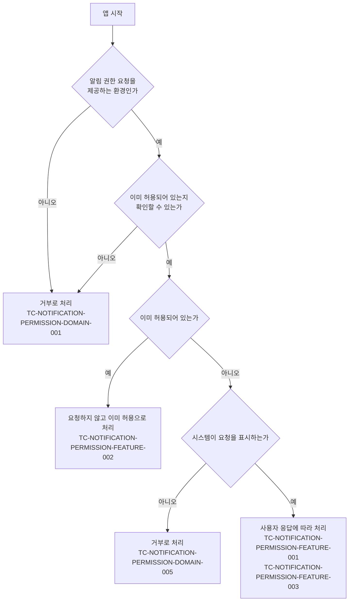

# 알림 권한 요청 테스트 케이스

기준 스펙: [알림 권한 요청 스펙](../spec/client/notification-permission.md)

모든 권한이 공유하는 요청 시점, 요청 기준, 요청 결과는 [권한 요청 공통 스펙](../spec/client/permission.md)이 소유하고, 알림 권한에 적용된 결과를 이 문서가 확인한다.

## feature

### TC-NOTIFICATION-PERMISSION-FEATURE-001: 알림 권한이 허용되어 있지 않으면 앱 시작 시 시스템 알림 권한 요청이 시작된다

- 근거: `feature > 앱 시작 시 알림 권한 요청`
- Given: 알림 권한 요청을 제공하는 환경에서 알림 권한이 허용되어 있지 않고, 앱이 시작될 준비가 되어 있다.
- When: 앱이 시작된다.
- Then: 시스템 알림 권한 요청이 한 번 시작된다.

### TC-NOTIFICATION-PERMISSION-FEATURE-002: 알림 권한이 이미 허용되어 있으면 요청이 시작되지 않는다

- 근거: [권한 요청 공통 스펙의 요청 기준](../spec/client/permission.md#요청-기준)
- Given: 알림 권한이 이미 허용되어 있고, 앱이 시작될 준비가 되어 있다.
- When: 앱이 시작된다.
- Then: 시스템 알림 권한 요청이 시작되지 않는다.

### TC-NOTIFICATION-PERMISSION-FEATURE-003: 요청에 어떻게 응답해도 앱 화면이 유지되고 별도 안내가 표시되지 않는다

- 근거: [권한 요청 공통 스펙의 권한 요청 응답](../spec/client/permission.md#권한-요청-응답)
- Given: 알림 권한이 허용되어 있지 않아 앱 시작으로 시스템 알림 권한 요청이 시작되었고, 요청 응답이 정해져 있다.
- When: 사용자가 알림 권한 요청에 응답한다.
- Then: 앱 화면이 그대로 유지되고 사용자에게 별도 안내가 표시되지 않는다.
- 테스트 데이터:

  | 요청 응답 |
  | --- |
  | 허용 |
  | 거부 |

## domain

스펙이 따르는 [권한 요청 공통 스펙의 요청 기준](../spec/client/permission.md#요청-기준)이 정의한 경로와 각 경로를 덮는 케이스는 다음과 같다.

### TC-NOTIFICATION-PERMISSION-DOMAIN-001: 알림 권한 요청을 제공하지 않는 환경에서는 요청 없이 거부로 처리한다

- 근거: `domain > 요청 제공 범위`
- Given: 테스트 데이터의 알림 권한 요청을 제공하지 않는 환경이다.
- When: 앱이 알림 권한을 요청한다.
- Then: 시스템 알림 권한 요청이 시작되지 않고 거부로 처리된다.
- 테스트 데이터:

  | 환경 |
  | --- |
  | 데스크톱 |
  | 웹 |

- 작성하지 않는 이유: 웹 행은 웹 앱으로 실행해야 결과를 확인할 수 있고, 현재 테스트 환경에는 웹 실행 환경이 없어 그 행만 자동화하지 않는다. 데스크톱 행은 자동화한다. 웹 실행 환경의 테스트가 제공되면 그 행도 자동화한다.

### TC-NOTIFICATION-PERMISSION-DOMAIN-002: 앱이 실행되는 동안에는 요청 조건을 다시 확인하지 않는다

- 근거: `domain > 요청 지점`
- Given: 알림 권한이 허용되어 있지 않아 앱 시작으로 시스템 알림 권한 요청이 한 번 시작되었다.
- When: 앱을 다시 시작하지 않은 채 실행 상태가 바뀐다.
- Then: 시스템 알림 권한 요청이 다시 시작되지 않는다.
- 테스트 데이터:

  | 실행 상태 변화 |
  | --- |
  | 화면 재구성 |
  | 백그라운드로 갔다가 다시 앞으로 돌아옴 |

### TC-NOTIFICATION-PERMISSION-DOMAIN-003: 앱 화면이 처음부터 다시 시작되면 요청 조건을 다시 확인한다

- 근거: `domain > 요청 지점`
- Given: 알림 권한이 허용되어 있지 않고, 앱 화면이 시작되어 시스템 알림 권한 요청이 한 번 시작되었다.
- When: 앱 화면이 재생성되어 처음부터 다시 시작된다.
- Then: 시스템 알림 권한 요청이 다시 한 번 시작된다.

### TC-NOTIFICATION-PERMISSION-DOMAIN-005: 시스템이 더 이상 요청을 표시하지 않으면 거부와 같이 처리한다

- 근거: [권한 요청 공통 스펙의 요청 기준](../spec/client/permission.md#요청-기준)
- Given: 사용자가 이전에 요청을 거부해 시스템이 더 이상 알림 권한 요청을 표시하지 않는 상태다.
- When: 앱이 알림 권한을 요청한다.
- Then: 사용자에게 요청이 표시되지 않고 거부로 처리된다.
- 작성하지 않는 이유: 요청을 더 이상 표시하지 않는 판단은 각 플랫폼의 권한 정책이 소유하며, 현재 테스트 환경은 실제 플랫폼의 권한 상태를 그 상태로 만들 수 없다. 플랫폼의 권한 표시 여부를 제어할 수 있는 테스트 환경이 제공되면 자동화한다.

### TC-NOTIFICATION-PERMISSION-DOMAIN-006: 알림을 화면에 표시하는 권한만 요청한다

- 근거: `domain > 요청 범위`
- Given: 테스트 데이터의 환경에서 알림 권한이 허용되어 있지 않다.
- When: 앱이 알림 권한을 요청한다.
- Then: 테스트 데이터의 알림 권한만 요청한다.
- 테스트 데이터:

  | 환경 | 요청하는 알림 권한 |
  | --- | --- |
  | Android | 방식별로 나누지 않은 하나의 알림 권한 |
  | iOS | 알림을 화면에 표시하는 권한만 요청하고 소리, 배지 권한은 요청하지 않음 |

- 작성하지 않는 이유: iOS 행은 어떤 알림 방식을 요청했는지를 iOS의 시스템 권한 요청에서만 관찰할 수 있고, 현재 테스트 환경은 iOS에서 실행하지 않으므로 그 행만 자동화하지 않는다. Android 행은 자동화한다. iOS의 권한 요청 내용을 관찰할 수 있는 테스트 환경이 제공되면 함께 자동화한다.

### TC-NOTIFICATION-PERMISSION-DOMAIN-007: iOS에서 임시로 허용된 알림 권한은 허용으로 본다

- 근거: `domain > 요청 범위`
- Given: iOS에서 시스템이 사용자에게 묻지 않고 알림을 조용히 받도록 임시로 허용한 상태다.
- When: 앱 화면이 시작되어 알림 권한 요청 조건을 확인한다.
- Then: 허용된 상태로 판정되어 시스템 알림 권한 요청이 시작되지 않는다.
- 작성하지 않는 이유: 임시 허용 상태는 iOS의 알림 권한 상태로만 만들 수 있고, 현재 테스트 환경은 iOS 권한 상태를 만들거나 iOS에서 실행하지 못한다. iOS 알림 권한 상태를 임시 허용으로 제어해 실행할 수 있는 iOS 테스트 환경이 갖춰지면 자동화한다.
