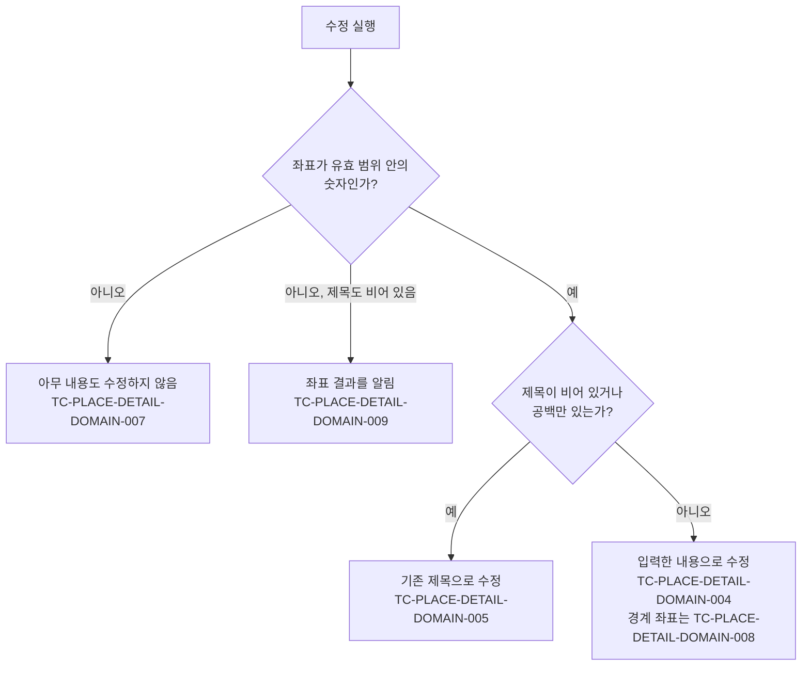

# PlaceDetail 테스트 케이스

기준 스펙: [PlaceDetail 화면 스펙](../spec/place-detail.md)

이 문서에서 `data > 저장 실패`, `data > 태그 연결의 저장`, `data > 태그 입력의 조회` 절은 [항목 상세 화면 공통 스펙](../spec/entity-detail.md)이 소유한다. 나머지 케이스의 절은 기준 스펙이 소유한다.

PlaceHome의 목록이나 지도 핀에서 장소를 선택해 PlaceDetail로 이동하는 케이스는 [PlaceHome 테스트 케이스](./place-home.md)에서 다룬다. 지도 표시, 지도 제공자 전환, 지점 선택과 핀 선택 자체의 케이스는 [DiaryMap 테스트 케이스](./diary-map.md)에서 다룬다. 좌표를 지도에서 고르고 직접 입력한 값이 지도에 반영되는 규칙 자체의 케이스는 [PlaceAdd 테스트 케이스](./place-add.md)에서 다룬다. 설명과 컬러 입력 자체의 케이스는 [설명 입력 테스트 케이스](./description-input.md)와 [DiaryColorInput 테스트 케이스](./diary-color-input.md)에서 다룬다.

태그 입력의 표시와 조작, 태그 선택 목록의 케이스는 [항목 태그 입력 컴포넌트 테스트 케이스](./entity-tag-input.md)에서 다룬다. 이 문서에는 PlaceDetail 화면에서만 다른 표시 기준과 반영 시점의 케이스만 둔다.

## feature

### TC-PLACE-DETAIL-FEATURE-001: 조회 중에는 상세 내용과 동작을 제공하지 않는다

- 근거: `feature > 조회 상태`
- Given: 대상 장소 조회가 아직 완료되지 않은 상태로 PlaceDetail 화면에 진입했다.
- When: 사용자가 화면을 확인한다.
- Then: 제목, 설명, 컬러와 좌표 입력이 표시되지 않고 수정과 외부 지도로 열기와 삭제를 실행할 수 없다.

### TC-PLACE-DETAIL-FEATURE-002: 조회에 성공하면 저장된 내용을 표시한다

- 근거: `feature > 진입과 내용`, `feature > 좌표 수정`
- Given: 제목, 설명, 컬러, 주소와 좌표가 저장된 장소를 조회할 수 있다.
- When: 사용자가 PlaceDetail 화면에 진입한다.
- Then: 저장된 제목, 설명, 컬러, 주소가 입력에 채워지고 위도 입력과 경도 입력에 저장된 좌표가 채워지며, 화면 제목에 저장된 장소 제목이 표시된다.

### TC-PLACE-DETAIL-FEATURE-003: 장소를 조회할 수 없으면 조회 중 상태를 유지한다

- 근거: `feature > 조회 상태`
- Given: 대상 장소 조회가 테스트 데이터의 상태다.
- When: 사용자가 PlaceDetail 화면을 확인한다.
- Then: 조회 중 상태가 유지되고 별도의 오류 안내가 표시되지 않는다.
- 테스트 데이터:

| 조회 상태 |
| --- |
| 조회에 실패함 |
| 대상 식별자의 장소가 없음 |

### TC-PLACE-DETAIL-FEATURE-004: 입력이 저장된 내용과 같으면 수정 동작을 제공하지 않는다

- 근거: `feature > 내용 수정`
- Given: 장소 조회에 성공해 저장된 제목, 설명, 컬러와 좌표가 입력에 채워져 있다.
- When: 사용자가 어떤 입력도 바꾸지 않고 화면을 확인한다.
- Then: 수정 반영 동작이 제공되지 않는다.

### TC-PLACE-DETAIL-FEATURE-005: 입력이 저장된 내용과 다르면 수정 동작을 제공한다

- 근거: `feature > 내용 수정`
- Given: 장소 조회에 성공해 저장된 내용이 입력에 채워져 있다.
- When: 사용자가 테스트 데이터의 입력을 저장된 값과 다르게 바꾼다.
- Then: 수정 반영 동작이 제공된다.
- 테스트 데이터:

| 바꾼 입력 |
| --- |
| 제목 |
| 설명 |
| 컬러 |
| 주소 |
| 위도 |
| 경도 |

### TC-PLACE-DETAIL-FEATURE-006: 수정에 성공하면 화면과 입력 내용을 유지하고 성공 피드백을 제공한다

- 근거: `feature > 내용 수정`
- Given: 장소 수정이 성공하도록 설정되어 있고, 저장된 내용과 다른 제목, 설명, 컬러, 주소와 유효한 좌표가 입력되어 있다.
- When: 사용자가 수정 반영을 실행한다.
- Then: PlaceDetail 화면이 유지되고 입력한 제목, 설명, 컬러, 주소와 좌표가 그대로 표시되며 장소가 수정되었다는 성공 피드백이 제공된다.

### TC-PLACE-DETAIL-FEATURE-007: 수정에 성공하면 화면 제목이 새 제목으로 갱신된다

- 근거: `feature > 내용 수정`
- Given: 장소 수정이 성공하도록 설정되어 있고, 저장된 제목과 다른 공백이 아닌 제목이 입력되어 있다.
- When: 사용자가 수정 반영을 실행한다.
- Then: 화면 제목이 새로 저장된 제목으로 갱신된다.

### TC-PLACE-DETAIL-FEATURE-008: 수정을 처리하는 동안 진행 상태를 표시한다

- 근거: `feature > 내용 수정`
- Given: 장소 수정 처리가 완료되지 않고 진행 중인 상태로 설정되어 있고, 저장된 내용과 다른 내용이 입력되어 있다.
- When: 사용자가 수정 반영을 실행한 뒤 화면을 확인한다.
- Then: 수정 처리가 끝날 때까지 진행 상태가 표시된다.

### TC-PLACE-DETAIL-FEATURE-009: 제목을 비운 채 수정하면 기존 제목이 유지된다

- 근거: `feature > 내용 수정`
- Given: 장소 수정이 성공하도록 설정되어 있고, 제목이 테스트 데이터의 상태이며 설명, 컬러와 주소를 저장된 값과 다르게 바꾸고 좌표는 유효하다.
- When: 사용자가 수정 반영을 실행한다.
- Then: 저장된 기존 제목이 그대로 유지되고 설명, 컬러, 주소와 좌표만 반영되며 화면 제목도 기존 제목으로 남는다.
- 테스트 데이터:

| 제목 상태 |
| --- |
| 비어 있음 |
| 공백 문자만 입력됨 |

### TC-PLACE-DETAIL-FEATURE-010: 좌표가 성립하지 않으면 좌표 오류 피드백을 제공한다

- 근거: `feature > 좌표 오류`
- Given: 장소 조회에 성공해 저장된 내용이 입력되어 있고, 위도와 경도가 테스트 데이터의 상태다.
- When: 사용자가 수정 반영을 실행한다.
- Then: 장소가 수정되지 않고 위도와 경도의 유효 범위를 알리는 같은 피드백이 제공된다.
- 테스트 데이터:

| 위도 | 경도 |
| --- | --- |
| 비어 있음 | 비어 있음 |
| `37.5` | 비어 있음 |
| 비어 있음 | `127.0` |
| `abc` | `127.0` |
| `37.5` | `--1` |
| `90.1` | `127.0` |
| `37.5` | `180.1` |

### TC-PLACE-DETAIL-FEATURE-011: 좌표가 성립하지 않아도 수정 중인 내용을 유지한다

- 근거: `feature > 좌표 오류`
- Given: 장소 조회에 성공한 뒤 제목, 설명과 주소를 바꾸고 컬러를 골랐으며, 위도가 테스트 데이터의 값이다.
- When: 사용자가 수정 반영을 실행한다.
- Then: 장소가 수정되지 않고 제목, 설명, 주소, 위도, 경도와 컬러가 지워지거나 바뀌지 않는다.
- 테스트 데이터:

| 위도 |
| --- |
| `abc` |
| `90.1` |

### TC-PLACE-DETAIL-FEATURE-012: 삭제에 성공하면 진입하기 전 화면으로 돌아간다

- 근거: `feature > 삭제`
- Given: 장소 삭제가 성공하도록 설정되어 있고 PlaceDetail 화면이 표시되어 있다.
- When: 사용자가 삭제를 실행한다.
- Then: PlaceDetail 화면에서 빠져나가 진입하기 전 화면으로 돌아간다.

### TC-PLACE-DETAIL-FEATURE-013: 삭제를 처리하는 동안 진행 상태를 표시한다

- 근거: `feature > 삭제`
- Given: 장소 삭제 처리가 완료되지 않고 진행 중인 상태로 설정되어 있다.
- When: 사용자가 삭제를 실행한 뒤 화면을 확인한다.
- Then: 삭제 처리가 끝날 때까지 진행 상태가 표시되고 화면에서 빠져나가지 않는다.

### TC-PLACE-DETAIL-FEATURE-014: 저장된 내용이 다른 경로에서 바뀌면 화면 제목만 갱신한다

- 근거: `feature > 외부 변경`
- Given: 장소 조회에 성공한 뒤 사용자가 제목, 설명, 주소와 좌표를 수정 중이다.
- When: 같은 장소의 저장된 제목과 설명이 다른 경로에서 바뀐다.
- Then: 화면 제목은 새로 저장된 제목으로 갱신되고, 수정 중인 제목, 설명, 컬러, 주소와 좌표는 바뀌지 않는다.

### TC-PLACE-DETAIL-FEATURE-015: 화면이 재생성되어도 수정 중인 내용을 유지한다

- 근거: `feature > 진행 상태 유지`
- Given: PlaceDetail 화면에서 제목, 설명, 주소, 위도, 경도를 바꾸고 컬러를 골랐다.
- When: 시스템이 화면을 재생성한다.
- Then: 재생성 전의 제목, 설명, 주소, 위도, 경도와 선택한 컬러가 그대로 표시된다.

### TC-PLACE-DETAIL-FEATURE-016: 화면을 떠난 뒤 다시 들어오면 저장된 내용으로 시작한다

- 근거: `feature > 진행 상태 유지`
- Given: PlaceDetail 화면에서 제목, 주소와 좌표를 바꾸고 반영하지 않은 채 화면을 떠났다.
- When: 사용자가 같은 장소의 PlaceDetail 화면에 다시 들어온다.
- Then: 떠날 때 수정 중이던 내용은 표시되지 않고 저장된 제목, 설명, 컬러, 주소와 좌표가 표시된다.

### TC-PLACE-DETAIL-FEATURE-017: 뒤로가면 수정 내용을 반영하지 않고 이전 화면으로 돌아간다

- 근거: `feature > 뒤로가기`
- Given: PlaceDetail 화면에서 제목과 설명을 바꾸고 수정 반영을 실행하지 않았다.
- When: 사용자가 뒤로간다.
- Then: 진입하기 전 화면으로 돌아가고 바꾼 내용이 저장되지 않는다.

### TC-PLACE-DETAIL-FEATURE-018: 지도가 표시되지 않아도 좌표를 직접 입력해 수정한다

- 근거: `feature > 좌표 수정`, `domain > 초기 지도 위치`
- Given: 장소 수정이 성공하도록 설정되어 있고, 기본 지도를 확인하지 못해 지도가 표시되지 않는 PlaceDetail 화면이 표시되어 있다.
- When: 사용자가 위도와 경도를 유효 범위 안의 다른 값으로 바꾸고 수정 반영을 실행한다.
- Then: 장소가 수정되고 성공 피드백이 제공된다.

### TC-PLACE-DETAIL-FEATURE-019: 대상 장소를 조회하기 전에는 지도를 표시하지 않는다

- 근거: `domain > 초기 지도 위치`
- Given: 기본 지도는 확인되었으나 대상 장소 조회가 테스트 데이터의 상태다.
- When: 사용자가 PlaceDetail 화면을 확인한다.
- Then: 지도가 표시되지 않고 별도의 로딩 안내나 오류 안내도 표시되지 않는다.
- 테스트 데이터:

| 조회 상태 |
| --- |
| 아직 완료되지 않음 |
| 조회에 실패함 |

### TC-PLACE-DETAIL-FEATURE-020: 기본 지도를 확인하지 못하면 지도를 표시하지 않는다

- 근거: `domain > PlaceDetail의 지도`, `domain > 초기 지도 위치`
- Given: 대상 장소는 조회되었으나 사용자가 고른 기본 지도를 아직 확인하지 못했거나 읽지 못했다.
- When: 사용자가 PlaceDetail 화면을 확인한다.
- Then: 지도가 표시되지 않고 별도의 로딩 안내나 오류 안내도 표시되지 않으며, 좌표 입력과 수정·삭제 동작은 사용할 수 있다.

### TC-PLACE-DETAIL-FEATURE-021: 화면이 재생성되어도 보고 있던 지도와 지점 표시를 유지한다

- 근거: `feature > 진행 상태 유지`
- Given: PlaceDetail 화면에서 사용자가 지도를 다른 위치로 옮기고 지도 제공자를 초기 제공자가 아닌 제공자로 바꿨으며, 좌표를 유효 범위 안의 다른 값으로 바꿨다.
- When: 시스템이 화면을 재생성한다.
- Then: 재생성 전의 위도와 경도, 지점 표시, 보고 있던 지도 위치와 확대 수준, 선택한 지도 제공자가 그대로 유지된다.
- 작성하지 않는 이유: 현재 호스트 테스트 환경은 지도 제공자의 실제 표시 요소와 지도 조작 입력을 제공하지 않아 지도가 붙은 PlaceDetail 화면을 결정적으로 구성할 수 없다. 지도 표시와 지도 입력을 대체할 수 있는 테스트 환경이 제공되면 자동화한다.

### TC-PLACE-DETAIL-FEATURE-022: 지도가 시작된 뒤 저장된 좌표가 바뀌어도 지도를 옮기지 않는다

- 근거: `domain > 초기 지도 위치`
- Given: 대상 장소의 저장된 좌표에서 지도가 시작되어 표시되어 있다.
- When: 같은 장소의 저장된 좌표가 다른 경로에서 바뀐다.
- Then: 지도를 새 좌표로 옮기도록 지정하지 않고 보고 있던 위치와 확대 수준이 유지된다.
- 작성하지 않는 이유: 현재 호스트 테스트 환경은 지도 제공자의 실제 표시 요소를 제공하지 않아 지도가 붙은 PlaceDetail 화면을 결정적으로 구성할 수 없다. 지도 표시를 대체할 수 있는 테스트 환경이 제공되면 자동화한다.

### TC-PLACE-DETAIL-FEATURE-023: 대상 장소가 삭제 상태로 바뀌어도 내용 표시 상태를 유지한다

- 근거: `feature > 외부 변경`, `domain > 상세 대상과 내용 표시`
- Given: PlaceDetail 화면이 내용 표시 상태이고 사용자가 제목, 설명, 컬러, 주소와 좌표를 바꿨다.
- When: 대상 장소가 다른 경로에서 삭제 상태로 바뀐다.
- Then: 화면은 내용 표시 상태를 유지하고 조회 중 상태로 돌아가지 않으며, 입력 중이던 제목, 설명, 컬러, 주소와 좌표가 그대로 남고 수정 반영과 삭제를 실행할 수 있다.

### TC-PLACE-DETAIL-FEATURE-024: 검색에서 고른 장소의 좌표가 위도와 경도에 채워진다

- 근거: `feature > 장소 검색으로 채우기`
- Given: 내용 표시 상태의 PlaceDetail 화면에서 장소 검색으로 찾은 장소 목록이 표시되어 있다.
- When: 사용자가 목록의 장소 하나를 선택한다.
- Then: 위도 입력과 경도 입력이 그 장소의 좌표로 채워지고, 저장된 좌표는 아직 바뀌지 않는다.

### TC-PLACE-DETAIL-FEATURE-025: 저장된 제목이 채워져 있으면 고른 장소의 이름이 제목을 덮어쓰지 않는다

- 근거: `feature > 장소 검색으로 채우기`
- Given: 저장된 제목이 채워진 PlaceDetail 화면에서 장소 검색으로 찾은 장소 목록이 표시되어 있다.
- When: 사용자가 목록의 장소 하나를 선택한다.
- Then: 제목 입력이 선택 전과 같게 유지된다.

### TC-PLACE-DETAIL-FEATURE-026: 제목을 비운 뒤 검색하면 고른 장소의 이름이 제목에 채워진다

- 근거: `feature > 장소 검색으로 채우기`
- Given: PlaceDetail 화면에서 사용자가 제목을 모두 지운 상태로 장소 검색으로 찾은 장소 목록이 표시되어 있다.
- When: 사용자가 목록의 장소 하나를 선택한다.
- Then: 제목 입력이 고른 장소의 이름으로 채워진다.

### TC-PLACE-DETAIL-FEATURE-027: 검색에서 고른 장소의 주소가 주소 입력을 덮어쓴다

- 근거: `feature > 장소 검색으로 채우기`
- Given: 저장된 주소가 주소 입력에 채워진 PlaceDetail 화면에서 장소 검색으로 찾은 장소 목록이 표시되어 있다.
- When: 사용자가 목록에서 주소가 테스트 데이터와 같은 장소 하나를 선택한다.
- Then: 주소 입력이 테스트 데이터의 기대 값으로 바뀌고, 저장된 주소는 아직 바뀌지 않는다.
- 테스트 데이터:

| 고른 장소의 주소 | 선택 후 주소 입력 |
| --- | --- |
| 주소 있음 | 고른 장소의 주소 |
| 주소 없음 | 비어 있음 |

### TC-PLACE-DETAIL-FEATURE-028: 수정을 처리하는 동안 보고 있던 화면 위치를 유지한다

- 근거: `feature > 진행 상태 유지`
- Given: 내용 표시 상태의 PlaceDetail 화면에서 사용자가 입력을 아래쪽까지 스크롤해 보고 있는 화면 위치를 옮겼다.
- When: 사용자가 수정 반영을 실행해 처리가 시작되고 끝난다.
- Then: 보고 있던 화면 위치가 처음으로 돌아가지 않고 그대로 유지된다.

### TC-PLACE-DETAIL-FEATURE-029: 저장된 내용이 갱신되어도 보고 있던 화면 위치를 유지한다

- 근거: `feature > 진행 상태 유지`, `feature > 외부 변경`
- Given: 내용 표시 상태의 PlaceDetail 화면에서 사용자가 입력을 아래쪽까지 스크롤해 보고 있는 화면 위치를 옮겼다.
- When: 같은 장소의 저장된 제목이 다른 경로에서 바뀐다.
- Then: 보고 있던 화면 위치가 처음으로 돌아가지 않고 그대로 유지된다.

### TC-PLACE-DETAIL-FEATURE-030: 화면에 진입해도 어느 입력에도 초점을 두지 않는다

- 근거: `feature > 진입과 내용`
- Given: 사용자가 장소를 선택했다.
- When: PlaceDetail 화면이 내용 표시 상태가 된다.
- Then: 제목, 설명, 주소, 위도, 경도 어느 입력에도 초점이 없다.

### TC-PLACE-DETAIL-FEATURE-031: 좌표 오류로 수정해도 초점을 옮기지 않는다

- 근거: `feature > 좌표 오류`
- Given: 내용 표시 상태의 PlaceDetail 화면에서 좌표를 성립하지 않게 고치고 주소 입력에 초점이 있다.
- When: 사용자가 수정을 실행한다.
- Then: 입력 초점이 주소 입력에 그대로 있다.

### TC-PLACE-DETAIL-FEATURE-032: 외부 지도로 열기를 실행하면 입력된 좌표가 앱 밖의 지도에서 열린다

- 근거: `feature > 외부 지도로 열기`, `domain > 외부로 여는 지도`
- Given: 장소 조회에 성공해 유효 범위 안의 좌표가 입력되어 있다.
- When: 사용자가 외부 지도로 열기를 실행한다.
- Then: 선택된 제공자의 지도에서 입력된 좌표를 가리키는 위치가 앱 밖에서 여는 방법으로 한 번 열린다.

### TC-PLACE-DETAIL-FEATURE-033: 좌표가 성립하지 않으면 지도를 열지 않고 좌표를 알린다

- 근거: `feature > 외부 지도로 열기`
- Given: 장소 조회에 성공했고 위도와 경도가 테스트 데이터의 상태다.
- When: 사용자가 외부 지도로 열기를 실행한다.
- Then: 앱 밖에서 아무것도 열리지 않고 위도와 경도의 유효 범위를 알리는 피드백이 제공된다.
- 테스트 데이터:

| 위도 | 경도 |
| --- | --- |
| 비어 있음 | 비어 있음 |
| `abc` | `127.0` |
| `90.1` | `127.0` |
| `37.5` | `180.1` |

### TC-PLACE-DETAIL-FEATURE-034: 외부 지도로 열어도 입력 중인 내용과 화면을 유지하고 장소를 수정하지 않는다

- 근거: `feature > 외부 지도로 열기`
- Given: 장소 조회에 성공한 뒤 제목, 설명, 주소와 좌표를 저장된 값과 다르게 바꿨다.
- When: 사용자가 외부 지도로 열기를 실행한다.
- Then: 화면이 내용 표시 상태를 유지하고 바꾼 제목, 설명, 주소와 좌표가 그대로 남으며 장소 수정이 실행되지 않는다.

### TC-PLACE-DETAIL-FEATURE-035: 지도 앱과 웹 지도를 모두 열지 못해도 화면을 유지하고 알리지 않는다

- 근거: `feature > 외부 지도로 열기`, `domain > 여는 수단`
- Given: 앱 밖에서 여는 방법이 어느 위치에 대해서도 실패하도록 설정되어 있고 장소 조회에 성공해 유효 범위 안의 좌표가 입력되어 있다.
- When: 사용자가 외부 지도로 열기를 실행한다.
- Then: 화면이 내용 표시 상태를 유지하고 입력된 내용이 그대로 남으며 오류 안내가 표시되지 않는다.

### TC-PLACE-DETAIL-FEATURE-042: 지도 앱을 열지 못하면 같은 위치를 웹 지도로 연다

- 근거: `domain > 여는 수단`
- Given: 지도 앱을 여는 실행 환경이고, 앱 밖에서 여는 방법이 지도 앱 위치에 대해서만 실패하도록 설정되어 있으며, 장소 조회에 성공해 유효 범위 안의 좌표가 입력되어 있다.
- When: 사용자가 외부 지도로 열기를 실행한다.
- Then: 선택된 제공자의 지도 앱 위치를 먼저 열려고 시도한 뒤 같은 제공자의 웹 지도 위치가 한 번 열리고, 화면은 내용 표시 상태를 유지하며 오류 안내가 표시되지 않는다.

### TC-PLACE-DETAIL-FEATURE-036: 지도가 표시되지 않아도 외부 지도로 열기를 제공한다

- 근거: `domain > 외부로 여는 지도`
- Given: 대상 장소는 조회되었으나 기본 지도를 확인하지 못해 지도가 표시되지 않는다.
- When: 사용자가 외부 지도로 열기를 실행한다.
- Then: 기본 제공자의 지도에서 입력된 좌표를 가리키는 위치가 앱 밖에서 여는 방법으로 한 번 열린다.

### TC-PLACE-DETAIL-FEATURE-037: 조회 중에는 태그 연결과 해제를 실행할 수 없다

- 근거: `feature > 조회 상태`
- Given: 대상 장소 조회가 완료되지 않아 조회 중 상태다.
- When: 사용자가 화면에서 실행할 수 있는 동작을 확인한다.
- Then: 태그 입력이 표시되지 않아 태그 연결과 해제를 실행할 수 없다.

### TC-PLACE-DETAIL-FEATURE-038: 태그를 연결하거나 해제하면 저장된 연결로 즉시 반영된다

- 근거: `feature > 태그 입력`
- Given: 대상 장소가 조회되어 있고 계정과 연결된 태그가 여러 개 저장되어 있다.
- When: 사용자가 태그 선택 목록에서 태그 하나를 연결한 뒤 다른 태그의 연결을 해제한다.
- Then: 각 조작마다 별도의 반영 동작 없이 그 장소의 저장된 연결이 바뀐다.

### TC-PLACE-DETAIL-FEATURE-039: 태그를 연결하거나 해제해도 수정 동작의 제공 여부는 바뀌지 않는다

- 근거: `feature > 태그 입력`, `domain > 수정 동작의 제공 기준`
- Given: 대상 장소가 조회되어 있고 입력 내용이 저장 내용과 같아 수정 동작이 제공되지 않는다.
- When: 사용자가 태그를 연결하거나 이미 연결된 태그를 해제한다.
- Then: 수정 동작이 제공되지 않는 상태가 그대로 유지된다.

### TC-PLACE-DETAIL-FEATURE-040: 태그를 연결하거나 해제해도 지도와 지점 표시는 바뀌지 않는다

- 근거: `feature > 태그 입력`
- Given: 대상 장소가 조회되어 지도가 저장된 좌표를 가운데에 두고 지점 표시가 놓여 있다.
- When: 사용자가 태그를 연결하거나 이미 연결된 태그를 해제한다.
- Then: 지도가 보고 있는 위치와 지점 표시가 그대로 유지된다.
- 작성하지 않는 이유: 지도와 지점 표시는 플랫폼 지도 SDK가 그리므로 현재 테스트 환경에서는 지도를 표시할 수 없고 보고 있는 위치도 읽을 수 없다. 지도를 표시할 수 있는 테스트 환경이 마련되면 작성한다.

### TC-PLACE-DETAIL-FEATURE-041: 연결한 태그를 누르면 그 태그의 상세로 이동한다

- 근거: `feature > 태그 입력`
- Given: 대상 장소에 태그 하나가 연결되어 태그 입력에 표시되어 있다.
- When: 사용자가 그 태그를 누른다.
- Then: 그 태그의 TagDetail 화면 이동이 한 번 요청된다.

### TC-PLACE-DETAIL-FEATURE-043: 화면에 처음 진입하면 장소 디테일 탭이 선택된다

- 근거: `feature > 탭 전환`
- Given: 장소가 저장되어 있다.
- When: 사용자가 그 장소의 PlaceDetail 화면에 진입한다.
- Then: 장소 디테일 탭이 선택되어 있고 지도 영역과 제목·설명·컬러·주소·좌표 입력, 태그 입력이 표시된다.

### TC-PLACE-DETAIL-FEATURE-044: 탭을 선택하면 그 탭의 내용을 표시한다

- 근거: `feature > 탭 전환`
- Given: 장소가 조회된 PlaceDetail 화면에서 테스트 데이터의 현재 탭이 선택되어 있다.
- When: 사용자가 테스트 데이터의 다른 탭을 선택한다.
- Then: 선택한 탭이 선택 상태가 되고 그 탭의 내용이 표시된다.
- 테스트 데이터:

| 현재 탭 | 선택한 탭 | 기대 내용 |
| --- | --- | --- |
| 장소 디테일 | 메모 | 대상 장소에 연결된 메모 목록 |
| 메모 | 장소 디테일 | 지도 영역과 제목·설명·컬러·주소·좌표 입력, 태그 입력 |

### TC-PLACE-DETAIL-FEATURE-045: 본문을 좌우로 밀어도 탭이 전환되지 않는다

- 근거: `feature > 탭 전환`
- Given: 장소가 조회된 PlaceDetail 화면에서 테스트 데이터의 현재 탭이 선택되어 있다.
- When: 사용자가 본문을 테스트 데이터의 방향으로 민다.
- Then: 현재 탭이 그대로 선택되어 있고 표시하는 내용도 바뀌지 않는다.
- 테스트 데이터:

| 현재 탭 | 미는 방향 |
| --- | --- |
| 장소 디테일 | 왼쪽 |
| 메모 | 오른쪽 |

### TC-PLACE-DETAIL-FEATURE-046: 조회 중에도 탭을 전환할 수 있다

- 근거: `feature > 탭 전환`, `feature > 조회 상태`
- Given: 상세 대상 장소를 조회할 수 없어 조회 중 상태가 유지되고 있다.
- When: 사용자가 메모 탭을 선택한다.
- Then: 메모 탭이 선택되고 메모 탭의 내용이 표시된다.

### TC-PLACE-DETAIL-FEATURE-047: 탭을 전환해도 수정 중이던 내용이 유지된다

- 근거: `feature > 탭 전환`
- Given: 장소 디테일 탭에서 제목, 설명, 컬러, 주소와 좌표를 저장된 내용과 다르게 수정했다.
- When: 사용자가 메모 탭으로 전환한 뒤 다시 장소 디테일 탭으로 돌아온다.
- Then: 수정 중이던 내용이 그대로 남아 있다.

### TC-PLACE-DETAIL-FEATURE-048: 수정 반영 동작은 장소 디테일 탭에서만 제공된다

- 근거: `feature > 내용 수정`, `domain > 수정 동작의 제공 기준`
- Given: 입력 내용이 저장된 내용과 달라 수정 반영 동작이 제공되고 있다.
- When: 사용자가 메모 탭으로 전환한다.
- Then: 수정 반영 동작이 제공되지 않고, 장소 디테일 탭으로 돌아오면 다시 제공된다.

### TC-PLACE-DETAIL-FEATURE-049: 외부 지도로 열기, 장소 검색과 삭제는 선택한 탭과 관계없이 제공된다

- 근거: `feature > 탭 전환`
- Given: 장소가 조회된 PlaceDetail 화면에서 테스트 데이터의 탭이 선택되어 있다.
- When: 사용자가 화면에서 실행할 수 있는 동작을 확인한다.
- Then: 외부 지도로 열기, 장소 검색과 삭제를 실행할 수 있다.
- 테스트 데이터:

| 선택한 탭 |
| --- |
| 장소 디테일 |
| 메모 |

### TC-PLACE-DETAIL-FEATURE-050: 메모 탭에서 검색 결과를 골라도 입력에 반영되고 탭은 바뀌지 않는다

- 근거: `feature > 탭 전환`, `feature > 장소 검색으로 채우기`
- Given: 장소가 조회된 PlaceDetail 화면에서 메모 탭이 선택되어 있고 검색 결과가 표시되어 있다.
- When: 사용자가 검색 결과 하나를 고른다.
- Then: 제목, 주소와 좌표 입력에 고른 장소의 값이 반영되고 메모 탭이 그대로 선택되어 있다.

### TC-PLACE-DETAIL-FEATURE-051: 화면 재생성 후에도 선택한 탭이 유지된다

- 근거: `feature > 진행 상태 유지`, `domain > 선택한 탭`
- Given: 같은 장소의 PlaceDetail 화면에서 메모 탭을 선택했다.
- When: 화면이 재생성된다.
- Then: 메모 탭이 선택된 상태가 유지된다.

### TC-PLACE-DETAIL-FEATURE-052: 메모 탭에서 뒤로가도 진입하기 전 화면으로 돌아간다

- 근거: `feature > 뒤로가기`
- Given: PlaceDetail 화면에서 메모 탭을 선택했다.
- When: 사용자가 뒤로간다.
- Then: 장소 디테일 탭으로 먼저 돌아가지 않고 PlaceDetail 화면에 진입하기 전 화면이 표시된다.

### TC-PLACE-DETAIL-FEATURE-053: 조회 중에도 탭 행과 메모 탭이 표시된다

- 근거: `feature > 조회 상태`
- Given: 상세 대상 장소를 조회할 수 없어 조회 중 상태가 유지되고 있다.
- When: 사용자가 PlaceDetail 화면을 확인한다.
- Then: 장소 디테일 탭에는 조회 중 표시가 있고 탭 행은 그대로 표시되어 메모 탭을 선택할 수 있다.

## domain

### TC-PLACE-DETAIL-DOMAIN-001: 현재 계정과 연결된 장소만 상세 대상으로 다룬다

- 근거: `domain > 상세 대상과 내용 표시`
- Given: 대상 식별자의 장소가 테스트 데이터의 상태다.
- When: PlaceDetail 화면이 대상 장소를 조회한다.
- Then: 현재 계정과 연결된 미삭제 장소만 조회되고, 나머지 경우에는 조회할 수 없는 것으로 다룬다.
- 테스트 데이터:

| 장소 상태 |
| --- |
| 현재 계정과 연결되어 있고 삭제되지 않음 |
| 다른 계정과만 연결되어 있음 |
| 현재 계정과 연결되어 있으나 삭제됨 |

### TC-PLACE-DETAIL-DOMAIN-002: 현재 계정을 확인할 수 없으면 장소를 조회할 수 없다

- 근거: `domain > 상세 대상과 내용 표시`
- Given: 대상 식별자의 장소가 저장되어 있으나 현재 계정을 확인할 수 없다.
- When: PlaceDetail 화면이 대상 장소를 조회한다.
- Then: 조회할 수 없는 것으로 다뤄 내용 표시 상태로 바뀌지 않는다.

### TC-PLACE-DETAIL-DOMAIN-003: 입력 내용은 처음 조회한 값으로 한 번만 채운다

- 근거: `domain > 상세 대상과 내용 표시`
- Given: 대상 장소를 조회해 입력 내용이 채워져 있다.
- When: 같은 장소의 저장된 제목, 설명, 컬러, 주소와 좌표가 다른 경로에서 바뀐다.
- Then: 입력 내용은 처음 조회한 값에서 다시 채워지지 않는다.

수정 판정의 각 경로는 다음 케이스가 나누어 덮는다.

### TC-PLACE-DETAIL-DOMAIN-004: 수정은 제목, 설명, 컬러, 주소, 좌표와 수정 시각만 바꾼다

- 근거: `domain > 수정되는 내용`
- Given: 미삭제 상태로 저장된 장소가 있고 새 제목, 설명, 컬러, 주소와 유효한 좌표가 입력되어 있다.
- When: 사용자가 수정 반영을 실행한다.
- Then: 제목, 설명, 컬러, 주소, 좌표가 입력한 값으로 바뀌고 수정 시각이 수정 시점으로 기록되며, 삭제 여부, 생성 시각과 계정 연결은 바뀌지 않는다.

### TC-PLACE-DETAIL-DOMAIN-005: 제목이 비어 있으면 기존 제목으로 수정한다

- 근거: `domain > 수정되는 내용`
- Given: 제목이 저장된 장소가 있고 유효한 좌표가 입력되어 있다.
- When: 제목이 테스트 데이터인 상태로 수정 반영을 실행한다.
- Then: 저장된 기존 제목이 그대로 유지된 채 수정이 성립한다.
- 테스트 데이터:

| 제목 |
| --- |
| 빈 문자열 |
| 공백 문자로만 이루어진 값 |

### TC-PLACE-DETAIL-DOMAIN-006: 설명과 주소가 비어 있으면 빈 값으로 수정한다

- 근거: `domain > 수정되는 내용`
- Given: 설명과 주소가 저장된 장소가 있고 공백이 아닌 제목과 유효한 좌표가 입력되어 있다.
- When: 설명과 주소가 빈 문자열인 상태로 수정 반영을 실행한다.
- Then: 수정이 성립하고 저장된 설명과 주소가 각각 빈 설명과 빈 주소로 바뀐다.

### TC-PLACE-DETAIL-DOMAIN-007: 좌표가 유효 범위 안의 숫자가 아니면 아무 내용도 수정하지 않는다

- 근거: `domain > 수정되는 내용`
- Given: 저장된 장소가 있고 저장된 값과 다른 제목, 설명, 컬러, 주소가 입력되어 있다.
- When: 위도와 경도가 테스트 데이터인 좌표로 수정 반영을 실행한다.
- Then: 수정이 성립하지 않아 제목, 설명, 컬러, 주소와 좌표가 모두 저장된 값으로 남고, 모든 경우가 같은 결과로 전달된다.
- 테스트 데이터:

| 위도 | 경도 |
| --- | --- |
| 숫자가 아닌 값 | 숫자가 아닌 값 |
| 숫자가 아닌 값 | `127.0` |
| `37.5` | 숫자가 아닌 값 |
| 무한대 | `127.0` |
| `90.000001` | `127.0` |
| `-90.000001` | `127.0` |
| `37.5` | `180.000001` |
| `37.5` | `-180.000001` |

### TC-PLACE-DETAIL-DOMAIN-008: 유효 범위의 경계 좌표로는 수정한다

- 근거: `domain > 수정되는 내용`
- Given: 저장된 장소가 있고 공백이 아닌 제목이 입력되어 있다.
- When: 위도와 경도가 테스트 데이터인 좌표로 수정 반영을 실행한다.
- Then: 수정이 성립하고 저장된 좌표가 그 값으로 바뀐다.
- 테스트 데이터:

| 위도 | 경도 |
| --- | --- |
| `90` | `180` |
| `-90` | `-180` |
| `0` | `0` |

### TC-PLACE-DETAIL-DOMAIN-009: 제목을 비운 상태와 좌표 오류가 함께 있으면 좌표 결과를 알린다

- 근거: `domain > 수정되는 내용`
- Given: 저장된 장소가 있다.
- When: 제목이 비어 있고 좌표도 유효 범위를 벗어난 상태로 수정 반영을 실행한다.
- Then: 좌표가 성립하지 않는다는 결과가 알려지고 아무 내용도 수정되지 않는다.

### TC-PLACE-DETAIL-DOMAIN-010: 삭제는 삭제 여부와 수정 시각만 바꾼다

- 근거: `domain > 삭제`
- Given: 미삭제 상태로 저장된 장소가 있다.
- When: 사용자가 삭제를 실행한다.
- Then: 삭제 여부가 삭제로 바뀌고 수정 시각이 삭제 시점으로 갱신되며, 제목, 설명, 컬러, 좌표, 주소와 생성 시각은 바뀌지 않는다.

### TC-PLACE-DETAIL-DOMAIN-011: 수정과 삭제는 종류별로 요청을 제한한다

- 근거: `domain > 요청 제한`
- Given: 앞선 동작이 아직 처리 중이고 수정에 필요한 내용이 입력되어 있다.
- When: 같은 종류의 요청과 다른 종류의 요청이 각각 한 번 더 전달된다.
- Then: 같은 종류의 요청은 처리되지 않고 다른 종류의 요청은 처리된다.
- 테스트 데이터:

| 처리 중인 동작 | 추가로 전달된 요청 | 기대 |
| --- | --- | --- |
| 수정 | 수정 | 처리하지 않음 |
| 수정 | 삭제 | 처리함 |
| 삭제 | 삭제 | 처리하지 않음 |
| 삭제 | 수정 | 처리함 |

### TC-PLACE-DETAIL-DOMAIN-012: 저장된 기본 지도를 초기 지도 제공자로 지정한다

- 근거: `domain > PlaceDetail의 지도`
- Given: 대상 장소가 조회되었고 기본 지도가 테스트 데이터의 지도로 저장되어 있다.
- When: 사용자가 PlaceDetail 화면에 진입한다.
- Then: 지도의 초기 제공자가 저장된 기본 지도로 지정된다.
- 테스트 데이터:

| 저장된 기본 지도 |
| --- |
| 네이버 지도 |
| Google 지도 |

### TC-PLACE-DETAIL-DOMAIN-013: 대상 장소의 저장된 좌표를 초기 지도 위치로 지정한다

- 근거: `domain > 초기 지도 위치`
- Given: 기본 지도가 확인되었고 대상 장소의 저장된 좌표가 테스트 데이터의 값이다.
- When: 사용자가 PlaceDetail 화면에 진입한다.
- Then: 지도의 초기 위치가 대상 장소의 저장된 위도와 경도로 지정되고 그 자리에 지점이 지정된다.
- 테스트 데이터:

| 저장된 위도 | 저장된 경도 |
| --- | --- |
| 서울 도심의 위도 | 서울 도심의 경도 |
| 남반구 도시의 위도 | 서반구 도시의 경도 |

### TC-PLACE-DETAIL-DOMAIN-014: 현재 위치를 따로 확인하지 않는다

- 근거: `domain > 초기 지도 위치`
- Given: 기본 지도가 확인되었고 대상 장소를 조회할 수 있다.
- When: 사용자가 PlaceDetail 화면에 진입한다.
- Then: 현재 위치 확인이 시작되지 않는다.
- 작성하지 않는 이유: 현재 위치 확인이 시작되지 않는다는 것은 어떤 관찰 대상도 만들지 않아 결정적으로 판정할 수 없다. 현재 위치 확인 발생 여부를 관찰할 수 있는 테스트 환경이 제공되면 자동화한다.

### TC-PLACE-DETAIL-DOMAIN-015: 기본 지도가 바뀌면 수정 중인 내용을 유지한 채 지도를 새로 시작한다

- 근거: `domain > PlaceDetail의 지도`
- Given: PlaceDetail 화면이 표시되어 있고 사용자가 제목, 설명, 컬러와 좌표를 바꿨다.
- When: 저장된 기본 지도가 다른 지도로 바뀐다.
- Then: 초기 지도 제공자가 바뀐 기본 지도로 지정되고, 수정 중인 제목, 설명, 컬러와 좌표는 그대로 유지된다.

### TC-PLACE-DETAIL-DOMAIN-020: 삭제 여부와 관계없이 상세 대상으로 조회한다

- 근거: `domain > 상세 대상과 내용 표시`, `data > 대상 장소 조회`
- Given: 대상 장소의 삭제 여부가 테스트 데이터와 같다.
- When: 그 장소로 PlaceDetail 화면에 진입해 처음 조회한다.
- Then: 두 경우 모두 그 장소가 조회되어 내용 표시 상태가 된다.
- 테스트 데이터:

| 진입 시점의 삭제 여부 |
| --- |
| 미삭제 |
| 삭제 |

### TC-PLACE-DETAIL-DOMAIN-017: 삭제 상태가 된 장소를 수정해도 삭제 상태로 남는다

- 근거: `domain > 상세 대상과 내용 표시`, `domain > 수정되는 내용`
- Given: 내용 표시 상태의 PlaceDetail 화면에서 대상 장소가 다른 경로에서 삭제 상태로 바뀌었다.
- When: 사용자가 제목, 설명, 컬러, 주소와 좌표를 바꿔 수정 반영을 실행한다.
- Then: 바꾼 제목, 설명, 컬러, 주소와 좌표가 저장되고 그 장소의 삭제 여부는 삭제 상태로 유지된다.

### TC-PLACE-DETAIL-DOMAIN-019: 삭제는 저장된 주소를 바꾸지 않는다

- 근거: `domain > 삭제`
- Given: 주소가 저장된 미삭제 장소가 있다.
- When: 사용자가 삭제를 실행한다.
- Then: 그 장소의 저장된 주소가 실행 전과 같게 남는다.

### TC-PLACE-DETAIL-DOMAIN-021: 외부 지도로 여는 위치는 저장된 좌표가 아니라 입력된 좌표다

- 근거: `domain > 외부로 여는 지도`
- Given: 좌표가 저장된 장소를 조회한 뒤 사용자가 위도와 경도를 유효 범위 안의 다른 값으로 바꿨다.
- When: 사용자가 외부 지도로 열기를 실행한다.
- Then: 앱 밖에서 열리는 위치가 바꾼 좌표를 가리키고 저장된 좌표를 가리키지 않는다.

### TC-PLACE-DETAIL-DOMAIN-022: 제공자마다 그 제공자의 웹 지도에서 좌표와 함께 제목이나 검색어를 담은 위치를 연다

- 근거: `domain > 외부로 여는 지도`
- Given: 유효 범위 안의 좌표와 공백이 아닌 제목과 주소, 테스트 데이터의 지도 제공자가 정해져 있다.
- When: 그 제공자와 좌표와 제목과 주소로 외부 지도를 열 위치를 정한다.
- Then: 테스트 데이터의 값이 담긴 그 제공자의 웹 지도 주소로 정해진다.
- 테스트 데이터:

| 지도 제공자 | 주소에 담기는 값 |
| --- | --- |
| 네이버 지도 | 위도, 경도, 제목 |
| Google 지도 | 위도, 경도, 제목과 주소를 합친 검색어 |

### TC-PLACE-DETAIL-DOMAIN-024: 제목과 주소가 모두 없으면 좌표만 담은 위치를 연다

- 근거: `domain > 외부로 여는 지도`
- Given: 유효 범위 안의 좌표가 정해져 있고 제목과 주소가 모두 비어 있으며, 테스트 데이터의 지도 제공자가 정해져 있다.
- When: 그 제공자와 좌표로 외부 지도를 열 위치를 정한다.
- Then: 그 제공자의 웹 지도 주소에 위도와 경도만 담기고 제목과 검색어는 담기지 않는다.
- 테스트 데이터:

| 지도 제공자 |
| --- |
| 네이버 지도 |
| Google 지도 |

### TC-PLACE-DETAIL-DOMAIN-026: Google 지도의 검색어는 제목과 주소를 합쳐 만든다

- 근거: `domain > 외부로 여는 지도`
- Given: 유효 범위 안의 좌표가 정해져 있고 제목과 주소가 테스트 데이터의 상태다.
- When: Google 지도와 그 좌표로 외부 지도를 열 위치를 정한다.
- Then: 주소에 담기는 검색어가 테스트 데이터의 검색어와 같다.
- 테스트 데이터:

| 제목 | 주소 | 검색어 |
| --- | --- | --- |
| `구두미 포구` | `제주 서귀포시 보목동` | `구두미 포구 제주 서귀포시 보목동` |
| `구두미 포구` | 비어 있음 | `구두미 포구` |
| 비어 있음 | `제주 서귀포시 보목동` | `제주 서귀포시 보목동` |

### TC-PLACE-DETAIL-DOMAIN-025: 외부 지도에 전달하는 제목은 저장될 제목과 같은 기준으로 정한다

- 근거: `domain > 외부로 여는 지도`
- Given: 입력한 제목과 저장된 제목이 테스트 데이터의 상태다.
- When: 외부 지도에 전달할 제목을 정한다.
- Then: 테스트 데이터의 제목으로 정해진다.
- 테스트 데이터:

| 입력한 제목 | 저장된 제목 | 전달하는 제목 |
| --- | --- | --- |
| `바꾼 제목` | `저장된 제목` | `바꾼 제목` |
| 비어 있음 | `저장된 제목` | `저장된 제목` |
| 공백 문자만 있음 | `저장된 제목` | `저장된 제목` |
| 비어 있음 | 비어 있음 | 없음 |

### TC-PLACE-DETAIL-DOMAIN-032: 네이버 지도 앱으로 열 위치에는 좌표와 제목과 호출 앱 식별 값이 담긴다

- 근거: `domain > 여는 수단`
- Given: 유효 범위 안의 좌표와 공백이 아닌 제목, 호출 앱 식별 값이 정해져 있다.
- When: 네이버 지도와 그 좌표와 제목으로 지도 앱에서 열 위치를 정한다.
- Then: 네이버 지도 앱의 지점 표시 위치로 정해지고 위도, 경도, 제목, 호출 앱 식별 값이 담긴다.

### TC-PLACE-DETAIL-DOMAIN-033: 제목이 없으면 네이버 지도 앱으로 열 위치에 제목을 담지 않는다

- 근거: `domain > 여는 수단`
- Given: 유효 범위 안의 좌표와 호출 앱 식별 값이 정해져 있고 제목이 비어 있다.
- When: 네이버 지도와 그 좌표로 지도 앱에서 열 위치를 정한다.
- Then: 네이버 지도 앱의 지도 표시 위치로 정해지고 위도, 경도, 호출 앱 식별 값만 담기며 제목은 담기지 않는다.

### TC-PLACE-DETAIL-DOMAIN-034: Google 지도 앱으로 열 위치에는 좌표와 검색어가 담긴다

- 근거: `domain > 여는 수단`
- Given: 유효 범위 안의 좌표가 정해져 있고 제목과 주소가 테스트 데이터의 상태다.
- When: Google 지도와 그 좌표와 제목과 주소로 지도 앱에서 열 위치를 정한다.
- Then: Google 지도 앱의 위치로 정해지고 테스트 데이터의 값이 담긴다.
- 테스트 데이터:

| 제목 | 주소 | 담기는 값 |
| --- | --- | --- |
| `구두미 포구` | `제주 서귀포시 보목동` | 위도와 경도를 담은 중심과 `구두미 포구 제주 서귀포시 보목동` 검색어 |
| 비어 있음 | 비어 있음 | 위도와 경도를 담은 검색어 |

### TC-PLACE-DETAIL-DOMAIN-023: 외부 지도로 열기는 요청 제한 대상이 아니다

- 근거: `domain > 요청 제한`
- Given: 수정 또는 삭제를 처리하는 중이고 유효 범위 안의 좌표가 입력되어 있다.
- When: 사용자가 외부 지도로 열기를 실행한다.
- Then: 입력된 좌표를 가리키는 위치가 앱 밖에서 여는 방법으로 한 번 열린다.
- 테스트 데이터:

| 처리 중인 동작 |
| --- |
| 수정 |
| 삭제 |

### TC-PLACE-DETAIL-DOMAIN-027: 태그 입력에는 삭제되지 않은 연결 태그만 표시하고 완료된 태그는 표시한다

- 근거: `domain > 태그 입력에 표시하는 태그`
- Given: 대상 장소에 태그가 연결되어 있다.
- When: 그 태그의 상태를 테스트 데이터대로 바꾼다.
- Then: 테스트 데이터의 기대 결과대로 태그 입력에 표시된다.
- 테스트 데이터:

| 태그의 상태 | 기대 결과 |
| --- | --- |
| 미완료·미삭제 | 표시된다 |
| 완료됨 | 표시된다 |
| 삭제됨 | 표시되지 않는다 |

### TC-PLACE-DETAIL-DOMAIN-028: 태그 연결과 해제는 장소의 내용과 수정 시각을 바꾸지 않는다

- 근거: `domain > 태그 연결의 반영`
- Given: 제목·설명·컬러·좌표·주소와 수정 시각이 정해진 장소가 조회되어 있다.
- When: 사용자가 태그를 연결하거나 이미 연결된 태그를 해제한다.
- Then: 그 장소의 제목·설명·컬러·좌표·주소와 삭제 여부, 수정 시각이 모두 그대로 유지된다.

### TC-PLACE-DETAIL-DOMAIN-029: 태그 연결과 해제는 입력 중인 내용을 바꾸지 않는다

- 근거: `domain > 태그 연결의 반영`
- Given: 대상 장소가 조회되어 있고 사용자가 제목, 설명, 주소와 좌표를 저장 내용과 다르게 고쳐 둔 상태다.
- When: 사용자가 태그를 연결하거나 이미 연결된 태그를 해제한다.
- Then: 입력 중이던 제목, 설명, 주소와 좌표가 그대로 유지된다.

### TC-PLACE-DETAIL-DOMAIN-030: 삭제 상태인 장소에서도 태그 연결을 바꿀 수 있다

- 근거: `domain > 태그 연결의 반영`
- Given: 대상 장소가 삭제 상태이지만 내용 표시 상태로 조회되어 있다.
- When: 사용자가 태그를 연결하거나 이미 연결된 태그를 해제한다.
- Then: 그 연결이 반영되고 장소의 삭제 여부는 삭제 상태로 유지된다.

### TC-PLACE-DETAIL-DOMAIN-031: 태그 연결과 해제는 요청 제한에 포함되지 않는다

- 근거: `domain > 요청 제한`
- Given: 대상 장소의 수정 또는 삭제가 처리 중이다.
- When: 사용자가 태그를 연결하고 이어서 다른 태그를 해제한다.
- Then: 두 조작이 모두 반영된다.

### TC-PLACE-DETAIL-DOMAIN-035: 화면을 떠났다 다시 들어오면 장소 디테일 탭으로 시작한다

- 근거: `domain > 선택한 탭`
- Given: PlaceDetail 화면에서 메모 탭을 선택한 뒤 화면을 떠났다.
- When: 사용자가 같은 장소의 PlaceDetail 화면에 다시 진입한다.
- Then: 장소 디테일 탭이 선택된 상태로 시작한다.

### TC-PLACE-DETAIL-DOMAIN-036: 삭제 상태인 장소에서도 두 탭을 모두 사용할 수 있다

- 근거: `domain > 선택한 탭`
- Given: 삭제 상태인 장소의 PlaceDetail 화면이 표시되어 있다.
- When: 사용자가 메모 탭을 선택한 뒤 다시 장소 디테일 탭을 선택한다.
- Then: 두 탭이 모두 선택되고 각 탭의 내용이 표시된다.

### TC-PLACE-DETAIL-DOMAIN-037: 메모 탭의 완료·삭제·실행 취소는 이 화면의 요청 제한에 포함되지 않는다

- 근거: `domain > 요청 제한`
- Given: 내용 수정이나 삭제를 처리하는 중이다.
- When: 사용자가 메모 탭에서 메모를 완료하거나 삭제하거나 실행 취소한다.
- Then: 진행 중인 수정이나 삭제와 무관하게 메모의 상태 변경이 요청된다.

## data

### TC-PLACE-DETAIL-DATA-001: 계정과 대상 식별자를 기준으로 저장소에서 장소를 조회한다

- 근거: `data > 대상 장소 조회`
- Given: 현재 계정이 있고 대상 식별자의 장소가 로컬에 저장되어 있다.
- When: PlaceDetail 화면이 대상 장소를 조회한다.
- Then: 현재 계정과 대상 식별자에 해당하는 장소 한 건이 조회된다.

### TC-PLACE-DETAIL-DATA-002: 저장된 내용이 바뀌면 조회 결과가 갱신된다

- 근거: `data > 대상 장소 조회`
- Given: PlaceDetail 화면이 대상 장소를 조회하고 있다.
- When: 같은 장소의 저장된 제목이 바뀐다.
- Then: 조회 결과가 새 제목으로 갱신된다.

### TC-PLACE-DETAIL-DATA-003: 수정을 반영하면 기존 장소를 덮어써 저장한다

- 근거: `data > 수정의 저장`
- Given: 현재 계정과 연결된 장소가 저장되어 있고 새 제목, 설명, 컬러, 주소와 유효한 좌표가 입력되어 있다.
- When: 사용자가 수정 반영을 실행한다.
- Then: 같은 식별자의 장소가 새 내용으로 덮어써져 저장되고 장소가 새로 추가되지 않으며, 계정 연결과 메모 연결은 그대로 남는다.

### TC-PLACE-DETAIL-DATA-004: 삭제를 실행하면 저장소에서 제거하지 않고 삭제 상태로 저장한다

- 근거: `data > 삭제의 저장`
- Given: 현재 계정과 연결되고 메모와도 연결된 장소가 저장되어 있다.
- When: 사용자가 삭제를 실행한다.
- Then: 장소가 삭제 상태로 저장되고, 장소 자체와 계정 연결, 메모 연결이 저장소에서 제거되지 않는다.

### TC-PLACE-DETAIL-DATA-005: 수정이나 삭제에 실패하면 실패를 그대로 알린다

- 근거: `data > 저장 실패`
- Given: 현재 계정과 연결된 장소가 저장되어 있으나 로컬 저장이 실패한다.
- When: 사용자가 테스트 데이터의 동작을 실행한다.
- Then: 결과가 실패로 전달되고 성공으로 바뀌지 않는다.
- 테스트 데이터:

| 동작 |
| --- |
| 수정 반영 |
| 삭제 |

### TC-PLACE-DETAIL-DATA-006: 수정한 내용이 그 장소를 조회하는 곳에 반영된다

- 근거: `data > 결과의 표시`
- Given: 현재 계정과 연결된 장소가 저장되어 있고 그 장소를 조회하는 목록이 있다.
- When: 사용자가 제목과 좌표를 바꿔 수정 반영을 실행한다.
- Then: 같은 장소를 조회하는 결과에 새 제목과 새 좌표가 반영된다.

### TC-PLACE-DETAIL-DATA-007: 삭제한 장소는 노출 기준에 따라 조회 결과에서 사라진다

- 근거: `data > 삭제의 저장`, `domain > 삭제`
- Given: 현재 계정과 연결된 미삭제 장소가 저장되어 있고 그 장소가 조회 결과에 포함되어 있다.
- When: 사용자가 삭제를 실행한다.
- Then: 미삭제 장소만 노출하는 조회 결과에서 그 장소가 사라진다.

### TC-PLACE-DETAIL-DATA-008: 수정과 삭제를 반영하면 업로드 대기 상태가 되고 동기화가 시작된다

- 근거: `data > 동기화`
- Given: 로그인한 계정과 연결된 장소가 동기화 완료 상태로 저장되어 있다.
- When: 사용자가 테스트 데이터의 동작을 실행한다.
- Then: 그 장소가 업로드 대기 항목으로 조회되고 그 계정으로 동기화가 한 번 요청된다.
- 테스트 데이터:

| 동작 |
| --- |
| 수정 반영 |
| 삭제 |

### TC-PLACE-DETAIL-DATA-009: 삭제한 장소는 삭제 상태로 업로드되고 제거 요청이 발생하지 않는다

- 근거: `data > 동기화`
- Given: 로그인한 계정과 연결된 장소를 삭제해 업로드 대기 상태다.
- When: 동기화의 업로드 단계가 진행된다.
- Then: 서버로 보내는 장소 항목에 삭제 상태가 함께 담기고 장소 제거 요청은 발생하지 않는다.

### TC-PLACE-DETAIL-DATA-010: 동기화가 실패해도 기기에 반영된 수정과 삭제는 되돌아가지 않는다

- 근거: `data > 동기화`
- Given: 로그인한 계정과 연결된 장소가 저장되어 있고 서버 반영이 실패하도록 제어되어 있다.
- When: 사용자가 수정 반영 또는 삭제를 실행한 뒤 동기화가 진행되어 실패한다.
- Then: 기기에 저장된 그 장소의 내용, 삭제 여부, 수정 시각은 실행 직후와 같게 유지되고 업로드 대기 상태로 남는다.

### TC-PLACE-DETAIL-DATA-011: 태그 입력의 두 조회는 서로 분리되어 있다

- 근거: `data > 태그 입력의 조회`
- Given: 대상 장소에 완료된 태그가 연결되어 있고, 계정에는 미완료·미삭제 태그도 저장되어 있다.
- When: 사용자가 태그 입력과 태그 선택 목록을 확인한다.
- Then: 연결 대상 표시에는 연결된 완료 태그가 페이지로 나뉘지 않은 채 나타나고, 태그 선택 목록에는 미완료·미삭제 태그와 연결된 완료 태그가 페이지 단위로 함께 나타난다.

### TC-PLACE-DETAIL-DATA-012: 태그를 연결하거나 해제하면 즉시 저장되고 동기화가 요청된다

- 근거: `data > 태그 연결의 저장`
- Given: 로그인한 계정의 장소가 조회되어 있고 계정과 연결된 태그가 저장되어 있다.
- When: 사용자가 태그를 연결하거나 이미 연결된 태그를 해제한다.
- Then: 그 연결이 즉시 저장되고 데이터 변경 계기의 동기화가 한 번 요청된다.

### TC-PLACE-DETAIL-DATA-013: 태그 연결의 저장은 장소를 업로드 대기로 만들지 않는다

- 근거: `data > 태그 연결의 저장`
- Given: 로그인한 계정의 장소가 동기화 완료 상태로 저장되어 있다.
- When: 사용자가 그 장소의 태그를 연결하거나 해제한다.
- Then: 그 연결만 업로드 대기 항목으로 조회되고 장소 자체는 업로드 대기 항목으로 조회되지 않는다.

### TC-PLACE-DETAIL-DATA-014: 태그 연결 결과가 그 태그의 장소 탭에 반영된다

- 근거: `data > 태그 연결 결과의 표시`
- Given: 로그인한 계정의 장소가 조회되어 있고 태그 하나가 저장되어 있다.
- When: 사용자가 그 태그를 연결한 뒤 다시 해제한다.
- Then: 연결한 동안에는 그 태그의 장소 목록에 이 장소가 나타나고, 해제한 뒤에는 나타나지 않는다.

### TC-PLACE-DETAIL-DATA-015: 태그 연결은 장소 목록·지도 핀과 장소 검색 결과를 바꾸지 않는다

- 근거: `data > 태그 연결 결과의 표시`
- Given: 로그인한 계정의 장소가 조회되어 있고, 제목이 그 장소의 제목·설명·주소 어디에도 들어 있지 않은 태그가 저장되어 있다.
- When: 사용자가 그 태그를 연결한다.
- Then: 장소 목록과 지도 핀의 노출과 순서가 연결 전과 같고, 그 태그 제목을 검색어로 장소를 검색해도 그 장소가 결과에 나타나지 않는다.
