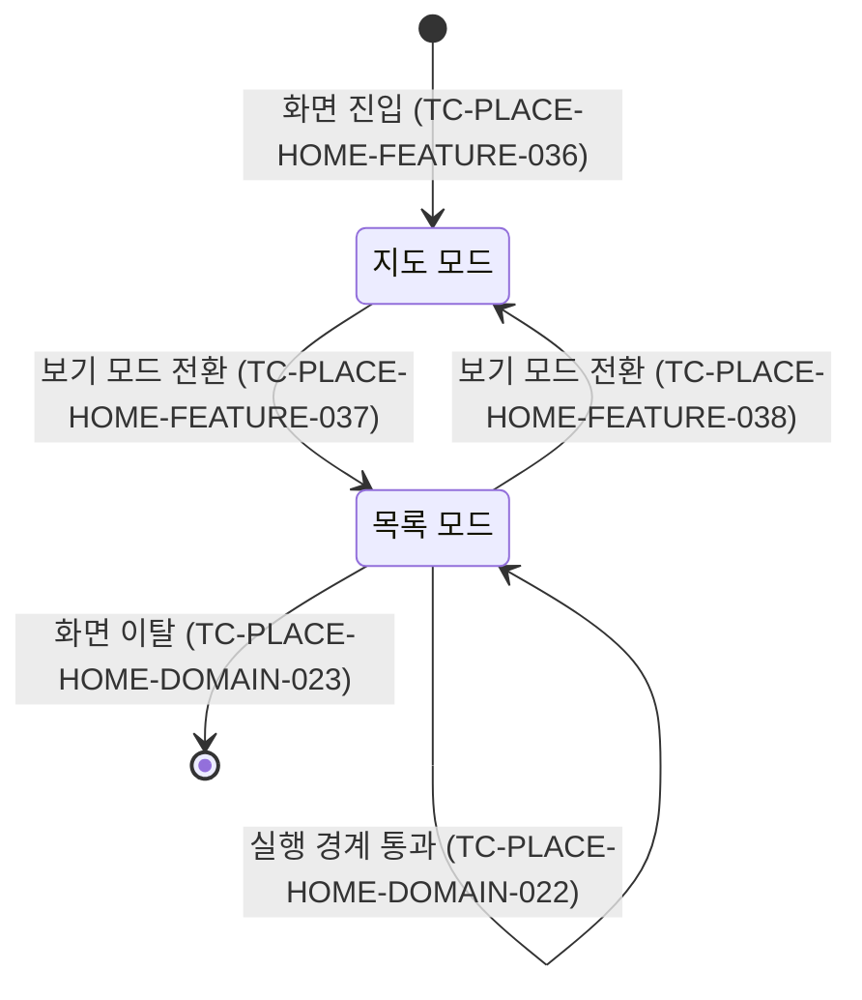

# PlaceHome 테스트 케이스

기준 스펙: [PlaceHome 화면 스펙](../spec/client/place-home.md)

보기 모드 전환, 지도 표시, 두 보기 모드의 목록과 지도 핀, 장소 추가와 상세로 넘기는 것, 정렬과 새로고침을 다루는 케이스의 `근거`가 가리키는 절은 [장소 보기 모드 스펙](../spec/client/place-view-mode.md)이 소유하고, 나머지 케이스의 절은 기준 스펙이 소유한다. 목록 모드의 자리 표시 케이스의 절은 공통 규칙을 [페이지 조회 목록의 자리 표시 스펙](../spec/client/paged-list-placeholder.md)에, 빈 상태 케이스의 절은 [목록 빈 상태 스펙](../spec/client/list-empty-state.md)에 위임한다.

현재 위치를 확인하는 규칙 자체의 케이스는 [현재 위치 확인 테스트 케이스](./current-location.md)에서 다룬다. 본문에 표시되는 지도와 지도 제공자 전환, 핀 선택 자체의 케이스는 [DiaryMap 테스트 케이스](./diary-map.md)에서 다룬다. 기본 지도를 고르고 저장하는 케이스는 [SettingMap 테스트 케이스](./setting-map.md)에서 다룬다. 장소를 작성해 추가하는 케이스는 [PlaceAdd 테스트 케이스](./place-add.md)에서, 이동한 상세 화면의 내용과 수정·삭제 케이스는 [PlaceDetail 테스트 케이스](./place-detail.md)에서 다룬다.

## feature

### TC-PLACE-HOME-FEATURE-003: 뒤로가기 동작을 선택하면 이전 화면으로 돌아간다

- 근거: `feature > 뒤로가기`
- Given: PlaceHome 화면이 표시되어 있다.
- When: 사용자가 뒤로가기를 실행한다.
- Then: 이전 화면인 `더보기`로 돌아간다.
- 작성하지 않는 이유: 뒤로가기를 실행하면 화면을 벗어나는 요청이 한 번 발생하는 것은 자동화한다. 실제 앱의 전환 이력, 복귀한 `더보기` 화면, 공통 내비게이션 영역을 함께 관찰하는 것은 PlaceHome 단위 테스트로 결정적으로 검증할 수 없다. 실제 앱 내비게이션을 구성하면서 지도 표시 요소를 결정적으로 대체할 수 있는 호스트 테스트 환경이 제공되면 자동화한다.

### TC-PLACE-HOME-FEATURE-010: 기본 지도를 고르지 않았으면 공용 지도 기능의 기본 제공자로 시작한다

- 근거: `feature > 지도 표시`, `domain > 지도 표시 요소`
- Given: 사용자가 기본 지도를 한 번도 고르지 않은 상태에서 MoreHome의 `장소` 항목을 선택해 PlaceHome 화면에 진입했다.
- When: 사용자가 PlaceHome의 지도 기능을 확인한다.
- Then: 공용 지도 기능의 기본 제공자 지도가 초기 지도로 표시된다.
- 작성하지 않는 이유: 현재 호스트 테스트 환경은 PlaceHome과 함께 표시되는 실제 지도의 플랫폼 표시 요소를 제공하지 않아 화면을 결정적으로 구성할 수 없다. 지도 표시를 포함한 PlaceHome을 반복 가능하게 구성할 수 있는 테스트 환경이 제공되면 자동화한다.

### TC-PLACE-HOME-FEATURE-011: 기본 지도를 확인하지 못하면 지도 기능을 표시하지 않는다

- 근거: `feature > 지도 표시`
- Given: 사용자가 고른 기본 지도를 아직 확인하지 못했거나 읽지 못한 상태로 PlaceHome 화면에 진입했다.
- When: 사용자가 PlaceHome을 확인한다.
- Then: 지도 기능이 표시되지 않고 별도의 로딩 안내나 오류 안내도 표시되지 않는다.

### TC-PLACE-HOME-FEATURE-012: 저장된 기본 지도가 초기 제공자로 표시된다

- 근거: `domain > 지도 표시 요소`
- Given: 기본 지도가 테스트 데이터의 지도로 저장되어 있다.
- When: 사용자가 PlaceHome 화면에 진입해 지도 기능을 확인한다.
- Then: 테스트 데이터의 저장된 기본 지도 제공자가 초기 제공자로 표시된다.
- 테스트 데이터:

| 저장된 기본 지도 |
| --- |
| 네이버 지도 |
| Google 지도 |

- 작성하지 않는 이유: 현재 호스트 테스트 환경은 PlaceHome과 함께 표시되는 실제 지도의 플랫폼 표시 요소를 제공하지 않아 화면을 결정적으로 구성할 수 없다. 지도 표시를 포함한 PlaceHome을 반복 가능하게 구성할 수 있는 테스트 환경이 제공되면 자동화한다.

### TC-PLACE-HOME-FEATURE-013: 화면이 표시된 뒤 기본 지도가 바뀌면 바뀐 지도로 새로 시작한다

- 근거: `domain > 지도 표시 요소`
- Given: 기본 지도가 네이버 지도로 저장된 상태에서 PlaceHome 화면에 진입해 네이버 지도를 보고 있다.
- When: 기본 지도가 Google 지도로 바뀐다.
- Then: 사용자가 보고 있는 지도가 Google 지도로 새로 시작한다.
- 작성하지 않는 이유: 현재 호스트 테스트 환경은 PlaceHome과 함께 표시되는 실제 지도의 플랫폼 표시 요소를 제공하지 않아 화면을 결정적으로 구성할 수 없다. 지도 표시를 포함한 PlaceHome을 반복 가능하게 구성할 수 있는 테스트 환경이 제공되면 자동화한다.

### TC-PLACE-HOME-FEATURE-014: 장소 추가를 선택하면 장소 추가 화면으로 이동한다

- 근거: `feature > 장소 추가로 이동`
- Given: PlaceHome 화면이 표시되어 있다.
- When: 사용자가 장소 추가를 선택한다.
- Then: 장소 추가 화면으로 이동하는 동작이 한 번 실행된다.

### TC-PLACE-HOME-FEATURE-015: 지도가 표시되지 않는 상태에서도 장소 추가를 실행할 수 있다

- 근거: `feature > 장소 추가로 이동`
- Given: 사용자가 고른 기본 지도를 아직 확인하지 못해 지도 기능이 표시되지 않는 PlaceHome 화면이 표시되어 있다.
- When: 사용자가 장소 추가를 선택한다.
- Then: 장소 추가 동작이 실행된다.

### TC-PLACE-HOME-FEATURE-016: 현재 위치를 확인하기 전에는 지도 기능을 표시하지 않는다

- 근거: `feature > 지도 표시`
- Given: 기본 지도는 확인되었지만 현재 위치 확인이 아직 끝나지 않은 상태로 PlaceHome 화면에 진입했다.
- When: 사용자가 PlaceHome을 확인한다.
- Then: 지도 기능이 표시되지 않고 별도의 로딩 안내나 오류 안내도 표시되지 않는다.

### TC-PLACE-HOME-FEATURE-017: 현재 위치를 확인하지 못해도 지도 기능을 표시한다

- 근거: `feature > 지도 표시`
- Given: 기본 지도가 확인되었고 디바이스 위치와 공인 IP 기준 위치를 모두 확인하지 못하도록 정해져 있다.
- When: 사용자가 PlaceHome 화면에 진입해 현재 위치 확인이 끝난다.
- Then: 지도 기능이 표시되고, 위치를 확인하지 못했음을 알리는 안내는 표시되지 않는다.

### TC-PLACE-HOME-FEATURE-018: 보이는 영역 안의 장소가 목록에 표시된다

- 근거: `feature > 지도 모드의 장소 목록`
- Given: 현재 계정과 연결된 삭제되지 않은 장소들이 저장되어 있고, 그중 일부만 좌표가 지도의 보이는 영역 안에 있도록 조회 결과가 정해져 있다.
- When: 지도가 보이는 영역을 알려온다.
- Then: 보이는 영역 안의 장소만 목록에 표시되고, 사용자는 각 장소의 제목, 주소와 컬러를 확인할 수 있다.

### TC-PLACE-HOME-FEATURE-019: 보이는 영역이 바뀌면 목록이 갱신된다

- 근거: `feature > 지도 모드의 장소 목록`, `domain > 목록 갱신`
- Given: 지도가 알려온 보이는 영역 기준으로 장소 목록이 표시되어 있다.
- When: 지도가 바뀐 보이는 영역을 알려온다.
- Then: 바뀐 영역 밖으로 나간 장소는 목록에서 사라지고, 영역 안으로 들어온 장소는 목록에 나타난다.

### TC-PLACE-HOME-FEATURE-020: 보이는 영역 안에 장소가 없으면 장소 카드를 표시하지 않는다

- 근거: `feature > 지도 모드의 장소 목록`
- Given: 지도가 알려온 보이는 영역 안에 좌표가 있는 장소가 없도록 조회 결과가 정해져 있다.
- When: 사용자가 장소 목록을 확인한다.
- Then: 목록에 장소 카드가 표시되지 않고, 로딩 안내나 오류 안내도 표시되지 않는다. 이때 표시하는 빈 상태 안내는 `TC-PLACE-HOME-FEATURE-047`이 다룬다.

### TC-PLACE-HOME-FEATURE-021: 보이는 영역을 확인하기 전에는 목록이 비어 있다

- 근거: `feature > 지도 모드의 장소 목록`
- Given: 지도가 아직 표시되지 않았거나 보이는 영역을 알려오기 전이다.
- When: 사용자가 장소 목록을 확인한다.
- Then: 목록에 장소가 표시되지 않고, 빈 상태 안내나 로딩 안내, 오류 안내도 표시되지 않는다.

### TC-PLACE-HOME-FEATURE-022: 장소가 추가되면 목록이 갱신된다

- 근거: `feature > 지도 모드의 장소 목록`, `domain > 목록 갱신`
- Given: 지도가 알려온 보이는 영역 기준으로 장소 목록이 표시되어 있다.
- When: 보이는 영역 안의 좌표를 가진 장소가 추가되어 조회 결과가 바뀐다.
- Then: 추가된 장소가 목록에 나타난다.

### TC-PLACE-HOME-FEATURE-023: 목록을 조회하지 못하면 빈 목록으로 표시한다

- 근거: `feature > 지도 모드의 장소 목록`, `data > 독립된 조회`
- Given: 지도 모드에서 지도가 보이는 영역을 알려왔고 장소 목록 조회가 실패하도록 정해져 있다.
- When: 사용자가 장소 목록을 확인한다.
- Then: 목록에 장소가 표시되지 않고 빈 상태 안내가 표시되며, 오류 안내는 표시되지 않는다.

### TC-PLACE-HOME-FEATURE-024: 목록에 표시되는 장소가 지도 핀으로 지정된다

- 근거: `feature > 지도 핀`, `domain > 핀 표현`
- Given: 지도가 보이는 영역을 알려왔고 영역 안의 장소들이 조회되도록 정해져 있다.
- When: 사용자가 지도를 확인한다.
- Then: 목록과 같은 장소들이 지도 기능의 핀으로 지정되고, 각 핀의 색은 장소의 컬러, 라벨은 장소의 제목이다.

### TC-PLACE-HOME-FEATURE-025: 목록이 갱신되면 핀도 함께 갱신된다

- 근거: `feature > 지도 핀`, `domain > 목록 갱신`
- Given: 지도가 알려온 보이는 영역 기준으로 장소 목록과 핀이 표시되어 있다.
- When: 지도가 바뀐 보이는 영역을 알려와 조회 결과가 바뀐다.
- Then: 지도 기능에 지정되는 핀이 바뀐 목록과 같은 장소들로 갱신된다.

### TC-PLACE-HOME-FEATURE-026: 목록이 비어 있으면 핀도 없다

- 근거: `feature > 지도 핀`
- Given: 지도가 알려온 보이는 영역 안에 좌표가 있는 장소가 없도록 조회 결과가 정해져 있다.
- When: 사용자가 지도를 확인한다.
- Then: 지도 기능에 지정되는 핀이 없다.

### TC-PLACE-HOME-FEATURE-027: 목록의 장소를 선택하면 그 장소의 상세로 이동한다

- 근거: `feature > 장소 상세로 이동`
- Given: 지도가 보이는 영역을 알려왔고 서로 다른 장소들이 목록에 표시되어 있다.
- When: 사용자가 목록의 한 장소를 선택한다.
- Then: 선택한 장소의 식별자로 장소 상세 이동이 한 번 요청된다.

### TC-PLACE-HOME-FEATURE-028: 지도 핀을 누르면 그 장소의 상세로 이동한다

- 근거: `feature > 장소 상세로 이동`
- Given: 지도가 보이는 영역을 알려와 서로 다른 장소들이 핀으로 표시되어 있다.
- When: 사용자가 그중 한 핀을 누른다.
- Then: 그 핀이 가리키는 장소의 식별자로 장소 상세 이동이 한 번 요청되고, 지도가 보고 있는 위치와 확대 수준은 바뀌지 않는다.
- 작성하지 않는 이유: 핀 누르기는 지도가 표시된 화면과 지도 제공자의 입력 처리가 필요한데, 현재 호스트 테스트 환경은 실제 지도의 플랫폼 표시 요소를 제공하지 않는다. 핀의 식별 값으로 상세 대상을 정하는 것은 TC-PLACE-HOME-DOMAIN-015에서 검증한다. 지도 표시와 지도 입력을 대체할 수 있는 테스트 환경이 제공되면 자동화한다.

### TC-PLACE-HOME-FEATURE-029: 장소 목록을 당기면 새로고침이 요청된다

- 근거: `feature > 장소 목록 새로고침`
- Given: 인증된 사용자 계정이 확인된 상태로 장소 목록이 표시되어 있고 진행 중인 동기화가 없다.
- When: 사용자가 장소 목록을 아래로 당겨 새로고침을 요청한다.
- Then: 계정 데이터의 서버 동기화가 한 번 요청된다.

### TC-PLACE-HOME-FEATURE-030: 새로고침이 실행되는 동안 진행이 표시된다

- 근거: `feature > 장소 목록 새로고침`
- Given: 장소 목록이 표시되어 있고 진행 중인 동기화가 없다.
- When: 사용자가 당겨서 요청한 동기화가 실행되기 시작한 뒤 성공 또는 실패로 끝난다.
- Then: 실행되는 동안 장소 목록 영역에 진행 표시가 나타나고, 끝나면 사라진다.

### TC-PLACE-HOME-FEATURE-031: 목록이 비어 있어도 당김으로 새로고침할 수 있다

- 근거: `feature > 장소 목록 새로고침`
- Given: 보이는 영역 안에 장소가 없어 장소 목록이 비어 있다.
- When: 사용자가 장소 목록을 아래로 당겨 새로고침을 요청한다.
- Then: 계정 데이터의 서버 동기화가 한 번 요청된다.

요청한 동기화가 실행되는 동안 진행 표시가 나타나는 것은 `TC-PLACE-HOME-FEATURE-030`이 다룬다.

### TC-PLACE-HOME-FEATURE-032: 새로고침으로 받은 장소가 보이는 영역 안에 있으면 목록에 나타난다

- 근거: `feature > 장소 목록 새로고침`
- Given: 지도가 보이는 영역을 알려와 장소 목록이 표시되어 있고, 그 영역 안에 좌표를 가진 장소가 아직 기기에 없다.
- When: 새로고침으로 그 장소가 기기에 저장된다.
- Then: 사용자의 추가 조작 없이 그 장소가 장소 목록에 나타난다.

### TC-PLACE-HOME-FEATURE-033: 새로고침이 실패해도 표시 중인 장소는 유지된다

- 근거: `feature > 장소 목록 새로고침`
- Given: 장소 목록에 장소가 표시되어 있다.
- When: 사용자가 당겨서 요청한 동기화가 실패한다.
- Then: 표시되던 장소가 그대로 유지되고 실패 안내가 표시되지 않는다.

### TC-PLACE-HOME-FEATURE-034: 진행 표시 중에도 목록 조작을 계속할 수 있다

- 근거: `feature > 장소 목록 새로고침`
- Given: 장소 목록에 장소가 표시되어 있고 진행 표시가 나타나 있다.
- When: 사용자가 목록의 장소를 선택하거나 장소 추가 버튼을 누른다.
- Then: 진행 표시가 없을 때와 같은 이동 요청이 발생한다.

### TC-PLACE-HOME-FEATURE-035: 새로고침 중에 보이는 영역이 바뀌면 목록은 곧바로 갱신된다

- 근거: `feature > 장소 목록 새로고침`
- Given: 장소 목록이 표시되어 있고 새로고침이 실행 중이어서 진행 표시가 나타나 있다.
- When: 지도가 다른 보이는 영역을 알려온다.
- Then: 목록이 새 영역의 노출 기준으로 갱신되고 진행 표시는 그대로 유지된다.

### TC-PLACE-HOME-FEATURE-036: 진입하면 지도 모드로 시작한다

- 근거: `domain > 기본 보기 모드`, `domain > 보기 모드`
- Given: 계정에 장소가 저장되어 있다.
- When: 사용자가 PlaceHome 화면에 진입해 본문을 확인한다.
- Then: 계정의 장소 전체를 보여 주는 목록이 표시되지 않고, 사용자는 보기 모드 전환을 실행할 수 있다.

### TC-PLACE-HOME-FEATURE-037: 보기 모드를 바꾸면 계정의 장소 전체가 목록에 표시된다

- 근거: `feature > 보기 모드 전환`, `feature > 목록 모드의 장소 목록`
- Given: PlaceHome 화면이 지도 모드로 표시되어 있고 계정에 장소가 저장되어 있다.
- When: 사용자가 보기 모드 전환을 실행한다.
- Then: 계정에 저장된 장소가 목록에 표시되고 지도와 지도 제공자를 바꾸는 기능은 표시되지 않는다.

### TC-PLACE-HOME-FEATURE-038: 목록 모드에서 다시 전환하면 지도 모드로 돌아온다

- 근거: `feature > 보기 모드 전환`
- Given: 사용자가 보기 모드를 바꿔 목록 모드가 표시되어 있다.
- When: 사용자가 보기 모드 전환을 다시 실행한다.
- Then: 계정의 장소 전체를 보여 주는 목록이 사라지고 지도 모드의 본문으로 돌아온다.

### TC-PLACE-HOME-FEATURE-039: 지도가 표시되지 않아도 보기 모드를 바꿀 수 있다

- 근거: `feature > 보기 모드 전환`
- Given: 사용자가 고른 기본 지도를 아직 확인하지 못해 지도 기능이 표시되지 않는 PlaceHome 화면이 표시되어 있다.
- When: 사용자가 보기 모드 전환을 실행한다.
- Then: 목록 모드의 장소 목록이 표시된다.

### TC-PLACE-HOME-FEATURE-052: 검색을 선택하면 장소 유형으로 시작하는 SearchHome 화면으로 이동한다

- 근거: `feature > 검색으로 이동`
- Given: 사용자가 PlaceHome 화면을 보고 있다.
- When: 사용자가 검색을 선택한다.
- Then: SearchHome 화면으로 이동하는 동작이 한 번 실행된다.

지정하는 시작 유형은 화면 밖 내비게이션 배선이 정하므로 이 케이스에서 관찰하지 않는다. 시작 유형별 표시는 [SearchHome 테스트 케이스](./search-home.md)의 `TC-SEARCH-HOME-FEATURE-005`가 다룬다.

### TC-PLACE-HOME-FEATURE-053: 보기 모드와 지도 표시 여부에 관계없이 검색 동작을 제공한다

- 근거: `feature > 검색으로 이동`
- Given: 테스트 데이터의 상태로 PlaceHome 화면을 보고 있다.
- When: 사용자가 화면에서 실행할 수 있는 동작을 확인한다.
- Then: 검색 동작이 제공된다.
- 테스트 데이터:

| 상태 |
| --- |
| 지도 모드이고 지도 기능이 표시되어 있다 |
| 사용자가 고른 기본 지도를 아직 확인하지 못해 지도 기능이 표시되지 않는다 |
| 목록 모드로 바꿔 두었다 |

- 작성하지 않는 이유: 지도 기능이 표시된 상태는 현재 호스트 테스트 환경이 실제 지도의 플랫폼 표시 요소를 제공하지 않아 결정적으로 구성할 수 없으므로 그 상태만 자동화하지 않는다. 나머지 두 상태는 자동화한다. 지도 표시를 포함한 PlaceHome을 반복 가능하게 구성할 수 있는 테스트 환경이 제공되면 함께 자동화한다.

### TC-PLACE-HOME-FEATURE-040: 목록 모드에 노출할 장소가 없으면 장소 카드를 표시하지 않는다

- 근거: `feature > 목록 모드의 장소 목록`
- Given: 계정에 노출 기준을 만족하는 장소가 하나도 없다.
- When: 사용자가 목록 모드로 바꿔 목록을 확인한다.
- Then: 목록에 장소 카드가 표시되지 않는다. 이때 표시하는 빈 상태 안내는 `TC-PLACE-HOME-FEATURE-046`이 다룬다.

### TC-PLACE-HOME-FEATURE-041: 목록 모드에서 장소를 선택하면 그 장소의 상세로 이동한다

- 근거: `feature > 장소 상세로 이동`, `domain > 상세로 이동하는 대상`
- Given: 목록 모드에 서로 다른 장소들이 표시되어 있다.
- When: 사용자가 목록의 한 장소를 선택한다.
- Then: 선택한 장소의 식별자로 장소 상세 이동이 한 번 요청된다.

### TC-PLACE-HOME-FEATURE-042: 목록 모드에서 아직 준비되지 않은 자리는 자리 표시 카드로 표시한다

- 근거: `feature > 목록 모드의 장소 목록`
- Given: 목록 모드의 한 자리에 표시할 장소가 아직 준비되지 않았다.
- When: 사용자가 목록을 확인한다.
- Then: 그 자리에는 제목, 주소와 컬러가 비어 있는 카드가 표시된다.

### TC-PLACE-HOME-FEATURE-043: 자리 표시 카드는 선택할 수 없다

- 근거: `feature > 목록 모드의 장소 목록`, `domain > 상세로 이동하는 대상`
- Given: 목록 모드에 장소가 준비되지 않은 자리 표시 카드가 표시되어 있다.
- When: 사용자가 그 카드를 선택한다.
- Then: 장소 상세 이동이 요청되지 않는다.

### TC-PLACE-HOME-FEATURE-044: 목록 모드에서 목록을 내려 보면 준비되지 않은 구간의 장소가 이어서 나타난다

- 근거: `feature > 목록 모드의 장소 목록`
- Given: 계정에 노출 대상 장소가 한 번에 준비되는 양보다 많이 저장되어 있고 목록 모드가 표시되어 있다.
- When: 사용자가 목록을 아직 준비되지 않은 구간까지 내려 본다.
- Then: 그 구간의 장소가 제목 오름차순에 이어서 나타난다.
- 작성하지 않는 이유: 아직 준비되지 않은 구간이 있는 목록 상태를 만들려면 기기에 저장된 장소를 나누어 이어서 불러오는 환경이 필요하고, 현재 호스트 테스트 환경은 화면에 전달할 목록을 직접 구성하므로 이 상태를 결정적으로 만들 수 없다. 페이지 준비 시점을 제어할 수 있는 테스트 환경이 제공되면 자동화한다.

### TC-PLACE-HOME-FEATURE-045: 목록 모드에서 당기면 새로고침이 요청된다

- 근거: `feature > 장소 목록 새로고침`
- Given: 목록 모드가 표시되어 있고 진행 중인 동기화가 없다.
- When: 사용자가 목록을 아래로 당겨 새로고침을 요청한다.
- Then: 계정 데이터의 서버 동기화가 한 번 요청된다.

### TC-PLACE-HOME-FEATURE-046: 목록 모드에 노출할 장소가 없으면 아직 장소가 없음을 알린다

- 근거: `feature > 목록 모드의 장소 목록`
- Given: 현재 계정에 노출 대상 장소가 하나도 없고 목록의 준비가 끝났으며 목록 모드가 표시되어 있다.
- When: 사용자가 장소 목록을 확인한다.
- Then: 장소 카드 대신 아직 장소가 없음을 알리는 안내가 표시된다.

### TC-PLACE-HOME-FEATURE-047: 지도 모드에서 보이는 영역 안에 장소가 없으면 이 지역에 장소가 없음을 알린다

- 근거: `feature > 지도 모드의 장소 목록`
- Given: 지도 모드가 표시되어 있고 지도가 보이는 영역을 확인했으며, 그 영역 안에 노출 대상 장소가 하나도 없다.
- When: 사용자가 장소 목록을 확인한다.
- Then: 장소 카드 대신 이 지역에 장소가 없음을 알리는 안내가 표시된다.

### TC-PLACE-HOME-FEATURE-051: 지도 모드에서 보이는 영역을 확인하기 전에는 빈 상태 안내를 표시하지 않는다

- 근거: `feature > 지도 모드의 장소 목록`
- Given: 지도 모드가 표시되어 있고 지도가 보이는 영역을 아직 확인하지 못했다.
- When: 사용자가 장소 목록을 확인한다.
- Then: 빈 상태 안내가 표시되지 않는다.

### TC-PLACE-HOME-FEATURE-048: 목록 모드에서 목록을 준비하는 동안에는 빈 상태 안내를 표시하지 않는다

- 근거: `feature > 목록 모드의 장소 목록`
- Given: 목록 모드에 표시된 장소가 아직 하나도 없고 목록의 준비가 끝나지 않았다.
- When: 사용자가 장소 목록을 확인한다.
- Then: 빈 상태 안내가 표시되지 않는다.

### TC-PLACE-HOME-FEATURE-049: 보이는 영역 안에 장소가 들어오면 빈 상태 안내가 사라진다

- 근거: `feature > 지도 모드의 장소 목록`
- Given: 지도 모드에 이 지역에 장소가 없음을 알리는 안내가 표시되어 있다.
- When: 사용자가 지도를 옮겨 노출 대상 장소가 보이는 영역 안에 들어온다.
- Then: 안내가 사라지고 그 장소의 카드가 목록에 표시된다.

### TC-PLACE-HOME-FEATURE-050: 빈 상태에서도 장소 추가와 보기 모드 전환을 실행할 수 있다

- 근거: `feature > 목록 모드의 장소 목록`, `feature > 지도 모드의 장소 목록`
- Given: 장소 목록 영역에 빈 상태 안내가 표시되어 있다.
- When: 사용자가 화면에서 실행할 수 있는 동작을 확인한다.
- Then: 장소 추가 동작과 보기 모드 전환 동작이 모두 제공된다.

## domain

### TC-PLACE-HOME-DOMAIN-001: 확인한 현재 위치를 지도의 초기 위치로 지정한다

- 근거: `domain > 초기 지도 위치`
- Given: 기본 지도가 확인되었고 디바이스가 테스트 데이터의 위도와 경도를 현재 위치로 제공하도록 정해져 있다.
- When: 사용자가 PlaceHome 화면에 진입해 현재 위치 확인이 끝난다.
- Then: 지도 기능의 초기 위치가 디바이스가 제공한 위도와 경도로 지정된다.
- 테스트 데이터:

| 위도 | 경도 |
| --- | --- |
| 서울 도심의 위도 | 서울 도심의 경도 |
| 남반구 도시의 위도 | 서반구 도시의 경도 |

### TC-PLACE-HOME-DOMAIN-002: 현재 위치를 확인하지 못하면 초기 위치를 지정하지 않는다

- 근거: `domain > 초기 지도 위치`
- Given: 기본 지도가 확인되었고 디바이스 위치와 공인 IP 기준 위치를 모두 확인하지 못하도록 정해져 있다.
- When: 사용자가 PlaceHome 화면에 진입해 현재 위치 확인이 끝난다.
- Then: 지도 기능에 초기 위치를 지정하지 않아 지도 제공자의 기본 위치에서 시작한다.

### TC-PLACE-HOME-DOMAIN-003: 화면이 회전하거나 백그라운드에 다녀와도 현재 위치를 다시 확인하지 않는다

- 근거: `domain > 현재 위치 확인 시점`, `domain > 초기 지도 위치`
- Given: PlaceHome 화면에서 현재 위치 확인이 이미 끝났다.
- When: 테스트 데이터의 실행 경계를 지나 같은 PlaceHome 화면으로 돌아온다.
- Then: 현재 위치를 다시 확인하지 않고 처음 확인한 위치를 초기 위치로 유지한다.
- 테스트 데이터:

| 실행 경계 |
| --- |
| 화면 회전이나 창 크기 변경 |
| 앱이 종료되지 않은 채 백그라운드에 갔다가 복귀 |

### TC-PLACE-HOME-DOMAIN-025: 시스템이 앱을 종료했다가 되살리면 보기 모드와 관계없이 현재 위치를 다시 확인한다

- 근거: `domain > 초기 지도 위치`, `domain > 현재 위치 확인 시점`
- Given: PlaceHome 화면에서 현재 위치 확인이 끝났고, 사용자가 지도를 다른 위치로 옮겨 둔 뒤 보기 모드를 테스트 데이터대로 두었으며, 디바이스가 제공하는 위치가 다른 위도와 경도로 바뀌었다.
- When: 앱이 백그라운드에 있는 동안 시스템이 앱을 종료했다가 같은 PlaceHome 화면으로 되살린다.
- Then: 테스트 데이터의 결과대로 현재 위치를 확인한다.
- 테스트 데이터:

| 되살아난 보기 모드 | 결과 |
| --- | --- |
| 지도 모드 | 되살아난 즉시 현재 위치를 다시 확인하고 새로 확인한 위치에서 지도를 시작하며, 옮겨 두었던 지도 위치와 확대 수준은 이어지지 않는다 |
| 목록 모드 | 목록 모드를 유지한 채 되살아난 즉시 현재 위치를 다시 확인하고, 그 뒤 지도 모드로 바꿀 때는 다시 확인하지 않는다 |

### TC-PLACE-HOME-DOMAIN-004: 화면을 떠난 뒤 다시 들어오면 현재 위치를 새로 확인한다

- 근거: `domain > 현재 위치 확인 시점`, `domain > 초기 지도 위치`
- Given: PlaceHome 화면에서 현재 위치 확인이 끝난 뒤 사용자가 화면을 떠났고, 디바이스가 제공하는 위치가 다른 위도와 경도로 바뀌었다.
- When: 사용자가 PlaceHome 화면에 다시 진입한다.
- Then: 바뀐 위도와 경도를 새 초기 위치로 지정한다.

### TC-PLACE-HOME-DOMAIN-005: 지도를 표시하기 위해 위치 권한을 요청하지 않는다

- 근거: `domain > 초기 지도 위치`
- Given: 위치 권한이 허용되어 있지 않다.
- When: 사용자가 PlaceHome 화면에 진입한다.
- Then: 위치 권한 요청이 시작되지 않는다.
- 작성하지 않는 이유: 시스템 권한 요청이 시작되었는지는 요청을 대신 받는 대체물로 관찰할 수 있지만, 지도를 표시하는 PlaceHome은 지도 제공자의 실제 표시 요소가 필요하고 현재 호스트 테스트 환경은 이를 제공하지 않아 지도를 표시한 화면을 구성할 수 없다. 지도 표시를 포함한 PlaceHome을 반복 가능하게 구성할 수 있는 테스트 환경이 제공되면 자동화한다.

### TC-PLACE-HOME-DOMAIN-006: 장소 추가로 이동할 때 보고 있던 지도 위치를 넘긴다

- 근거: `domain > 장소 추가로 넘기는 지도 위치`
- Given: 기본 지도가 확인되어 지도 기능이 표시되어 있고, 지도가 테스트 데이터의 위도와 경도를 보고 있다고 알려왔다.
- When: 사용자가 장소 추가를 선택한다.
- Then: 장소 추가 화면으로 이동할 때 지도가 알려온 위도와 경도가 초기 지도 위치로 함께 전달된다.
- 테스트 데이터:

| 보고 있던 위도 | 보고 있던 경도 |
| --- | --- |
| 서울 도심의 위도 | 서울 도심의 경도 |
| 남반구 도시의 위도 | 서반구 도시의 경도 |
- 작성하지 않는 이유: 지도가 알려온 위치를 만들려면 지도 제공자의 실제 표시 요소가 필요하고, 현재 호스트 테스트 환경은 이를 제공하지 않는다. 지도 표시를 대체할 수 있는 테스트 환경이 제공되면 자동화한다.

### TC-PLACE-HOME-DOMAIN-007: 지도를 옮기지 않았으면 진입 시 시작한 위치를 넘긴다

- 근거: `domain > 장소 추가로 넘기는 지도 위치`
- Given: 디바이스가 특정 위도와 경도를 현재 위치로 제공해 지도 기능이 그 위치에서 시작했고, 사용자가 지도를 옮기지 않았다.
- When: 사용자가 장소 추가를 선택한다.
- Then: 진입 시 시작한 위도와 경도가 초기 지도 위치로 전달된다.
- 작성하지 않는 이유: 지도가 알려온 위치를 만들려면 지도 제공자의 실제 표시 요소가 필요하고, 현재 호스트 테스트 환경은 이를 제공하지 않는다. 지도 표시를 대체할 수 있는 테스트 환경이 제공되면 자동화한다.

### TC-PLACE-HOME-DOMAIN-008: 지도가 표시되지 않으면 지도 위치를 넘기지 않는다

- 근거: `domain > 장소 추가로 넘기는 지도 위치`
- Given: 기본 지도를 아직 확인하지 못해 지도 기능이 표시되지 않은 PlaceHome 화면이 표시되어 있다.
- When: 사용자가 장소 추가를 선택한다.
- Then: 초기 지도 위치를 전달하지 않고 장소 추가 화면으로 이동한다.

### TC-PLACE-HOME-DOMAIN-009: 보고 있던 지도 제공자는 넘기지 않는다

- 근거: `domain > 장소 추가로 넘기는 지도 위치`
- Given: 기본 지도가 네이버 지도로 저장되어 있고, 사용자가 PlaceHome에서 Google 지도로 잠시 바꿔 보고 있다.
- When: 사용자가 장소 추가를 선택한다.
- Then: 장소 추가 화면으로 지도 제공자를 전달하지 않는다.
- 작성하지 않는 이유: 현재 호스트 테스트 환경은 PlaceHome과 함께 표시되는 실제 지도의 플랫폼 표시 요소를 제공하지 않아 제공자를 바꿔 보는 상태를 결정적으로 구성할 수 없다. 지도 표시를 포함한 PlaceHome을 반복 가능하게 구성할 수 있는 테스트 환경이 제공되면 자동화한다.

### TC-PLACE-HOME-DOMAIN-010: 노출 기준을 만족하는 장소만 목록에 노출한다

- 근거: `domain > 지도 모드에 노출하는 장소`
- Given: 테스트 데이터의 장소가 저장되어 있고 지도가 특정 보이는 영역을 알려왔다.
- When: 사용자가 장소 목록을 확인한다.
- Then: 테스트 데이터의 기대 결과대로 장소가 노출되거나 노출되지 않는다.
- 테스트 데이터:

| 장소 조건 | 기대 결과 |
| --- | --- |
| 현재 계정과 연결되고 삭제되지 않았으며 좌표가 영역 안 | 노출 |
| 현재 계정과 연결되었지만 삭제되었고 좌표가 영역 안 | 노출하지 않음 |
| 현재 계정과 연결되고 삭제되지 않았지만 좌표가 영역 밖 | 노출하지 않음 |
| 다른 계정과 연결되고 좌표가 영역 안 | 노출하지 않음 |

### TC-PLACE-HOME-DOMAIN-011: 영역 경계 위의 좌표도 영역 안으로 다룬다

- 근거: `domain > 지도 모드에 노출하는 장소`
- Given: 좌표가 지도가 알려온 보이는 영역의 경계 위에 있는 장소가 저장되어 있다.
- When: 사용자가 장소 목록을 확인한다.
- Then: 경계 위의 장소가 목록에 노출된다.
- 테스트 데이터:

| 경계 위 좌표 |
| --- |
| 남쪽 경계 위도와 영역 안 경도 |
| 북쪽 경계 위도와 영역 안 경도 |
| 영역 안 위도와 서쪽 경계 경도 |
| 영역 안 위도와 동쪽 경계 경도 |

### TC-PLACE-HOME-DOMAIN-012: 날짜변경선을 걸친 영역은 양쪽 범위를 모두 영역 안으로 다룬다

- 근거: `domain > 지도 모드에 노출하는 장소`
- Given: 지도가 서쪽 경도가 동쪽 경도보다 큰 보이는 영역을 알려왔고, 테스트 데이터의 경도를 가진 장소가 저장되어 있다.
- When: 사용자가 장소 목록을 확인한다.
- Then: 테스트 데이터의 기대 결과대로 장소가 노출되거나 노출되지 않는다.
- 테스트 데이터:

| 장소 경도 | 기대 결과 |
| --- | --- |
| 서쪽 경계보다 동쪽(날짜변경선 서쪽 범위 안) | 노출 |
| 동쪽 경계보다 서쪽(날짜변경선 동쪽 범위 안) | 노출 |
| 동쪽 경계와 서쪽 경계 사이(영역 밖) | 노출하지 않음 |

### TC-PLACE-HOME-DOMAIN-013: 목록은 제목 오름차순으로 정렬한다

- 근거: `domain > 목록 정렬`
- Given: 보이는 영역 안에 서로 다른 제목의 장소 여러 개가 저장되어 있다.
- When: 사용자가 장소 목록을 확인한다.
- Then: 장소가 제목 오름차순으로 표시된다.

### TC-PLACE-HOME-DOMAIN-014: 현재 계정을 확인할 수 없으면 노출하는 장소가 없다

- 근거: `domain > 지도 모드에 노출하는 장소`
- Given: 현재 계정을 확인할 수 없도록 정해져 있고 지도가 보이는 영역을 알려왔다.
- When: 사용자가 장소 목록을 확인한다.
- Then: 목록에 장소가 노출되지 않는다.

### TC-PLACE-HOME-DOMAIN-015: 각 핀의 식별 값으로 그 핀의 장소를 정한다

- 근거: `domain > 핀 표현`, `domain > 상세로 이동하는 대상`
- Given: 지도가 보이는 영역을 알려와 서로 다른 장소들이 조회되도록 정해져 있다.
- When: 지도 기능에 지정되는 핀들을 확인한다.
- Then: 각 핀의 식별 값이 그 핀이 나타내는 장소의 식별자와 같고, 서로 다른 장소의 식별 값이 겹치지 않는다.

### TC-PLACE-HOME-DOMAIN-016: 상세로는 장소 식별자만 넘긴다

- 근거: `domain > 상세로 이동하는 대상`
- Given: 사용자가 지도를 옮기고 지도 제공자를 초기 제공자가 아닌 제공자로 바꾼 상태로 장소 목록이 표시되어 있다.
- When: 사용자가 목록의 한 장소를 선택한다.
- Then: 상세 이동 요청에는 선택한 장소의 식별자만 담기고, 보고 있던 지도 위치와 지도 제공자는 담기지 않는다.
- 작성하지 않는 이유: 지도를 옮긴 상태의 PlaceHome을 구성해야 확인할 수 있고, 현재 호스트 테스트 환경은 실제 지도의 플랫폼 표시 요소와 지도 조작 입력을 제공하지 않는다. 지도 표시와 지도 입력을 대체할 수 있는 테스트 환경이 제공되면 자동화한다.

### TC-PLACE-HOME-DOMAIN-017: 로그인하지 않은 상태에서 당기면 동기화도 진행 표시도 없다

- 근거: `domain > 새로고침 대상`
- Given: 로그인하지 않은 상태로 장소 목록이 표시되어 있다.
- When: 사용자가 장소 목록을 아래로 당겨 새로고침을 요청한다.
- Then: 계정 데이터의 서버 동기화가 요청되지 않고 진행 표시가 나타나지 않는다.

### TC-PLACE-HOME-DOMAIN-018: 당김은 진행 중인 서버 동기화를 취소하고 새로 시작한다

- 근거: `domain > 새로고침 대상`
- Given: 장소 목록이 표시되어 있고 계정 데이터의 서버 동기화가 진행 중이다.
- When: 사용자가 장소 목록을 아래로 당겨 새로고침을 요청한다.
- Then: 진행 중이던 서버 동기화가 취소되고 새 서버 동기화가 시작되며 진행 표시는 이어진다.

### TC-PLACE-HOME-DOMAIN-019: 목록 모드에서 장소 추가로 이동하면 지도 위치를 넘기지 않는다

- 근거: `domain > 장소 추가로 넘기는 지도 위치`
- Given: 목록 모드가 표시되어 있다.
- When: 사용자가 장소 추가를 선택한다.
- Then: 초기 지도 위치를 전달하지 않고 장소 추가 화면으로 이동한다.

### TC-PLACE-HOME-DOMAIN-020: 목록 모드는 보이는 영역 밖의 장소도 노출한다

- 근거: `domain > 목록 모드에 노출하는 장소`
- Given: 지도가 보이는 영역을 알려와 그 영역 안의 장소만 지도 모드의 목록에 노출되어 있고, 계정에는 그 영역 밖의 장소도 저장되어 있다.
- When: 사용자가 목록 모드로 바꿔 목록을 확인한다.
- Then: 영역 밖의 장소를 포함한 계정의 장소가 목록에 노출된다.

### TC-PLACE-HOME-DOMAIN-021: 현재 계정을 확인할 수 없으면 목록 모드에도 노출하는 장소가 없다

- 근거: `domain > 목록 모드에 노출하는 장소`
- Given: 현재 계정을 확인할 수 없도록 정해져 있다.
- When: 사용자가 목록 모드로 바꿔 목록을 확인한다.
- Then: 목록에 장소가 노출되지 않는다.

### TC-PLACE-HOME-DOMAIN-022: 실행 경계를 지나도 바꿔 둔 보기 모드를 유지한다

- 근거: `domain > 보기 모드의 유지`
- Given: 사용자가 보기 모드를 목록 모드로 바꿔 두었다.
- When: 테스트 데이터의 실행 경계를 지나 같은 PlaceHome 화면으로 돌아온다.
- Then: 목록 모드가 그대로 유지된다.
- 테스트 데이터:

| 실행 경계 |
| --- |
| 화면 회전이나 창 크기 변경 |
| 앱이 백그라운드에 있는 동안 시스템이 앱을 종료했다가 같은 화면으로 되살림 |
| 앱의 백그라운드 진입 후 복귀 |
| 장소 추가나 장소 상세로 이동한 뒤 뒤로 돌아옴 |

### TC-PLACE-HOME-DOMAIN-023: 화면을 떠난 뒤 다시 들어오면 지도 모드로 시작한다

- 근거: `domain > 기본 보기 모드`, `domain > 보기 모드의 유지`
- Given: 사용자가 보기 모드를 목록 모드로 바꿔 둔 뒤 화면을 떠났다.
- When: 사용자가 PlaceHome 화면에 다시 진입한다.
- Then: 기본값인 지도 모드로 시작한다.

### TC-PLACE-HOME-DOMAIN-024: 목록 모드로 바꿨다 돌아와도 지도가 보던 위치와 제공자를 유지한다

- 근거: `domain > 보기 모드의 유지`
- Given: 사용자가 지도를 옮기고 지도 제공자를 초기 제공자가 아닌 제공자로 바꾼 상태다.
- When: 사용자가 목록 모드로 바꿨다가 다시 지도 모드로 바꾼다.
- Then: 바꾸기 직전에 보던 지도 위치와 확대 수준, 고른 지도 제공자가 그대로 표시된다.
- 작성하지 않는 이유: 지도를 옮기고 제공자를 바꾼 상태를 만들려면 지도 제공자의 실제 표시 요소와 지도 조작 입력이 필요한데, 현재 호스트 테스트 환경은 이를 제공하지 않는다. 지도 표시와 지도 입력을 대체할 수 있는 테스트 환경이 제공되면 자동화한다.

### TC-PLACE-HOME-DOMAIN-026: 실행 경계를 지나도 목록 모드에서 보던 목록 위치를 유지한다

- 근거: `domain > 보기 모드의 유지`
- Given: 목록 모드의 목록에 한 화면을 넘는 장소가 표시되어 있고, 사용자가 목록을 내려 맨 위가 아닌 장소를 보고 있다.
- When: 테스트 데이터의 실행 경계를 지나 같은 PlaceHome 화면으로 돌아온다.
- Then: 목록 모드가 유지되고 사용자가 보던 장소가 그대로 표시되며 목록의 맨 위 장소는 보이지 않는다.
- 테스트 데이터:

| 실행 경계 |
| --- |
| 화면 회전이나 창 크기 변경 |
| 앱의 백그라운드 진입 후 복귀 |
| 장소 추가나 장소 상세로 이동한 뒤 뒤로 돌아옴 |

### TC-PLACE-HOME-DOMAIN-027: 지도 모드에 다녀오면 목록 모드의 목록을 맨 위부터 보여 준다

- 근거: `domain > 보기 모드의 유지`
- Given: 목록 모드의 목록에 한 화면을 넘는 장소가 표시되어 있고, 사용자가 목록을 내려 맨 위가 아닌 장소를 보고 있다.
- When: 사용자가 지도 모드로 바꿨다가 다시 목록 모드로 바꾼다.
- Then: 목록의 맨 위 장소부터 표시된다.

보기 모드의 상태 전이는 다음 케이스가 나누어 덮는다.

## data

### TC-PLACE-HOME-DATA-001: 계정과 보이는 영역을 기준으로 기기에 저장된 장소를 조회한다

- 근거: `data > 목록 조회`
- Given: 현재 계정과 연결된 장소들이 기기에 저장되어 있고 지도가 보이는 영역을 알려왔다.
- When: 장소 목록을 조회한다.
- Then: 현재 계정과 보이는 영역 기준으로 노출 기준과 정렬을 만족하는 장소가 조회된다.

### TC-PLACE-HOME-DATA-002: 저장된 장소가 바뀌면 조회 결과가 갱신된다

- 근거: `data > 목록 조회`
- Given: 보이는 영역 기준으로 장소 목록이 조회되어 있다.
- When: 조회 기준을 만족하는 장소가 기기에 새로 저장된다.
- Then: 조회 결과에 새 장소가 반영된다.

### TC-PLACE-HOME-DATA-003: 서버에서 내려받은 장소 변경이 목록에 반영된다

- 근거: `domain > 목록 갱신`, `data > 목록 조회`
- Given: 보이는 영역 기준으로 장소 목록이 조회되어 있고 그 영역 안의 장소가 목록에 포함되어 있다.
- When: 서버에서 내려받은 변경이 기기에 반영되어 그 장소의 제목이 바뀌거나 삭제 상태가 된다.
- Then: 제목이 바뀐 장소는 새 제목과 정렬 기준으로 조회되고, 삭제 상태가 된 장소는 조회 결과에서 사라진다.
- 테스트 데이터:

| 내려받은 변경 | 기대 결과 |
| --- | --- |
| 제목 변경 | 새 제목으로 조회, 정렬 기준 재적용 |
| 삭제 상태로 변경 | 조회 결과에서 사라짐 |
| 보이는 영역 밖 좌표로 변경 | 조회 결과에서 사라짐 |
| 보이는 영역 안 좌표를 가진 새 장소 | 조회 결과에 나타남 |

### TC-PLACE-HOME-DATA-004: 목록 모드의 목록은 계정 기준으로 나누어 불러온 결과로 구성된다

- 근거: `data > 목록 조회`
- Given: 현재 계정과 연결된 장소들이 기기에 저장되어 있고 목록 모드가 표시되어 있다.
- When: 기기에 저장된 장소 중 계정 기준으로 조회된 장소가 목록에 전달된다.
- Then: 조회된 장소가 조회 순서대로 목록에 노출된다.

### TC-PLACE-HOME-DATA-005: 보기 모드를 바꾸는 것은 서버 조회를 일으키지 않는다

- 근거: `data > 목록 조회`
- Given: PlaceHome 화면이 표시되어 있고 진행 중인 동기화가 없다.
- When: 사용자가 보기 모드를 바꾼다.
- Then: 계정 데이터의 서버 동기화가 요청되지 않는다.
