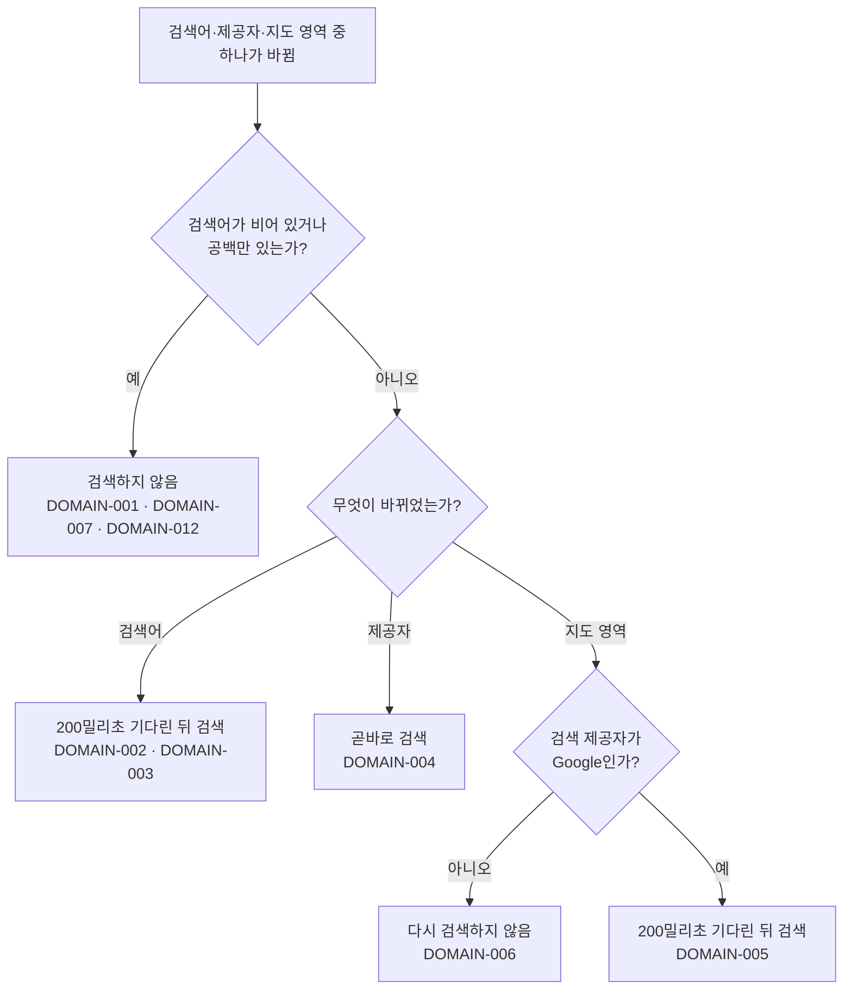

# 장소 검색 다이얼로그 테스트 케이스

기준 스펙: [장소 검색 다이얼로그 컴포넌트 스펙](../spec/client/place-search-dialog.md)

지도의 표시·조작·제공자 전환과 핀 표시·핀 선택 자체의 케이스는 [DiaryMap 테스트 케이스](./diary-map.md)에서 다룬다. 각 제공자에게 보내는 요청과 응답 계약의 케이스는 [네이버 장소 검색 테스트 케이스](./naver-place-search.md)와 [Google 장소 검색 테스트 케이스](./google-place-search.md)에서 다룬다. 고른 장소가 화면의 제목, 주소와 좌표에 반영된 결과의 케이스는 [PlaceAdd 테스트 케이스](./place-add.md)와 [PlaceDetail 테스트 케이스](./place-detail.md)에서 다룬다.

다이얼로그 전체는 지도를 포함해 호스트 테스트 환경에서 구성할 수 없다. 지도가 필요 없는 케이스는 검색어 입력·결과 목록·검색 실행 규칙을 각각 구성해 검증하고, 지도가 필요한 케이스에는 `작성하지 않는 이유`를 남긴다.

## feature

### TC-PLACE-SEARCH-DIALOG-FEATURE-001: 검색을 선택하면 다이얼로그가 열린다

- 근거: `feature > 진입`
- Given: 지도가 표시된 PlaceAdd 화면이나 PlaceDetail 화면이 표시되어 있다.
- When: 사용자가 장소 검색을 선택한다.
- Then: 장소 검색 다이얼로그가 표시된다.
- 작성하지 않는 이유: 현재 호스트 테스트 환경은 지도 제공자의 실제 표시 요소를 제공하지 않아 지도가 표시된 화면을 구성할 수 없다. 지도 표시를 대체할 수 있는 테스트 환경이 제공되면 자동화한다.

### TC-PLACE-SEARCH-DIALOG-FEATURE-002: 지도를 표시할 수 없으면 검색을 제공하지 않는다

- 근거: `feature > 진입`, `domain > 다이얼로그의 지도`
- Given: 기본 지도를 아직 확인하지 못했거나 읽지 못해 지도를 표시할 수 없는 PlaceAdd 화면이나 PlaceDetail 화면이 표시되어 있다.
- When: 사용자가 화면을 확인한다.
- Then: 장소 검색을 선택할 수 있는 자리가 표시되지 않는다.

### TC-PLACE-SEARCH-DIALOG-FEATURE-003: 검색어가 비어 있으면 결과를 표시하지 않는다

- 근거: `feature > 진입`, `domain > 검색을 다시 실행하는 기준`
- Given: 장소 검색 다이얼로그의 검색어가 비어 있다.
- When: 사용자가 다이얼로그를 확인한다.
- Then: 검색어 입력이 비어 있고 찾은 장소 목록도 표시되지 않는다.

### TC-PLACE-SEARCH-DIALOG-FEATURE-004: 검색어를 입력하면 찾은 장소가 목록에 표시된다

- 근거: `feature > 검색어 입력`, `feature > 검색 결과 확인`
- Given: 장소 검색 다이얼로그가 열려 있고, 검색 응답이 장소 목록을 담은 성공으로 제어되어 있다.
- When: 사용자가 검색어를 입력하고 입력을 멈춘다.
- Then: 응답에 담긴 장소들이 받은 순서 그대로 목록에 표시된다.

### TC-PLACE-SEARCH-DIALOG-FEATURE-005: 결과 항목에 이름과 주소가 함께 표시된다

- 근거: `feature > 검색 결과 확인`, `domain > 결과로 보여 주는 내용`
- Given: 장소 검색 다이얼로그가 열려 있고, 검색 응답이 이름과 주소를 가진 장소 하나를 담은 성공으로 제어되어 있다.
- When: 사용자가 검색어를 입력해 결과를 받는다.
- Then: 그 장소의 이름과 주소가 함께 표시된다.

### TC-PLACE-SEARCH-DIALOG-FEATURE-006: 결과가 없으면 결과 없음 안내가 표시된다

- 근거: `feature > 검색 결과 확인`
- Given: 장소 검색 다이얼로그가 열려 있고, 검색 응답이 빈 장소 목록을 담은 성공으로 제어되어 있다.
- When: 사용자가 검색어를 입력해 결과를 받는다.
- Then: 결과가 없다는 안내가 표시되고 실패 안내는 표시되지 않는다.

### TC-PLACE-SEARCH-DIALOG-FEATURE-007: 검색에 실패하면 실패 안내가 표시된다

- 근거: `feature > 검색 결과 확인`
- Given: 장소 검색 다이얼로그가 열려 있고, 검색 응답이 실패로 제어되어 있다.
- When: 사용자가 검색어를 입력해 결과를 받는다.
- Then: 검색에 실패했다는 안내가 표시되고 이전에 표시되던 장소 목록은 표시되지 않는다.

### TC-PLACE-SEARCH-DIALOG-FEATURE-008: 검색어를 지우면 결과가 사라진다

- 근거: `feature > 검색어 입력`
- Given: 장소 검색 다이얼로그에 검색어가 입력되어 있고 찾은 장소 목록이 표시되어 있다.
- When: 사용자가 검색어를 지운다.
- Then: 검색어 입력이 비고 장소 목록과 안내 문구가 모두 표시되지 않는다.

### TC-PLACE-SEARCH-DIALOG-FEATURE-009: 다시 검색하는 동안 직전 결과가 그대로 표시된다

- 근거: `feature > 검색 결과 확인`, `domain > 검색 상태`
- Given: 장소 검색 다이얼로그에 찾은 장소 목록이 표시되어 있고, 다음 검색 응답이 도착하지 않도록 제어되어 있다.
- When: 사용자가 검색어를 고쳐 새 검색이 실행된다.
- Then: 직전에 받은 장소 목록이 그대로 표시되고 결과 없음 안내와 실패 안내는 표시되지 않는다.

### TC-PLACE-SEARCH-DIALOG-FEATURE-010: 장소를 고르면 다이얼로그가 닫힌다

- 근거: `feature > 장소 선택`
- Given: 장소 검색 다이얼로그에 찾은 장소 목록이 표시되어 있다.
- When: 사용자가 목록의 장소 하나를 선택한다.
- Then: 다이얼로그가 표시되지 않는다.

### TC-PLACE-SEARCH-DIALOG-FEATURE-011: 찾은 장소가 모두 지도에 표시된다

- 근거: `feature > 검색 결과 확인`, `domain > 지도에 표시하는 결과`
- Given: 장소 검색 다이얼로그가 열려 있고, 검색 응답이 장소 여러 개를 담은 성공으로 제어되어 있다.
- When: 사용자가 검색어를 입력해 결과를 받는다.
- Then: 받은 장소가 모두 지도 위에 각자의 이름을 라벨로 갖는 표시로 나타난다.
- 작성하지 않는 이유: 현재 호스트 테스트 환경은 지도 제공자의 실제 표시 요소를 제공하지 않아 지도 위 표시를 확인할 수 없다. 지도 표시를 대체할 수 있는 테스트 환경이 제공되면 자동화한다.

### TC-PLACE-SEARCH-DIALOG-FEATURE-012: 지도의 결과 표시를 골라도 목록에서 고른 것과 같다

- 근거: `feature > 장소 선택`, `domain > 지도에 표시하는 결과`
- Given: 장소 검색 다이얼로그에 찾은 장소가 지도 위에 표시되어 있다.
- When: 사용자가 지도의 결과 표시 하나를 선택한다.
- Then: 다이얼로그가 닫히고 그 장소를 목록에서 선택했을 때와 같은 결과가 된다.
- 작성하지 않는 이유: 현재 호스트 테스트 환경은 지도 제공자의 실제 표시 요소와 지도 누르기 입력을 제공하지 않는다. 지도 표시와 지도 입력을 대체할 수 있는 테스트 환경이 제공되면 자동화한다.

### TC-PLACE-SEARCH-DIALOG-FEATURE-013: 고르지 않고 닫을 수 있다

- 근거: `feature > 닫기`
- Given: 장소 검색 다이얼로그에 찾은 장소 목록이 표시되어 있다.
- When: 사용자가 장소를 고르지 않고 다이얼로그를 닫는다.
- Then: 다이얼로그가 표시되지 않는다.
- 작성하지 않는 이유: 다이얼로그를 닫는 조작이 지도를 포함한 다이얼로그 전체를 거쳐야 하므로 현재 호스트 테스트 환경에서 구성할 수 없다. 지도 표시를 대체할 수 있는 테스트 환경이 제공되면 자동화한다.

### TC-PLACE-SEARCH-DIALOG-FEATURE-014: 화면이 재생성되어도 다이얼로그가 열린 상태로 남는다

- 근거: `feature > 진행 상태 유지`
- Given: 장소 검색 다이얼로그가 열려 있다.
- When: 화면이 시스템에 의해 재생성된다.
- Then: 다이얼로그가 열린 상태로 남는다.

### TC-PLACE-SEARCH-DIALOG-FEATURE-017: 화면이 재생성되면 유지한 검색어로 다시 검색한다

- 근거: `feature > 진행 상태 유지`
- Given: 장소 검색 다이얼로그가 열려 있고 검색어가 입력되어 검색이 한 번 실행된 상태다.
- When: 화면이 시스템에 의해 재생성된다.
- Then: 검색어가 그대로 유지되고 그 검색어로 검색이 다시 실행된다.

### TC-PLACE-SEARCH-DIALOG-FEATURE-015: 닫았다 다시 열면 비어 있는 상태로 시작한다

- 근거: `feature > 닫기`
- Given: 사용자가 검색어를 입력해 결과를 받은 뒤 다이얼로그를 닫았다.
- When: 사용자가 장소 검색을 다시 선택한다.
- Then: 검색어 입력이 비어 있고 이전 결과도 표시되지 않는다.
- 작성하지 않는 이유: 다이얼로그를 다시 여는 조작이 지도가 표시된 화면을 거쳐야 하므로 `TC-PLACE-SEARCH-DIALOG-FEATURE-001`과 같은 제약을 받는다.

### TC-PLACE-SEARCH-DIALOG-FEATURE-016: 앱을 새로 시작하면 다이얼로그가 닫힌 상태다

- 근거: `feature > 진행 상태 유지`
- Given: 사용자가 다이얼로그를 연 상태에서 앱을 종료했다.
- When: 사용자가 앱을 새로 시작해 같은 화면에 진입한다.
- Then: 다이얼로그가 표시되지 않는다.
- 작성하지 않는 이유: 실제 앱 종료와 재실행을 결정적으로 제어할 수 있는 테스트 환경이 필요하다.

### TC-PLACE-SEARCH-DIALOG-FEATURE-018: 다이얼로그를 열면 검색어 입력에 초점이 있다

- 근거: `feature > 진입`
- Given: 사용자가 장소 검색을 선택했다.
- When: 다이얼로그가 표시된다.
- Then: 입력 초점이 검색어 입력에 있다.

### TC-PLACE-SEARCH-DIALOG-FEATURE-019: 화면이 재생성되어도 다이얼로그 지도의 제공자와 위치를 유지한다

- 근거: `feature > 진행 상태 유지`
- Given: 장소 검색 다이얼로그에서 사용자가 지도 제공자를 바꾸고 지도를 다른 위치로 옮겼다.
- When: 화면이 시스템에 의해 재생성된다.
- Then: 다이얼로그 지도는 사용자가 고른 제공자와 옮긴 위치를 그대로 보여 준다. 재생성 뒤 확대 수준이 유지되는 것은 [DiaryMap 테스트 케이스](./diary-map.md)의 TC-DIARY-MAP-DOMAIN-046이 다룬다.

### TC-PLACE-SEARCH-DIALOG-FEATURE-020: 앱이 백그라운드에 갔다가 돌아와도 결과를 유지하고 다시 검색하지 않는다

- 근거: `feature > 진행 상태 유지`
- Given: 장소 검색 다이얼로그에 찾은 장소 목록이 표시되어 있다.
- When: 앱이 백그라운드에 갔다가 돌아온다.
- Then: 같은 장소 목록이 비었다가 다시 차지 않고 그대로 표시되며, 검색이 다시 실행되지 않는다.

## domain

### 검색을 다시 실행하는 기준

### TC-PLACE-SEARCH-DIALOG-DOMAIN-001: 검색어가 비어 있으면 검색하지 않는다

- 근거: `domain > 검색을 다시 실행하는 기준`
- Given: 장소 검색 다이얼로그가 열려 있다.
- When: 사용자가 테스트 데이터의 검색어를 입력하고 기다린다.
- Then: 검색이 실행되지 않고 결과도 표시되지 않는다.
- 테스트 데이터:

| 검색어 |
| --- |
| 빈 문자열 |
| 공백 문자만 있는 문자열 |

### TC-PLACE-SEARCH-DIALOG-DOMAIN-002: 입력을 멈추고 200밀리초가 지나면 한 번 검색한다

- 근거: `domain > 검색을 다시 실행하는 기준`
- Given: 장소 검색 다이얼로그가 열려 있다.
- When: 사용자가 검색어를 입력하고 `200`밀리초가 지난다.
- Then: 그 검색어로 검색이 한 번 실행된다.

### TC-PLACE-SEARCH-DIALOG-DOMAIN-003: 기다리는 동안 다시 입력하면 마지막 검색어로만 검색한다

- 근거: `domain > 검색을 다시 실행하는 기준`
- Given: 장소 검색 다이얼로그가 열려 있다.
- When: 사용자가 검색어를 입력하고 `200`밀리초가 지나기 전에 검색어를 다시 고친 뒤 `200`밀리초를 기다린다.
- Then: 마지막 검색어로 검색이 한 번 실행되고, 중간 검색어로는 검색이 실행되지 않는다.

### TC-PLACE-SEARCH-DIALOG-DOMAIN-004: 제공자를 바꾸면 곧바로 다시 검색한다

- 근거: `domain > 검색 제공자`, `domain > 검색을 다시 실행하는 기준`
- Given: 장소 검색 다이얼로그에 검색어가 입력되어 있고 검색이 한 번 실행된 상태다.
- When: 사용자가 지도의 제공자를 다른 제공자로 바꾼다.
- Then: 기다림 없이 바뀐 제공자로 같은 검색어의 검색이 실행된다.

### TC-PLACE-SEARCH-DIALOG-DOMAIN-005: Google로 검색할 때 지도를 옮기면 다시 검색한다

- 근거: `domain > 검색을 다시 실행하는 기준`, `domain > 검색 기준 영역`
- Given: 장소 검색 다이얼로그가 Google로 검색하는 상태이고 검색어가 입력되어 있다.
- When: 사용자가 지도를 옮겨 보이는 영역이 바뀌고 `200`밀리초가 지난다.
- Then: 바뀐 영역 안에 들어가는 가장 큰 원을 기준 위치로 삼아 검색이 다시 실행된다.
- 작성하지 않는 이유: 지도를 옮기는 조작과 보이는 영역 확인이 지도 제공자의 실제 표시 요소를 거쳐야 하므로 현재 호스트 테스트 환경에서 구성할 수 없다.

### TC-PLACE-SEARCH-DIALOG-DOMAIN-006: 네이버로 검색할 때는 지도를 옮겨도 다시 검색하지 않는다

- 근거: `domain > 검색을 다시 실행하는 기준`, `domain > 검색 기준 영역`
- Given: 장소 검색 다이얼로그가 네이버로 검색하는 상태이고 검색어가 입력되어 있다.
- When: 사용자가 지도를 옮겨 보이는 영역이 바뀌고 `200`밀리초가 지난다.
- Then: 검색이 다시 실행되지 않고 표시된 결과도 바뀌지 않는다.
- 작성하지 않는 이유: `TC-PLACE-SEARCH-DIALOG-DOMAIN-005`와 같은 제약을 받는다.

### TC-PLACE-SEARCH-DIALOG-DOMAIN-007: 검색어가 비어 있으면 제공자가 바뀌어도 검색하지 않는다

- 근거: `domain > 검색을 다시 실행하는 기준`
- Given: 장소 검색 다이얼로그가 열려 있고 검색어가 비어 있다.
- When: 사용자가 제공자를 바꾼다.
- Then: 검색이 실행되지 않는다.

### TC-PLACE-SEARCH-DIALOG-DOMAIN-008: 앞선 검색의 늦은 결과는 쓰지 않는다

- 근거: `domain > 검색을 다시 실행하는 기준`
- Given: 장소 검색 다이얼로그가 열려 있고, 먼저 실행된 검색의 응답이 나중에 실행된 검색의 응답보다 늦게 도착하도록 제어되어 있다.
- When: 사용자가 검색어를 고쳐 검색이 두 번 실행되고 두 응답이 모두 도착한다.
- Then: 나중에 실행된 검색의 결과만 목록에 표시된다.

### TC-PLACE-SEARCH-DIALOG-DOMAIN-009: 네이버 검색에는 기준 위치를 넘기지 않는다

- 근거: `domain > 검색 기준 영역`
- Given: 장소 검색 다이얼로그가 네이버로 검색하는 상태다.
- When: 사용자가 검색어를 입력해 검색이 실행된다.
- Then: 외부 경계로 나가는 검색 요청에 기준 위치가 포함되지 않는다.

### TC-PLACE-SEARCH-DIALOG-DOMAIN-010: 이름의 강조 표식을 제거해 보여 준다

- 근거: `domain > 결과로 보여 주는 내용`
- Given: 장소 검색 다이얼로그가 열려 있고, 검색 응답이 이름에 강조 표식이 섞인 장소를 담은 성공으로 제어되어 있다.
- When: 사용자가 검색어를 입력해 결과를 받는다.
- Then: 목록에는 강조 표식을 제거한 이름만 표시된다.

### TC-PLACE-SEARCH-DIALOG-DOMAIN-011: 네이버 결과의 주소는 도로명 주소를 먼저 보여 준다

- 근거: `domain > 결과로 보여 주는 내용`
- Given: 장소 검색 다이얼로그가 네이버로 검색하는 상태이고, 검색 응답이 테스트 데이터의 주소를 가진 장소를 담은 성공으로 제어되어 있다.
- When: 사용자가 검색어를 입력해 결과를 받는다.
- Then: 그 장소의 항목에 테스트 데이터의 기대 주소가 표시된다.
- 테스트 데이터:

| 지번 주소 | 도로명 주소 | 표시되는 주소 |
| --- | --- | --- |
| 있음 | 있음 | 도로명 주소 |
| 있음 | 없음 | 지번 주소 |
| 없음 | 있음 | 도로명 주소 |
| 없음 | 없음 | 주소 없이 이름만 |

### TC-PLACE-SEARCH-DIALOG-DOMAIN-012: 검색어가 비어 있으면 지도를 옮겨도 검색하지 않는다

- 근거: `domain > 검색을 다시 실행하는 기준`
- Given: 장소 검색 다이얼로그가 Google로 검색하는 상태이고 검색어가 비어 있다.
- When: 사용자가 지도를 옮겨 보이는 영역이 바뀐다.
- Then: 검색이 실행되지 않는다.
- 작성하지 않는 이유: 보이는 영역을 바꾸는 조작이 지도 제공자의 실제 표시 요소를 거쳐야 하므로 현재 호스트 테스트 환경에서 구성할 수 없다.

### TC-PLACE-SEARCH-DIALOG-DOMAIN-013: Google 결과의 주소는 전체 주소를 먼저 보여 준다

- 근거: `domain > 결과로 보여 주는 내용`
- Given: 장소 검색 다이얼로그가 Google로 검색하는 상태이고, 검색 응답이 테스트 데이터의 주소를 가진 장소를 담은 성공으로 제어되어 있다.
- When: 사용자가 검색어를 입력해 결과를 받는다.
- Then: 그 장소의 항목에 테스트 데이터의 기대 주소가 표시된다.
- 테스트 데이터:

| 전체 주소 | 짧은 주소 | 표시되는 주소 |
| --- | --- | --- |
| 있음 | 있음 | 전체 주소 |
| 있음 | 없음 | 전체 주소 |
| 없음 | 있음 | 짧은 주소 |
| 없음 | 없음 | 주소 없이 이름만 |

### TC-PLACE-SEARCH-DIALOG-DOMAIN-014: 기준 위치는 보고 있는 영역의 가운데를 중심으로 그 영역을 넘지 않는다

- 근거: `domain > 검색 기준 영역`
- Given: 장소 검색 다이얼로그가 Google로 검색하는 상태이고 검색어가 입력되어 있다.
- When: 테스트 데이터의 영역을 보고 있는 상태로 검색이 실행된다.
- Then: 외부 경계로 나가는 검색 요청의 기준 위치 가운데가 그 영역의 가운데와 같고, 반경은 영역의 남북 절반과 동서 절반 중 짧은 쪽을 넘지 않는다.
- 테스트 데이터:

| 영역 |
| --- |
| 남북 폭이 동서 폭보다 좁은 영역 |
| 동서 폭이 남북 폭보다 좁은 영역 |
| 날짜변경선에 걸쳐 서쪽 경도가 동쪽 경도보다 큰 영역 |

### TC-PLACE-SEARCH-DIALOG-DOMAIN-016: 기준 위치로 삼을 영역이 없으면 기준 위치 없이 검색한다

- 근거: `domain > 검색 기준 영역`
- Given: 장소 검색 다이얼로그가 Google로 검색하는 상태이고 검색어가 입력되어 있다.
- When: 테스트 데이터의 영역 상태로 검색이 실행된다.
- Then: 외부 경계로 나가는 검색 요청에 기준 위치가 포함되지 않는다.
- 테스트 데이터:

| 영역 상태 |
| --- |
| 지도가 준비되지 않아 보이는 영역을 확인할 수 없음 |
| 보이는 영역의 남북과 동서 폭이 없어 그 안에 원을 만들 수 없음 |

### TC-PLACE-SEARCH-DIALOG-DOMAIN-017: 제공자를 바꾸면 직전 결과를 곧바로 비운다

- 근거: `feature > 검색 결과 확인`, `domain > 검색 상태`
- Given: 장소 검색 다이얼로그에 한 제공자로 찾은 장소 목록이 표시되어 있고, 다른 제공자의 검색 응답이 도착하지 않도록 제어되어 있다.
- When: 사용자가 제공자를 다른 제공자로 바꿔 새 검색이 실행된다.
- Then: 응답이 도착하기 전에 직전 장소 목록이 표시되지 않고, 결과 없음 안내와 실패 안내도 표시되지 않는다. 응답이 도착하면 새 제공자의 장소 목록이 표시된다.

### TC-PLACE-SEARCH-DIALOG-DOMAIN-018: 한 제공자의 검색 실패는 다른 제공자로 바꾼 검색에 영향을 주지 않는다

- 근거: `domain > 검색 인증`
- Given: 장소 검색 다이얼로그에서 한 제공자의 검색 응답이 실패로, 다른 제공자의 검색 응답이 장소 목록을 담은 성공으로 제어되어 있다.
- When: 사용자가 실패하는 제공자로 검색해 실패 안내를 받은 뒤 제공자를 다른 제공자로 바꾼다.
- Then: 바뀐 제공자의 장소 목록이 표시되고 실패 안내는 표시되지 않는다.

### TC-PLACE-SEARCH-DIALOG-DOMAIN-019: 아주 넓은 영역을 보고 있어도 기준 위치를 넘긴다

- 근거: `domain > 검색 기준 영역`
- Given: 장소 검색 다이얼로그가 Google로 검색하는 상태이고 검색어가 입력되어 있다.
- When: Google이 받을 수 있는 반경보다 훨씬 넓은 영역을 보고 있는 상태로 검색이 실행된다.
- Then: 검색에 기준 위치가 함께 넘겨지고, 그 가운데는 영역의 가운데이며 반경은 영역 안에 들어가는 가장 큰 원의 반경이다. Google에 보내는 반경을 상한으로 줄이는 결과는 [Google 장소 검색 테스트 케이스](./google-place-search.md)의 `TC-GOOGLE-PLACE-SEARCH-DATA-005`가 다룬다.

### TC-PLACE-SEARCH-DIALOG-DOMAIN-020: 검색 중에 검색어를 비우면 늦게 도착한 결과를 쓰지 않는다

- 근거: `feature > 검색어 입력`, `domain > 검색 상태`
- Given: 장소 검색 다이얼로그에서 검색이 실행되었고, 그 검색 응답이 도착하지 않도록 제어되어 있다.
- When: 사용자가 검색어를 비운 뒤 앞선 검색 응답이 장소 목록을 담은 성공으로 도착한다.
- Then: 도착한 장소 목록은 표시되지 않고, 결과 없음 안내와 실패 안내도 표시되지 않는다.

### TC-PLACE-SEARCH-DIALOG-DOMAIN-021: 다이얼로그의 지도는 배치한 화면의 지도가 보던 제공자와 위치에서 시작한다

- 근거: `domain > 다이얼로그의 지도`
- Given: 배치한 화면의 지도가 테스트 데이터의 제공자로 한 위치를 보고 있다.
- When: 사용자가 장소 검색 다이얼로그를 연다.
- Then: 다이얼로그 지도는 같은 제공자가 선택된 상태로, 배치한 화면의 지도가 보던 위도와 경도를 가운데에 두고 시작한다.
- 테스트 데이터:

| 배치한 화면의 지도 제공자 |
| --- |
| 네이버 지도 |
| Google 지도 |

### TC-PLACE-SEARCH-DIALOG-DOMAIN-022: 다이얼로그에서 바꾼 제공자와 옮긴 위치는 배치한 화면의 지도에 반영하지 않는다

- 근거: `feature > 검색 제공자 전환`, `domain > 다이얼로그의 지도`
- Given: 배치한 화면의 지도가 네이버 지도로 한 위치를 보고 있고, 장소 검색 다이얼로그가 열려 있다.
- When: 사용자가 다이얼로그에서 지도 제공자를 Google 지도로 바꾸고 지도를 다른 위치로 옮긴다.
- Then: 배치한 화면의 지도는 네이버 지도로 원래 위치를 그대로 보고 있다.

### TC-PLACE-SEARCH-DIALOG-DOMAIN-023: 복원한 검색어로는 기다리지 않고 곧바로 검색한다

- 근거: `domain > 검색을 다시 실행하는 기준`, `feature > 진행 상태 유지`
- Given: 장소 검색 다이얼로그에 검색어가 입력되어 검색이 한 번 실행된 상태다.
- When: 화면이 시스템에 의해 재생성되어 검색어가 다시 나타난다.
- Then: 입력 정지 대기 시간을 기다리지 않고 그 검색어로 검색이 곧바로 실행된다.
