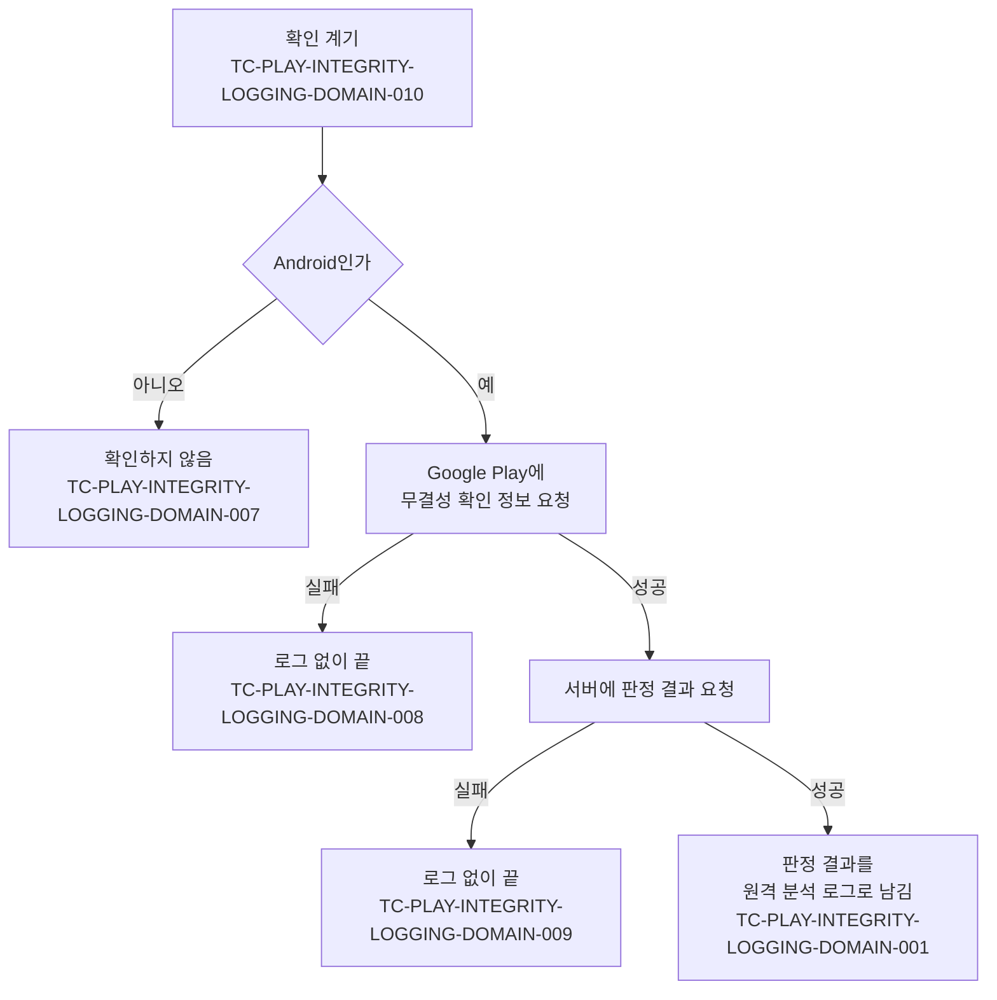

# Play Integrity 판정 기록 테스트 케이스

기준 스펙: [Play Integrity 판정 기록 스펙(client)](../spec/client/play-integrity-logging.md), [Play Integrity 판정 기록 스펙(common)](../spec/common/play-integrity-logging.md), [Play Integrity 판정 기록 스펙(server)](../spec/server/play-integrity-logging.md)

각 케이스의 `근거`는 절이 있는 스펙 폴더를 앞에 붙여 `client > domain > 절 이름`처럼 적는다.

## domain

### TC-PLAY-INTEGRITY-LOGGING-DOMAIN-001: 판정 결과를 계층 없이 원격 분석 로그로 남긴다

- 근거: `client > domain > 계층 없는 전달`, `client > domain > 원격 분석 로그`
- Given: Google Play가 무결성 확인 정보를 발급하고, 서버가 테스트 데이터의 항목을 여러 단계로 묶은 판정 결과를 돌려준다.
- When: 판정을 확인한다.
- Then: 사건 종류가 `play_integrity`인 원격 분석 로그가 한 번 남고, 로그의 값은 테스트 데이터의 값 이름과 값을 한 단계 목록으로 모두 담는다.
- 테스트 데이터:

| 판정 결과의 위치 | 로그 값 이름 |
| --- | --- |
| `requestDetails.requestPackageName` | `request_package_name` |
| `requestDetails.requestHash` | `request_hash` |
| `requestDetails.timestampMillis` | `timestamp_millis` |
| `appIntegrity.appRecognitionVerdict` | `app_recognition_verdict` |
| `appIntegrity.packageName` | `package_name` |
| `appIntegrity.certificateSha256Digest` | `certificate_sha256_digest` |
| `appIntegrity.versionCode` | `version_code` |
| `deviceIntegrity.deviceRecognitionVerdict` | `device_recognition_verdict` |
| `deviceIntegrity.deviceAttributes.sdkVersion` | `sdk_version` |
| `deviceIntegrity.recentDeviceActivity.deviceActivityLevel` | `device_activity_level` |
| `accountDetails.appLicensingVerdict` | `app_licensing_verdict` |
| `environmentDetails.appAccessRiskVerdict.appsDetected` | `apps_detected` |
| `environmentDetails.playProtectVerdict` | `play_protect_verdict` |

### TC-PLAY-INTEGRITY-LOGGING-DOMAIN-002: 같은 이름의 항목은 바로 위 묶음 이름을 붙여 구분한다

- 근거: `client > domain > 계층 없는 전달`
- Given: 서버가 돌려준 판정 결과의 `deviceIntegrity.deviceRecall.values.flag`와 `deviceIntegrity.deviceRecall.writeDates.flag`처럼 서로 다른 묶음에 같은 이름의 항목이 있다.
- When: 판정을 확인한다.
- Then: 로그에 `values_flag`와 `write_dates_flag`가 각자의 값으로 남고, 이름이 겹치지 않는 다른 항목은 가장 안쪽 이름 그대로 남는다.

### TC-PLAY-INTEGRITY-LOGGING-DOMAIN-003: 여러 값을 가진 항목은 받은 순서대로 쉼표로 잇는다

- 근거: `client > domain > 계층 없는 전달`
- Given: 서버가 돌려준 `deviceRecognitionVerdict`가 `MEETS_BASIC_INTEGRITY`, `MEETS_DEVICE_INTEGRITY` 순서의 두 값을 가진다.
- When: 판정을 확인한다.
- Then: 로그의 `device_recognition_verdict` 값은 문자열 `MEETS_BASIC_INTEGRITY,MEETS_DEVICE_INTEGRITY`다.

### TC-PLAY-INTEGRITY-LOGGING-DOMAIN-004: 값의 종류를 지켜 전달한다

- 근거: `client > domain > 계층 없는 전달`
- Given: 서버가 돌려준 판정 결과에 테스트 데이터의 값이 있다.
- When: 판정을 확인한다.
- Then: 로그에 각 값이 테스트 데이터의 로그 값으로 남는다.
- 테스트 데이터:

| 판정 결과의 값 | 로그 값 |
| --- | --- |
| 숫자 `34` | 숫자 `34` |
| 문자열 `"1617893780"` | 문자열 `1617893780` |
| 참 | 문자열 `true` |
| 거짓 | 문자열 `false` |

### TC-PLAY-INTEGRITY-LOGGING-DOMAIN-005: 값이 비어 있는 항목은 담지 않는다

- 근거: `client > domain > 계층 없는 전달`
- Given: 서버가 돌려준 판정 결과에 테스트 데이터의 빈 항목과 값이 있는 `appRecognitionVerdict`가 함께 있다.
- When: 판정을 확인한다.
- Then: 로그에 `app_recognition_verdict`는 남고, 빈 항목에서 나온 이름은 하나도 남지 않는다.
- 테스트 데이터:

| 빈 항목 |
| --- |
| 빈 목록인 `deviceRecognitionVerdict` |
| 아래 항목이 하나도 없는 묶음 `deviceIntegrity` |
| 아래 항목이 하나도 없는 묶음 `deviceAttributes` |
| 값이 없음으로 온 `deviceRecognitionVerdict` |

### TC-PLAY-INTEGRITY-LOGGING-DOMAIN-006: 알려지지 않은 새 항목도 그대로 전달한다

- 근거: `server > data > 판정 결과 요청 처리`, `client > domain > 계층 없는 전달`
- Given: 서버가 돌려준 판정 결과에 이 문서의 표에 없는 항목 `environmentDetails.newVerdict`가 값 `NEW_VALUE`로 담겨 있다.
- When: 판정을 확인한다.
- Then: 로그에 `new_verdict`가 `NEW_VALUE`로 남는다.

### TC-PLAY-INTEGRITY-LOGGING-DOMAIN-007: Android가 아닌 플랫폼에서는 확인하지 않는다

- 근거: `client > domain > 확인하는 기기`
- Given: 실행 중인 플랫폼이 데스크톱 앱이다.
- When: 판정을 확인한다.
- Then: 서버로 판정 결과 요청이 발생하지 않고, 원격 분석 로그가 남지 않으며, 오류 없이 끝난다.

### TC-PLAY-INTEGRITY-LOGGING-DOMAIN-008: 무결성 확인 정보를 받지 못하면 로그 없이 끝낸다

- 근거: `client > domain > 실패 처리`
- Given: Android에서 Google Play가 무결성 확인 정보 발급에 실패한다.
- When: 판정을 확인한다.
- Then: 서버로 판정 결과 요청이 발생하지 않고, 원격 분석 로그와 오류 보고가 남지 않으며, 확인은 오류 없이 끝난다.

### TC-PLAY-INTEGRITY-LOGGING-DOMAIN-009: 서버가 판정 결과를 돌려주지 못하면 로그 없이 끝낸다

- 근거: `client > domain > 실패 처리`
- Given: Google Play가 무결성 확인 정보를 발급하고, 서버가 판정 결과 요청에 실패로 답한다.
- When: 판정을 확인한다.
- Then: 원격 분석 로그와 오류 보고가 남지 않고, 확인은 오류 없이 끝난다.

### TC-PLAY-INTEGRITY-LOGGING-DOMAIN-010: 앱이 활성 상태가 될 때마다 확인한다

- 근거: `client > domain > 확인 계기`
- Given: Android 앱이 실행되어 있고 아직 활성 상태가 된 적이 없다.
- When: 앱이 활성 상태가 되고, 백그라운드로 갔다가, 다시 활성 상태가 된다.
- Then: 판정 확인이 활성 상태가 될 때마다 한 번씩, 모두 두 번 일어나고 백그라운드로 갈 때는 일어나지 않는다.

### TC-PLAY-INTEGRITY-LOGGING-DOMAIN-011: 확인 중 백그라운드로 가도 끝까지 진행해 로그를 남긴다

- 근거: `client > domain > 실행 경계`
- Given: Android 앱이 활성 상태가 되어 판정 확인이 시작되었고, 서버가 아직 답하지 않았다.
- When: 앱이 백그라운드로 간 뒤 서버가 판정 결과를 돌려준다.
- Then: 확인이 취소되지 않고 끝까지 진행되어, 사건 종류가 `play_integrity`인 원격 분석 로그가 한 번 남는다.

### TC-PLAY-INTEGRITY-LOGGING-DOMAIN-013: 앱이 보이는 동안 포커스만 오가는 것은 계기가 아니다

- 근거: `client > domain > 확인 계기`
- Given: Android 앱이 활성 상태이고 판정 확인이 한 번 일어났다.
- When: 앱이 보이는 채로 포커스를 잃었다가 다시 얻는다.
- Then: 판정 확인이 더 일어나지 않는다.

### TC-PLAY-INTEGRITY-LOGGING-DOMAIN-012: 원격 분석 한도를 넘는 부분은 잘라서 남긴다

- 근거: `client > domain > 원격 분석 로그`, [앱 로깅 스펙](../spec/client/app-logging.md)의 `domain > 원격 분석 기록`
- Given: 원격 분석 로그의 값에 테스트 데이터처럼 원격 분석 한도를 넘는 부분이 있다.
- When: 그 로그를 원격 분석 형식으로 바꾼다.
- Then: 테스트 데이터의 결과처럼 한도에 맞게 잘린 값으로 바뀌고, 로그 전체가 버려지지 않는다.
- 테스트 데이터:

| 한도를 넘는 부분 | 결과 |
| --- | --- |
| 값 26개 | 앞의 25개 값만 남는다 |
| 41자인 값 이름 | 앞 40자 이름으로 남는다 |
| 101자인 문자열 값 | 앞 100자 값으로 남는다 |

한도에 맞추는 규칙은 판정 결과 로그만의 규칙이 아니라 [앱 로깅](../spec/client/app-logging.md)의 `원격 분석 기록`이 모든 원격 분석 로그에 정한 것이다. 한도 바로 안쪽 값과 빈 값을 포함한 경계 케이스는 [앱 로깅 테스트 케이스](./app-logging.md)의 TC-APP-LOGGING-DOMAIN-015, TC-APP-LOGGING-DOMAIN-016이 갖고, 이 케이스는 그 가운데 판정 결과 로그에서 한도를 넘는 세 경우만 다룬다.

### TC-PLAY-INTEGRITY-LOGGING-DOMAIN-014: 로그인 여부와 관계없이 같은 계기에 같은 방식으로 확인한다

- 근거: `client > domain > 확인하는 기기`
- Given: Android에서 현재 계정이 테스트 데이터의 상태다.
- When: 앱이 활성 상태가 된다.
- Then: 판정 확인이 한 번 일어나고, 서버로 보내는 판정 결과 요청은 계정 상태와 관계없이 같은 정보를 담는다.
- 테스트 데이터:

| 계정 상태 |
| --- |
| 게스트 |
| 로그인한 사용자 |

- 작성하지 않는 이유: 계정 상태는 실제 로그인 세션으로만 정해지고, 로그인 세션은 서버로 보내는 요청에 Supabase가 붙이는 인증 정보로만 판정 확인과 이어진다. 실제 로그인 세션과 Supabase 없이 게스트와 로그인한 사용자의 요청을 만들어 비교할 수 없다. 로그인 세션을 게스트와 사용자로 바꿔 가며 서버로 나가는 요청을 관찰할 수 있는 서버 함수 호출 테스트 환경이 마련되면 작성한다.

### TC-PLAY-INTEGRITY-LOGGING-DOMAIN-015: Google Play 밖에서 설치했거나 Google Play 서비스가 없는 기기에서도 확인을 시도한다

- 근거: `client > domain > 확인하는 기기`
- Given: Android 기기가 테스트 데이터의 환경이다.
- When: 앱이 활성 상태가 된다.
- Then: 판정 확인을 시도하고, 무결성 확인 정보를 받지 못하면 로그 없이 끝나며, 판정 결과를 받으면 앱이나 기기를 인식하지 못했다는 판정이 그대로 로그에 남는다.
- 테스트 데이터:

| 기기 환경 |
| --- |
| Google Play 밖에서 설치한 앱 |
| Google Play 서비스가 없는 기기 |

- 작성하지 않는 이유: 판정 값을 Google이 정하므로 실제 기기와 Google Play 서버가 있어야 결과를 판정할 수 있다. 무결성 확인 정보 발급 실패는 TC-PLAY-INTEGRITY-LOGGING-DOMAIN-008이 덮는다. 실제 기기 환경별로 Google Play 응답을 받을 수 있는 기기 테스트 환경이 갖춰지면 자동화한다.

### TC-PLAY-INTEGRITY-LOGGING-DOMAIN-016: 화면이 재생성되어 다시 보이게 되면 한 번 더 확인한다

- 근거: `client > domain > 확인 계기`
- Given: Android 앱이 활성 상태이고 판정 확인이 한 번 일어났다.
- When: 화면 회전으로 화면이 재생성되어 다시 보이게 된다.
- Then: 판정 확인이 한 번 더 일어난다.

### TC-PLAY-INTEGRITY-LOGGING-DOMAIN-020: 확인 중 화면이 재생성되어도 끝까지 진행해 로그를 남긴다

- 근거: `client > domain > 실행 경계`
- Given: Android 앱이 활성 상태가 되어 판정 확인이 시작되었고, 서버가 아직 답하지 않았다.
- When: 화면이 재생성된 뒤 서버가 판정 결과를 돌려준다.
- Then: 먼저 시작한 확인이 취소되지 않고 끝까지 진행되어, 그 확인의 `play_integrity` 원격 분석 로그가 한 번 남는다.

### TC-PLAY-INTEGRITY-LOGGING-DOMAIN-017: 확인 중 앱 프로세스가 종료되면 로그를 남기지 않고 실패로 보지 않는다

- 근거: `client > domain > 실행 경계`
- Given: Android 앱이 활성 상태가 되어 판정 확인이 시작되었고, 서버가 아직 답하지 않았다.
- When: 앱 프로세스가 종료된다.
- Then: 그 계기의 원격 분석 로그와 오류 보고가 남지 않는다.
- 작성하지 않는 이유: 앱 프로세스 종료가 필요해 유닛 테스트로 결정적으로 검증할 수 없다. 프로세스를 종료하고 다시 시작할 수 있는 기기 테스트 환경이 갖춰지면 자동화한다.

### TC-PLAY-INTEGRITY-LOGGING-DOMAIN-018: Android에서 판정 결과 로그가 Google Analytics 4에 남는다

- 근거: `client > domain > 원격 분석 로그`
- Given: Android에서 원격 분석 기록 수단이 등록되어 있고 판정 확인이 성공한다.
- When: 판정 결과 로그가 남는다.
- Then: Google Analytics 4에 사건 종류가 `play_integrity`인 사건이 한 번 기록된다.
- 작성하지 않는 이유: 실제 Google Analytics 4 속성에 기록된 사건을 조회해야 판정할 수 있다. 기록 수단의 플랫폼 제약은 [앱 로깅 테스트 케이스](./app-logging.md)가 다룬다. 테스트용 Google Analytics 4 속성과 그 기록을 조회하는 수단이 갖춰지면 자동화한다.

### TC-PLAY-INTEGRITY-LOGGING-DOMAIN-019: 준비가 무효가 되면 그 계기는 실패로 끝나고 다음 계기에 다시 준비한다

- 근거: `client > domain > 확인 계기`, `client > domain > 실패 처리`
- Given: Android에서 Google Play에 확인을 요청할 준비를 한 번 마쳤고, Google Play가 다음 요청에 준비가 더 이상 유효하지 않다고 알린다.
- When: 앱이 활성 상태가 되어 판정을 확인하고, 그 뒤 다시 활성 상태가 된다.
- Then: 첫 계기는 로그와 오류 보고 없이 끝나고, 다음 계기에서 확인 준비를 다시 한 뒤 무결성 확인 정보를 요청한다.
- 작성하지 않는 이유: 준비가 무효라는 알림은 Google Play 라이브러리가 공개 생성 수단 없이 만드는 오류여서 단위 테스트에서 그 응답을 만들 수 없다. 라이브러리가 테스트용 응답을 제공하거나 확인 준비를 앱이 제어할 수 있는 경계로 감싸게 되면 자동화한다.

## data

### TC-PLAY-INTEGRITY-LOGGING-DATA-001: 서버에 무결성 확인 정보와 패키지 이름을 보내고 받은 판정 결과를 구조 그대로 돌려준다

- 근거: `client > data > 판정 결과 요청`, `common > data > 판정 결과 요청`
- Given: 서버가 여러 단계로 묶인 판정 결과로 답한다.
- When: 무결성 확인 정보와 패키지 이름으로 판정 결과를 요청한다.
- Then: 서버 요청에 그 무결성 확인 정보와 패키지 이름이 담기고, 서버가 답한 판정 결과가 구조를 바꾸지 않은 채 돌아온다.

### TC-PLAY-INTEGRITY-LOGGING-DATA-002: 확인마다 새 무작위 값을 요청 확인 값으로 담는다

- 근거: `client > domain > 요청 확인 값`
- Given: Android에서 Google Play가 무결성 확인 정보를 발급한다.
- When: 판정을 두 번 확인한다.
- Then: 두 번의 무결성 확인 정보 요청에 담긴 요청 확인 값이 서로 다르다.

### TC-PLAY-INTEGRITY-LOGGING-DATA-003: 서버는 무결성 확인 정보나 앱 패키지 이름이 비어 있는 요청을 거절한다

- 근거: `server > data > 판정 결과 요청 처리`
- Given: 서버에 테스트 데이터의 판정 결과 요청이 로그인 세션 없이 도착한다.
- When: 서버가 요청을 처리한다.
- Then: 테스트 데이터의 결과로 끝난다.
- 테스트 데이터:

| 요청 | 결과 |
| --- | --- |
| 무결성 확인 정보와 앱 패키지 이름이 모두 있음 | Google에 판정 결과를 요청한다 |
| 무결성 확인 정보가 비어 있음 | 거절하고 Google에 요청하지 않는다 |
| 앱 패키지 이름이 비어 있음 | 거절하고 Google에 요청하지 않는다 |

- 작성하지 않는 이유: 서버의 요청 검증 규칙이어서 서버 함수 실행 환경에서만 판정할 수 있고, 그 환경은 저장소의 자동 검증 절차에 포함되어 있지 않다. 서버 함수 테스트 러너가 검증 절차에 들어오면 자동화한다.

### TC-PLAY-INTEGRITY-LOGGING-DATA-004: 서버는 Google이 풀지 않은 정보에 판정 결과 없이 실패를 돌려준다

- 근거: `server > data > 판정 결과 요청 처리`
- Given: 서버에 다른 앱이 발급받았거나 위조한 무결성 확인 정보가 담긴 요청이 도착한다.
- When: 서버가 Google에 판정 결과를 요청한다.
- Then: 서버는 판정 결과 없이 실패를 돌려주고 서버 오류 기록으로 남긴다.
- 작성하지 않는 이유: 정보를 풀지 여부는 Google 서버가 정하므로 앱이나 저장소의 테스트 환경에서 제어할 수 없다. Google의 판정 응답을 대신하는 서버 함수 테스트 환경이 갖춰지면 자동화한다.
