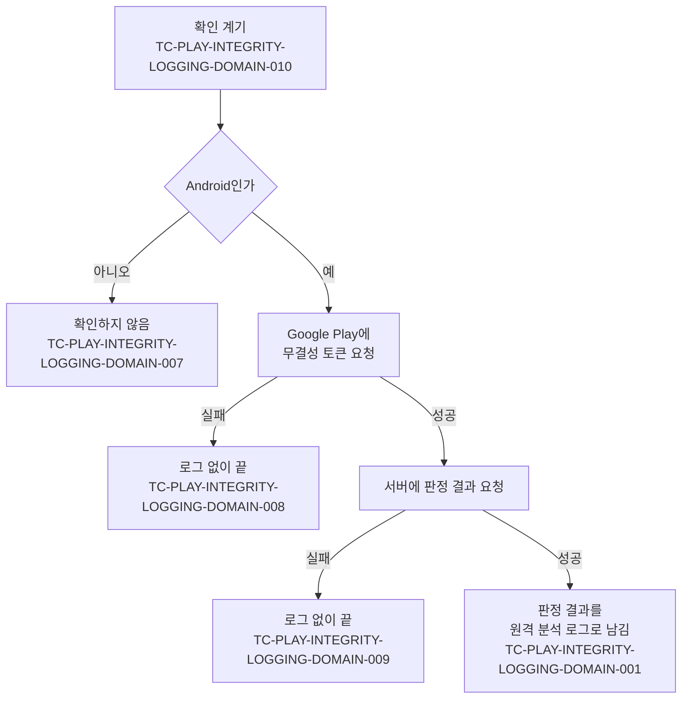

# Play Integrity 판정 로깅 테스트 케이스

기준 스펙: [Play Integrity 판정 로깅 스펙](../spec/play-integrity-logging.md)

## domain

### TC-PLAY-INTEGRITY-LOGGING-DOMAIN-001: 판정 결과를 계층 없이 원격 분석 로그로 남긴다

- 근거: `domain > 계층 없는 전달`, `domain > 원격 분석 로그`
- Given: Google Play가 무결성 토큰을 발급하고, 서버가 테스트 데이터의 필드를 겹친 구조로 담은 판정 결과를 돌려준다.
- When: 판정을 확인한다.
- Then: 사건 종류가 `play_integrity`인 원격 분석 로그가 한 번 남고, 로그의 값은 테스트 데이터의 필드 이름과 값을 한 단계 목록으로 모두 담는다.
- 테스트 데이터:

| 판정 결과의 위치 | 로그 필드 이름 |
| --- | --- |
| `requestDetails.requestPackageName` | `request_package_name` |
| `requestDetails.requestHash` | `request_hash` |
| `requestDetails.timestampMillis` | `timestamp_millis` |
| `appIntegrity.appRecognitionVerdict` | `app_recognition_verdict` |
| `appIntegrity.packageName` | `package_name` |
| `appIntegrity.certificateSha256Digest` | `certificate_sha256_digest` |
| `appIntegrity.versionCode` | `version_code` |
| `deviceIntegrity.deviceRecognitionVerdict` | `device_recognition_verdict` |
| `deviceIntegrity.deviceAttributes.sdkVersion` | `sdk_version` |
| `deviceIntegrity.recentDeviceActivity.deviceActivityLevel` | `device_activity_level` |
| `accountDetails.appLicensingVerdict` | `app_licensing_verdict` |
| `environmentDetails.appAccessRiskVerdict.appsDetected` | `apps_detected` |
| `environmentDetails.playProtectVerdict` | `play_protect_verdict` |

### TC-PLAY-INTEGRITY-LOGGING-DOMAIN-002: 같은 이름의 필드는 바로 위 필드 이름을 붙여 구분한다

- 근거: `domain > 계층 없는 전달`
- Given: 서버가 돌려준 판정 결과의 `deviceIntegrity.deviceRecall.values.flag`와 `deviceIntegrity.deviceRecall.writeDates.flag`처럼 서로 다른 위치에 같은 이름의 필드가 있다.
- When: 판정을 확인한다.
- Then: 로그에 `values_flag`와 `write_dates_flag`가 각자의 값으로 남고, 이름이 겹치지 않는 다른 필드는 가장 안쪽 이름 그대로 남는다.

### TC-PLAY-INTEGRITY-LOGGING-DOMAIN-003: 여러 값을 가진 필드는 받은 순서대로 쉼표로 잇는다

- 근거: `domain > 계층 없는 전달`
- Given: 서버가 돌려준 `deviceRecognitionVerdict`가 `MEETS_BASIC_INTEGRITY`, `MEETS_DEVICE_INTEGRITY` 순서의 두 값을 가진다.
- When: 판정을 확인한다.
- Then: 로그의 `device_recognition_verdict` 값은 문자열 `MEETS_BASIC_INTEGRITY,MEETS_DEVICE_INTEGRITY`다.

### TC-PLAY-INTEGRITY-LOGGING-DOMAIN-004: 값의 종류를 지켜 전달한다

- 근거: `domain > 계층 없는 전달`
- Given: 서버가 돌려준 판정 결과에 테스트 데이터의 값이 있다.
- When: 판정을 확인한다.
- Then: 로그에 각 값이 테스트 데이터의 로그 값으로 남는다.
- 테스트 데이터:

| 판정 결과의 값 | 로그 값 |
| --- | --- |
| 숫자 `34` | 숫자 `34` |
| 문자열 `"1617893780"` | 문자열 `1617893780` |
| 참 | 문자열 `true` |
| 거짓 | 문자열 `false` |

### TC-PLAY-INTEGRITY-LOGGING-DOMAIN-005: 값이 비어 있는 필드는 담지 않는다

- 근거: `domain > 계층 없는 전달`
- Given: 서버가 돌려준 판정 결과에 테스트 데이터의 빈 필드와 값이 있는 `appRecognitionVerdict`가 함께 있다.
- When: 판정을 확인한다.
- Then: 로그에 `app_recognition_verdict`는 남고, 빈 필드에서 나온 이름은 하나도 남지 않는다.
- 테스트 데이터:

| 빈 필드 |
| --- |
| 빈 목록인 `deviceRecognitionVerdict` |
| 하위 필드가 없는 `deviceIntegrity` |
| 하위 필드가 없는 `deviceAttributes` |

### TC-PLAY-INTEGRITY-LOGGING-DOMAIN-006: 알려지지 않은 새 필드도 그대로 전달한다

- 근거: `domain > 판정 결과`
- Given: 서버가 돌려준 판정 결과에 이 문서의 표에 없는 필드 `environmentDetails.newVerdict`가 값 `NEW_VALUE`로 담겨 있다.
- When: 판정을 확인한다.
- Then: 로그에 `new_verdict`가 `NEW_VALUE`로 남는다.

### TC-PLAY-INTEGRITY-LOGGING-DOMAIN-007: Android가 아닌 플랫폼에서는 확인하지 않는다

- 근거: `domain > 확인하는 기기`
- Given: 실행 중인 플랫폼이 JVM 데스크톱이다.
- When: 판정을 확인한다.
- Then: 서버로 판정 결과 요청이 발생하지 않고, 원격 분석 로그가 남지 않으며, 오류 없이 끝난다.

### TC-PLAY-INTEGRITY-LOGGING-DOMAIN-008: 무결성 토큰을 받지 못하면 로그 없이 끝낸다

- 근거: `domain > 실패 처리`
- Given: Android에서 Google Play가 무결성 토큰 발급에 실패한다.
- When: 판정을 확인한다.
- Then: 서버로 판정 결과 요청이 발생하지 않고, 원격 분석 로그와 오류 보고가 남지 않으며, 확인은 오류를 던지지 않고 끝난다.

### TC-PLAY-INTEGRITY-LOGGING-DOMAIN-009: 서버가 판정 결과를 돌려주지 못하면 로그 없이 끝낸다

- 근거: `domain > 실패 처리`
- Given: Google Play가 무결성 토큰을 발급하고, 서버가 판정 결과 요청에 실패로 답한다.
- When: 판정을 확인한다.
- Then: 원격 분석 로그와 오류 보고가 남지 않고, 확인은 오류를 던지지 않고 끝난다.

### TC-PLAY-INTEGRITY-LOGGING-DOMAIN-010: 앱이 활성 상태가 될 때마다 확인한다

- 근거: `domain > 확인 계기`
- Given: Android 앱이 실행되어 있고 아직 활성 상태가 된 적이 없다.
- When: 앱이 활성 상태가 되고, 백그라운드로 갔다가, 다시 활성 상태가 된다.
- Then: 판정 확인이 활성 상태가 될 때마다 한 번씩, 모두 두 번 일어나고 백그라운드로 갈 때는 일어나지 않는다.

### TC-PLAY-INTEGRITY-LOGGING-DOMAIN-011: 확인 중 백그라운드로 가도 끝까지 진행해 로그를 남긴다

- 근거: `domain > 실행 경계`
- Given: Android 앱이 활성 상태가 되어 판정 확인이 시작되었고, 서버가 아직 답하지 않았다.
- When: 앱이 백그라운드로 간 뒤 서버가 판정 결과를 돌려준다.
- Then: 확인이 취소되지 않고 끝까지 진행된다.

### TC-PLAY-INTEGRITY-LOGGING-DOMAIN-013: 앱이 보이는 동안 포커스만 오가는 것은 계기가 아니다

- 근거: `domain > 확인 계기`
- Given: Android 앱이 활성 상태이고 판정 확인이 한 번 일어났다.
- When: 앱이 보이는 채로 포커스를 잃었다가 다시 얻는다.
- Then: 판정 확인이 더 일어나지 않는다.

### TC-PLAY-INTEGRITY-LOGGING-DOMAIN-012: 원격 분석 한도를 넘는 부분은 잘라서 남긴다

- 근거: `domain > 원격 분석 로그`
- Given: 원격 분석 로그의 값에 테스트 데이터처럼 원격 분석 한도를 넘는 부분이 있다.
- When: 그 로그를 원격 분석 형식으로 바꾼다.
- Then: 테스트 데이터의 결과처럼 한도에 맞게 잘린 값으로 바뀌고, 로그 전체가 버려지지 않는다.
- 테스트 데이터:

| 한도를 넘는 부분 | 결과 |
| --- | --- |
| 필드 26개 | 앞의 25개 필드만 남는다 |
| 41자인 필드 이름 | 앞 40자 이름으로 남는다 |
| 101자인 문자열 값 | 앞 100자 값으로 남는다 |

## data

### TC-PLAY-INTEGRITY-LOGGING-DATA-001: 서버에 토큰과 패키지 이름을 보내고 받은 판정 결과를 구조 그대로 돌려준다

- 근거: `data > 판정 결과 요청`
- Given: 서버가 겹친 구조의 판정 결과로 답한다.
- When: 무결성 토큰과 패키지 이름으로 판정 결과를 요청한다.
- Then: 서버 요청 본문에 그 토큰과 패키지 이름이 담기고, 서버가 답한 판정 결과가 구조를 바꾸지 않은 채 돌아온다.

### TC-PLAY-INTEGRITY-LOGGING-DATA-002: 확인마다 새 무작위 값을 요청 해시로 담는다

- 근거: `domain > 판정 결과`
- Given: Android에서 Google Play가 무결성 토큰을 발급한다.
- When: 판정을 두 번 확인한다.
- Then: 두 번의 토큰 요청에 담긴 요청 해시가 서로 다르다.

## 작성하지 않는 이유

- `domain > 확인하는 기기`의 로그인 여부와 무관한 확인: 확인이 계정 상태를 입력으로 받지 않아 계정 상태를 제어할 경계가 없다.
- `domain > 확인하는 기기`의 Google Play 밖 설치, Google Play 서비스 없는 기기: 판정 값을 Google이 정하므로 실제 기기와 Google Play 서버가 필요하다. 토큰 발급 실패는 TC-PLAY-INTEGRITY-LOGGING-DOMAIN-008이 덮는다.
- `domain > 확인 계기`의 화면 재생성 시 재확인: 화면 재생성은 앱이 다시 활성 상태가 되는 것과 같은 계기로 판정되므로 TC-PLAY-INTEGRITY-LOGGING-DOMAIN-010이 덮는다. 실제 재생성은 기기에서 화면을 회전해 확인한다.
- `domain > 실행 경계`의 앱 프로세스 종료로 인한 중단: 앱 프로세스 종료가 필요해 유닛 테스트로 결정적으로 검증할 수 없다.
- `domain > 원격 분석 로그`의 Android에서 Google Analytics 4에 실제로 남는지: 실제 Google Analytics 4 속성이 필요하다. 기록 수단의 플랫폼 제약은 [앱 로깅 테스트 케이스](./app-logging.md)가 다룬다.
- `data > 판정 결과 요청`의 Google이 다른 앱의 토큰이나 위조한 토큰을 풀지 않음: Google 서버의 동작이라 앱에서 제어할 수 없다.
