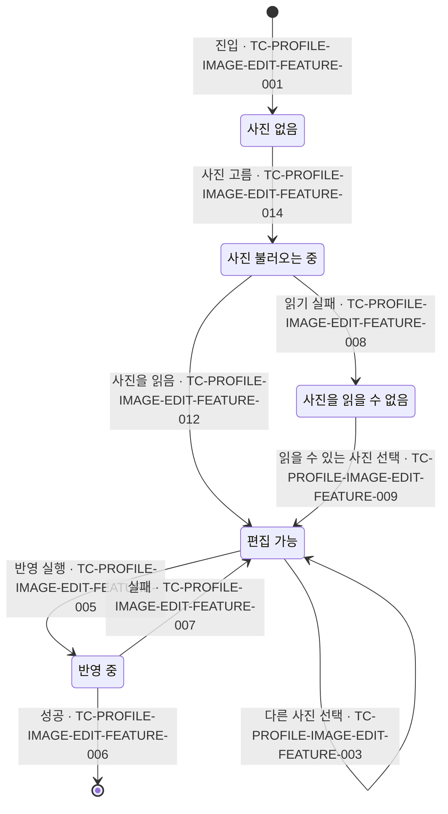

# ProfileImageEdit 테스트 케이스

기준 스펙: [ProfileImageEdit 화면 스펙](../spec/client/profile-image-edit.md)

## feature

### TC-PROFILE-IMAGE-EDIT-FEATURE-001: 진입하면 사진이 없는 상태로 시작하고 반영을 실행할 수 없다

- 근거: `feature > 진입`
- Given: ProfileImageEdit 화면에 진입한다.
- When: 사용자가 화면을 확인한다.
- Then: 사진을 골라야 한다는 안내가 표시되고, 반영 실행은 선택할 수 없으며 사진 선택은 선택할 수 있다.

### TC-PROFILE-IMAGE-EDIT-FEATURE-002: 사진 선택을 실행하면 사진 선택 도구를 연다

- 근거: `feature > 사진 고르기`
- Given: ProfileImageEdit 화면이 표시되어 있다.
- When: 사용자가 사진 선택을 실행한다.
- Then: 기기의 사진 선택 도구를 여는 요청이 한 번 이루어진다.

### TC-PROFILE-IMAGE-EDIT-FEATURE-012: 사진을 고르면 그 사진이 표시되고 반영을 실행할 수 있다

- 근거: `feature > 사진 고르기`
- Given: 사진이 없는 상태이고 사진 선택 도구가 열려 있다.
- When: 사용자가 읽을 수 있는 사진을 고른다.
- Then: 고른 사진이 표시되고 사진 선택 안내가 사라지며, 반영 실행과 사진 선택을 선택할 수 있다.

### TC-PROFILE-IMAGE-EDIT-FEATURE-014: 고른 사진을 읽는 동안 불러오는 중을 표시하고 반영을 실행할 수 없다

- 근거: `feature > 사진 고르기`, `domain > 반영 실행 조건`
- Given: 사진이 없는 상태이고 사진 선택 도구가 열려 있으며, 고를 사진의 읽기가 끝나지 않도록 제어되어 있다.
- When: 사용자가 그 사진을 고른다.
- Then: 불러오는 중임이 표시되고, 사진 선택 안내는 사라지며 반영 실행은 선택할 수 없다.

### TC-PROFILE-IMAGE-EDIT-FEATURE-003: 다른 사진을 고르면 새 사진의 처음 상태로 바뀐다

- 근거: `feature > 사진 고르기`
- Given: 읽을 수 있는 사진이 표시되어 있고 사용자가 남길 영역을 처음 상태와 다르게 옮겼으며, 사진 선택 도구가 열려 있다.
- When: 사용자가 읽을 수 있는 다른 사진을 고른 뒤 반영을 실행한다.
- Then: 새 사진이 표시되고, 반영 요청에는 새 사진의 위치와 새 사진 기준 처음 상태의 남길 영역이 담긴다.

### TC-PROFILE-IMAGE-EDIT-FEATURE-004: 사진 선택을 취소하면 보고 있던 사진과 영역을 유지한다

- 근거: `feature > 사진 고르기`
- Given: 읽을 수 있는 사진이 표시되어 있고 사용자가 남길 영역을 처음 상태와 다르게 옮겼으며, 사진 선택 도구가 열려 있다.
- When: 사용자가 사진을 고르지 않고 취소한 뒤 반영을 실행한다.
- Then: 보고 있던 사진이 그대로 표시되고, 반영 요청에는 그 사진의 위치와 옮긴 남길 영역이 담긴다.

### TC-PROFILE-IMAGE-EDIT-FEATURE-013: 사진이 없을 때 사진 선택을 취소하면 사진이 없는 상태를 유지한다

- 근거: `feature > 사진 고르기`
- Given: 사진이 없는 상태이고 사진 선택 도구가 열려 있다.
- When: 사용자가 사진을 고르지 않고 취소한다.
- Then: 사진을 골라야 한다는 안내가 그대로 표시되고 반영 실행은 선택할 수 없다.

### TC-PROFILE-IMAGE-EDIT-FEATURE-005: 반영 중에는 진행 상태를 표시하고 다른 조작을 할 수 없다

- 근거: `feature > 반영 실행`
- Given: 읽을 수 있는 사진이 표시되어 있고, 프로필 이미지 반영 요청이 끝나지 않도록 제어되어 있다.
- When: 사용자가 반영을 실행한다.
- Then: 진행 상태가 표시되고, 사진 선택과 반영 실행을 선택할 수 없으며, 사진을 옮기거나 확대해도 남길 영역이 바뀌지 않는다. 반영 처리가 끝난 뒤 다시 반영을 실행하면 요청에 반영 중 조작하기 전의 남길 영역이 담긴다.

### TC-PROFILE-IMAGE-EDIT-FEATURE-006: 반영에 성공하면 이전 화면으로 돌아간다

- 근거: `feature > 반영 실행`
- Given: 읽을 수 있는 사진이 표시되어 있고, 프로필 이미지 반영 요청이 성공하도록 제어되어 있다.
- When: 사용자가 반영을 실행한다.
- Then: 이전 화면으로 돌아가는 동작이 한 번 실행된다.

### TC-PROFILE-IMAGE-EDIT-FEATURE-007: 반영에 실패하면 화면을 유지하고 실패를 알린다

- 근거: `feature > 반영 실행`
- Given: 읽을 수 있는 사진이 표시되어 있고 사용자가 남길 영역을 처음 상태와 다르게 옮겼으며, 프로필 이미지 반영 요청이 실패하도록 제어되어 있다.
- When: 사용자가 반영을 실행한다.
- Then: 이전 화면으로 돌아가는 동작이 실행되지 않고 반영 실패 안내가 표시되며, 보고 있던 사진이 그대로 표시되고 사진 선택과 반영 실행을 다시 선택할 수 있다. 다시 반영을 실행하면 요청에 옮긴 남길 영역이 그대로 담긴다.

### TC-PROFILE-IMAGE-EDIT-FEATURE-008: 사진을 읽을 수 없으면 읽기 실패를 알리고 반영을 실행할 수 없다

- 근거: `feature > 사진을 읽을 수 없는 경우`
- Given: 사진 선택 도구가 열려 있다.
- When: 사용자가 읽을 수 없는 사진을 고른다.
- Then: 사진을 읽을 수 없다는 안내가 표시되고, 반영 실행은 선택할 수 없으며 사진 선택은 선택할 수 있다.

### TC-PROFILE-IMAGE-EDIT-FEATURE-009: 읽을 수 없는 상태에서 읽을 수 있는 사진을 고르면 반영을 실행할 수 있다

- 근거: `feature > 사진을 읽을 수 없는 경우`
- Given: 사진을 읽을 수 없다는 안내가 표시되어 있고 사진 선택 도구가 열려 있다.
- When: 사용자가 읽을 수 있는 사진을 고른다.
- Then: 고른 사진이 표시되고 읽기 실패 안내가 사라지며 반영 실행을 선택할 수 있다.

### TC-PROFILE-IMAGE-EDIT-FEATURE-010: 뒤로가면 반영하지 않고 이전 화면으로 돌아간다

- 근거: `feature > 뒤로가기`
- Given: 읽을 수 있는 사진이 표시되어 있고 사용자가 남길 영역을 처음 상태와 다르게 옮겼다.
- When: 사용자가 뒤로가기를 선택한다.
- Then: 이전 화면으로 돌아가는 동작이 한 번 실행되고 프로필 이미지 반영 요청은 이루어지지 않는다.

### TC-PROFILE-IMAGE-EDIT-FEATURE-011: 반영 중에 뒤로가면 결과를 기다리지 않고 돌아간다

- 근거: `feature > 뒤로가기`
- Given: 프로필 이미지 반영 요청이 끝나지 않도록 제어되어 있고 반영이 진행 중이다.
- When: 사용자가 뒤로가기를 선택한다.
- Then: 반영 결과가 오기 전에 이전 화면으로 돌아가는 동작이 한 번 실행된다.

### 반영 중단과 이미 반영된 결과

- 근거: `feature > 뒤로가기`
- 작성하지 않는 이유: 진행 중이던 반영이 중단되는 것과 중단 전에 이미 계정에 반영된 결과가 유지되는 것은 서버와 인증 제공자에 남은 상태라 화면 경계에서 관찰할 수 없다. 자동화하려면 실제 서버와 인증 제공자의 상태를 요청 도중에 조회하는 수단이 필요하다.

## domain

### TC-PROFILE-IMAGE-EDIT-DOMAIN-001: 처음 상태의 남길 영역은 사진 가운데의 짧은 변 정사각형이다

- 근거: `domain > 남길 영역`
- Given: 사용자가 테스트 데이터의 크기를 가진 읽을 수 있는 사진을 골라 표시되어 있다.
- When: 사용자가 남길 영역을 바꾸지 않고 반영을 실행한다.
- Then: 반영 요청의 남길 영역이 사진 전체를 기준으로 테스트 데이터의 비율이다.
- 테스트 데이터:

| 사진 크기 | 가로 시작 | 가로 끝 | 세로 시작 | 세로 끝 |
| --- | --- | --- | --- | --- |
| 가로 400, 세로 200 | 0.25 | 0.75 | 0 | 1 |
| 가로 200, 세로 400 | 0 | 1 | 0.25 | 0.75 |
| 가로 300, 세로 300 | 0 | 1 | 0 | 1 |

### TC-PROFILE-IMAGE-EDIT-DOMAIN-002: 사진을 어느 방향으로 밀어도 남길 영역은 사진 안에 머문다

- 근거: `feature > 남길 영역 정하기`, `domain > 남길 영역`
- Given: 가로가 세로보다 긴 읽을 수 있는 사진이 표시되어 있다.
- When: 사용자가 사진을 테스트 데이터의 방향으로 사진 크기보다 멀리 민 뒤 반영을 실행한다.
- Then: 반영 요청의 남길 영역이 사진 안에 있고, 한 변의 비율이 처음 상태와 같으며, 민 방향의 반대쪽 사진 가장자리에 붙는다.
- 테스트 데이터:

| 민 방향 | 붙는 가장자리 |
| --- | --- |
| 시작 쪽 | 끝 쪽 |
| 끝 쪽 | 시작 쪽 |

### TC-PROFILE-IMAGE-EDIT-DOMAIN-003: 처음 상태보다 작게 줄일 수 없다

- 근거: `feature > 남길 영역 정하기`, `domain > 남길 영역`
- Given: 읽을 수 있는 사진이 처음 상태로 표시되어 있다.
- When: 사용자가 사진을 줄이는 조작을 한 뒤 반영을 실행한다.
- Then: 반영 요청의 남길 영역이 처음 상태와 같다.

### TC-PROFILE-IMAGE-EDIT-DOMAIN-004: 남길 영역의 한 변은 처음 상태의 5분의 1까지만 줄어든다

- 근거: `domain > 남길 영역`
- Given: 읽을 수 있는 사진이 처음 상태로 표시되어 있다.
- When: 사용자가 사진을 한도보다 크게 키우는 조작을 한 뒤 반영을 실행한다.
- Then: 반영 요청의 남길 영역 한 변의 비율이 처음 상태의 5분의 1과 같다.

### TC-PROFILE-IMAGE-EDIT-DOMAIN-005: 반영 처리 중에 전달된 반영 요청은 처리하지 않는다

- 근거: `domain > 반영 실행 조건`
- Given: 읽을 수 있는 사진이 표시되어 있고, 프로필 이미지 반영 요청이 끝나지 않도록 제어되어 있다.
- When: 사용자가 반영을 연달아 두 번 실행한다.
- Then: 프로필 이미지 반영 요청이 한 번만 이루어진다.

### TC-PROFILE-IMAGE-EDIT-DOMAIN-006: 화면이 재생성되어도 사진과 남길 영역을 유지한다

- 근거: `domain > 실행 경계`
- Given: 사용자가 읽을 수 있는 사진을 골라 표시되어 있고 남길 영역을 처음 상태와 다르게 옮겼다.
- When: 화면이 시스템에 의해 재생성된 뒤 사용자가 반영을 실행한다.
- Then: 같은 사진이 표시되고, 반영 요청에 재생성 전에 옮긴 남길 영역이 그대로 담긴다.

### TC-PROFILE-IMAGE-EDIT-DOMAIN-007: 사진을 고르기 전에 화면이 재생성되어도 사진이 없는 상태를 유지한다

- 근거: `domain > 실행 경계`
- Given: 사진이 없는 상태다.
- When: 화면이 시스템에 의해 재생성된다.
- Then: 사진을 골라야 한다는 안내가 표시되고 반영 실행은 선택할 수 없다.

### 앱 정리 뒤 복원과 재진입

- 근거: `domain > 실행 경계`
- 작성하지 않는 이유: 시스템이 앱을 메모리에서 정리한 뒤 복원할 때 사진을 읽을 수 있는지는 기기가 고른 사진에 준 접근 권한이 정하고, 화면을 떠난 뒤 다시 진입하는 흐름은 MoreHome 화면과 사진 선택 도구를 함께 통과해야 한다. 자동화하려면 프로세스 종료와 복원, 여러 화면을 오가는 내비게이션을 제어할 수 있는 테스트 환경이 필요하다.

## data

### TC-PROFILE-IMAGE-EDIT-DATA-001: 반영을 실행하면 사진의 위치와 비율로 표현한 남길 영역으로 프로필 이미지를 바꾸도록 요청한다

- 근거: `data > 반영 요청`
- Given: 사용자가 읽을 수 있는 사진을 골라 표시되어 있다.
- When: 사용자가 반영을 실행한다.
- Then: 고른 사진의 위치와 사진 전체를 기준으로 한 비율의 남길 영역을 담아 저장된 사용자 정보의 프로필 이미지를 바꾸는 요청이 한 번 이루어진다.
