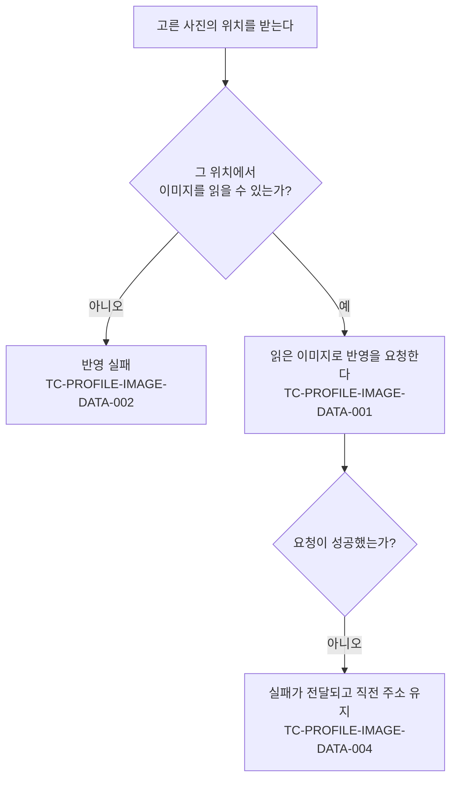

# 프로필 이미지 변경 테스트 케이스

기준 스펙: [프로필 이미지 변경 스펙](../spec/profile-image.md)

## domain

### 반영할 수 있는 이미지

- 근거: `domain > 반영할 수 있는 이미지`
- 작성하지 않는 이유: 허용하는 형식과 크기는 원격이 판정하므로, 앱은 조건을 만족하지 않는 사진도 똑같이 반영을 요청하고 실패를 받는다. 앱 경계에서는 다른 실패와 구분할 수 없다. 자동화하려면 실제 원격에 형식과 크기별 이미지를 올려 응답을 비교하는 수단이 필요하다.

### 보관하는 프로필 이미지

- 근거: `domain > 보관하는 프로필 이미지`
- 작성하지 않는 이유: 계정마다 이미지 하나만 남기는 것과 주소만으로 조회할 수 있는 것은 원격 저장소가 보장하는 결과라 앱 경계에서 관찰할 수 없다. 자동화하려면 실제 원격 저장소에 올린 뒤 이전 주소와 새 주소를 조회하는 수단이 필요하다.

## data

### TC-PROFILE-IMAGE-DATA-001: 고른 사진에서 읽은 이미지 내용과 형식을 반영 요청에 담는다

- 근거: `data > 반영 흐름`
- Given: 고른 사진의 위치에서 이미지 내용과 형식을 읽을 수 있다.
- When: 그 위치로 프로필 이미지 반영을 시작한다.
- Then: 반영 요청에 그 위치에서 읽은 이미지 내용과 형식이 그대로 담긴다.

### TC-PROFILE-IMAGE-DATA-002: 고른 사진을 읽지 못하면 반영을 요청하지 않고 실패한다

- 근거: `data > 반영 흐름`
- Given: 고른 사진의 위치에서 이미지를 읽는 데 실패한다.
- When: 그 위치로 프로필 이미지 반영을 시작한다.
- Then: 프로필 이미지 반영 요청이 이루어지지 않고 실패가 전달된다.

### 반영 결과의 전달

- 근거: `data > 반영 결과의 전달`
- 작성하지 않는 이유: 반영은 사용자 정보를 다시 확인하도록 요구하지 않으므로, 새 주소가 계정에 나타나는 것은 인증 제공자의 사용자 정보를 다시 확인할 때 성립한다. 그 경로는 [계정 조회 테스트 케이스](./account.md)의 `TC-ACCOUNT-DATA-002`가 이미 덮는다.

### TC-PROFILE-IMAGE-DATA-004: 반영에 실패하면 프로필 이미지가 직전 주소를 유지한다

- 근거: `domain > 반영 실패 시 상태`, `data > 반영 흐름`
- Given: 계정의 프로필 이미지가 직전 주소이고, 프로필 이미지 반영 요청이 실패한다.
- When: 고른 사진으로 프로필 이미지 반영을 시작한다.
- Then: 실패가 전달되고 저장된 사용자 정보의 프로필 이미지가 직전 주소를 유지한다.

### 계정에 반영하지 못한 이미지 정리

- 근거: `data > 반영 흐름`
- 작성하지 않는 이유: 올린 이미지를 버리는 것은 원격이 한 요청 안에서 처리하는 결과라 앱이 보낸 요청과 받은 응답만으로는 구분할 수 없다. 자동화하려면 실제 원격 저장소의 남은 파일을 조회하는 수단이 필요하다.
