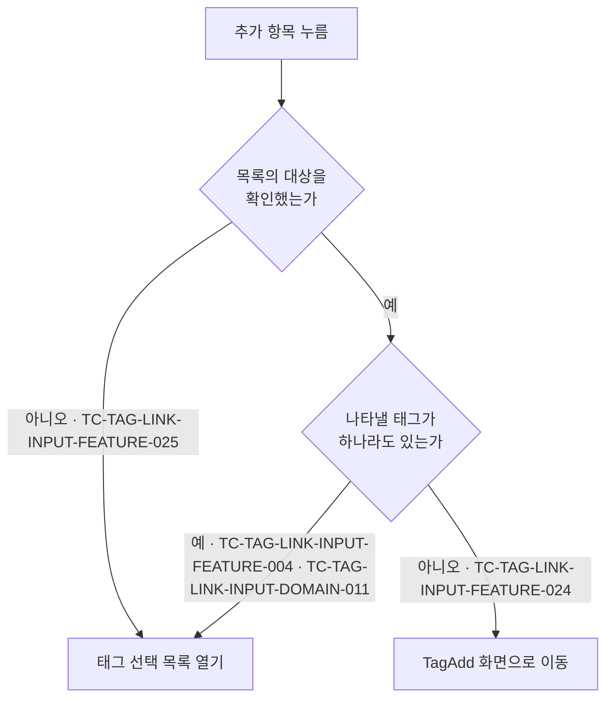

# 태그 연결 입력 컴포넌트 테스트 케이스

기준 스펙: [태그 연결 입력 컴포넌트 스펙](../spec/client/tag-link-input.md)

이 문서에서 `domain > 추가 항목의 동작 판정`, `domain > 추가한 태그의 자동 선택`, `domain > 태그 검색어`, `domain > 태그 선택 목록의 열림 상태`, `feature > 선택 상태 표시`, `feature > 태그 검색`, `feature > 태그 상세 이동`, `feature > 태그 선택 목록`, `feature > 태그 선택과 해제`, `feature > 태그 추가 이동` 절은 [태그 선택 입력 공통 스펙](../spec/client/tag-select-input.md)이 소유한다. 나머지 케이스의 절은 기준 스펙이 소유한다.

이 문서의 케이스는 TagAdd 화면과 TagDetail 화면에서 같은 결과로 판정된다. 사용자가 반영한 연결이 언제 저장된 연결이 되는지는 [TagAdd 테스트 케이스](./tag-add.md)와 [TagDetail 테스트 케이스](./tag-detail.md)에서 다룬다.

검색어의 정규화와 일치 판정, 검색 결과 없음 판정은 [검색어 일치 판정 스펙](../spec/client/search-match.md)에 위임되어 있으며, 태그 선택 목록에서의 결과를 이 문서의 케이스로 덮는다.

완료된 태그를 연결 대상으로 표시하는지와 출발 태그를 선택 대상에서 제외하는지는 화면마다 다르므로 이 문서에서 다루지 않는다. TagAdd 화면의 케이스는 [TagAdd 테스트 케이스](./tag-add.md)에서, TagDetail 화면의 케이스는 [TagDetail 테스트 케이스](./tag-detail.md)에서 다룬다.

## feature

### TC-TAG-LINK-INPUT-FEATURE-001: 연결한 태그가 이모지와 제목으로 표시된다

- 근거: `feature > 선택 상태 표시`
- Given: 이모지가 있는 태그와 이모지가 없는 태그가 연결 대상으로 표시된다.
- When: 사용자가 연결 입력을 확인한다.
- Then: 이모지가 있는 태그는 이모지와 제목이 함께 표시되고, 이모지가 없는 태그는 제목만 표시된다.

### TC-TAG-LINK-INPUT-FEATURE-002: 연결한 태그의 저장 내용이 바뀌면 연결 입력에 반영된다

- 근거: `feature > 선택 상태 표시`
- Given: 태그 하나가 연결 대상으로 표시되어 있다.
- When: 그 태그의 이모지, 제목 또는 컬러가 다른 경로에서 바뀐다.
- Then: 연결 입력에 바뀐 내용이 표시된다.

### TC-TAG-LINK-INPUT-FEATURE-003: 태그 연결 항목이 연결 입력에 항상 표시된다

- 근거: `feature > 태그 선택 목록`
- Given: 연결 대상으로 표시하는 태그가 테스트 데이터와 같다.
- When: 사용자가 연결 입력을 확인한다.
- Then: 연결 입력에 태그 연결 항목이 표시된다.
- 테스트 데이터:

| 연결 대상으로 표시하는 태그 |
| --- |
| 없음 |
| 태그 여러 개 |

추가 항목을 눌렀을 때의 동작 판정은 다음 케이스가 나누어 덮는다.

### TC-TAG-LINK-INPUT-FEATURE-004: 나타낼 태그가 있을 때 추가 항목을 누르면 태그 선택 목록이 열린다

- 근거: `feature > 태그 선택 목록`, `domain > 추가 항목의 동작 판정`
- Given: 목록에 나타나는 태그가 여러 개 있고 태그 선택 목록이 닫혀 있다.
- When: 사용자가 연결 입력의 태그 연결 항목을 누른다.
- Then: 태그 선택 목록이 열리고 TagAdd 화면 이동은 요청되지 않는다.

### TC-TAG-LINK-INPUT-FEATURE-005: 목록에는 각 태그의 연결 여부가 표시된다

- 근거: `feature > 태그 선택 목록`
- Given: 목록에 나타나는 태그가 여러 개 있고 그중 일부만 연결되어 있다.
- When: 사용자가 태그 선택 목록을 연다.
- Then: 목록에 나타나는 태그가 표시되고 연결된 태그만 연결 상태로 표시된다.

### TC-TAG-LINK-INPUT-FEATURE-006: 확인 중에 연 목록이 대상 없음으로 확정되면 목록 영역이 비어 있는 채로 유지된다

- 근거: `feature > 태그 선택 목록`
- Given: 나타낼 태그의 확인이 끝나지 않은 상태에서 태그 선택 목록이 열려 있다.
- When: 확인이 끝나 나타낼 태그가 하나도 없는 것으로 확정된다.
- Then: 목록 영역이 비어 있는 채로 유지되고 별도의 안내 문구가 표시되지 않는다.

### TC-TAG-LINK-INPUT-FEATURE-024: 나타낼 태그가 없는 것으로 확정되면 추가 항목이 TagAdd 이동을 요청한다

- 근거: `feature > 태그 추가 이동`, `domain > 추가 항목의 동작 판정`
- Given: 태그 선택 목록에 나타낼 태그가 하나도 없는 것으로 확정되어 있다.
- When: 사용자가 연결 입력의 태그 연결 항목을 누른다.
- Then: TagAdd 화면 이동이 한 번 요청되고 태그 선택 목록은 열리지 않는다.

### TC-TAG-LINK-INPUT-FEATURE-025: 목록의 대상을 확인하는 중에는 추가 항목이 목록을 연다

- 근거: `domain > 추가 항목의 동작 판정`
- Given: 태그 선택 목록에 나타낼 태그의 확인이 아직 끝나지 않도록 제어되어 있다.
- When: 사용자가 연결 입력의 태그 연결 항목을 누른다.
- Then: 태그 선택 목록이 열리고 TagAdd 화면 이동은 요청되지 않는다.

### TC-TAG-LINK-INPUT-FEATURE-026: 태그 선택 목록에 태그 추가 항목이 항상 표시된다

- 근거: `feature > 태그 선택 목록`
- Given: 태그 선택 목록이 열려 있고 목록에 나타나는 태그가 테스트 데이터와 같다.
- When: 사용자가 태그 선택 목록을 확인한다.
- Then: 목록과 함께 태그 추가 항목이 표시된다.
- 테스트 데이터:

| 목록에 나타나는 태그 |
| --- |
| 없음 |
| 태그 여러 개 |

### TC-TAG-LINK-INPUT-FEATURE-027: 목록의 태그 추가 항목을 누르면 목록이 닫히고 TagAdd 이동이 요청된다

- 근거: `feature > 태그 선택 목록`, `feature > 태그 추가 이동`
- Given: 태그 선택 목록이 열려 있고 목록에 나타나는 태그가 테스트 데이터와 같다.
- When: 사용자가 태그 선택 목록의 태그 추가 항목을 누른다.
- Then: TagAdd 화면 이동이 한 번 요청되고 태그 선택 목록이 닫히며, 연결은 바뀌지 않는다.
- 테스트 데이터:

| 목록에 나타나는 태그 |
| --- |
| 없음 |
| 태그 여러 개 |

### TC-TAG-LINK-INPUT-FEATURE-028: TagAdd 화면에서 추가한 태그가 돌아왔을 때 연결 대상으로 선택된다

- 근거: `feature > 태그 추가 이동`, `feature > 태그 추가 이동으로 더해지는 연결`, `domain > 추가한 태그의 자동 선택`
- Given: 태그 하나가 연결 대상으로 표시된 상태에서 사용자가 연결 입력에서 TagAdd 화면으로 이동해 테스트 데이터만큼 태그를 추가했다.
- When: 사용자가 연결 입력이 있는 화면으로 돌아온다.
- Then: 이동하기 전에 연결한 태그가 유지된 채로 추가한 태그가 모두 연결 대상으로 표시된다.
- 테스트 데이터:

| 추가한 태그 |
| --- |
| 한 개 |
| 여러 개 |

### TC-TAG-LINK-INPUT-FEATURE-029: 태그를 추가하지 않고 돌아오면 연결이 그대로 유지된다

- 근거: `feature > 태그 추가 이동`
- Given: 태그 두 개가 연결 대상으로 표시된 상태에서 사용자가 연결 입력에서 TagAdd 화면으로 이동해 태그를 하나도 추가하지 않았다.
- When: 사용자가 연결 입력이 있는 화면으로 돌아온다.
- Then: 연결 대상으로 표시하던 두 태그가 그대로 유지된다.

### TC-TAG-LINK-INPUT-FEATURE-030: TagAdd 화면에서 돌아와도 태그 선택 목록이 저절로 열리지 않는다

- 근거: `feature > 태그 추가 이동`
- Given: 사용자가 태그 선택 목록의 태그 추가 항목을 눌러 TagAdd 화면으로 이동해 태그를 추가했다.
- When: 사용자가 연결 입력이 있는 화면으로 돌아온다.
- Then: 태그 선택 목록이 닫힌 채로 유지된다.

### TC-TAG-LINK-INPUT-FEATURE-031: 검색 결과가 없어도 태그 추가 항목으로 TagAdd 이동을 요청할 수 있다

- 근거: `feature > 태그 검색`, `feature > 태그 추가 이동`
- Given: 태그 선택 목록이 열려 있고 어느 태그도 만족하지 않는 검색어가 입력되어 있다.
- When: 사용자가 태그 선택 목록의 태그 추가 항목을 누른다.
- Then: 태그 추가 항목이 그대로 표시되어 있고, 누르면 TagAdd 화면 이동이 한 번 요청되며 태그 선택 목록이 닫힌다.

### TC-TAG-LINK-INPUT-FEATURE-008: 목록에서 태그를 누르면 연결 상태로 표시된다

- 근거: `feature > 태그 선택과 해제`, `feature > 선택 상태 표시`
- Given: 연결할 수 있는 태그가 여러 개 있고 태그 선택 목록이 열려 있다.
- When: 사용자가 태그 두 개를 차례로 누른다.
- Then: 두 태그가 목록에서 연결 상태로 표시되고 연결 입력에도 연결 대상으로 표시된다.

### TC-TAG-LINK-INPUT-FEATURE-009: 목록에서 연결된 태그를 누르면 연결이 해제된다

- 근거: `feature > 태그 선택과 해제`
- Given: 태그 두 개가 연결된 상태로 태그 선택 목록이 열려 있다.
- When: 사용자가 그중 한 태그를 누른다.
- Then: 그 태그만 연결 해제 상태로 표시되고 연결 입력에서도 빠지며, 다른 태그의 연결은 유지된다.

### TC-TAG-LINK-INPUT-FEATURE-010: 목록을 닫아도 반영된 연결이 유지된다

- 근거: `feature > 태그 선택 목록`
- Given: 태그 선택 목록에서 태그를 연결하고 다른 태그의 연결을 해제했다.
- When: 사용자가 목록을 닫는다.
- Then: 연결 입력에 반영한 연결이 그대로 표시된다.

### TC-TAG-LINK-INPUT-FEATURE-011: 태그를 누르면 그 태그의 TagDetail 화면으로 이동한다

- 근거: `feature > 태그 상세 이동`
- Given: 태그 하나가 연결 대상으로 표시되어 있다.
- When: 사용자가 그 태그를 누른다.
- Then: 그 태그의 TagDetail 화면 이동이 한 번 요청된다.

### TC-TAG-LINK-INPUT-FEATURE-012: 태그를 눌러도 연결과 태그 선택 목록은 바뀌지 않는다

- 근거: `feature > 태그 상세 이동`
- Given: 태그 하나가 연결 대상으로 표시되어 있고 태그 선택 목록이 닫혀 있다.
- When: 사용자가 그 태그를 누른다.
- Then: 태그 선택 목록이 열리지 않고 그 태그의 연결도 그대로 유지된다.

### TC-TAG-LINK-INPUT-FEATURE-013: 목록의 끝으로 이동하면 다음 태그가 이어서 나타난다

- 근거: `feature > 태그 선택 목록`
- Given: 목록의 대상 태그가 한 번에 나타나는 수보다 많고 태그 선택 목록이 열려 있다.
- When: 사용자가 목록의 끝으로 이동한다.
- Then: 다음 태그가 정렬 순서대로 이어서 나타난다.

### TC-TAG-LINK-INPUT-FEATURE-014: 다음 태그를 불러오는 동안에도 이미 나타난 태그를 조작할 수 있다

- 근거: `feature > 태그 선택 목록`
- Given: 다음 태그를 불러오는 중이고 이미 나타난 태그가 목록에 있다.
- When: 사용자가 이미 나타난 태그를 누른다.
- Then: 그 태그의 연결 여부가 바뀐다.

### TC-TAG-LINK-INPUT-FEATURE-015: 목록을 불러오지 못해도 이미 나타난 태그를 유지한다

- 근거: `feature > 태그 선택 목록`
- Given: 태그 선택 목록에 태그가 나타나 있고 다음 태그 조회가 실패하도록 제어되어 있다.
- When: 사용자가 목록의 끝으로 이동한다.
- Then: 이미 나타난 태그가 그대로 유지되고 오류 안내나 재시도 동작이 표시되지 않는다.

### TC-TAG-LINK-INPUT-FEATURE-016: 목록을 닫았다가 다시 열면 앞부분부터 나타난다

- 근거: `feature > 태그 선택 목록`
- Given: 사용자가 태그 선택 목록의 끝까지 이동한 뒤 목록을 닫았다.
- When: 사용자가 태그 연결 항목을 눌러 목록을 다시 연다.
- Then: 목록이 정렬 순서의 앞부분부터 나타난다.

### TC-TAG-LINK-INPUT-FEATURE-017: 화면이 재생성되어도 태그 선택 목록의 열림 상태가 유지된다

- 근거: `domain > 태그 선택 목록의 열림 상태`
- Given: 태그 선택 목록이 열려 있다.
- When: 화면이 회전하거나 시스템에 의해 재생성된다.
- Then: 태그 선택 목록이 열린 상태로 유지된다.

### TC-TAG-LINK-INPUT-FEATURE-018: 목록을 열면 검색어가 비어 있고 대상 태그가 모두 나타난다

- 근거: `feature > 태그 검색`
- Given: 목록에 나타나는 태그가 여러 개 있고 태그 선택 목록이 닫혀 있다.
- When: 사용자가 연결 입력의 태그 연결 칩을 눌러 태그 선택 목록을 연다.
- Then: 검색 입력이 비어 있는 상태로 함께 표시되고 목록에는 대상 태그가 모두 나타난다.

### TC-TAG-LINK-INPUT-FEATURE-019: 검색어를 입력하면 별도의 확정 동작 없이 목록이 좁혀진다

- 근거: `feature > 태그 검색`
- Given: 제목이 서로 다른 태그 여러 개가 목록에 나타난 상태로 태그 선택 목록이 열려 있다.
- When: 사용자가 그중 한 태그의 제목 일부를 검색어로 입력한다.
- Then: 별도의 확정 동작 없이 검색어를 만족하는 태그만 목록에 남고, 만족하지 않는 태그는 목록에서 빠진다.

### TC-TAG-LINK-INPUT-FEATURE-020: 검색어를 지우면 대상 전체가 다시 나타난다

- 근거: `feature > 태그 검색`
- Given: 태그 선택 목록이 열려 있고 검색어로 목록이 일부 태그만 남도록 좁혀져 있다.
- When: 사용자가 검색어를 모두 지운다.
- Then: 목록에 대상 태그가 모두 다시 나타난다.

### TC-TAG-LINK-INPUT-FEATURE-021: 검색어로 좁힌 목록에서도 연결과 해제를 전달한다

- 근거: `feature > 태그 검색`
- Given: 태그 선택 목록이 열려 있고 검색어로 목록이 한 태그만 남도록 좁혀져 있다.
- When: 사용자가 그 태그를 연결한 뒤 연결을 해제한다.
- Then: 각 조작이 그 태그에 즉시 반영되고, 그 태그는 검색어를 만족하는 동안 목록에 그대로 남는다.

### TC-TAG-LINK-INPUT-FEATURE-022: 검색어에 맞는 태그가 없으면 안내가 표시된다

- 근거: `feature > 태그 검색`
- Given: 목록에 나타나는 태그가 여러 개인 상태로 태그 선택 목록이 열려 있다.
- When: 사용자가 어느 태그도 만족하지 않는 검색어를 입력한다.
- Then: 목록 자리에 검색어에 맞는 태그가 없으며 다른 검색어로 다시 찾을 수 있음을 알리는 안내가 표시된다.

### TC-TAG-LINK-INPUT-FEATURE-023: 목록을 닫았다가 다시 열면 검색어가 비어 있다

- 근거: `feature > 태그 검색`
- Given: 태그 선택 목록이 열려 있고 일부 태그만 남도록 검색어가 입력되어 있다.
- When: 사용자가 목록을 닫고 다시 연다.
- Then: 검색 입력이 비어 있고 목록에는 대상 태그가 모두 나타난다.

### TC-TAG-LINK-INPUT-FEATURE-032: 목록을 열어도 검색어 입력에 초점이 놓이지 않는다

- 근거: `feature > 검색어 입력의 초점`
- Given: 목록에 나타나는 태그가 여러 개 있고 태그 선택 목록이 닫혀 있다.
- When: 사용자가 연결 입력의 태그 연결 칩을 눌러 태그 선택 목록을 연다.
- Then: 검색어 입력이 입력 초점을 받지 않고, 사용자가 검색어 입력을 누르면 그때 입력 초점을 받는다.

## domain

### TC-TAG-LINK-INPUT-DOMAIN-001: 연결할 수 있는 태그는 계정과 연결된 완료·삭제되지 않은 태그다

- 근거: `domain > 선택할 수 있는 태그`
- Given: 저장된 태그가 테스트 데이터와 같다.
- When: 사용자가 태그 선택 목록을 연다.
- Then: 연결할 수 있는 태그만 목록에 나타난다.
- 테스트 데이터:

| 태그 | 목록 표시 |
| --- | --- |
| 계정과 연결된 미완료·미삭제 태그 | 나타남 |
| 계정과 연결되지 않은 태그 | 나타나지 않음 |
| 계정과 연결된 완료된 태그로 연결 대상이 아닌 태그 | 나타나지 않음 |
| 계정과 연결된 삭제된 태그 | 나타나지 않음 |

### TC-TAG-LINK-INPUT-DOMAIN-002: 목록의 태그는 완료 여부로 구분하지 않고 제목 오름차순으로 정렬된다

- 근거: `domain > 선택할 수 있는 태그`, `domain > 태그 선택 목록에 나타나는 태그`
- Given: 제목이 서로 다른 미완료 태그와, 목록에 함께 나타나는 완료된 태그가 저장되어 있다.
- When: 사용자가 태그 선택 목록을 연다.
- Then: 목록은 완료 여부와 관계없이 제목 오름차순으로 정렬되어 나타난다.

### TC-TAG-LINK-INPUT-DOMAIN-003: 표시 기준에서 빠진 태그는 연결에서 제외된 것으로 표시된다

- 근거: `domain > 연결 대상으로 표시하는 태그`
- Given: 태그 하나가 연결 대상으로 표시되어 있다.
- When: 그 태그가 삭제된다.
- Then: 연결 입력에서 그 태그가 제외된 것으로 표시된다.

### TC-TAG-LINK-INPUT-DOMAIN-004: 태그가 복구되면 유지되어 있던 연결이 다시 나타난다

- 근거: `domain > 연결 대상으로 표시하는 태그`
- Given: 연결한 태그가 삭제되어 연결 입력에서 제외된 것으로 표시되어 있다.
- When: 그 태그의 삭제가 취소된다.
- Then: 연결 입력에 그 태그가 다시 연결 대상으로 표시된다.

### TC-TAG-LINK-INPUT-DOMAIN-005: 연결할 수 있는 태그에 없는 연결된 태그도 목록에 함께 나타난다

- 근거: `domain > 태그 선택 목록에 나타나는 태그`
- Given: 연결할 수 있는 태그에는 없지만 연결 대상으로 표시되는 태그가 있다.
- When: 사용자가 태그 선택 목록을 연다.
- Then: 그 태그가 연결할 수 있는 태그와 함께 목록에 나타난다.

### TC-TAG-LINK-INPUT-DOMAIN-006: 목록에 나타난 연결할 수 없는 태그도 연결을 해제할 수 있다

- 근거: `domain > 태그 선택 목록에 나타나는 태그`
- Given: 연결할 수 있는 태그에 없는 태그가 연결된 상태로 목록에 나타나 있다.
- When: 사용자가 그 태그를 눌러 연결을 해제한다.
- Then: 그 태그의 연결이 해제되고 목록에서도 사라진다.

### TC-TAG-LINK-INPUT-DOMAIN-007: 검색어는 이모지·제목·설명 중 하나 이상을 포함하면 만족한다

- 근거: `domain > 태그 검색어`
- Given: 테스트 데이터의 값을 가진 태그가 목록에 나타나는 태그로 저장되어 있고 태그 선택 목록이 열려 있다.
- When: 사용자가 테스트 데이터의 검색어를 입력한다.
- Then: 테스트 데이터의 기대 결과와 같이 그 태그가 목록에 남거나 빠진다.
- 테스트 데이터:

| 태그의 값 | 검색어 | 기대 결과 |
| --- | --- | --- |
| 제목 `여행 기록` | `여행` | 남음 |
| 제목 `Travel` | `trav` | 남음 |
| 설명에 `가족` 포함 | `가족` | 남음 |
| 이모지 `✈️` | `✈️` | 남음 |
| 제목 `여행 기록`, 컬러만 다름 | `업무` | 빠짐 |

### TC-TAG-LINK-INPUT-DOMAIN-008: 앞뒤 공백만 있는 검색어는 목록을 좁히지 않는다

- 근거: `domain > 태그 검색어`
- Given: 목록에 나타나는 태그가 여러 개인 상태로 태그 선택 목록이 열려 있다.
- When: 사용자가 공백만으로 이루어진 검색어를 입력한다.
- Then: 목록에 대상 태그가 모두 그대로 나타나고 검색 결과 없음 안내도 표시되지 않는다.

### TC-TAG-LINK-INPUT-DOMAIN-009: 검색어는 연결 입력에 표시하는 태그를 좁히지 않는다

- 근거: `domain > 태그 검색어`
- Given: 연결한 태그 두 개가 연결 입력에 표시된 상태로 태그 선택 목록이 열려 있다.
- When: 사용자가 그중 한 태그만 만족하는 검색어를 입력한다.
- Then: 목록에는 그 한 태그만 남고, 연결 입력에는 연결한 두 태그가 모두 그대로 표시된다.

### TC-TAG-LINK-INPUT-DOMAIN-010: 화면이 회전해도 열려 있는 목록의 검색어와 좁힌 결과가 유지된다

- 근거: `domain > 태그 검색어`, `domain > 태그 선택 목록의 열림 상태`
- Given: 태그 선택 목록이 열려 있고 일부 태그만 남도록 검색어가 입력되어 있다.
- When: 화면이 회전하거나 창 크기가 바뀐다.
- Then: 목록이 열린 채로 검색어와 그 검색어로 좁힌 결과가 그대로 유지된다.

### TC-TAG-LINK-INPUT-DOMAIN-015: 메모리 정리 뒤 복원하면 검색어가 다시 나타나고 기다리지 않고 그 검색어로 좁힌 목록을 보여 준다

- 근거: [검색어 일치 판정 스펙의 검색어 반영 시점](../spec/client/search-match.md#검색어-반영-시점), `domain > 태그 검색어`, `domain > 태그 선택 목록의 열림 상태`
- Given: 태그 선택 목록이 열려 있고 일부 태그만 남도록 검색어가 입력되어 있다.
- When: 시스템이 앱을 메모리에서 정리한 뒤 화면을 복원한다.
- Then: 목록이 다시 열리고 입력하던 검색어가 다시 나타난다. 목록은 빈 목록이나 좁히지 않은 대상 전체를 거치지 않고, 입력 정지 대기 시간을 기다리지 않은 채 처음부터 그 검색어로 좁힌 결과로 나타난다.

### TC-TAG-LINK-INPUT-DOMAIN-011: 선택할 수 있는 태그가 없어도 목록 대상이 있으면 목록이 열린다

- 근거: `domain > 추가 항목의 동작 판정`, `domain > 태그 선택 목록에 나타나는 태그`
- Given: 선택할 수 있는 태그가 하나도 없고, 선택할 수 있는 태그에 없는 완료된 태그가 연결 대상으로 표시되어 목록의 대상 확인이 끝나 있다.
- When: 사용자가 연결 입력의 태그 연결 항목을 누른다.
- Then: 그 완료된 태그가 나타나는 태그 선택 목록이 열리고 TagAdd 화면 이동은 요청되지 않는다.

### TC-TAG-LINK-INPUT-DOMAIN-012: 자동 선택된 태그의 연결을 해제하면 다시 선택되지 않는다

- 근거: `domain > 추가한 태그의 자동 선택`
- Given: 사용자가 TagAdd 화면에서 추가한 태그가 돌아온 화면에서 자동으로 연결 대상이 되어 있다.
- When: 사용자가 그 태그의 연결을 해제한다.
- Then: 그 태그가 연결 대상에서 제외된 상태로 유지되고 다시 선택되지 않는다.

### TC-TAG-LINK-INPUT-DOMAIN-013: 이 입력에서 이동하지 않은 TagAdd 화면의 태그는 자동 선택되지 않는다

- 근거: `domain > 추가한 태그의 자동 선택`
- Given: 사용자가 이 연결 입력이 아닌 곳에서 TagAdd 화면을 열어 태그를 추가했다.
- When: 사용자가 연결 입력이 있는 화면을 확인한다.
- Then: 추가한 태그는 연결 대상으로 표시되지 않는다.

## data

### TC-TAG-LINK-INPUT-DATA-001: 태그 선택 목록을 페이지 단위로 조회한다

- 근거: `data > 태그 목록 조회`
- Given: 목록의 대상 태그가 한 페이지보다 많다.
- When: 사용자가 태그 선택 목록을 열고 목록의 끝으로 이동한다.
- Then: 처음에는 첫 페이지의 태그만 조회되고, 끝에 다가가면 다음 페이지가 이어서 조회된다.

### TC-TAG-LINK-INPUT-DATA-002: 연결 대상으로 표시하는 태그는 목록 조회와 분리해 조회한다

- 근거: `data > 태그 목록 조회`
- Given: 연결 대상으로 표시하는 태그가 있다.
- When: 사용자가 연결 입력이 있는 화면을 확인한다.
- Then: 연결 대상으로 표시하는 태그는 페이지로 나누지 않은 조회 결과로 표시된다.

### TC-TAG-LINK-INPUT-DATA-003: 저장된 태그가 바뀌면 연결 입력과 태그 선택 목록에 함께 반영된다

- 근거: `data > 태그 목록 조회`
- Given: 태그 선택 목록이 열려 있고 그 태그가 연결 대상으로 표시되어 있다.
- When: 저장된 태그의 이모지, 제목 또는 컬러가 바뀐다.
- Then: 연결 입력과 태그 선택 목록에 바뀐 내용이 함께 반영된다.

### TC-TAG-LINK-INPUT-DATA-004: 검색어가 있으면 검색어를 만족하는 태그만 조회한다

- 근거: `data > 태그 목록 조회`
- Given: 로그인한 계정에 목록에 나타나는 기준을 만족하는 태그가 여러 페이지 분량으로 저장되어 있고, 검색어를 만족하는 태그는 정렬 순서 뒤쪽에 하나만 있다.
- When: 태그 선택 목록에 그 검색어가 적용된다.
- Then: 검색어를 만족하는 그 태그가 목록의 첫 페이지에 나타난다.

### TC-TAG-LINK-INPUT-DATA-005: 검색어가 바뀌면 첫 페이지부터 다시 조회한다

- 근거: `data > 태그 목록 조회`
- Given: 로그인한 계정에 검색어를 만족하는 태그가 한 번에 조회하는 범위보다 많이 저장되어 있고, 사용자가 목록의 뒤쪽 구간까지 확인한 상태다.
- When: 사용자가 검색어를 다른 값으로 바꾼다.
- Then: 새 검색어를 만족하는 태그가 정렬 순서 앞쪽부터 조회되어 목록의 처음부터 나타난다.
