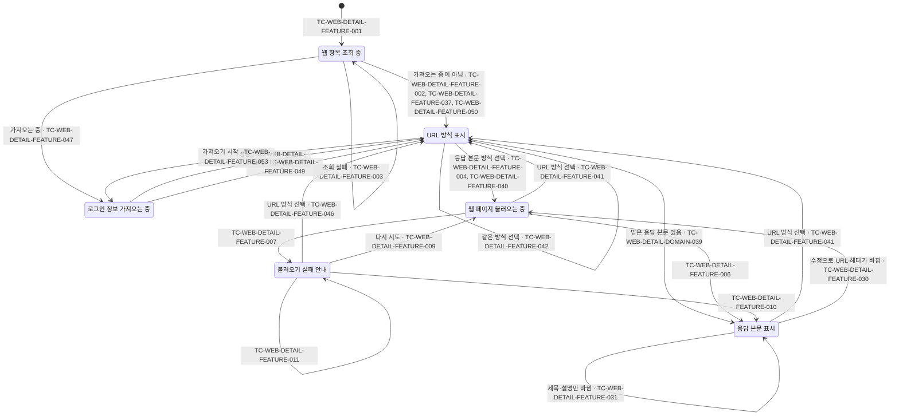
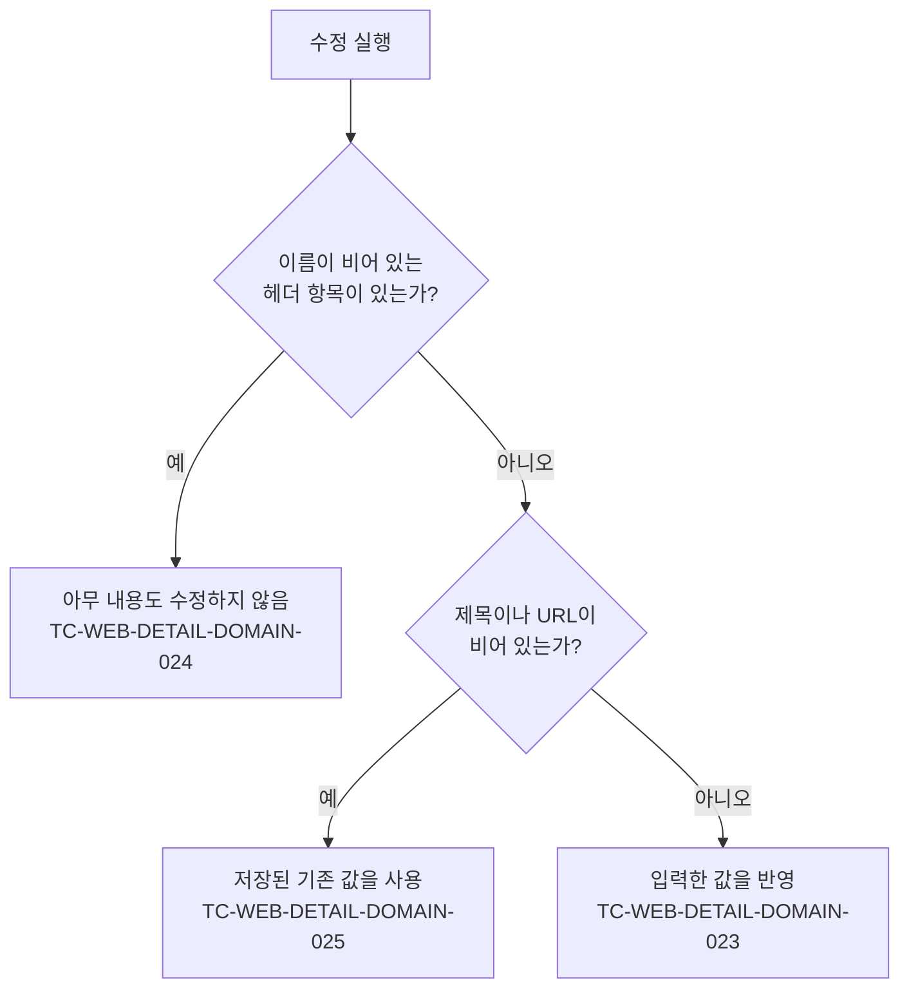

# WebDetail 테스트 케이스

기준 스펙: [WebDetail 화면 스펙](../spec/web-detail.md)

이 문서에서 `data > 태그 연결의 저장`, `data > 태그 입력의 조회` 절은 [항목 상세 화면 공통 스펙](../spec/entity-detail.md)이 소유한다. 나머지 케이스의 절은 기준 스펙이 소유한다.

WebHome의 목록과 SearchHome의 웹 결과에서 웹 항목을 선택해 WebDetail로 이동하는 케이스는 [WebHome 테스트 케이스](./web-home.md)와 [SearchHome 테스트 케이스](./search-home.md)에서, 웹 항목이 갖는 정보와 요청 헤더 항목의 추가·삭제·입력 케이스는 [WebAdd 테스트 케이스](./web-add.md)에서, 웹 항목을 서버와 맞추는 케이스는 [데이터 동기화 테스트 케이스](./data-sync.md)에서, 어떤 로그인 정보를 가져오고 무엇이 실패인지의 케이스는 [Chrome 로그인 이어받기 테스트 케이스](./chrome-session-import.md)에서 다룬다.

태그 입력의 표시와 조작, 태그 선택 목록의 케이스는 [항목 태그 입력 컴포넌트 테스트 케이스](./entity-tag-input.md)에서 다룬다. 이 문서에는 WebDetail 화면에서만 다른 표시 기준과 반영 시점의 케이스만 둔다.

화면은 URL 방식으로 시작하고 그 방식에서는 앱이 웹 페이지를 요청하지 않으므로, 웹 페이지 요청을 다루는 케이스는 Given이나 When에서 사용자가 응답 본문 방식을 고른 상태를 전제로 한다.

## feature

### TC-WEB-DETAIL-FEATURE-001: 조회 중에는 조회 중 상태를 제공하고 웹 페이지를 불러오지 않는다

- 근거: `feature > 조회 상태`, `domain > 불러오기 시점`
- Given: 대상 웹 항목의 조회가 아직 결과를 내지 않고 진행 중인 상태로 설정되어 있다.
- When: WebDetail 화면이 표시된다.
- Then: 조회 중 상태가 표시되고 웹 페이지 요청이 한 번도 일어나지 않는다.

### TC-WEB-DETAIL-FEATURE-002: 조회에 성공하면 저장된 제목, 설명, URL과 요청 헤더가 채워진다

- 근거: `feature > 진입과 내용`, `domain > 입력 내용 채우기`
- Given: 현재 계정과 연결되고 삭제되지 않은 웹 항목이 제목, 설명, URL과 요청 헤더 두 개를 갖고 조회된다.
- When: WebDetail 화면이 표시된다.
- Then: 저장된 제목, 설명, URL과 두 요청 헤더의 이름과 값이 모두 화면의 입력에 채워진 채로 표시된다.

### TC-WEB-DETAIL-FEATURE-003: 웹 항목을 조회할 수 없으면 조회 중 상태를 유지한다

- 근거: `feature > 조회 상태`
- Given: 대상 웹 항목 조회가 테스트 데이터의 결과를 내도록 설정되어 있다.
- When: WebDetail 화면이 표시된다.
- Then: 조회 중 상태가 유지되고 오류 안내가 표시되지 않으며 웹 페이지 요청이 일어나지 않는다.
- 테스트 데이터:

| 조회 결과 |
| --- |
| 조회가 실패함 |
| 대상 식별자의 웹 항목이 없음 |
| 현재 계정을 확인할 수 없음 |

### TC-WEB-DETAIL-FEATURE-004: 응답 본문 방식이 되면 저장된 URL과 요청 헤더로 웹 페이지를 불러온다

- 근거: `feature > 웹 페이지 불러오기`
- Given: 대상 웹 항목이 URL과 요청 헤더 두 개를 갖고 조회된다.
- When: 사용자가 표시 방식을 응답 본문 방식으로 바꾼다.
- Then: 그 URL과 두 요청 헤더로 웹 페이지 요청이 한 번 일어난다.

### TC-WEB-DETAIL-FEATURE-005: 불러오는 동안 진행 상태를 표시한다

- 근거: `feature > 웹 페이지 불러오기`
- Given: 대상 웹 항목이 조회되고, 웹 페이지 요청이 응답을 내지 않고 진행 중인 상태로 설정되어 있다.
- When: 사용자가 표시 방식을 응답 본문 방식으로 바꾼다.
- Then: 웹 페이지 자리에 진행 상태가 표시된다.

### TC-WEB-DETAIL-FEATURE-006: 불러오기에 성공하면 받은 웹 페이지를 표시한다

- 근거: `feature > 웹 페이지 불러오기`
- Given: 대상 웹 항목이 조회되고, 웹 페이지 요청이 본문을 담은 응답을 내도록 설정되어 있다.
- When: 사용자가 표시 방식을 응답 본문 방식으로 바꾼다.
- Then: 진행 상태가 사라지고 웹 페이지 자리에 받은 본문이 표시되며, 불러오기 실패 안내와 다시 시도는 표시되지 않는다.

### TC-WEB-DETAIL-FEATURE-007: 불러오지 못하면 안내와 다시 시도를 표시한다

- 근거: `feature > 불러오기 실패`
- Given: 대상 웹 항목이 조회되고, 웹 페이지 요청이 응답을 내지 못하고 실패하도록 설정되어 있다.
- When: 사용자가 표시 방식을 응답 본문 방식으로 바꾼다.
- Then: 웹 페이지 자리에 불러오지 못했다는 안내와 다시 시도가 표시된다.

### TC-WEB-DETAIL-FEATURE-008: 불러오기에 실패해도 웹 항목 정보를 확인하고 수정할 수 있다

- 근거: `feature > 불러오기 실패`
- Given: 제목, 설명, URL과 요청 헤더를 가진 웹 항목이 조회되고, 응답 본문 방식에서 웹 페이지 요청이 실패해 불러오기 실패 안내가 표시되어 있다.
- When: 사용자가 제목을 다른 값으로 바꾼다.
- Then: 제목, 설명, URL과 요청 헤더가 모두 그대로 채워져 있고 수정 동작을 실행할 수단이 제공된다.

### TC-WEB-DETAIL-FEATURE-009: 다시 시도하면 같은 URL과 요청 헤더로 다시 불러온다

- 근거: `feature > 다시 시도`
- Given: 응답 본문 방식에서 웹 페이지 요청이 실패해 불러오기 실패 안내가 표시되어 있다.
- When: 사용자가 다시 시도를 실행한다.
- Then: 처음과 같은 URL과 요청 헤더로 웹 페이지 요청이 한 번 더 일어나고, 처리 중에는 진행 상태가 표시된다.

### TC-WEB-DETAIL-FEATURE-010: 다시 시도에 성공하면 받은 웹 페이지를 표시한다

- 근거: `feature > 다시 시도`
- Given: 응답 본문 방식에서 불러오기 실패 안내가 표시되어 있고, 다음 웹 페이지 요청이 본문을 담은 응답을 내도록 설정되어 있다.
- When: 사용자가 다시 시도를 실행한다.
- Then: 불러오기 실패 안내와 다시 시도가 사라지고 웹 페이지 자리에 받은 본문이 표시된다.

### TC-WEB-DETAIL-FEATURE-011: 다시 시도에 실패하면 다시 안내를 표시하고 또 시도할 수 있다

- 근거: `feature > 다시 시도`
- Given: 응답 본문 방식에서 불러오기 실패 안내가 표시되어 있고, 다음 웹 페이지 요청도 실패하도록 설정되어 있다.
- When: 사용자가 다시 시도를 실행한다.
- Then: 불러오기 실패 안내와 다시 시도가 다시 표시되고, 사용자는 다시 시도를 한 번 더 실행할 수 있다.

### TC-WEB-DETAIL-FEATURE-012: 불러오는 동안에도 웹 항목 정보를 확인하고 수정하고 뒤로갈 수 있다

- 근거: `feature > 웹 페이지 불러오기`
- Given: 대상 웹 항목이 조회되고, 응답 본문 방식에서 웹 페이지 요청이 응답을 내지 않고 진행 중이다.
- When: 사용자가 제목을 다른 값으로 바꾼 뒤 뒤로가기를 실행한다.
- Then: 진행 중에도 제목, 설명, URL과 요청 헤더가 채워져 있고 수정 동작을 실행할 수단이 제공되며 뒤로가기가 그대로 실행된다.

### TC-WEB-DETAIL-FEATURE-013: 화면이 재생성되어도 웹 페이지를 다시 불러오지 않는다

- 근거: `feature > 진행 상태 유지`, `domain > 진행 상태 유지 기준`
- Given: 응답 본문 방식에서 웹 페이지를 한 번 불러와 본문이 표시되어 있다.
- When: 화면이 재생성된다.
- Then: 같은 본문이 그대로 표시되고 웹 페이지 요청이 추가로 일어나지 않는다.

### TC-WEB-DETAIL-FEATURE-014: 앱을 다시 실행해 진입하면 웹 페이지를 다시 불러온다

- 근거: `feature > 진행 상태 유지`
- Given: 이전 실행에서 WebDetail 화면을 응답 본문 방식으로 바꿔 웹 페이지를 불러온 뒤 앱을 종료했다.
- When: 앱을 다시 실행해 같은 웹 항목의 WebDetail 화면에 진입한다.
- Then: 표시 방식이 URL 방식으로 시작하고 이전에 받은 본문을 복원하지 않는다.
- 작성하지 않는 이유: 앱 프로세스를 종료하고 다시 시작해야 확인할 수 있어 앱의 단위 테스트 환경에서 결정적으로 판정할 수 없다. 프로세스 재시작을 제어할 수 있는 테스트 환경이 마련되면 작성한다.

### TC-WEB-DETAIL-FEATURE-015: 뒤로가면 진입하기 전 화면으로 돌아간다

- 근거: `feature > 뒤로가기`
- Given: WebDetail 화면이 표시되어 있다.
- When: 사용자가 뒤로가기를 실행한다.
- Then: 진입하기 전 화면으로 돌아가는 동작이 한 번 실행된다.

### TC-WEB-DETAIL-FEATURE-016: 외부로 열기를 실행하면 저장된 URL이 앱 밖에서 열린다

- 근거: `feature > 외부로 열기`, `domain > 외부로 열기 대상`
- Given: URL이 저장된 웹 항목의 WebDetail 화면이 내용 표시 상태로 표시되어 있다.
- When: 사용자가 외부로 열기를 실행한다.
- Then: 저장된 URL이 앱 밖에서 여는 방법으로 한 번 열린다.

### TC-WEB-DETAIL-FEATURE-017: 앱 밖에서 열지 못해도 화면을 유지하고 알리지 않는다

- 근거: `feature > 외부로 열기`
- Given: 앱 밖에서 여는 방법이 실패하도록 설정된 WebDetail 화면이 내용 표시 상태로 표시되어 있다.
- When: 사용자가 외부로 열기를 실행한다.
- Then: 화면이 내용 표시 상태를 유지하고 제목, 설명, URL과 요청 헤더가 그대로 채워져 있으며 오류 안내가 표시되지 않는다.

### TC-WEB-DETAIL-FEATURE-018: 조회 중에는 수정과 표시 방식 변경과 외부로 열기와 삭제를 실행할 수 없다

- 근거: `feature > 조회 상태`
- Given: 대상 웹 항목의 조회가 아직 결과를 내지 않고 진행 중인 상태로 설정되어 있다.
- When: WebDetail 화면이 표시된다.
- Then: 수정과 표시 방식 변경과 외부로 열기와 삭제를 실행할 수단이 표시되지 않는다.

### TC-WEB-DETAIL-FEATURE-019: 삭제를 처리하는 동안 진행 상태를 표시한다

- 근거: `feature > 삭제`
- Given: 삭제 처리가 완료되지 않고 진행 중인 상태로 설정된 WebDetail 화면이 내용 표시 상태로 표시되어 있다.
- When: 사용자가 삭제를 실행한 뒤 화면을 확인한다.
- Then: 삭제 처리가 끝날 때까지 진행 상태가 표시된다.

### TC-WEB-DETAIL-FEATURE-020: 삭제에 성공하면 진입하기 전 화면으로 돌아간다

- 근거: `feature > 삭제`
- Given: 삭제가 성공하도록 설정된 WebDetail 화면이 내용 표시 상태로 표시되어 있다.
- When: 사용자가 삭제를 실행한다.
- Then: 뒤로가기와 같은 결과로 WebDetail 화면에서 빠져나가 진입하기 전 화면으로 돌아간다.

### TC-WEB-DETAIL-FEATURE-021: 삭제에 실패하면 화면에 머무르고 진행 상태만 해제한다

- 근거: `feature > 삭제`
- Given: 삭제가 실패하도록 설정된 WebDetail 화면이 내용 표시 상태로 표시되어 있다.
- When: 사용자가 삭제를 실행한다.
- Then: 화면에서 빠져나가지 않고 진행 상태가 해제되며, 사용자는 삭제를 다시 실행할 수 있다.

### TC-WEB-DETAIL-FEATURE-022: 삭제를 처리하는 동안에도 다른 조작을 할 수 있다

- 근거: `feature > 삭제`, `domain > 요청 제한`
- Given: 삭제 처리가 완료되지 않고 진행 중인 WebDetail 화면이 내용 표시 상태로 표시되어 있다.
- When: 사용자가 외부로 열기와 뒤로가기를 실행한다.
- Then: 제목, 설명, URL과 요청 헤더가 그대로 채워져 있고 외부로 열기와 뒤로가기가 그대로 실행된다.

### TC-WEB-DETAIL-FEATURE-023: 진입할 때는 어느 입력에도 초점을 두지 않는다

- 근거: `feature > 진입과 내용`
- Given: 대상 웹 항목이 조회된다.
- When: WebDetail 화면이 표시된다.
- Then: 제목, 설명, URL과 요청 헤더 입력 중 어느 것도 초점을 갖지 않는다.

### TC-WEB-DETAIL-FEATURE-024: 입력이 저장 내용과 다를 때만 수정 동작을 제공한다

- 근거: `feature > 내용 수정`, `domain > 수정 동작의 제공 기준`
- Given: 대상 웹 항목이 조회되어 저장된 값이 입력에 채워져 있다.
- When: 사용자가 테스트 데이터와 같이 입력을 다룬다.
- Then: 테스트 데이터의 기대 결과가 나타난다.
- 테스트 데이터:

| 입력 조작 | 기대 결과 |
| --- | --- |
| 아무것도 바꾸지 않음 | 수정 동작을 실행할 수단이 표시되지 않는다 |
| 제목을 다른 값으로 바꿈 | 수정 동작을 실행할 수단이 표시된다 |
| 설명을 다른 값으로 바꿈 | 수정 동작을 실행할 수단이 표시된다 |
| URL을 다른 값으로 바꿈 | 수정 동작을 실행할 수단이 표시된다 |
| 헤더 항목을 하나 추가함 | 수정 동작을 실행할 수단이 표시된다 |
| 바꾼 값을 저장된 값으로 되돌림 | 수정 동작을 실행할 수단이 다시 사라진다 |

### TC-WEB-DETAIL-FEATURE-025: 수정을 처리하는 동안 진행 상태를 표시한다

- 근거: `feature > 내용 수정`
- Given: 수정 처리가 완료되지 않고 진행 중인 상태로 설정되어 있고, 입력이 저장 내용과 다르다.
- When: 사용자가 수정을 실행한 뒤 화면을 확인한다.
- Then: 수정 처리가 끝날 때까지 진행 상태가 표시된다.

### TC-WEB-DETAIL-FEATURE-026: 수정에 성공하면 화면과 입력을 유지하고 성공 피드백을 제공한다

- 근거: `feature > 내용 수정`
- Given: 수정이 성공하도록 설정되어 있고, 사용자가 제목을 다른 값으로 바꿨다.
- When: 사용자가 수정을 실행한다.
- Then: 화면에서 빠져나가지 않고 입력한 값이 그대로 남으며 수정 성공 피드백이 한 번 제공된다.

### TC-WEB-DETAIL-FEATURE-027: 수정에 실패하면 입력을 유지하고 진행 상태만 해제한다

- 근거: `feature > 내용 수정`
- Given: 수정이 실패하도록 설정되어 있고, 사용자가 제목을 다른 값으로 바꿨다.
- When: 사용자가 수정을 실행한다.
- Then: 화면에서 빠져나가지 않고 입력한 값이 그대로 남으며 진행 상태가 해제되고, 사용자는 수정을 다시 실행할 수 있다.

### TC-WEB-DETAIL-FEATURE-028: 이름이 비어 있는 헤더 항목이 있으면 헤더 이름 안내를 제공한다

- 근거: `feature > 헤더 이름 미입력`
- Given: 대상 웹 항목이 조회되고, 사용자가 이름이 비어 있는 헤더 항목을 하나 추가했다.
- When: 사용자가 수정을 실행한다.
- Then: 헤더 이름 입력이 필요하다는 피드백이 제공되고 웹 항목의 저장 내용은 바뀌지 않으며, 입력한 제목·설명·URL과 헤더 항목이 모두 그대로 남는다.

### TC-WEB-DETAIL-FEATURE-029: 화면이 재생성되어도 입력 중이던 내용을 유지한다

- 근거: `feature > 진행 상태 유지`, `domain > 진행 상태 유지 기준`
- Given: 대상 웹 항목이 조회된 뒤 사용자가 제목, 설명, URL을 바꾸고 헤더 항목을 하나 추가했다.
- When: 화면이 재생성된다.
- Then: 바꾼 제목, 설명, URL과 헤더 항목의 이름·값·순서가 그대로 유지된다.

### TC-WEB-DETAIL-FEATURE-030: 수정으로 URL이나 요청 헤더가 바뀌면 웹 페이지를 다시 불러온다

- 근거: `feature > 수정 뒤의 웹 페이지`, `domain > 불러오기 시점`
- Given: 응답 본문 방식에서 웹 페이지를 한 번 불러와 본문이 표시되어 있고 수정이 성공하도록 설정되어 있다.
- When: 사용자가 테스트 데이터와 같이 바꾼 뒤 수정을 실행한다.
- Then: 새로 저장된 URL과 요청 헤더로 웹 페이지 요청이 한 번 더 일어난다.
- 테스트 데이터:

| 입력 조작 |
| --- |
| URL을 다른 값으로 바꿈 |
| 헤더 항목을 하나 추가함 |
| 헤더 항목의 값을 다른 값으로 바꿈 |

### TC-WEB-DETAIL-FEATURE-031: 제목이나 설명만 바뀌면 웹 페이지를 다시 불러오지 않는다

- 근거: `feature > 수정 뒤의 웹 페이지`, `domain > 불러오기 시점`
- Given: 응답 본문 방식에서 웹 페이지를 한 번 불러와 본문이 표시되어 있고 수정이 성공하도록 설정되어 있다.
- When: 사용자가 제목과 설명만 다른 값으로 바꾼 뒤 수정을 실행한다.
- Then: 표시하던 본문이 그대로 남고 웹 페이지 요청이 추가로 일어나지 않는다.

### TC-WEB-DETAIL-FEATURE-032: 조회 중에는 태그 연결과 해제를 실행할 수 없다

- 근거: `feature > 조회 상태`
- Given: 대상 웹 항목 조회가 완료되지 않아 조회 중 상태다.
- When: 사용자가 화면에서 실행할 수 있는 동작을 확인한다.
- Then: 태그 입력이 표시되지 않아 태그 연결과 해제를 실행할 수 없다.

### TC-WEB-DETAIL-FEATURE-033: 태그를 연결하거나 해제하면 저장된 연결로 즉시 반영된다

- 근거: `feature > 태그 입력`
- Given: 대상 웹 항목이 조회되어 있고 계정과 연결된 태그가 여러 개 저장되어 있다.
- When: 사용자가 태그 선택 목록에서 태그 하나를 연결한 뒤 다른 태그의 연결을 해제한다.
- Then: 각 조작마다 별도의 반영 동작 없이 그 웹 항목의 저장된 연결이 바뀐다.

### TC-WEB-DETAIL-FEATURE-034: 태그를 연결하거나 해제해도 수정 동작의 제공 여부는 바뀌지 않는다

- 근거: `feature > 태그 입력`, `domain > 수정 동작의 제공 기준`
- Given: 대상 웹 항목이 조회되어 있고 입력 내용이 저장 내용과 같아 수정 동작이 제공되지 않는다.
- When: 사용자가 태그를 연결하거나 이미 연결된 태그를 해제한다.
- Then: 수정 동작이 제공되지 않는 상태가 그대로 유지된다.

### TC-WEB-DETAIL-FEATURE-035: 태그를 연결하거나 해제해도 웹 페이지를 다시 불러오지 않는다

- 근거: `feature > 태그 입력`, `domain > 불러오기 시점`
- Given: 응답 본문 방식에서 대상 웹 항목의 웹 페이지가 이미 표시되어 있다.
- When: 사용자가 태그를 연결하거나 이미 연결된 태그를 해제한다.
- Then: 웹 페이지 요청이 다시 일어나지 않고 표시하던 웹 페이지가 그대로 유지된다.

### TC-WEB-DETAIL-FEATURE-036: 연결한 태그를 누르면 그 태그의 상세로 이동한다

- 근거: `feature > 태그 입력`
- Given: 대상 웹 항목에 태그 하나가 연결되어 태그 입력에 표시되어 있다.
- When: 사용자가 그 태그를 누른다.
- Then: 그 태그의 TagDetail 화면 이동이 한 번 요청된다.

### TC-WEB-DETAIL-FEATURE-037: 내용 표시 상태는 URL 방식으로 시작하고 웹 페이지를 불러오지 않는다

- 근거: `feature > 웹 페이지 표시 방식`, `domain > 불러오기 시점`
- Given: 대상 웹 항목이 URL과 요청 헤더를 갖고 조회된다.
- When: WebDetail 화면이 표시된다.
- Then: 현재 표시 방식으로 URL 방식이 표시되고, 웹 페이지 요청이 한 번도 일어나지 않는다.

### TC-WEB-DETAIL-FEATURE-038: 표시 방식 선택 목록에 두 방식과 현재 선택과 URL 방식 안내가 표시된다

- 근거: `feature > 웹 페이지 표시 방식`
- Given: 대상 웹 항목이 조회되어 URL 방식으로 표시되어 있다.
- When: 사용자가 표시 방식 컨트롤을 누른다.
- Then: 표시 방식 선택 목록이 열려 URL 방식과 응답 본문 방식이 표시되고, URL 방식이 선택된 상태로 표시되며, URL 방식에 저장한 요청 헤더가 적용되지 않는다는 안내가 함께 표시된다.

### TC-WEB-DETAIL-FEATURE-039: 응답 본문 방식을 고르면 목록이 닫히고 그 방식으로 표시된다

- 근거: `feature > 웹 페이지 표시 방식`
- Given: URL 방식으로 표시되어 있고 표시 방식 선택 목록이 열려 있다.
- When: 사용자가 응답 본문 방식을 고른다.
- Then: 선택 목록이 닫히고 현재 표시 방식으로 응답 본문 방식이 표시된다.

### TC-WEB-DETAIL-FEATURE-040: 응답 본문 방식을 고르면 웹 페이지를 한 번 불러온다

- 근거: `feature > 웹 페이지 표시 방식`, `domain > 불러오기 시점`
- Given: 대상 웹 항목이 URL과 요청 헤더를 갖고 조회되어 URL 방식으로 표시되어 있다.
- When: 사용자가 응답 본문 방식을 고른다.
- Then: 저장된 URL과 요청 헤더로 웹 페이지 요청이 한 번 일어난다.

### TC-WEB-DETAIL-FEATURE-041: URL 방식으로 되돌리면 앱 요청 없이 URL 방식으로 표시된다

- 근거: `feature > 웹 페이지 표시 방식`, `feature > URL 방식의 표시`
- Given: 응답 본문 방식에서 웹 페이지를 한 번 불러와 본문이 표시되어 있다.
- When: 사용자가 표시 방식을 URL 방식으로 되돌린다.
- Then: 현재 표시 방식으로 URL 방식이 표시되고, 웹 페이지 요청이 추가로 일어나지 않는다.

### TC-WEB-DETAIL-FEATURE-042: 현재 방식과 같은 방식을 골라도 목록만 닫힌다

- 근거: `feature > 웹 페이지 표시 방식`
- Given: URL 방식으로 표시되어 있고 표시 방식 선택 목록이 열려 있다.
- When: 사용자가 URL 방식을 고른다.
- Then: 선택 목록이 닫히고 현재 표시 방식이 URL 방식으로 유지되며, 웹 페이지 요청이 일어나지 않는다.

### TC-WEB-DETAIL-FEATURE-043: 선택 목록을 닫으면 표시 방식이 바뀌지 않는다

- 근거: `feature > 웹 페이지 표시 방식`
- Given: URL 방식으로 표시되어 있고 표시 방식 선택 목록이 열려 있다.
- When: 사용자가 아무 방식도 고르지 않고 선택 목록을 닫는다.
- Then: 선택 목록이 닫히고 현재 표시 방식이 URL 방식으로 유지된다.

### TC-WEB-DETAIL-FEATURE-044: URL 방식에서는 진행 상태와 실패 안내와 다시 시도를 표시하지 않는다

- 근거: `feature > URL 방식의 표시`
- Given: 대상 웹 항목이 조회되고, 웹 페이지 요청이 테스트 데이터의 결과를 내도록 설정되어 있다.
- When: WebDetail 화면이 URL 방식으로 표시된다.
- Then: 웹 페이지 자리에 진행 상태와 불러오기 실패 안내와 다시 시도가 모두 표시되지 않는다.
- 테스트 데이터:

| 웹 페이지 요청 결과 |
| --- |
| 응답을 내지 않고 진행 중 |
| 응답을 내지 못하고 실패 |

### TC-WEB-DETAIL-FEATURE-045: 화면이 재생성되어도 고른 표시 방식을 유지한다

- 근거: `feature > 진행 상태 유지`, `domain > 표시 방식의 기본값과 유지`
- Given: 사용자가 표시 방식을 응답 본문 방식으로 바꿔 두었다.
- When: 화면이 재생성된다.
- Then: 현재 표시 방식으로 응답 본문 방식이 그대로 표시된다.

### TC-WEB-DETAIL-FEATURE-046: 불러오기에 실패해도 표시 방식을 바꿀 수 있다

- 근거: `feature > 불러오기 실패`, `feature > 웹 페이지 표시 방식`
- Given: 응답 본문 방식에서 웹 페이지 요청이 실패해 불러오기 실패 안내가 표시되어 있다.
- When: 사용자가 표시 방식을 URL 방식으로 바꾼다.
- Then: 불러오기 실패 안내와 다시 시도가 사라지고 현재 표시 방식으로 URL 방식이 표시된다.

### TC-WEB-DETAIL-FEATURE-047: 로그인 정보를 가져오는 동안에는 진행 상태를 표시하고 주소를 열지 않는다

- 근거: `feature > 로그인 정보 가져오기`
- Given: 대상 웹 항목이 조회되었고 로그인 정보 가져오는 상태가 `가져오는 중`으로 제어되어 있다.
- When: 사용자가 URL 방식의 웹 페이지 자리를 확인한다.
- Then: 웹 페이지 자리에 진행 상태가 표시되고 웹 표시 수단은 아직 주소를 열지 않으며, 표시 방식 변경, 수정, 뒤로가기는 그대로 실행할 수 있다.

### TC-WEB-DETAIL-FEATURE-049: 로그인 정보를 가져오지 못하면 알리고 주소를 그대로 연다

- 근거: `feature > 로그인 정보 가져오기`
- Given: 대상 웹 항목이 조회되었고 로그인 정보 가져오는 상태가 `가져오는 중`이다.
- When: 가져오는 상태가 `가져오기 실패`로 바뀐다.
- Then: 가져오지 못했다는 피드백이 한 번 표시되고 웹 표시 수단이 저장된 URL을 열며, 다시 시도 수단은 표시되지 않는다.

### TC-WEB-DETAIL-FEATURE-050: 로그인 정보를 가져오는 중이 아니면 곧바로 주소를 연다

- 근거: `feature > 로그인 정보 가져오기`
- Given: 대상 웹 항목이 조회되었고 로그인 정보 가져오는 상태가 테스트 데이터의 값으로 제어되어 있다.
- When: 사용자가 URL 방식의 웹 페이지 자리를 확인한다.
- Then: 진행 상태 없이 웹 표시 수단이 저장된 URL을 열고, `가져오기 실패`가 아니면 피드백은 표시되지 않는다.
- 테스트 데이터:

| 가져오는 상태 |
| --- |
| `가져온 적 없음` |
| `가져오기 성공` |

### TC-WEB-DETAIL-FEATURE-052: 로그인 정보를 가져오면 웹 표시 수단이 주소를 새로 연다

- 근거: `feature > 로그인 정보 가져오기`
- Given: 대상 웹 항목이 조회되었고 로그인 정보 가져오는 상태가 `가져오는 중`이다.
- When: 가져오는 상태가 `가져오기 성공`으로 바뀐다.
- Then: 진행 상태가 사라지고 웹 표시 수단이 저장된 URL을 새로 열며, 피드백은 표시되지 않는다.

### TC-WEB-DETAIL-FEATURE-053: 주소를 연 뒤 가져오기가 시작되면 진행 상태로 바뀌고 끝나면 다시 연다

- 근거: `feature > 로그인 정보 가져오기`
- Given: URL 방식으로 저장된 URL이 열려 있고 로그인 정보 가져오는 상태가 `가져오기 성공`이다.
- When: 가져오는 상태가 `가져오는 중`으로 바뀌었다가 다시 `가져오기 성공`으로 바뀐다.
- Then: 가져오는 동안 웹 표시 수단이 사라지고 진행 상태가 표시되며, 끝나면 웹 표시 수단이 저장된 URL을 이전과 다른 새 표시로 다시 연다.

### TC-WEB-DETAIL-FEATURE-054: 들어왔을 때 마지막 가져오기 결과가 실패였으면 한 번 알린다

- 근거: `feature > 로그인 정보 가져오기`
- Given: 로그인 정보 가져오는 상태가 `가져오기 실패`다.
- When: 사용자가 WebDetail 화면에 들어온다.
- Then: 가져오지 못했다는 피드백이 한 번 표시되고 웹 표시 수단이 저장된 URL을 연다.

### TC-WEB-DETAIL-FEATURE-055: 수정으로 URL이 바뀌어도 로그인 정보를 다시 가져오지 않는다

- 근거: `feature > 수정 뒤의 웹 페이지`
- Given: URL 방식으로 첫 주소가 열려 있고 로그인 정보 가져오는 상태가 `가져오기 성공`이다.
- When: 사용자가 URL을 다른 주소로 바꿔 수정을 실행하고 수정이 반영된다.
- Then: 로그인 정보 가져오기가 시작되지 않고 진행 상태 없이 웹 표시 수단이 새 주소를 연다.

### TC-WEB-DETAIL-FEATURE-056: 화면에 처음 진입하면 메모 탭은 선택되어 있지 않다

- 근거: `feature > 메모 탭`
- Given: 웹 항목이 저장되어 있다.
- When: 사용자가 그 웹 항목의 WebDetail 화면에 진입한다.
- Then: 메모 탭이 선택되어 있지 않고 웹 정보 수정 또는 웹 페이지가 표시된다.

### TC-WEB-DETAIL-FEATURE-057: 메모 탭을 선택하면 연결된 메모 목록을 표시하고 다시 돌아올 수 있다

- 근거: `feature > 메모 탭`
- Given: 웹 항목이 조회된 WebDetail 화면이 표시되어 있다.
- When: 사용자가 메모 탭을 선택한 뒤 다시 웹 정보 수정 탭을 선택한다.
- Then: 메모 탭을 선택하면 대상 웹 항목에 연결된 메모 목록이 표시되고 웹 정보 수정 입력은 표시되지 않으며, 웹 정보 수정 탭으로 돌아오면 입력이 다시 표시된다.

### TC-WEB-DETAIL-FEATURE-058: 조회 중에도 메모 탭을 선택할 수 있다

- 근거: `feature > 메모 탭`, `feature > 조회 상태`
- Given: 상세 대상 웹 항목을 조회할 수 없어 조회 중 상태가 유지되고 있다.
- When: 사용자가 메모 탭을 선택한다.
- Then: 메모 탭이 선택되고 메모 목록이 표시된다.

### TC-WEB-DETAIL-FEATURE-059: 메모 탭에 다녀와도 수정 중이던 내용과 웹 페이지 상태가 유지된다

- 근거: `feature > 메모 탭`
- Given: 제목, 설명, URL과 요청 헤더를 저장된 내용과 다르게 수정했고 응답 본문 방식으로 웹 페이지를 표시하고 있다.
- When: 사용자가 메모 탭으로 전환한 뒤 다시 돌아온다.
- Then: 수정 중이던 내용이 그대로 남아 있고 고른 표시 방식과 이미 받은 웹 페이지가 유지되어 다시 불러오지 않는다.

### TC-WEB-DETAIL-FEATURE-060: 외부로 열기와 삭제는 메모 탭에서도 제공된다

- 근거: `feature > 메모 탭`
- Given: 웹 항목이 조회된 WebDetail 화면에서 메모 탭이 선택되어 있다.
- When: 사용자가 화면에서 실행할 수 있는 동작을 확인한다.
- Then: 외부로 열기와 삭제를 실행할 수 있다.

### TC-WEB-DETAIL-FEATURE-061: 화면 재생성 후에도 메모 탭 선택이 유지된다

- 근거: `feature > 진행 상태 유지`, `domain > 선택한 탭`
- Given: 같은 웹 항목의 WebDetail 화면에서 메모 탭을 선택했다.
- When: 화면이 재생성된다.
- Then: 메모 탭이 선택된 상태가 유지된다.

### TC-WEB-DETAIL-FEATURE-062: 메모 탭에서 뒤로가도 진입하기 전 화면으로 돌아간다

- 근거: `feature > 뒤로가기`
- Given: WebDetail 화면에서 메모 탭을 선택했다.
- When: 사용자가 뒤로간다.
- Then: 웹 정보 수정으로 먼저 돌아가지 않고 WebDetail 화면에 진입하기 전 화면이 표시된다.

### TC-WEB-DETAIL-FEATURE-063: 수정 반영 동작은 메모 탭에서 제공되지 않는다

- 근거: `feature > 내용 수정`, `feature > 메모 탭`
- Given: 입력 내용이 저장된 내용과 달라 수정 반영 동작이 제공되고 있다.
- When: 사용자가 메모 탭으로 전환한다.
- Then: 수정 반영 동작이 제공되지 않고, 웹 정보 수정 탭으로 돌아오면 다시 제공된다.

## domain

### TC-WEB-DETAIL-DOMAIN-001: 상세 대상이 될 수 없는 웹 항목은 조회할 수 없는 것으로 다룬다

- 근거: `domain > 상세 대상`
- Given: 대상 식별자의 웹 항목이 테스트 데이터의 상태로 저장되어 있다.
- When: 상세 대상 웹 항목을 조회한다.
- Then: 대상 웹 항목이 조회되지 않는다.
- 테스트 데이터:

| 저장 상태 |
| --- |
| 다른 계정과 연결된 웹 항목 |
| 대상 식별자의 웹 항목이 없음 |

### TC-WEB-DETAIL-DOMAIN-019: 삭제 여부와 관계없이 상세 대상으로 조회한다

- 근거: `domain > 상세 대상`, `data > 대상 웹 항목 조회`
- Given: 현재 계정과 연결된 웹 항목의 삭제 여부가 테스트 데이터와 같다.
- When: 상세 대상 웹 항목을 조회한다.
- Then: 두 경우 모두 그 웹 항목이 요청 헤더까지 함께 조회된다.
- 테스트 데이터:

| 삭제 여부 |
| --- |
| 미삭제 |
| 삭제 |

### TC-WEB-DETAIL-DOMAIN-002: 현재 계정을 확인할 수 없으면 대상 웹 항목을 조회할 수 없다

- 근거: `domain > 상세 대상`
- Given: 현재 계정 조회가 실패하도록 설정되어 있다.
- When: 상세 대상 웹 항목을 조회한다.
- Then: 대상 웹 항목이 조회되지 않고 계정 조회의 실패가 그대로 전달된다.

### TC-WEB-DETAIL-DOMAIN-003: 내용 표시 상태가 된 뒤 삭제 상태가 되어도 내용 표시를 유지한다

- 근거: `domain > 상세 대상`
- Given: 대상 웹 항목이 조회되어 WebDetail 화면에 내용이 표시되어 있다.
- When: 그 웹 항목이 삭제 상태로 바뀐다.
- Then: 화면이 조회 중 상태로 되돌아가지 않고 내용 표시 상태를 유지하며, 입력 중이던 내용과 표시하던 웹 페이지도 그대로 남는다.

### TC-WEB-DETAIL-DOMAIN-004: 요청 헤더는 저장된 순서대로 모두 채운다

- 근거: `domain > 입력 내용 채우기`
- Given: 이름이 같고 값이 다른 헤더 두 개를 포함해 요청 헤더 여러 개를 특정 순서로 가진 웹 항목이 조회된다.
- When: WebDetail 화면이 표시된다.
- Then: 모든 요청 헤더가 저장된 순서 그대로 헤더 항목에 채워지고, 이름이 같은 헤더도 각각의 항목으로 채워진다.

### TC-WEB-DETAIL-DOMAIN-020: 저장 내용이 다른 경로에서 바뀌어도 입력을 덮어쓰지 않는다

- 근거: `domain > 외부 변경`, `domain > 입력 내용 채우기`
- Given: 대상 웹 항목이 조회되어 입력에 저장된 값이 채워졌고, 사용자가 제목과 URL을 다른 값으로 바꿨다.
- When: 그 웹 항목의 제목, 설명, URL과 요청 헤더가 또 다른 값으로 저장된다.
- Then: 입력에는 사용자가 바꾼 값이 그대로 남고, 화면 제목만 새로 저장된 제목으로 갱신된다.

### TC-WEB-DETAIL-DOMAIN-021: 입력은 처음 조회한 값으로 한 번만 채운다

- 근거: `domain > 입력 내용 채우기`
- Given: 대상 웹 항목이 조회되어 입력에 저장된 값이 채워져 있고 사용자는 아무것도 바꾸지 않았다.
- When: 같은 웹 항목의 저장 내용이 다른 값으로 바뀐다.
- Then: 입력에는 처음 조회한 값이 그대로 남고 새 값으로 다시 채워지지 않는다.

### TC-WEB-DETAIL-DOMAIN-022: 설명이 비어 있거나 요청 헤더가 없으면 빈 상태로 채운다

- 근거: `domain > 입력 내용 채우기`
- Given: 설명이 비어 있고 요청 헤더가 하나도 없는 웹 항목이 조회된다.
- When: WebDetail 화면이 표시된다.
- Then: 설명 입력이 빈 값으로 채워지고 헤더 항목이 하나도 없는 상태가 되며, 사용자는 그대로 설명을 입력하고 헤더 항목을 추가할 수 있다.

### TC-WEB-DETAIL-DOMAIN-023: 수정은 제목, 설명, URL, 요청 헤더와 수정 시각을 바꾼다

- 근거: `domain > 수정되는 내용`
- Given: 현재 계정과 연결된 미삭제 웹 항목이 있고 현재 시각이 고정되어 있다.
- When: 제목, 설명, URL과 요청 헤더를 모두 다른 값으로 수정한다.
- Then: 네 값이 입력한 대로 바뀌고 수정 시각이 고정된 현재 시각으로 갱신되며, 삭제 여부와 생성 시각과 계정 연결은 바뀌지 않는다.

### TC-WEB-DETAIL-DOMAIN-024: 이름이 없는 요청 헤더가 있으면 아무 내용도 수정하지 않는다

- 근거: `domain > 수정 성립 조건`
- Given: 현재 계정과 연결된 웹 항목이 있고, 제목·설명·URL을 모두 다른 값으로 바꾼 상태에서 이름이 테스트 데이터와 같은 헤더 항목이 하나 섞여 있다.
- When: 수정을 실행한다.
- Then: 헤더 이름이 없다는 결과가 전달되고 제목, 설명, URL, 요청 헤더와 수정 시각 중 어느 것도 바뀌지 않는다.
- 테스트 데이터:

| 헤더 이름 |
| --- |
| 빈 문자열 |
| 공백 문자만 있음 |

### TC-WEB-DETAIL-DOMAIN-025: 제목이나 URL이 비어 있으면 저장된 기존 값을 사용한다

- 근거: `domain > 수정 성립 조건`
- Given: 현재 계정과 연결된 웹 항목이 제목과 URL을 갖고 저장되어 있다.
- When: 테스트 데이터의 제목과 URL로 수정을 실행한다.
- Then: 테스트 데이터의 기대 결과가 나타나고 설명과 요청 헤더는 입력한 대로 반영된다.
- 테스트 데이터:

| 제목 | URL | 기대 결과 |
| --- | --- | --- |
| 빈 문자열 | 새 URL | 저장된 기존 제목이 유지되고 URL만 바뀐다 |
| 공백 문자만 있음 | 새 URL | 저장된 기존 제목이 유지되고 URL만 바뀐다 |
| 새 제목 | 빈 문자열 | 저장된 기존 URL이 유지되고 제목만 바뀐다 |
| 새 제목 | 공백 문자만 있음 | 저장된 기존 URL이 유지되고 제목만 바뀐다 |
| 빈 문자열 | 빈 문자열 | 저장된 기존 제목과 URL이 모두 유지된다 |

### TC-WEB-DETAIL-DOMAIN-026: 요청 헤더는 입력한 순서대로 모두 반영한다

- 근거: `domain > 수정되는 내용`
- Given: 현재 계정과 연결된 웹 항목이 있다.
- When: 이름이 같고 값이 다른 헤더 두 개를 포함한 요청 헤더 여러 개를 특정 순서로 두고 수정을 실행한다.
- Then: 모든 헤더가 입력한 순서 그대로 반영되고, 이름이 같은 헤더도 합쳐지거나 덮어써지지 않는다.

### TC-WEB-DETAIL-DOMAIN-027: 삭제 상태인 웹 항목을 수정해도 삭제 상태로 남는다

- 근거: `domain > 상세 대상`
- Given: 현재 계정과 연결된 웹 항목이 삭제 상태로 저장되어 있다.
- When: 그 웹 항목의 제목을 다른 값으로 수정한다.
- Then: 제목이 바뀌고 삭제 여부는 삭제 상태로 남는다.

### TC-WEB-DETAIL-DOMAIN-028: 수정을 처리하는 동안 전달된 수정 요청은 처리하지 않는다

- 근거: `domain > 요청 제한`
- Given: 수정 처리가 완료되지 않고 진행 중이다.
- When: 같은 화면에서 수정을 다시 실행한다.
- Then: 수정은 한 번만 수행되고, 처리가 끝난 뒤 실행한 수정은 다시 수행된다.

### TC-WEB-DETAIL-DOMAIN-029: 수정과 삭제는 서로를 제한하지 않는다

- 근거: `domain > 요청 제한`
- Given: 수정 처리가 완료되지 않고 진행 중이며 입력이 저장 내용과 다르다.
- When: 사용자가 삭제를 실행한다.
- Then: 삭제가 한 번 수행된다.

### TC-WEB-DETAIL-DOMAIN-030: 불러오는 동안 수정으로 URL이 바뀌면 진행 중이던 불러오기를 대체한다

- 근거: `domain > 요청 제한`
- Given: 응답 본문 방식에서 웹 페이지 요청이 응답을 내지 않고 진행 중이며 수정이 성공하도록 설정되어 있다.
- When: 사용자가 URL을 다른 값으로 바꿔 수정을 실행하고, 앞선 요청이 뒤늦게 응답을 낸다.
- Then: 새 URL로 웹 페이지 요청이 한 번 더 일어나고, 화면에는 새 요청의 결과만 반영되며 앞선 요청의 본문은 표시되지 않는다.

### TC-WEB-DETAIL-DOMAIN-007: 저장 내용이 다른 경로에서 바뀌어도 웹 페이지를 다시 불러오지 않는다

- 근거: `domain > 외부 변경`
- Given: 응답 본문 방식에서 웹 페이지를 한 번 불러와 본문이 표시되어 있다.
- When: 대상 웹 항목의 URL과 요청 헤더가 다른 경로에서 다른 값으로 저장된다.
- Then: 표시하던 본문이 그대로 남고 웹 페이지 요청이 추가로 일어나지 않는다.

### TC-WEB-DETAIL-DOMAIN-008: 저장된 요청 헤더를 순서대로 모두 함께 보낸다

- 근거: `domain > 불러오기 대상`
- Given: 이름이 같고 값이 다른 헤더 두 개를 포함해 요청 헤더 여러 개를 특정 순서로 가진 웹 항목이 조회된다.
- When: 사용자가 응답 본문 방식을 골라 웹 페이지를 불러온다.
- Then: 웹 페이지 요청에 저장된 모든 헤더가 저장된 순서대로 담기고, 이름이 같은 헤더도 합쳐지거나 덮어써지지 않는다.

### TC-WEB-DETAIL-DOMAIN-031: 반영하지 않은 입력은 불러오기에 쓰지 않는다

- 근거: `domain > 불러오기 대상`
- Given: 응답 본문 방식에서 웹 페이지 요청이 실패해 불러오기 실패 안내가 표시되어 있다.
- When: 사용자가 URL을 다른 값으로 바꾸기만 하고 수정을 실행하지 않은 채 다시 시도를 실행한다.
- Then: 저장된 URL로 웹 페이지 요청이 일어나고 입력만 바꾼 URL은 요청에 쓰이지 않는다.

### TC-WEB-DETAIL-DOMAIN-009: 2xx가 아닌 응답도 불러오기 성공으로 다룬다

- 근거: `domain > 불러오기 결과 판정`
- Given: 대상 웹 항목이 조회되고, 웹 페이지 요청이 테스트 데이터의 상태 코드와 본문을 담은 응답을 내도록 설정되어 있다.
- When: 사용자가 표시 방식을 응답 본문 방식으로 바꾼다.
- Then: 불러오기 실패 안내가 표시되지 않고 응답 본문이 웹 페이지 자리에 표시된다.
- 테스트 데이터:

| 응답 상태 코드 |
| --- |
| `200` |
| `404` |
| `500` |

### TC-WEB-DETAIL-DOMAIN-010: 응답을 받지 못하면 불러오기 실패로 다룬다

- 근거: `domain > 불러오기 결과 판정`
- Given: 대상 웹 항목이 조회되고, 웹 페이지 요청이 응답을 받지 못하고 실패하도록 설정되어 있다.
- When: 사용자가 표시 방식을 응답 본문 방식으로 바꾼다.
- Then: 불러오기 실패 안내가 표시되고 웹 페이지 본문은 표시되지 않는다.

### TC-WEB-DETAIL-DOMAIN-011: 불러오는 동안 전달된 다시 시도 요청은 처리하지 않는다

- 근거: `domain > 요청 제한`
- Given: 응답 본문 방식에서 웹 페이지 요청이 응답을 내지 않고 진행 중이다.
- When: 같은 화면에서 다시 시도를 다시 실행한다.
- Then: 웹 페이지 요청이 늘어나지 않고, 진행 중인 요청이 끝난 뒤 실행한 다시 시도는 새 요청을 일으킨다.

### TC-WEB-DETAIL-DOMAIN-012: 웹 페이지는 응답 본문 방식이 처음 될 때 한 번만 불러온다

- 근거: `domain > 불러오기 시점`
- Given: 대상 웹 항목이 조회되고 사용자가 응답 본문 방식을 골라 웹 페이지를 한 번 불러왔다.
- When: 같은 웹 항목의 조회 결과가 같은 내용으로 다시 전달된다.
- Then: 웹 페이지 요청이 추가로 일어나지 않는다.

### TC-WEB-DETAIL-DOMAIN-013: 응답 본문의 상대 경로는 요청한 URL을 기준 주소로 해석한다

- 근거: `domain > 표시하는 웹 페이지`
- Given: 상대 경로 리소스를 포함한 응답 본문을 받았다.
- When: 웹 페이지 자리에 그 본문이 표시된다.
- Then: 상대 경로가 요청한 URL을 기준으로 해석되어 요청되고, 그 요청에는 대상 웹 항목의 요청 헤더가 담기지 않는다.
- 작성하지 않는 이유: 실제 웹 표시 수단이 문서를 해석하고 리소스를 요청해야 확인할 수 있어 플랫폼 웹 표시 수단 없이 결정적으로 판정할 수 없다. 웹 표시 수단이 일으키는 요청을 가로챌 수 있는 테스트 환경이 마련되면 작성한다.

### TC-WEB-DETAIL-DOMAIN-033: 응답 본문 안의 스크립트를 실행한 결과를 표시한다

- 근거: `domain > 표시하는 웹 페이지`
- Given: 본문을 그리거나 바꾸는 스크립트를 포함한 응답 본문을 받았다.
- When: 웹 페이지 자리에 그 본문이 표시된다.
- Then: 스크립트가 실행되어 그 결과가 표시되고, 스크립트가 일으키는 요청에는 대상 웹 항목의 요청 헤더가 담기지 않는다.
- 작성하지 않는 이유: 실제 웹 표시 수단이 문서를 해석하고 스크립트를 실행해야 확인할 수 있어 플랫폼 웹 표시 수단 없이 결정적으로 판정할 수 없다. 웹 표시 수단의 스크립트 실행 결과와 그 요청을 가로챌 수 있는 테스트 환경이 마련되면 작성한다.

### TC-WEB-DETAIL-DOMAIN-014: 외부로 열기는 웹 페이지 요청이나 저장을 일으키지 않는다

- 근거: `domain > 외부로 열기 대상`
- Given: 웹 페이지를 한 번 불러온 WebDetail 화면이 내용 표시 상태로 표시되어 있다.
- When: 사용자가 외부로 열기를 실행한다.
- Then: 웹 페이지 요청이 추가로 일어나지 않고 저장된 웹 항목의 내용도 바뀌지 않는다.

### TC-WEB-DETAIL-DOMAIN-032: 반영하지 않은 URL 입력은 외부로 여는 주소를 바꾸지 않는다

- 근거: `domain > 외부로 열기 대상`
- Given: URL이 저장된 웹 항목의 WebDetail 화면이 내용 표시 상태로 표시되어 있다.
- When: 사용자가 URL 입력만 다른 값으로 바꾸고 수정을 실행하지 않은 채 외부로 열기를 실행한다.
- Then: 입력한 값이 아니라 웹 항목에 저장된 URL이 앱 밖에서 열린다.

### TC-WEB-DETAIL-DOMAIN-015: 웹 페이지 안에서 이동해도 외부로 여는 주소는 저장된 URL이다

- 근거: `domain > 외부로 열기 대상`
- Given: 웹 페이지를 표시하고 있는 WebDetail 화면에서 사용자가 문서 안의 링크를 눌러 다른 주소로 이동했다.
- When: 사용자가 외부로 열기를 실행한다.
- Then: 이동한 주소가 아니라 웹 항목에 저장된 URL이 앱 밖에서 열린다.
- 작성하지 않는 이유: 실제 웹 표시 수단이 문서 안의 링크를 따라 이동해야 확인할 수 있어 플랫폼 웹 표시 수단 없이 결정적으로 판정할 수 없다. 웹 표시 수단의 이동을 제어할 수 있는 테스트 환경이 마련되면 작성한다.

### TC-WEB-DETAIL-DOMAIN-016: 삭제는 삭제 여부와 수정 시각만 바꾼다

- 근거: `domain > 삭제`
- Given: 현재 계정과 연결된 미삭제 웹 항목이 있고 현재 시각이 고정되어 있다.
- When: 사용자가 그 웹 항목의 삭제를 실행한다.
- Then: 삭제 여부가 삭제로 바뀌고 수정 시각이 고정된 현재 시각으로 갱신되며, 제목·설명·URL·요청 헤더와 생성 시각은 바뀌지 않는다.

### TC-WEB-DETAIL-DOMAIN-017: 삭제를 처리하는 동안 전달된 삭제 요청은 처리하지 않는다

- 근거: `domain > 요청 제한`
- Given: 삭제 처리가 완료되지 않고 진행 중이다.
- When: 같은 화면에서 삭제를 다시 실행한다.
- Then: 삭제는 한 번만 수행되고, 처리가 끝난 뒤 실행한 삭제는 다시 수행된다.

### TC-WEB-DETAIL-DOMAIN-018: 삭제와 웹 페이지 불러오기는 서로를 제한하지 않는다

- 근거: `domain > 요청 제한`
- Given: 삭제 처리가 완료되지 않고 진행 중이며 불러오기 실패 안내가 표시되어 있다.
- When: 사용자가 다시 시도를 실행한다.
- Then: 웹 페이지 요청이 한 번 더 일어난다.

### TC-WEB-DETAIL-DOMAIN-034: 태그 입력에는 삭제되지 않은 연결 태그만 표시하고 완료된 태그는 표시한다

- 근거: `domain > 태그 입력에 표시하는 태그`
- Given: 대상 웹 항목에 태그가 연결되어 있다.
- When: 그 태그의 상태를 테스트 데이터대로 바꾼다.
- Then: 테스트 데이터의 기대 결과대로 태그 입력에 표시된다.
- 테스트 데이터:

| 태그의 상태 | 기대 결과 |
| --- | --- |
| 미완료·미삭제 | 표시된다 |
| 완료됨 | 표시된다 |
| 삭제됨 | 표시되지 않는다 |

### TC-WEB-DETAIL-DOMAIN-035: 태그 연결과 해제는 웹 항목의 내용과 수정 시각을 바꾸지 않는다

- 근거: `domain > 태그 연결의 반영`
- Given: 제목·설명·URL·요청 헤더와 수정 시각이 정해진 웹 항목이 조회되어 있다.
- When: 사용자가 태그를 연결하거나 이미 연결된 태그를 해제한다.
- Then: 그 웹 항목의 제목·설명·URL·요청 헤더와 삭제 여부, 수정 시각이 모두 그대로 유지된다.

### TC-WEB-DETAIL-DOMAIN-036: 태그 연결과 해제는 입력 중인 내용을 바꾸지 않는다

- 근거: `domain > 태그 연결의 반영`
- Given: 대상 웹 항목이 조회되어 있고 사용자가 제목, 설명, URL과 헤더 항목을 저장 내용과 다르게 고쳐 둔 상태다.
- When: 사용자가 태그를 연결하거나 이미 연결된 태그를 해제한다.
- Then: 입력 중이던 제목, 설명, URL과 헤더 항목이 그대로 유지된다.

### TC-WEB-DETAIL-DOMAIN-037: 삭제 상태인 웹 항목에서도 태그 연결을 바꿀 수 있다

- 근거: `domain > 태그 연결의 반영`
- Given: 대상 웹 항목이 삭제 상태이지만 내용 표시 상태로 조회되어 있다.
- When: 사용자가 태그를 연결하거나 이미 연결된 태그를 해제한다.
- Then: 그 연결이 반영되고 웹 항목의 삭제 여부는 삭제 상태로 유지된다.

### TC-WEB-DETAIL-DOMAIN-039: 응답 본문 방식으로 돌아오면 이미 받은 응답 본문을 다시 불러오지 않는다

- 근거: `domain > 불러오기 시점`, `domain > 화면 상태 전이`
- Given: 응답 본문 방식에서 웹 페이지를 한 번 불러와 본문이 표시된 뒤 사용자가 URL 방식으로 되돌렸다.
- When: 사용자가 다시 응답 본문 방식을 고른다.
- Then: 앞서 받은 본문이 그대로 표시되고 웹 페이지 요청이 추가로 일어나지 않는다.

### TC-WEB-DETAIL-DOMAIN-040: URL 방식에 있는 동안에는 수정으로 URL이 바뀌어도 불러오지 않는다

- 근거: `domain > 불러오기 시점`
- Given: URL 방식으로 표시되어 있고 수정이 성공하도록 설정되어 있다.
- When: 사용자가 URL을 다른 값으로 바꿔 수정을 실행한다.
- Then: 웹 페이지 요청이 일어나지 않는다.

### TC-WEB-DETAIL-DOMAIN-041: URL 방식에서는 저장된 URL만 넘기고 요청 헤더는 넘기지 않는다

- 근거: `domain > 표시 대상`
- Given: 대상 웹 항목이 URL과 요청 헤더 두 개를 갖고 조회된다.
- When: WebDetail 화면이 URL 방식으로 표시된다.
- Then: 저장된 URL이 웹 표시 수단에 넘겨지고 저장된 요청 헤더는 함께 넘겨지지 않는다.
- 작성하지 않는 이유: 웹 표시 수단이 무엇을 받아 어떤 요청을 만드는지 확인해야 하므로 플랫폼 웹 표시 수단 없이 결정적으로 판정할 수 없다. 웹 표시 수단이 일으키는 요청을 가로챌 수 있는 테스트 환경이 마련되면 작성한다.

### TC-WEB-DETAIL-DOMAIN-042: 화면을 떠났다 다시 들어오면 기본 표시 방식으로 시작한다

- 근거: `domain > 표시 방식의 기본값과 유지`
- Given: 사용자가 표시 방식을 응답 본문 방식으로 바꾼 뒤 뒤로가 WebDetail 화면을 떠났다.
- When: 사용자가 같은 웹 항목의 WebDetail 화면에 다시 들어온다.
- Then: 현재 표시 방식으로 URL 방식이 표시된다.

### TC-WEB-DETAIL-DOMAIN-038: 태그 연결과 해제는 요청 제한에 포함되지 않는다

- 근거: `domain > 요청 제한`
- Given: 대상 웹 항목의 수정 또는 삭제가 처리 중이다.
- When: 사용자가 태그를 연결하고 이어서 다른 태그를 해제한다.
- Then: 두 조작이 모두 반영된다.

### TC-WEB-DETAIL-DOMAIN-044: 화면이 재생성되어도 이미 알린 가져오기 실패를 다시 알리지 않는다

- 근거: `feature > 진행 상태 유지`
- Given: 로그인 정보 가져오는 상태가 `가져오기 실패`여서 가져오지 못했다는 피드백이 한 번 표시되었다.
- When: 화면이 시스템에 의해 재생성된다.
- Then: 피드백이 다시 표시되지 않고 로그인 정보 가져오기도 시작되지 않는다.

### TC-WEB-DETAIL-DOMAIN-045: 화면을 떠났다 다시 들어오면 메모 탭이 선택되지 않은 상태로 시작한다

- 근거: `domain > 선택한 탭`
- Given: WebDetail 화면에서 메모 탭을 선택한 뒤 화면을 떠났다.
- When: 사용자가 같은 웹 항목의 WebDetail 화면에 다시 진입한다.
- Then: 메모 탭이 선택되지 않은 상태로 시작한다.

### TC-WEB-DETAIL-DOMAIN-046: 삭제 상태인 웹 항목에서도 메모 탭을 사용할 수 있다

- 근거: `domain > 선택한 탭`
- Given: 삭제 상태인 웹 항목의 WebDetail 화면이 표시되어 있다.
- When: 사용자가 메모 탭을 선택한다.
- Then: 메모 탭이 선택되고 메모 목록이 표시된다.

### TC-WEB-DETAIL-DOMAIN-047: 메모 탭의 완료·삭제·실행 취소는 이 화면의 요청 제한에 포함되지 않는다

- 근거: `domain > 요청 제한`
- Given: 내용 수정, 삭제 또는 웹 페이지 불러오기를 처리하는 중이다.
- When: 사용자가 메모 탭에서 메모를 완료하거나 삭제하거나 실행 취소한다.
- Then: 진행 중인 처리와 무관하게 메모의 상태 변경이 요청된다.

## data

### TC-WEB-DETAIL-DATA-001: 현재 계정과 대상 식별자로 로컬 저장소에서 조회한다

- 근거: `data > 대상 웹 항목 조회`
- Given: 현재 계정과 연결된 대상 웹 항목이 요청 헤더 여러 개와 함께 로컬 저장소에 있다.
- When: 상세 대상 웹 항목을 조회한다.
- Then: 그 웹 항목이 조회되고 요청 헤더가 저장된 순서 그대로 함께 조회된다.

### TC-WEB-DETAIL-DATA-002: 저장된 내용이 바뀌면 조회 결과가 갱신된다

- 근거: `data > 대상 웹 항목 조회`
- Given: 대상 웹 항목이 조회되어 있다.
- When: 그 웹 항목의 내용이 로컬 저장소에서 바뀐다.
- Then: 조회 결과에 바뀐 내용이 반영된다.

### TC-WEB-DETAIL-DATA-003: WebDetail 진입만으로는 서버 조회를 일으키지 않는다

- 근거: `data > 대상 웹 항목 조회`
- Given: 진행 중인 동기화가 없다.
- When: 사용자가 WebDetail 화면에 진입한다.
- Then: 계정 데이터의 서버 동기화가 요청되지 않는다.
- 작성하지 않는 이유: WebDetail 화면에는 서버 동기화를 요청하는 경로가 없어 요청되지 않았음을 관찰할 대상이 없다. 화면이 동기화를 요청할 수 있게 되면 그때 작성한다.

### TC-WEB-DETAIL-DATA-014: 수정은 제목, 설명, URL, 요청 헤더와 수정 시각을 로컬 저장한다

- 근거: `data > 수정의 저장`
- Given: 현재 계정과 연결된 웹 항목이 요청 헤더와 함께 로컬 저장소에 있다.
- When: 그 웹 항목의 제목, 설명, URL과 요청 헤더를 다른 값으로 수정한다.
- Then: 네 값과 수정 시각이 로컬 저장소에 덮어써지고, 계정 연결과 생성 시각은 바뀌지 않는다.

### TC-WEB-DETAIL-DATA-015: 헤더를 모두 지운 수정을 반영하면 요청 헤더가 남지 않는다

- 근거: `data > 수정의 저장`
- Given: 요청 헤더 두 개를 가진 웹 항목이 로컬 저장소에 있다.
- When: 요청 헤더를 하나도 두지 않고 수정을 반영한다.
- Then: 그 웹 항목을 다시 조회하면 요청 헤더가 하나도 없다.

### TC-WEB-DETAIL-DATA-016: 계정과 식별자를 함께 만족하는 웹 항목에만 수정을 반영한다

- 근거: `data > 수정의 저장`
- Given: 현재 계정의 웹 항목, 다른 계정의 웹 항목이 로컬 저장소에 있다.
- When: 테스트 데이터의 대상으로 수정을 실행한다.
- Then: 테스트 데이터의 기대 결과가 나타난다.
- 테스트 데이터:

| 수정 대상 | 기대 결과 |
| --- | --- |
| 현재 계정의 웹 항목 | 그 웹 항목의 내용만 바뀐다 |
| 다른 계정의 웹 항목 | 어떤 웹 항목도 바뀌지 않는다 |
| 저장되지 않은 식별자 | 어떤 웹 항목도 바뀌지 않는다 |

### TC-WEB-DETAIL-DATA-004: 저장된 URL과 요청 헤더로 원격에 요청한다

- 근거: `data > 웹 페이지 요청`
- Given: URL과 요청 헤더를 가진 대상 웹 항목이 조회된다.
- When: 사용자가 응답 본문 방식을 골라 웹 페이지를 불러온다.
- Then: 저장된 URL로 요청이 나가고 저장된 요청 헤더가 그 요청에 담긴다.

### TC-WEB-DETAIL-DATA-005: 웹 페이지 요청에 앱의 계정 정보를 함께 보내지 않는다

- 근거: `data > 웹 페이지 요청`
- Given: 인증된 사용자 계정이 확인된 상태로 대상 웹 항목이 조회된다.
- When: 사용자가 응답 본문 방식을 골라 웹 페이지를 불러온다.
- Then: 요청에는 대상 웹 항목에 저장된 요청 헤더만 담기고 앱의 계정이나 로그인 세션 정보가 담기지 않는다.

### TC-WEB-DETAIL-DATA-006: 받은 응답을 저장하지 않는다

- 근거: `data > 웹 페이지 요청`
- Given: 웹 페이지를 한 번 불러와 본문을 받았다.
- When: 같은 웹 항목의 WebDetail 화면에 다시 진입한다.
- Then: 이전에 받은 본문을 저장소에서 읽지 않고 웹 페이지 요청이 새로 일어난다.

### TC-WEB-DETAIL-DATA-007: 요청에 실패하면 실패를 그대로 알린다

- 근거: `data > 요청 실패`
- Given: 웹 페이지 요청이 실패하도록 설정되어 있다.
- When: 웹 페이지를 불러온다.
- Then: 실패가 성공으로 바뀌지 않고 그대로 전달되며 저장된 웹 항목의 내용은 바뀌지 않는다.

### TC-WEB-DETAIL-DATA-008: 삭제는 삭제 여부와 수정 시각을 로컬 저장한다

- 근거: `data > 삭제의 저장`
- Given: 현재 계정과 연결된 미삭제 웹 항목이 요청 헤더와 함께 로컬 저장소에 있다.
- When: 그 웹 항목의 삭제를 실행한다.
- Then: 그 웹 항목의 삭제 여부와 수정 시각이 로컬 저장소에 저장되고, 웹 항목 자체와 계정 연결, 요청 헤더는 저장소에서 제거되지 않는다.

### TC-WEB-DETAIL-DATA-009: 계정과 식별자를 함께 만족하는 웹 항목에만 삭제를 반영한다

- 근거: `data > 삭제의 저장`
- Given: 현재 계정의 웹 항목, 다른 계정의 웹 항목이 로컬 저장소에 있다.
- When: 테스트 데이터의 대상으로 삭제를 실행한다.
- Then: 테스트 데이터의 기대 결과가 나타난다.
- 테스트 데이터:

| 삭제 대상 | 기대 결과 |
| --- | --- |
| 현재 계정의 웹 항목 | 그 웹 항목만 삭제 상태가 된다 |
| 다른 계정의 웹 항목 | 어떤 웹 항목도 바뀌지 않는다 |
| 저장되지 않은 식별자 | 어떤 웹 항목도 바뀌지 않는다 |

### TC-WEB-DETAIL-DATA-010: 저장에 실패하면 실패를 그대로 알린다

- 근거: `data > 저장 실패`
- Given: 로컬 저장이 실패하도록 설정되어 있다.
- When: 테스트 데이터의 동작을 실행한다.
- Then: 실패가 성공으로 바뀌지 않고 그대로 전달되며 대상 웹 항목은 그 동작이 반영되지 않은 채로 남는다.
- 테스트 데이터:

| 실행한 동작 |
| --- |
| 수정 |
| 삭제 |

### TC-WEB-DETAIL-DATA-011: 저장을 반영하면 업로드 대기로 기록되고 동기화가 시작된다

- 근거: `data > 수정과 삭제의 동기화`
- Given: 로그인한 사용자 계정이 있고 로컬 저장이 성공한다.
- When: 테스트 데이터의 동작을 실행한다.
- Then: 그 웹 항목이 계정의 업로드 대기 상태로 기록되고 백그라운드 동기화가 한 번 요청된다.
- 테스트 데이터:

| 실행한 동작 |
| --- |
| 수정 |
| 삭제 |

### TC-WEB-DETAIL-DATA-012: 성공 여부는 로컬 저장 결과로만 판단한다

- 근거: `data > 수정과 삭제의 동기화`
- Given: 로컬 저장은 성공하고 서버 반영은 실패하도록 설정되어 있다.
- When: 테스트 데이터의 동작을 실행한다.
- Then: 그 동작이 성공으로 전달되고 기기에 반영된 결과가 되돌아가지 않으며 업로드 대기 상태를 유지한다.
- 테스트 데이터:

| 실행한 동작 |
| --- |
| 수정 |
| 삭제 |

### TC-WEB-DETAIL-DATA-013: 로그인하지 않은 상태에서 바꾼 웹 항목은 서버에 반영되지 않는다

- 근거: `data > 수정과 삭제의 동기화`
- Given: 로그인하지 않아 게스트 상태의 계정이 확인된다.
- When: 테스트 데이터의 동작을 실행한다.
- Then: 웹 항목은 기기에서 그 결과로 남고 서버로 웹 항목 업로드 요청은 발생하지 않는다.
- 테스트 데이터:

| 실행한 동작 |
| --- |
| 수정 |
| 삭제 |

### TC-WEB-DETAIL-DATA-017: 태그 입력의 두 조회는 서로 분리되어 있다

- 근거: `data > 태그 입력의 조회`
- Given: 대상 웹 항목에 완료된 태그가 연결되어 있고, 계정에는 미완료·미삭제 태그도 저장되어 있다.
- When: 사용자가 태그 입력과 태그 선택 목록을 확인한다.
- Then: 연결 대상 표시에는 연결된 완료 태그가 페이지로 나뉘지 않은 채 나타나고, 태그 선택 목록에는 미완료·미삭제 태그와 연결된 완료 태그가 페이지 단위로 함께 나타난다.

### TC-WEB-DETAIL-DATA-018: 태그를 연결하거나 해제하면 즉시 저장되고 동기화가 요청된다

- 근거: `data > 태그 연결의 저장`
- Given: 로그인한 계정의 웹 항목이 조회되어 있고 계정과 연결된 태그가 저장되어 있다.
- When: 사용자가 태그를 연결하거나 이미 연결된 태그를 해제한다.
- Then: 그 연결이 즉시 저장되고 데이터 변경 계기의 동기화가 한 번 요청된다.

### TC-WEB-DETAIL-DATA-019: 태그 연결의 저장은 웹 항목을 업로드 대기로 만들지 않는다

- 근거: `data > 태그 연결의 저장`
- Given: 로그인한 계정의 웹 항목이 동기화 완료 상태로 저장되어 있다.
- When: 사용자가 그 웹 항목의 태그를 연결하거나 해제한다.
- Then: 그 연결만 업로드 대기 항목으로 조회되고 웹 항목 자체는 업로드 대기 항목으로 조회되지 않는다.

### TC-WEB-DETAIL-DATA-020: 태그 연결 결과가 그 태그의 웹 탭에 반영된다

- 근거: `data > 태그 연결 결과의 표시`
- Given: 로그인한 계정의 웹 항목이 조회되어 있고 태그 하나가 저장되어 있다.
- When: 사용자가 그 태그를 연결한 뒤 다시 해제한다.
- Then: 연결한 동안에는 그 태그의 웹 목록에 이 웹 항목이 나타나고, 해제한 뒤에는 나타나지 않는다.

### TC-WEB-DETAIL-DATA-021: 태그 연결은 웹 목록과 웹 검색 결과를 바꾸지 않는다

- 근거: `data > 태그 연결 결과의 표시`
- Given: 로그인한 계정의 웹 항목이 조회되어 있고, 제목이 그 웹 항목의 제목·설명·URL 어디에도 들어 있지 않은 태그가 저장되어 있다.
- When: 사용자가 그 태그를 연결한다.
- Then: 웹 목록의 노출과 순서가 연결 전과 같고, 그 태그 제목을 검색어로 웹 항목을 검색해도 그 웹 항목이 결과에 나타나지 않는다.

### TC-WEB-DETAIL-DATA-022: URL 방식에서는 앱이 웹 페이지를 원격에 요청하지 않는다

- 근거: `data > 웹 페이지 요청`
- Given: URL과 요청 헤더를 가진 대상 웹 항목이 조회된다.
- When: WebDetail 화면이 URL 방식으로 표시된 채 유지된다.
- Then: 웹 페이지 요청이 원격으로 한 번도 나가지 않는다.
